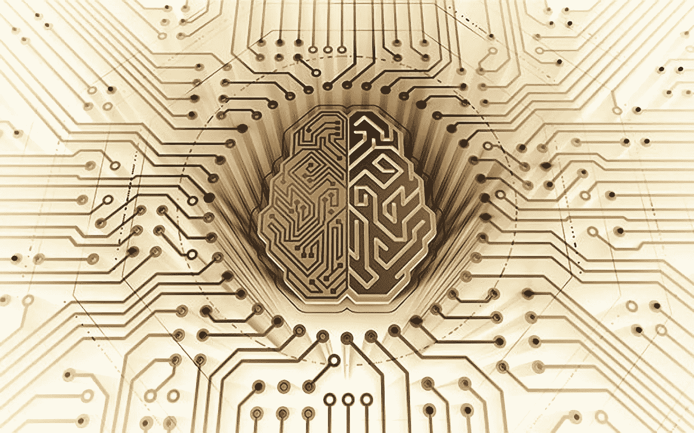

# 深度学习:以多种方式增强人类智力！

> 原文：<https://medium.datadriveninvestor.com/deep-learning-augmenting-human-intelligence-in-more-ways-than-one-5ffe977f4203?source=collection_archive---------2----------------------->

一提到人工智能或人工智能，我们就有一场激烈的辩论。形成的对话通常是关于“人与机器”或“机器人的崛起”或类似的反乌托邦草图。人们很快就会选择支持哪一方！

这些观念在流行文化中经常被强化。想象电影中的画面——终结者，前玛奇纳，2001:太空漫游，机器人等等。伊隆·马斯克(Elon Musk)等政要的推文加剧了炒作。当我们把参与被认为是人类专有的任务的机器人加入进来时，讨论就乱了套。例如，创造艺术和音乐的机器人，在医疗保健中帮助医生给病人做手术的机器人，以及保护人类生命的安全机器人。

我可以理解在人工智能中保持被动和采取中间立场是多么困难。但人工智能本身没有好坏之分，就像任何技术一样，它是一个推动者。旨在增强和补充人类的智力而不是取代它。

# 1.理解大数据

当我们认为人工智能是一种使能的、补充性的技术时，有趣的机会就会出现。

云计算、智能手机技术和社交媒体都是让我们能够生成大量数据的技术。嗯，不仅仅是生成，还要存储和处理大量数据。智能传感器、物联网(IoT)和无数的连接应用程序也在向数据存储中添加更多关于天气、气候、污染、交通、健康和我们物理世界中其他几个因素的数据。

在我们每天喷涌而出的海量数据中，隐藏着对世界上最紧迫问题的深刻回答。从在早期阶段识别和治疗癌症，到减少我们家中和周围的污染，到建设更加节能的智能社会和城市，我们可以获得各种各样的见解。

而人工智能在这方面已经有很长时间了。通过不懈的努力和深入的学习来帮助人类的意图。

# 2.发现正确的背景

虽然我们知道数据往往根深蒂固、隐藏和分散，但我们也知道数据远非完整。为了理解数据，必须找出模式，破译隐藏的关联，并揭示潜在的背景。

让我先给你举个例子。“云”这个词在任何一天实际上都可以指(a)天空中的云，或者(b)云计算中的云。甚至“Java”这个词也可能有几个意思。Java 可以指一个地方、咖啡或编程/开发。通过添加一个单词，我们可以给我们的发现更多的上下文。

不幸的是，那些擅长从堆积如山的数据中获得洞察力的机器，在涉及到上下文时经常处于十字路口。诚然，它们被设计成模仿人类大脑处理数据和做出决策的功能，但它们还远远没有将所有的部分整合在一起。

要让数据和我们从中得出的见解完全可以理解，需要一个正确的方向、一些指导和一点“人类智慧”。和可操作性。这就是人类分析师与人工智能一起改善结果的地方。

这里有一个很棒的网络研讨会，它揭示了深度学习技术是如何工作的，以及它们涉及解决哪些常见问题。

# 3.深度学习应用

深度学习和人类智能一起有很多应用。事实上，部署人工智能的地区经常挤满了监督、训练或分析人工智能的人。

上周我写了深度学习在灾害管理中的应用。几周前，我们分析了金融科技在欺诈检测和面部识别方面的一些深度学习应用。深度学习在医疗保健、空间科学和气候建模方面有着巨大的应用空间。它的持续有用性正在定义每个行业的新领域。

[WorkFusion 正在探索深度学习领域的一些前沿发展](http://bit.ly/2s9VLWF)。利用业界最低的 bot 与 FTE 比率，为所有人大幅降低基础设施成本。同时保持并鼓励机器人和人类伙伴之间的重要伙伴关系。

最后，人工智能思想领袖埃里克·布林约尔松(Erik Brynjolfsson)和安德鲁·迈克菲(Andrew McAfee)的一句话最适合我们的讨论，或许也是我们在迈向令人兴奋的人工智能未来时应该记住的——“在未来十年，人工智能不会取代经理，但使用人工智能的经理将取代那些不使用人工智能的经理。”