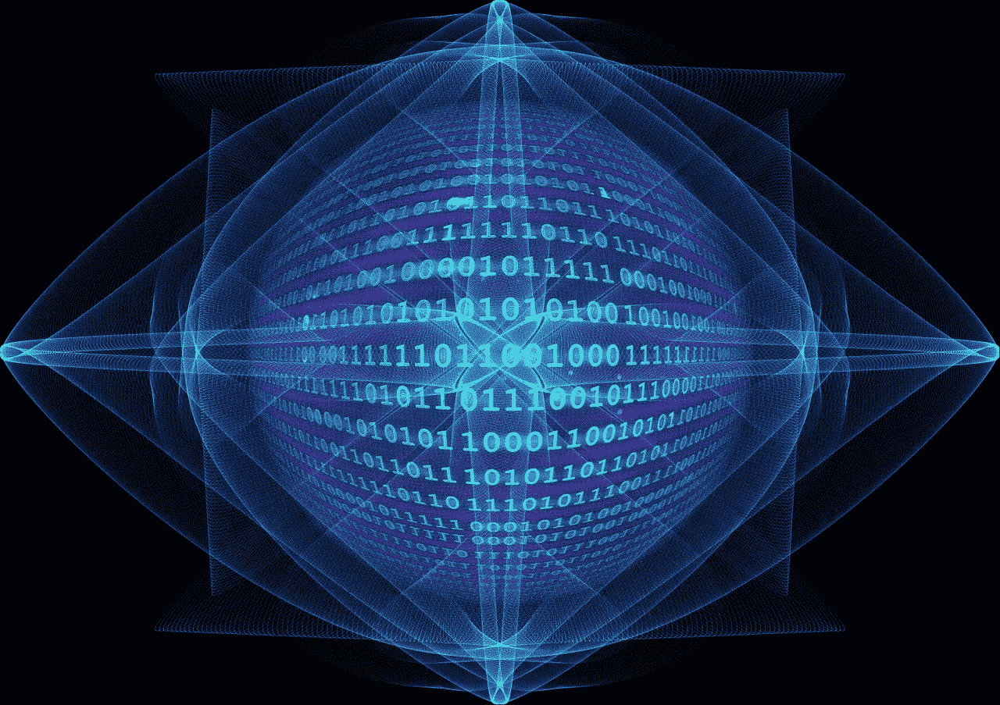
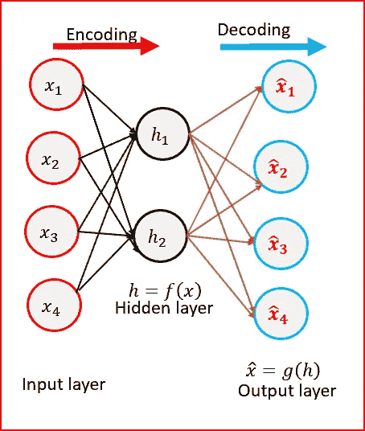
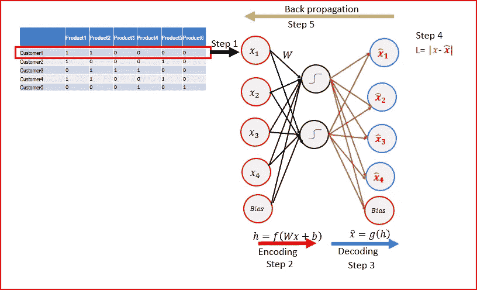
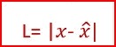

# 深度学习自动编码器

> 原文：<https://medium.datadriveninvestor.com/deep-learning-autoencoders-db265359943e?source=collection_archive---------2----------------------->

想知道亚马逊这样的零售商是如何给你推荐的吗？喜欢顾客谁买了这个项目也买了或如何网飞推荐电影，然后继续阅读…

**这一切都可以通过使用名为 Autoencoder 的无监督深度学习算法来实现。**

将一个复杂的概念与一些已知的东西联系起来以便于理解总是有帮助的。让我们试着把自动编码器和我们知道的东西联系起来。

## **T5 什么是 Autoencoder？**

我们在网上购买服务或商品。我们通过检查网站是否使用 https 协议来确保网站的安全。我们输入购买的信用卡详细信息。我们的信用卡详细信息通过网络使用某种编码算法进行编码。解码编码的信用卡细节以生成用于验证的原始信用卡号。

在我们的信用卡示例中，我们获取了信用卡的详细信息，并使用一些函数对其进行了编码。后来使用另一个函数对其进行解码，以再现与输入相同的输出。这就是自动编码器的工作方式。

**自动编码器使用函数 *f 对输入值 *x、*进行编码，然后使用函数 *g、*对编码值 *f(x)* 进行解码，以创建与输入值相同的输出值。***

**Autoencoder 的目标是最小化输入和输出之间的重建误差。这有助于自动编码器了解数据中的重要特征。当一个表示允许很好地重建它的输入时，那么它就保留了输入中的大部分信息。**

## 自动编码器是如何工作的？

我们接受输入，对其进行编码，以识别潜在的特征表示。解码潜在特征表示以重建输入。我们通过比较输入和输出来计算损耗。为了减少重建误差，我们反向传播并更新权重。权重根据他们对误差的责任程度进行更新。

让我们一步一步地分解它。

在我们的示例中，我们获取了客户购买的产品的数据集

**第一步:从客户数据中取出所有购买产品的第一行作为输入**。1 表示客户购买了产品。0 表示客户没有购买该产品。

**第二步:将输入编码成另一个向量 *h，h* 是一个比输入**维数更低的向量。我们可以对 h 使用 sigmoid 激活函数，因为它的范围是从 0 到 1。w 是应用于输入的权重，b 是偏置项。

***h=f(Wx+b)***

**第三步:解码向量 *h* 以重建输入**。输出将与输入具有相同的维度

**第四步:计算重构误差** L .重构误差是输入和输出向量之差。我们的目标是最小化重构误差，使得输出类似于输入向量

**重建误差=输入向量—输出向量**

Loss function or Reconstruction error

**步骤 5:将误差从输出层反向传播到输入层以更新权重。**根据权重对误差的影响程度来更新权重。

学习率取决于我们更新权重的程度。

**步骤 6:对数据集中的每个观察值重复步骤 1 到 5。每次观察后更新权重** ( [随机梯度下降](https://medium.com/datadriveninvestor/gradient-descent-5a13f385d403))

**第七步:重复更多的纪元**。Epoch 是指数据集中的所有行都已通过神经网络的时间。

## **自动编码器是**

*   无监督深度机器学习算法。自动编码器不使用任何带标签的数据。
*   定向神经网络
*   学习输入要素的低维表示

# ***自动编码器用在哪里？***

*   **用于非线性降维。**将隐藏层中的输入编码为比输入尺寸更小的尺寸。隐藏层稍后被解码为输出。输出图层与输入图层具有相同的维度。自动编码器降低了线性和非线性数据的维数，因此它比 PCA 更强大。
*   **用于推荐引擎**。它使用深度编码器来理解用户的偏好，以推荐电影、书籍或商品
*   **用于特征提取**:自动编码器试图最小化重建误差。在减少误差的过程中，它学习输入中存在的一些重要特征。它从隐藏层中存在的编码状态重建输入。编码生成一组新的特征，它是原始特征的组合。自动编码器中的编码有助于识别输入数据中存在的潜在特征。
*   **图像识别**:堆叠式自动编码器用于图像识别。我们可以使用多个编码器堆叠在一起，有助于了解图像的不同特征。

点击阅读不同类型的自动编码器

# **参考文献:**

伊恩·古德菲勒、约舒阿·本吉奥和亚伦·库维尔的深度学习

# 如果你喜欢这篇文章，请分享并鼓掌！

*原载于 2018 年 12 月 2 日* [*mc.ai*](http://mc.ai/deep-learning-autoencoders/) *。*

# 来自 DDI 的相关帖子:

 [## 用 7 个步骤解释深度学习——数据驱动投资者

### 在深度学习的帮助下，自动驾驶汽车、Alexa、医学成像-小工具正在我们周围变得超级智能…

www.datadriveninvestor.com](https://www.datadriveninvestor.com/2019/01/23/deep-learning-explained-in-7-steps/)  [## 数据科学和软件工程哪个更有前途？-数据驱动型投资者

### 大约一个月前，当我坐在咖啡馆里为一个客户开发网站时，我发现了这个女人…

www.datadriveninvestor.com](https://www.datadriveninvestor.com/2019/01/23/which-is-more-promising-data-science-or-software-engineering/)