# 深度学习最佳实践:激活函数和权重初始化方法—第 1 部分

> 原文：<https://medium.datadriveninvestor.com/deep-learning-best-practices-activation-functions-weight-initialization-methods-part-1-c235ff976ed?source=collection_archive---------0----------------------->

Photo by [Franck V.](https://unsplash.com/@franckinjapan?utm_source=medium&utm_medium=referral) on [Unsplash](https://unsplash.com?utm_source=medium&utm_medium=referral)

深度学习在过去十年中变得更加流行的原因之一是更好的学习算法，这些算法通常会导致神经网络更快的收敛或更好的性能。随着更好的学习算法，更好的激活函数和更好的初始化方法的引入，帮助我们创建更好的神经网络。

注意:本文假设读者对神经网络、权重、偏差和反向传播有基本的了解。

> **引用注:本文内容和结构基于四分之一实验室深度学习讲座——**[**帕德海**](https://padhai.onefourthlabs.in) **。**

在本文中，我们讨论了在训练深度神经网络时一些常用的激活函数和权重初始化方法。更具体地说，我们将涉及以下内容。

 [## 用 7 个步骤解释深度学习——数据驱动投资者

### 在深度学习的帮助下，自动驾驶汽车、Alexa、医学成像-小工具正在我们周围变得超级智能…

www.datadriveninvestor.com](https://www.datadriveninvestor.com/2019/01/23/deep-learning-explained-in-7-steps/) 

在激活功能下，

*   [**为什么激活功能很重要？**](https://medium.com/p/c235ff976ed#a22e)
*   [**物流功能**](https://medium.com/p/c235ff976ed#4346)
*   [**双功能**](https://medium.com/p/c235ff976ed#f486)
*   [**ReLU —整流线性单元**](https://medium.com/p/c235ff976ed#3ad8)
*   [**漏热路**](https://medium.com/p/c235ff976ed#7cf2)

欠重初始化方法，

*   [**为什么不将所有权重初始化为零？**](https://medium.com/p/c235ff976ed#aa1c)
*   [**随机初始化—小权重**](https://medium.com/p/c235ff976ed#717e)
*   [**随机初始化—大权重**](https://medium.com/p/c235ff976ed#ac32)
*   [**浩宇初始化**](https://medium.com/p/c235ff976ed#c837)
*   [**何(He-et-al)初始化**](https://medium.com/p/c235ff976ed#e189)
*   [**最佳实践**](https://medium.com/p/c235ff976ed#535f)
*   [**结论**](https://medium.com/p/c235ff976ed#eda6)

*你可以跟随文章的流向，也可以点击上面的任何一个超链接进入该部分。*

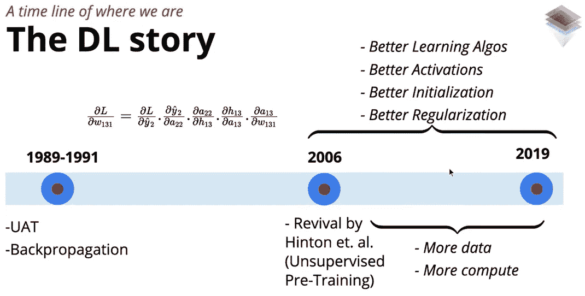

Image Source: [https://padhai.onefourthlabs.in](https://padhai.onefourthlabs.in/)

我们使用**多层神经元网络**的主要原因是它们能够处理非线性可分离数据。输入层和输出层之间的层称为隐藏层。隐藏层通过引入某种称为激活函数的非线性函数来处理输入和输出之间复杂的非线性可分关系。

> PS:如果你不熟悉与**多层网络**或**前馈神经网络**相关的概念，没必要花时间在谷歌上搜索相关文章，请浏览我最近关于前馈神经网络的博文。链接在本文末尾。

# 为什么激活函数很重要？

在我们讨论不同的激活函数之前，让我们看看为什么激活函数在深度神经网络中是重要的。激活函数是非线性函数，我们将该函数应用于到达特定神经元的输入数据，并且该函数的输出将作为输入被发送到下一层中存在的神经元。

假设我们有一个简单的神经元网络，有两个隐藏层(蓝色)，每个隐藏层有 3 个 sigmoid 神经元。我们有三个输入进入网络，在输出层有一个神经元。

Simple Neural Network

对于这些神经元中的每一个，将会发生两件事

1.  预激活用“a”表示:它是输入加上偏差的加权和。
2.  由“h”表示的激活:激活函数是非线性函数。

每层的预激活是来自前一层的输入加上偏置的加权和。在每一层“I”上预激活的数学方程由下式给出:

Pre-activation Function

> 如果网络中没有非线性激活函数会发生什么？

想象一下，不是应用非线性激活函数，而是将线性变换应用于预激活的输出。因为我们不对网络中存在的任何神经元的输出应用任何非线性变换，所以网络的最终输出将正好等于网络中所有权重与输入的乘积。

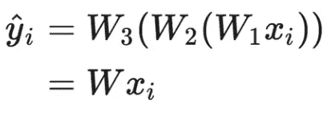

Linear Transformation

即使我们使用没有非线性激活函数的非常非常深的神经网络，我们也只是将' **y** '学习为' **x** '的线性变换。它只能表示' **x** '和' **y** '之间的线性关系。换句话说，我们将被限制于学习线性决策边界，并且我们不能学习任何任意的非线性决策边界。

更重要的是，谈论深度神经网络的表示能力的[通用逼近定理](https://hackernoon.com/illustrative-proof-of-universal-approximation-theorem-5845c02822f6)不成立。深度神经网络的代表能力是由于它的非线性激活函数。这就是为什么我们需要激活函数——非线性激活函数来学习输入和输出之间复杂的非线性关系。

一些常用的激活功能，

*   **物流**
*   **谭**
*   **ReLU**
*   **泄漏的 ReLU**

让我们来讨论一下这些功能的优缺点。

# 逻辑函数

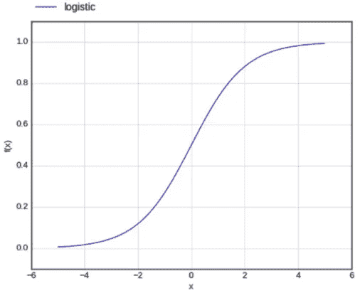

Logistic Function

sigmoid 函数是一个非线性函数，它将一个实数值作为输入，并将其所有输出压缩到范围[0，1]内，这可以解释为一个概率。有许多具有“**S**”**形曲线特征的函数称为 sigmoid 函数。最常用的函数是逻辑函数。在逻辑函数中，输入的微小变化只会导致输出的微小变化，而不是阶跃输出。因此，输出比阶跃函数输出平滑得多。**

**逻辑函数及其导数的数学形式由下式给出:**

**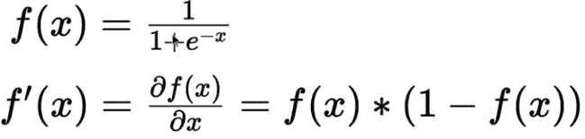**

**Logistic Function**

**sigmoid 函数是连续的并且容易微分，因此我们可以容易地在反向传播期间使用逻辑函数来更新权重。然而，最近物流功能由于其缺点而变得不那么流行:**

****消失梯度—饱和的乙状结肠神经元:****

**当逻辑神经元达到其最大或最小峰值时，称其饱和。在逻辑函数数学公式中，当你插入一个大的正数逻辑函数变成 1，一个大的负数逻辑函数变成 0。**

**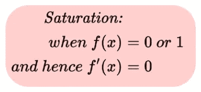**

**当函数达到最大值或最小值时，我们说逻辑函数已经饱和。因此，逻辑函数的导数在饱和点将等于零。为了理解饱和逻辑神经元的含义，我们将采用如下所示的简单神经网络，**

**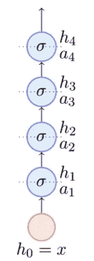**

**Thin but Deep Network**

**在这个薄而深的网络中，假设你对计算权重 w₂相对于损失函数的梯度感兴趣。第三隐藏层中存在的神经元的预激活和后激活由下式给出:**

**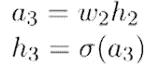**

**Pre and Post Activation**

**假设您已经知道计算权重参数梯度的链式法则，**

**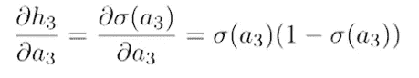**

**Chain Rule for the derivative**

**如果我们的后激活值'h₃'接近 0 或 1，那么我们的链式法则中的梯度将等于 0。结果，将不会有权重的更新，因为梯度值将变得等于零(或接近零)，这导致了**消失梯度问题**。**

> **饱和的神经元导致梯度消失**

****为什么逻辑函数会饱和？****

**我们已经看到饱和的逻辑函数会引起问题，但是为什么逻辑函数会饱和呢？。sigmoid 函数采用预激活的输出，该输出只不过是输入的加权和以及相应的权重加上偏差。**

**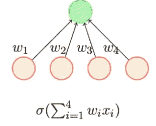**

**Simple Aggregation of Inputs**

**什么时候逻辑函数会饱和？。如果聚合是一个较大的正数或较大的负数，这意味着可能会发生以下两种情况之一输入'xᵢ'非常大或权重'wᵢ'非常大。我们知道，在将数据输入任何神经网络之前，我们会对它们进行归一化，因此输入将在 0 和 1 的范围内。**

**假设如果我碰巧将所有权重初始化为一个大值(大正值或大负值)，聚合的有效和将变得非常大。我们知道，如果聚集变得非常大(大正或大负)，逻辑函数将饱和。在训练或权重初始化期间的任何时间点，如果权重变为非常大的正值或非常大的负值，则求和可能会在正方向或负方向爆炸，在这种情况下，逻辑函数可能会达到饱和。**

## **零中心函数**

> **逻辑函数不是以零为中心的**

**逻辑函数不是以零为中心的，我的意思是，逻辑函数的值总是在 0 和 1 之间。所以平均值不可能是 0，它总是一个大于 0 的值。以零为中心的函数是其输出有时会大于 0 且小于 0 的函数。**

**让我们通过一个简单的神经网络来看看一个不以零为中心的函数有什么问题。在本次讨论中，只考虑网络中的最后一层和倒数第二层。倒数第二层的预激活由等于输入的加权和的'a₃'给出。**

****

**Image Source: [https://padhai.onefourthlabs.in](https://padhai.onefourthlabs.in/)**

**现在，为了应用梯度下降规则并更新倒数第二层中存在的神经元的参数，我们需要计算'dw₁'和'dw₂'相对于损失函数的梯度。假设你知道链式法则，**

**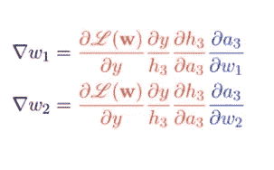**

**Gradients for Weights**

**红色项对于权重和蓝色项的链式法则变化都是常见的。a₃的值由下式给出:**

**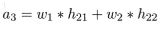**

**Weighted Sum**

**将'a₃'代入上述链式法则，我们将得到下面的等式。**

**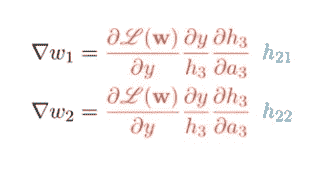**

**Modified Chain Rule Gradients**

**记住，h₂₁和 h₂₂是逻辑函数的输出，所以它们总是正的。假设上图中的红色量是负的，那么这两个梯度都是负的。同样，如果红色量是正的，那么这两个梯度都是正的。**本质上，要么一层中连接同一神经元的所有梯度都是正的，要么一层中的所有梯度都是负的。****

**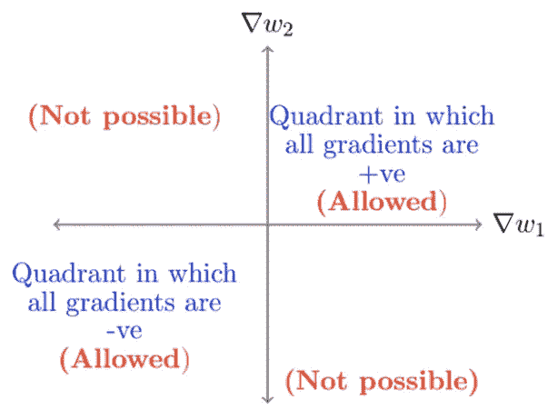**

**Gradient Options**

**这限制了可能的更新方向，即…梯度只能在第一象限和第三象限移动。这意味着因为算法不允许采取某些运动或方向。因此，需要很长时间才能收敛。**

## **计算成本高**

**由于函数中的指数项，逻辑函数的计算开销很大。**

# **Tanh 函数**

****

**Tanh 是一个非线性激活函数，它将其所有输入压缩到范围[-1，1]。下面给出了双曲正切激活函数及其导数的数学形式，**

**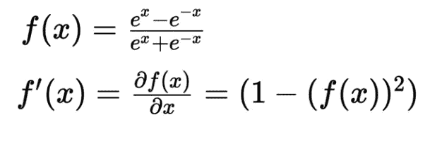**

**Mathematical Form**

**Tanh 类似于逻辑函数，它在大的正值或大的负值处饱和，梯度在饱和时仍然消失。但是双曲正切函数是以零为中心的，因此梯度并不局限于在某些方向上移动。像 sigmoid 一样，Tanh 也因为 eˣ.而计算昂贵
在实践中，Tanh 优于逻辑函数。**

# **ReLU —整流线性单元**

**ReLU 在卷积神经网络的上下文中引入了非线性激活函数。与 Tanh 函数不同，ReLU 不是一个以零为中心的函数。**

****

**如果输入为正，那么函数将输出值本身，如果输入为负，则输出为零。事实上，我们可以组合两个 ReLU 单元来恢复逻辑函数的分段线性近似。**

**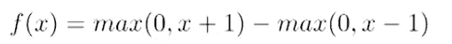**

****优势**:**

*   **在正区域不饱和，避免了消失梯度问题**
*   **计算效率高。**
*   **在实践中，它比 logistic/Tanh 收敛得快得多。**

**【ReLU 问题——死亡神经元**

**让我们以一个简单的神经网络为例，其中第一层 h₁中的预激活值等于在 a₁.上应用 ReLU 函数**

**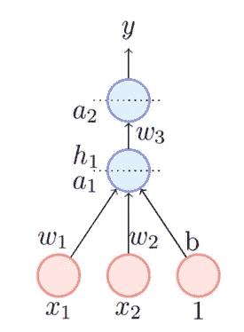**

**h₁的值由下式给出:**

**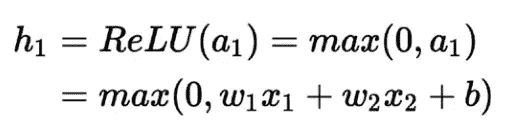**

**让我们假设参数‘b’由于在训练时的某个点的大的负值更新而呈现大的负值，那么 a₁的值改变为，**

**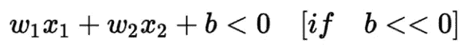**

**如果我们在小于零的 a₁上应用 ReLU 函数，那么输出 h₁也将是零，这意味着神经元将输出零。**

**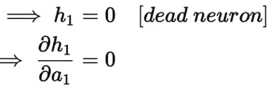**

**不仅输出将等于零，在反向传播期间，梯度 dh₁值将评估为零。权重 w₁、w₂和偏置 b₁将不会得到更新，因为在链式法则中将有一个零项，并且神经元将永远保持死亡状态。这个问题被称为**将死 ReLU。****

**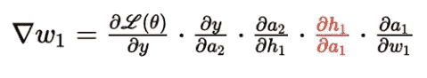**

**这意味着没有梯度会回流，所有连接到该神经元的权重都不会更新。实际上，当你用 ReLU 训练一个网络时，你会发现很大一部分神经元会死亡。为了避免这个问题，我们可以使用 ReLU 的其他变体，如 Leaky ReLU，或者我们可以将权重和偏差初始化为一个大的正值。通过将权重初始化为大的正值，即使这个大的负梯度流过网络，仍然有机会它不会变成大的负值，因此它不会搞乱网络。**

# **泄漏 ReLU**

**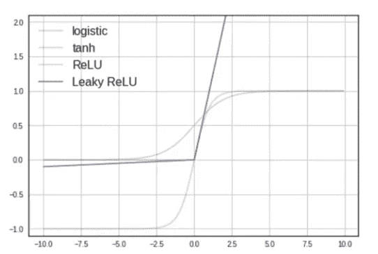**

**漏 ReLU 是 ReLU 的变种。在泄漏 ReLU 中，不是像在 ReLU 中那样对小于零的输入产生零，而是仅产生一个与输入成比例的非常小的值，即… 0.01x。泄漏 ReLU 激活函数及其导数的数学形式如下所示。**

**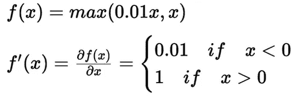**

**由于与负值输入成比例的小值(0.01)，梯度不会饱和。如果输入为负，梯度将为 0.01，这确保神经元不会死亡。**

****漏 ReLU 的优点:****

*   **不会在正区域或负区域饱和**
*   **神经元不会死亡(0.01x 确保至少有小的梯度流过)**
*   **易于计算**
*   **接近零中心输出**

# **重量初始化**

**当我们训练深度神经网络时，权重和偏差通常用随机值初始化。在将权重初始化为随机值的过程中，我们可能会遇到消失梯度或爆炸梯度等问题。因此，网络需要很长时间才能收敛。在本节中，我们将讨论一些最佳的权重初始化技术。**

**

Xavier Initialization Not this Xavier** 

# **为什么不将所有权重初始化为零？**

**让我们看看初始化权重的简单方法，即…将所有权重初始化为零。我再一次用了一个简单的神经网络，如下所示，让我们只关注预激活项 a₁₁和 a₁₂.**

**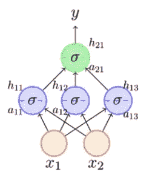**

**Simple Network**

**我们知道预激活等于输入和偏差的加权和，为简单起见，忽略等式中的偏差项。**

**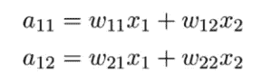**

**如果我们所有的权重都被初始化为零，那么上述两个等式的值将为零。这意味着第一层中的所有神经元将获得相同的后激活值，而与所使用的非线性激活函数无关。**

**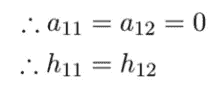**

**因为网络中的每个神经元计算相同的输出，所以它们在反向传播期间也将具有相同的梯度值，并经历完全相同的参数更新。**

**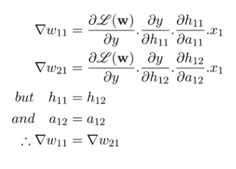**

**换句话说，权重以相同的值开始，它们将获得相同的梯度更新，然后即使在使用反向传播获得更新之后，它们也保持相同的值。一旦将权重初始化为零，在所有后续迭代中，权重将保持不变(它们将远离零，但它们将相等)，这种对称性在训练过程中永远不会打破。因此，连接到同一神经元的权重不应被初始化为相同的值。这种现象被称为**对称性破缺问题**。**

**从我们关于对称性破缺问题的讨论中，**

*   **切勿将所有权重初始化为零**
*   **切勿将所有权重初始化为相同的值**

# **随机初始化—小权重**

**我们已经看到用零和等值初始化权重不好，我们来看看随机初始化权重但是权重小到底好不好！。**

**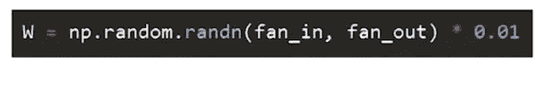**

**假设我们有一个具有 5 层的深度神经网络，下面给出了这 5 层(从左到右)的激活输出值，**

**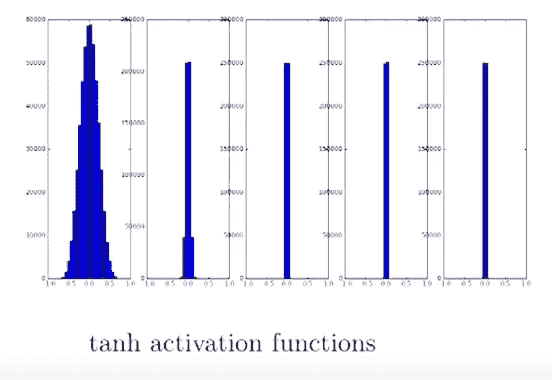**

**Activation output for 5 layers (1 to 5)**

**从上图我们可以看到，在所有的隐藏层中，除了第一个输入层，Tanh 激活函数的输出非常接近于零。这意味着没有梯度会回流，网络不会学习任何东西，权重根本不会更新。在这里，我们面临的是**消失渐变问题**。这个问题不仅是 Tanh 激活函数特有的，而且也可以在其他非线性激活函数中观察到。**

**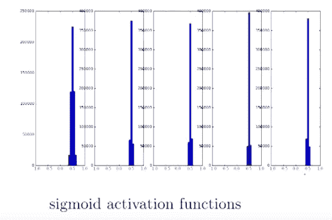**

**Vanishing Gradient — Sigmoid Function**

**在 sigmoid(逻辑)函数的情况下，输出值以 0.5 为中心，逻辑函数在 0.5 处的值等于 0。因此，逻辑函数也导致**消失梯度问题。****

# **随机初始化—大权重**

**让我们尝试使用大的随机值来初始化权重，并分析它是否会导致任何问题。**

**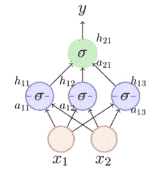**

**如果权重很大，激活后和(a₁₁和 a₁₂)可能会取很大的值，尤其是在有更多输入神经元的情况下。**

**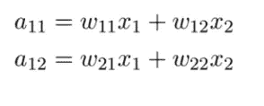**

**Post-Activation**

**如果我们将大的聚合值传递给一个逻辑或 tanh 激活函数，该函数将达到饱和。结果，将不会有权重的更新，因为梯度值将是零(或接近零)，这导致**消失梯度问题**。**

# **Xavier 初始化**

**到目前为止，我们已经看到，初始化为零的权重是不好的，初始化为随机的大或小的值也不是一个好方法。现在，将讨论一些标准的初始化方法。**

**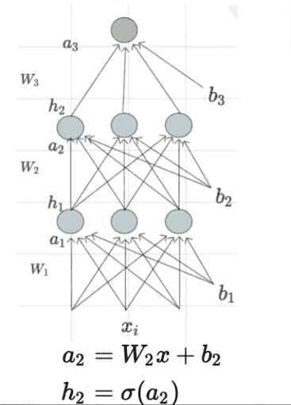**

**如果观察第二层'a₂'的预激活，它是来自前一层的输入(来自第一层的后激活的输出)和偏差的加权和。如果第二层的输入数量非常大，在这种情况下，聚合'a₂'可能会爆炸。因此，这些权重应该与前一层中存在的输入神经元的数量成反比是有意义的。**

**如果权重与输入神经元的数量成反比，在输入神经元的数量非常大的情况下(这在深度神经网络中是常见的),由于反比关系，所有这些权重将呈现小的值。因此，激活后的净聚集将非常小。这种初始化方法被称为 **Xavier 初始化**。**

**[Xavier 初始化](http://proceedings.mlr.press/v9/glorot10a/glorot10a.pdf)通过从具有零均值和特定方差的分布中抽取权重来初始化网络中的权重，**

**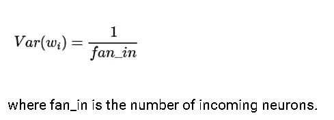**

***根据经验，我们使用 Xavier 初始化 Tanh 和逻辑激活函数*。不要在这里发牢骚，我不会详细说明如何推导这个公式，以及推导这个方程的假设是什么。如果你有兴趣深入了解这个概念，请阅读安迪的博客文章**

** [## Xavier 初始化的解释

### 如果您在查看下面的公式时遇到问题，请尝试关闭 Adblock (thanks /u/BeatLeJuce ),如果您完成了…

andyljones.tumblr.com](https://andyljones.tumblr.com/post/110998971763/an-explanation-of-xavier-initialization) 

# He (He-et-al)初始化

读作*嘿初始化。*由 He-et-al 于 2015 年推出，类似于 Xavier 初始化。在 He-Normal 初始化中，网络中的权重来自具有零均值和乘以 2 的特定方差因子的正态分布，

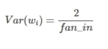

Variance Formula

数字化的数字实现，

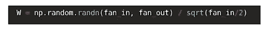

He 初始化主要用于 ReLU 和泄漏 ReLU 激活的内容中。如果你想看看他初始化的证据，可以去看看 mc.ai 的博客。

 [## Xavier 和 He 正常(He-et-al)初始化

### 为什么不应该用零或随机(不知道分布)初始化权重:如果权重在…

mc.ai](https://mc.ai/xavier-and-he-normal-he-et-al-initialization/) 

# 最佳实践

因为没有一成不变的规则来选择正确的激活函数和权重初始化方法。我们将根据经验法则行事，

*   Xavier 初始化主要与 tanh 和逻辑激活函数一起使用
*   He 初始化主要用于 ReLU 或它的变体——泄漏 ReLU。

# 结论

在这篇文章中，我们讨论了深度神经网络中非线性激活函数的必要性，然后我们继续看常用的非线性激活函数的优缺点。之后，我们看了如何不初始化权重的不同方法。然后我们讨论了两种标准的初始化方法。最后，我们看到了关于激活函数和砝码初始化方法的行业最佳实践。

# 前进的道路

反向传播是神经网络如何学习它们所学内容的支柱。如果你有兴趣了解更多关于神经网络的知识，请查看来自 [Starttechacademy](https://courses.starttechacademy.com/full-site-access/?coupon=NKSTACAD) 的 Abhishek 和 Pukhraj 的[人工神经网络](https://courses.starttechacademy.com/full-site-access/?coupon=NKSTACAD)。本课程将使用最新版本的 Tensorflow 2.0 (Keras 后端)进行教学。** 

***推荐阅读:***

** [## 揭秘梯度下降优化算法的不同变体

### 了解对梯度下降的不同改进，并使用 2D 等高线图比较它们的更新规则。

hackernoon.com](https://hackernoon.com/demystifying-different-variants-of-gradient-descent-optimization-algorithm-19ae9ba2e9bc)  [## 深度学习:解释前馈神经网络

### 你的第一个深度神经网络

hackernoon.com](https://hackernoon.com/deep-learning-feedforward-neural-networks-explained-c34ae3f084f1) 

在我的下一篇文章中，我们将讨论如何实现这些激活函数&权重初始化方法，并分析激活函数和权重初始化方法的选择将如何影响准确性以及我们使用非线性可分离玩具数据集在深度神经网络中减少损失的速度。所以确保你在媒体上跟踪我，以便在它下降时得到通知。

直到那时和平:)

NK。

Niranjan Kumar 是汇丰银行分析部门的零售风险分析师。他对深度学习和人工智能充满热情。他是[人工智能](https://medium.com/tag/artificial-intelligence/top-writers)中[媒介](https://medium.com/u/504c7870fdb6?source=post_page-----c235ff976ed--------------------------------)的顶尖作家之一。在 [LinkedIn](https://www.linkedin.com/in/niranjankumar-c/) 上与我联系，或者在 [twitter](https://twitter.com/Nkumar_283) 上关注我，了解关于深度学习和人工智能的最新文章。

**免责声明** —这篇文章中可能有一些相关资源的附属链接。你可以以尽可能低的价格购买捆绑包。如果你购买这门课程，我会收到一小笔佣金。

 [## 深度学习最佳实践-权重初始化

### https://pixabay.com/photo-1600668/:作为深度学习的初学者，我意识到的一件事是没有…

www.kdnuggets.com](https://www.kdnuggets.com/2018/06/deep-learning-best-practices-weight-initialization.html)**