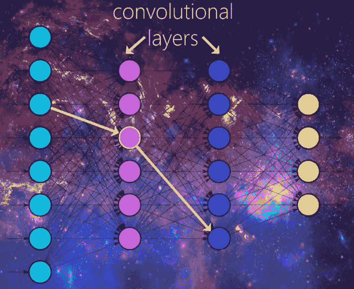
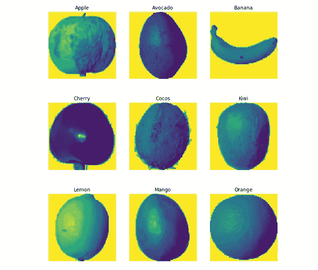

# 深度学习-第二天(CNN 的水果项目)

> 原文：<https://medium.datadriveninvestor.com/deep-learning-day-2-practical-implementation-of-cnn-9b51ba9d28a9?source=collection_archive---------2----------------------->

[](http://www.track.datadriveninvestor.com/1B9E)

在我之前的博客[中，我从 CNN 基础知识开始，https://medium . com/datadriveninvestor/deep-learning-an-introduction-day 1-4 BBC 3a 37 de 59](https://medium.com/datadriveninvestor/deep-learning-an-introduction-day1-4bbc3a37de59)不要与卷积、relu 和池化等像素计算混淆，模型会为我们做这类事情。



机器学习以及深度学习不仅仅是应用模型和计算准确度。从将数据集加载到工作空间，到清理、预处理和提取有用的特征，人们不得不付出一些努力。如果数据在像 mnist 数据集(sklearn 和 tensorflow 中的手写图像数据集)这样的库中，那么剩下的工作就变得很容易，但是如果数据在你的系统中，你需要熟悉其他的东西。

感谢 python 给了我们这个“操作系统”库来操作我们系统中的文件。首先让我们了解一些重要的事情，在构建 CNN 模型时，我们使用 **Conv2D** 进行卷积，使用 **MaxPooling2D 或 MinPooling2D** 进行池化。我们需要指定一些重要的参数，如过滤器的数量，它们的大小和我们正在使用的激活。

## Conv2D —一些有用的参数

```
import tensorflow as tf
from tensorflow.keras.layers import Conv2D, MaxPooling2D, MinPooling2D#model.add(Conv2D(filters, kernel_size, activation=None))
model = Sequential()
model.add(Conv2d(32,(3,3), activation = 'relu')
```

***过滤器:将用于与输入进行卷积的过滤器数量。随着我们深入网络，滤波器的数量会增加，例如[32，64，128]或甚至更高到[256，512，1024]，但开始时滤波器的数量会减少，只有在必要时才会增加。***

***kernel_size:滤镜的尺寸，通常为 2x2、3x3 等，但尺寸> 7x7 一般很少。***

***步幅:步幅参数类似于最大池的替代。***

***激活:在这里，我们指定执行卷积*** 后我们想要应用的激活函数的名称。 ***我们既可以在这里指定激活，也可以在下面的层中指定。***

上面的参数可以在一定程度上简化我们的代码，见下文

```
#To add 3 layers 
model.add(Conv2d(32,(3,3))
model.add(Activation('relu'))
model.add(MaxPooling2D(pool_size = (2,2)))
model.add(Conv2d(32,(3,3))
model.add(Activation('relu'))
model.add(MaxPooling2D(pool_size = (2,2)))
model.add(Conv2d(32,(3,3))
model.add(Activation('relu'))
model.add(MaxPooling2D(pool_size = (2,2)))#Or you can just use the parameters appropriately and simplify your codemodel.add(Conv2D(64, (3, 3), strides=(2,2), activation="relu"))
model.add(Conv2D(64, (3, 3), strides=(2,2), activation="relu"))
model.add(Conv2D(64, (3, 3), strides=(2,2), activation="relu"))
```

让我们开始吧，我们有一个水果数据集，它包含了成千上万不同水果的图片(以及它们不同的类别)。你可以在这里找到数据集[https://www.kaggle.com/moltean/fruits/kernels](https://www.kaggle.com/moltean/fruits/kernels)。简而言之，这个项目的目标是设计一个可以对水果进行分类的机器人，以帮助收获，但我们的工作只是简单地建立一个 CNN 模型来对水果进行分类。

[](https://www.datadriveninvestor.com/2019/01/23/deep-learning-explained-in-7-steps/) [## 深度学习用 7 个步骤解释-更新|数据驱动的投资者

### 在深度学习的帮助下，自动驾驶汽车、Alexa、医学成像-小工具正在我们周围变得超级智能…

www.datadriveninvestor.com](https://www.datadriveninvestor.com/2019/01/23/deep-learning-explained-in-7-steps/) 

## 导入必要的库:

```
import os  #for manipulating the directories
import cv2 #for image processing 
import random   #for shuffling
import numpy as np
import pandas as pd
import matplotlib.pyplot as plt
import tensorflow as tf
from tensorflow.keras.models import Sequential
from tensorflow.keras.layers import Dense, Conv2D, MaxPooling2D, Dropout
from sklearn.model_selection import  train_test_split
```

我们在 out fruits360 数据集中有两个文件夹，所以我们将遍历每个文件夹，并将数据追加到各自的列表中。“操作系统”开始发挥作用了。

```
arr1 = []
arr2 = []
DATADIR1 = ‘fruits-360/Training/’
CATEGORIES = [“Apple Golden 1”,”Avocado”,”Banana”,”Cherry 1",”Cocos”,”Kiwi”,”Lemon”,”Mango”,”Orange”]
img_size = 100#For training set — -
for category in CATEGORIES:
    path = os.path.join(DATADIR1, category)
    class_num = CATEGORIES.index(category)
    for image in os.listdir(path):
        if(image.endswith(‘jpg’)):
            img_array =       cv2.imread(os.path.join(path,image),cv2.IMREAD_GRAYSCALE)
            img_array = cv2.resize(img_array, (img_size,img_size))
            arr1.append([img_array,class_num])#For test set ---
DATADIR2 = 'fruits-360/Test/'for category in CATEGORIES:
    path = os.path.join(DATADIR2, category)
    class_num = CATEGORIES.index(category)
    for image in os.listdir(path):
        if(image.endswith('jpg')):
            img_array = cv2.imread(os.path.join(path,image),cv2.IMREAD_GRAYSCALE)
            img_array = cv2.resize(img_array, (img_size,img_size))
            arr2.append([img_array,class_num])

print(len(arr1))
print(len(arr2))
```

*DATADIR1 = ' fruits-360/Training/'(在 datadir 1 中保存 Training 文件夹的路径)*

*path = os.path.join(DATADIR1，category)(逐一迭代每个类别，并将路径存储在 path 变量中)*

*class_num = CATEGORIES.index(类别)(在 class_num 中保存相应的索引)*

> listdir 返回特定目录中所有文件的列表

*对于 os.listdir(path)中的图像(对于该特定路径中的每个图像，检查其是否为图像，然后将其大小调整为 100x100，并将其附加到 arr1 中*

对测试文件夹进行同样的操作…

将数据添加到列表中后，绘制图像

```
fruits_to_train = []
for features,label in arr1:
 fruits_to_train.append(features)pos = [[1,500,1150],[1500,2000,2500],[3000,3500,4000]]
fruits = [“Apple”,”Avocado”,”Banana”,”Cherry”,”Cocos”,”Kiwi”,
”Lemon”,”Mango”,”Orange”]
a = 0
b = 1
c = 2
for i,j,k in pos:
 plt.subplots(figsize = (10,10))
 plt.subplot(1,3,1)
 plt.imshow(fruits_to_train[i])
 plt.title(fruits[a])
 plt.axis(“off”)
 plt.subplot(1,3,2)
 plt.imshow(fruits_to_train[j])
 plt.title(fruits[b])
 plt.axis(“off”)
 plt.subplot(1,3,3)
 plt.imshow(fruits_to_train[k])
 plt.title(fruits[c])
 plt.axis(“off”)
 #as 3 pictures are to be displayed at a time so we’ll increment a, b and c by 3
 a+=3
 b+=3
 c+=3
```

## 输出:



为了更准确，在训练之前对数据集进行洗牌是非常必要的，否则我们的模型将会像“所有的水果都是苹果，所以首先预测所有的苹果，然后预测鳄梨和香蕉”那样。因此，我们将使用上面导入的 python 库“random”来混洗数据。然后我们将创建训练集和测试集。

```
x_train = []
x_test =[]
y_train = []
y_test = []#shuffle 
random.shuffle(arr1)
random.shuffle(arr2)for features, label in arr1: #training data
 x_train.append(features)
 y_train.append(label)
x_train = np.array(x_train)

for features, label in arr2: #test data
 x_test.append(features)
 y_test.append(label)
x_test = np.array(x_test)
```

标准化数据

```
#reshape and normalize
x_train=x_train.reshape(-1,img_size,img_size,1)
x_train=x_train/255
x_test=x_test.reshape(-1,img_size,img_size,1)
x_test=x_test/255
print(x_train.shape)
print(x_test.shape)# y is a categorical variable right! when you have multiple classes in a  classification model it will not work well unless the classes are not  distributed in a binary matrix.from keras.utils import to_categorical
Y_train=to_categorical(Y_train,num_classes=9)
Y_test=to_categorical(Y_test,num_classes=9)
```

建立模型-

```
model=Sequential()
model.add(Conv2D(filters=8,kernel_size=(5,5),padding="Same",activation="relu",input_shape=(100,100,1)))
model.add(MaxPooling2D(pool_size=(2,2)))
model.add(Dropout(0.25))

model.add(Conv2D(filters=16,kernel_size=(4,4),padding="Same",activation="relu"))
model.add(MaxPooling2D(pool_size=(2,2),strides=(2,2)))
model.add(Dropout(0.25))

model.add(Conv2D(filters=32,kernel_size=(4,4),padding="Same",activation="relu"))
model.add(MaxPooling2D(pool_size=(2,2),strides=(2,2)))
model.add(Dropout(0.25))model.add(Flatten())
model.add(Dense(512,activation="relu"))
model.add(Dropout(0.5))#output layer
model.add(Dense(9,activation="softmax"))

#compile 
model.compile(optimizer='adam',loss="binary_crossentropy",metrics=["accuracy"])
model.fit(x_train,y_train,epochs =10)
val_loss, val_acc = model.evaluate(x_test,y_test)
val_loss, val_acc
```

我有大约 96%的准确率。如果你愿意，你也可以应用其他东西，比如打印混淆矩阵。我们还可以使用数据扩充和其他技术来提高我们模型的准确性，我用几个数据集进行了实践，下面是链接。

[https://www . ka ggle . com/uzairrj/beg-tut-Intel-image-class ification-93-76-accur](https://www.kaggle.com/uzairrj/beg-tut-intel-image-classification-93-76-accur)

[https://www . ka ggle . com/bhanotkaran 22/keras-CNN-data-augmentation](https://www.kaggle.com/bhanotkaran22/keras-cnn-data-augmentation?source=post_page---------------------------)

[https://www.youtube.com/watch?v=j-3vuBynnOE&list = plqvvvaa 0 qudfhtox 0 ajmq 6 tvtgmbzbexn&index = 2](https://www.youtube.com/watch?v=j-3vuBynnOE&list=PLQVvvaa0QuDfhTox0AjmQ6tvTgMBZBEXN&index=2)

[https://www.kaggle.com/naveenc131/cnn-with-accuracy-of-98](https://www.kaggle.com/naveenc131/cnn-with-accuracy-of-98)

目前就这些，在接下来的博客中，我们将学习深度学习中另一个重要的东西 RNNs，在那之前请继续关注

编码快乐！