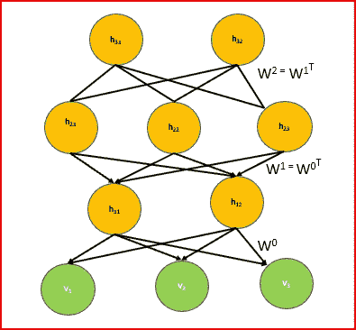
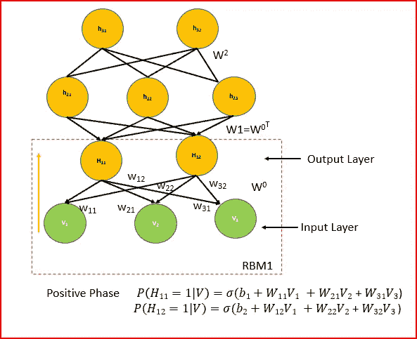
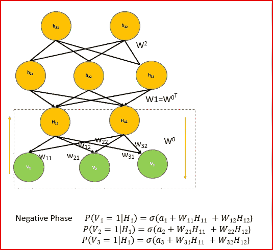
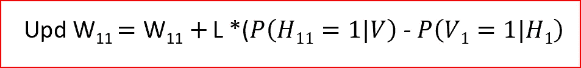
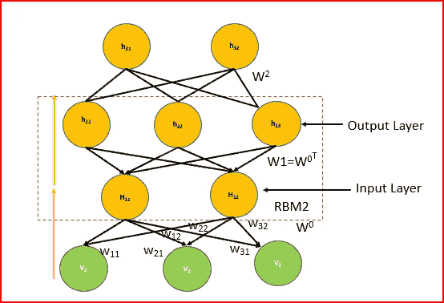
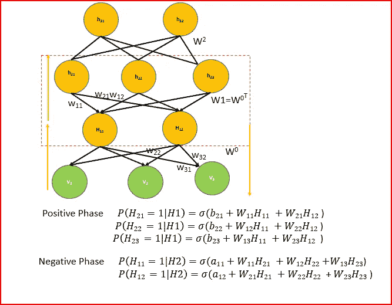
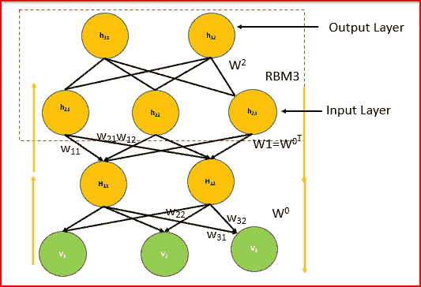

# 深度学习——深度信念网络(DBN)

> 原文：<https://medium.datadriveninvestor.com/deep-learning-deep-belief-network-dbn-ab715b5b8afc?source=collection_archive---------1----------------------->

在这篇文章中，我们将探索深度信仰网络(DBN)的特征，DBN 的架构，以及 DBN 的是如何被训练和使用的。

## 什么是深度信念网络？

*   DBN 是一种无监督的概率深度学习算法。
*   DBN 由多层随机潜变量组成。潜在变量是二元的，也称为特征检测器或隐藏单元
*   DBN 是一个生成式混合图形模型。上面两层是无向的。较低的层具有来自较高层的直接连接。

## DBN 建筑

Deep Belief Network

*   它是一堆受限的玻尔兹曼机器(RBM)或自动编码器。
*   DBN 的顶部两层是无向的，它们之间的对称连接形成了联想记忆。
*   所有较低层之间的连接是有方向的，箭头指向离数据最近的层。较低层有向非循环连接，将联想记忆转换为观察变量。最低层或可视单元接收输入数据。输入数据可以是二进制或实数。
*   没有像 RBM 那样的层内连接
*   隐藏单位表示捕获数据中存在的相关性的特征
*   两层由对称权重矩阵 w 连接
*   每层中的每个单元都连接到每个相邻层中的每个单元

## DBN 是如何工作的？

*   使用**贪婪学习算法对 DBN 进行预训练。**贪婪学习算法使用**逐层学习自上而下的方法，生成权重**。这些生成权重决定了一层中的变量如何依赖于上一层中的变量。
*   在 DBN，我们**在顶部两个隐藏层**上运行几个吉布斯采样步骤。这个阶段实际上是从由顶部两个隐藏层定义的 RBM 中抽取一个样本。
*   然后对模型的其余部分使用单遍祖先采样，从可见单元中抽取一个样本。
*   学习中，每一层中潜在变量的值可以通过一次自下而上的传递来推断。贪婪预训练从底层的观测数据向量开始。然后，它使用微调在相反方向使用生成权重。

***让我们一步步理解这个***

## W 什么是贪心层智学习？

*   贪婪逐层训练算法是由 Geoffrey Hinton 提出的，其中我们以无监督的方式一次一层地训练 DBN。
*   学习任何复杂事物的简单方法是把复杂的问题分成容易处理的部分。我们采用一个多层 DBN，分成更简单的模型(RBM ),依次学习。训练一个浅层网络比训练一个深层网络容易
*   我们的贪婪算法背后的思想是允许序列中的每个模型接收数据的不同表示。

## 贪婪层明智训练算法是如何工作的？

*   贪婪地从训练数据中训练第一层，而所有其他层被冻结。我们导出了第一个隐藏层的单独激活概率。第一隐藏层的所有隐藏单元被并行更新。这被称为**正相位**。

b1 and b2 are the biases associated with the hidden units

*   我们使用**负相位**重建可见单元，这是类似于正相位的技术。

a1, a2 and a3 are biases. Reconstructing visible unit from hidden unit

*   贪婪分层学习的最后一步是更新所有相关的权重。l 是我们乘以正负相位值之差并加到权重初始值上的学习速率。

Weight update for one of the weights. L is the Learning rate

*   这个过程将被重复，直到我们得到所需的阈值
*   然后，我们将第一个隐藏层作为第二个隐藏层的输入，依此类推。
*   每一层都将前一层的输出作为输入来产生输出。生成的输出是一种新的数据表示形式，其分布更加简单。
*   第二个 RBM 的权重是第一个 RBM 的权重的转置。
*   我们再次使用对比散度方法，使用吉布斯采样，就像我们对第一个 RBM 做的那样。

Training the next RBM, hidden unit or output of RBM1 becomes the input for RBM2

*   我们计算正相位、负相位并更新所有相关的权重。
*   这个过程将被重复，直到我们得到所需的阈值

a and b are biases associated with the nodes

*   我们可以再次添加另一个 RBM，并使用 Gibbs 抽样计算对比散度

## 为什么 DBM 使用贪婪分层智能学习进行预训练？

*   预训练通过更好地初始化所有层的权重来帮助优化。
*   贪婪学习算法速度快，效率高，一次学习一层。
*   从底层开始按顺序训练层
*   每一层学习较低层的较高数据表示。

## 为什么我们需要微调？

贪婪分层预训练识别**特征检测器**。

**微调会稍微修改特性，以获得正确的类别边界**。

添加微调有助于更好地区分不同的类。在微调过程中调整权重提供了最佳值。这有助于提高模型的准确性。

## 如何才能实现微调？

微调可以通过以下方式实现

*   唤醒睡眠算法
*   反向传播

*这里我们将讨论反向传播*

## 使用反向传播进行微调

反向传播与贪婪的逐层训练一起工作得更好。我们不开始反向传播，直到我们已经识别出对辨别任务有用的敏感特征检测器。

微调的目标不是发现新功能。DBM 的目的是通过寻找层间权重的最优值来提高模型的精度

一旦我们识别了敏感的特征检测器，那么反向传播只需要执行局部搜索。

未标记的数据有助于发现好的特征。我们也可能得到对辨别任务没有太大帮助的特征，但这不是问题。我们仍然可以从原始输入中获得有用的特征。

输入向量通常包含比标签更多的信息。宝贵的信息是标签仅用于微调

带标签的数据集有助于将模式和要素与数据集相关联。一个小的标记数据集用于使用反向传播进行微调

## 反向传播用于微调的优势

*   反向传播微调模型以更好地辨别
*   克服了标准反向传播的许多限制。
*   让学习深层网络变得更容易
*   使网络更好地通用化

## **我们如何应用微调流程？**

*   应用自下而上的随机传递，并调整自上而下的权重。
*   当我们到达顶层时，我们对顶层应用递归。这是 DBN 最上面的两层，是无向的。顶层是我们的输出
*   为了进一步微调，我们做了一个随机的自上而下的传递，并调整自下而上的权重。

## DBN 的用法

*   图像识别
*   视频序列
*   动作捕捉数据
*   语音识别

## 参考资料:

http://www.cs.toronto.edu/~hinton/absps/fastnc.pdf

【http://www.scholarpedia.org/article/Deep_belief_networks 

[https://www.youtube.com/watch?v=WKet0_mEBXg&t = 19s](https://www.youtube.com/watch?v=WKet0_mEBXg&t=19s)

[https://www . cs . Toronto . edu/~ hint on/nips tutorial/nips tut 3 . pdf](https://www.cs.toronto.edu/~hinton/nipstutorial/nipstut3.pdf)

# 如果你喜欢这篇文章，请分享并鼓掌！

# 来自 DDI 的相关帖子:

 [## 用 7 个步骤解释深度学习——数据驱动投资者

### 在深度学习的帮助下，自动驾驶汽车、Alexa、医学成像-小工具正在我们周围变得超级智能…

www.datadriveninvestor.com](https://www.datadriveninvestor.com/2019/01/23/deep-learning-explained-in-7-steps/)  [## 数据科学和软件工程哪个更有前途？-数据驱动型投资者

### 大约一个月前，当我坐在咖啡馆里为一个客户开发网站时，我发现了这个女人…

www.datadriveninvestor.com](https://www.datadriveninvestor.com/2019/01/23/which-is-more-promising-data-science-or-software-engineering/)