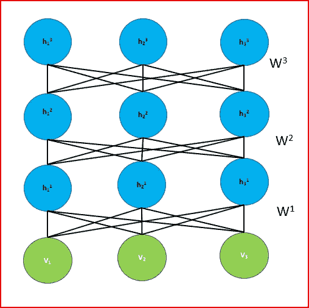
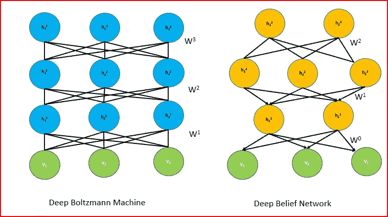
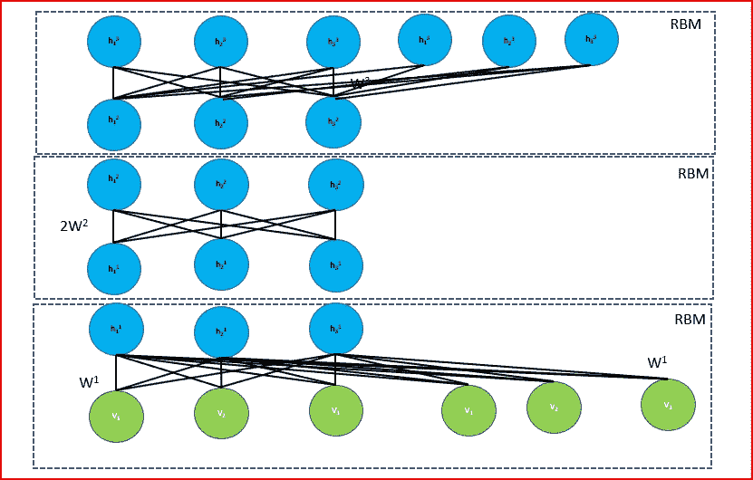
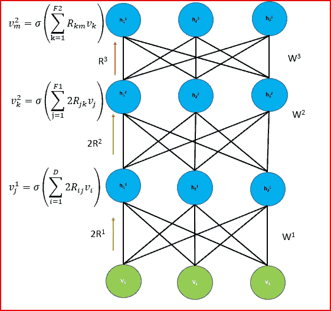
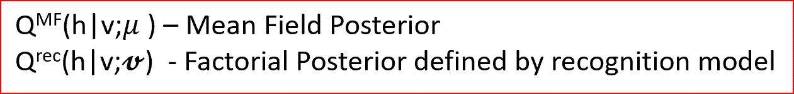

# 深度学习——深度玻尔兹曼机器(DBM)

> 原文：<https://medium.datadriveninvestor.com/deep-learning-deep-boltzmann-machine-dbm-e3253bb95d0f?source=collection_archive---------1----------------------->

在这篇文章中，我们将讨论什么是深度玻尔兹曼机器，DBN 和 DBM 之间的区别和相似之处，我们如何使用贪婪分层训练来训练 DBM，然后对其进行微调。

**深层玻尔兹曼是由:**提出的

**萨拉赫丁诺夫，鲁斯兰&拉罗歇尔，雨果。(2010).深度玻尔兹曼机器的高效学习..机器学习研究杂志-会议录。9.693–700.**

## 什么是深层玻尔兹曼机(DBM)？

Deep Boltzmann Machine

*   无监督的概率生成模型，不同层之间的连接完全没有方向
*   包含可见单元和多层隐藏单元
*   像 RBM 一样，DBM 不存在层内联系。连接仅存在于相邻层的单元之间
*   对称连接的随机二元单元网络
*   DBM 可以被组织成二分图，奇数层在一边，偶数层在一边
*   层内的单元相互独立，但依赖于相邻的层
*   通过逐层预训练，学习变得更有效率——贪婪的逐层预训练与 DBM 的略有不同
*   在学习了每一层中的二进制特征之后，通过反向传播对 DBM 进行微调。

听起来像 DBN，那么深度信念网络(DBN)和深度波尔兹曼机器(DBM)之间有什么区别呢？

让我们先谈谈 DBN 和 DBM 的相似之处，然后谈谈 DBN 和 DBM 的不同之处

## ***深度信念网络(DBN)和深度玻尔兹曼机器(DBM)之间的相似性***

*   DBN 和 DBM 都是无监督的、概率的、生成的、图形化的模型，由 RBM 的堆叠层组成。
*   DBN 和 DBM 都被用来识别数据中的潜在特征。
*   DBN 和 DBM 都使用贪婪的逐层训练有效地执行推理和参数学习。
*   DBN 和 DBM 都在贪婪的逐层预训练之后应用区别性微调。
*   DBN 和 DBM 都使用大量未标记的数据以无监督的方式进行预训练，以找到模型的良好参数集，然后在小的标记数据集上应用判别微调。

## [深度信念网络(DBN)](https://medium.com/datadriveninvestor/deep-learning-deep-belief-network-dbn-ab715b5b8afc) 和深度玻尔兹曼机器(DBM)的区别

*   深度信念网络(DBN)具有无向连接的顶部两层和有向连接的较低层
*   深玻尔兹曼机(DBM)具有完全无向的连接。
*   DBM 的近似推理过程除了通常的自下而上的传递之外，还使用了自上而下的反馈，允许深度玻尔兹曼机器更好地结合关于模糊输入的不确定性。
*   DBN 的一个缺点是，基于平均场方法的近似推断与深度信念网络中的单次自底向上传递相比要慢。需要为每个新的测试输入执行平均场推断。

## *什么是平均场或变分近似？*

*在这里直观地解释平均场或变分近似*

计算后验分布被称为推理问题。

我们有一个数据分布 P( *x* )，计算后验分布通常很难。

我们可以通过引入分布 Q( *x* )来用更简单的易处理的推理来近似难处理的推理，分布 Q 是 P( *x* )的最佳近似。

Q( *x* )成为平均场近似值，其中 Q 分布中的变量独立于变量 *x.*

我们的目标是最小化近似分布和实际分布之间的 KL 散度

## DBM 是如何被训练的？

玻尔兹曼机器使用随机初始化的马尔可夫链来逼近似然函数的梯度，该梯度太慢而不实用。

DBM 使用贪婪逐层预训练来加快学习的重量。它依赖于使用对比散度对受限玻尔兹曼机器进行小的修改来学习堆栈。

对 DBM 进行贪婪分层智能训练的关键直觉是，我们对较低层次的 RBM 和最高层次的 RBM 的输入加倍。

较低水平的 RBM 输入被加倍，以补偿第一隐藏层中自上而下输入的缺乏。同样，对于顶级 RBM，我们将隐藏单元增加一倍，以弥补自下而上输入的不足。

对于中间层，RBM 权重简单地加倍。

Double inputs for the input and the top level hidden layer. Double the weights for the intermediate layers

然后将这三个 RBM 组合起来形成一个模型。

贪婪地预训练 DBM 的权重将权重初始化为合理的值，有助于所有层的后续联合学习。

与 DBN 使用的单一自下而上的推理相比，这是昂贵的。为了学习使用大数据集，我们需要在 DBM 中加速推理。

为了加速 DBM 的推断，我们使用一组识别权重，这些权重被初始化为由贪婪预训练找到的权重。

我们取一个输入向量，并应用识别权重来重建完全分解的近似后验分布的输入 *v* 。

如下图所示，每一层隐藏单元在一个确定性的自下而上的过程中被激活。

我们在每一层将识别模型的权重加倍，以弥补自上而下反馈的不足。然而，我们没有将顶层加倍，因为它没有自上而下的输入。

{R1 , R2 , R3} denotes set of recognition weights

我们应用平均场的 K 次迭代来获得将用于 DBM 氏病的训练更新的平均场参数。

最后，我们为接近结果的输入ν的初始猜测更新识别权重。是平均场推理的结果，这是你的目标

通过更新识别权重，我们希望最小化平均场后验(h | v；)和识别模型。

Objective is to minimize KL divergence between mean field posterior and factorial posterior of the recognition model

## DBM 的区别性微调

为了执行分类，我们需要一个独立的多层感知器(MLP ),它位于从贪婪层预训练中提取的隐藏特征之上，就像在 [DBN](https://medium.com/datadriveninvestor/deep-learning-deep-belief-network-dbn-ab715b5b8afc) 中执行微调一样

## 参考资料:

[http://proceedings . MLR . press/V5/salakhutdinov 09 a/salakhutdinov 09 a . pdf](http://proceedings.mlr.press/v5/salakhutdinov09a/salakhutdinov09a.pdf)

[http://proceedings . MLR . press/v9/salakhutdinov 10a/salakhutdinov 10a . pdf](http://proceedings.mlr.press/v9/salakhutdinov10a/salakhutdinov10a.pdf)

[https://cedar . buffalo . edu/~ Sri Hari/CSE 676/20.4-deepboltzmann . pdf](https://cedar.buffalo.edu/~srihari/CSE676/20.4-DeepBoltzmann.pdf)

[https://www . researchgate . net/publication/220320264 _ Efficient _ Learning _ of _ Deep _ Boltzmann _ Machines](https://www.researchgate.net/publication/220320264_Efficient_Learning_of_Deep_Boltzmann_Machines)

# 如果你喜欢这篇文章，请分享并鼓掌！