# 深度学习——不同类型的自动编码器

> 原文：<https://medium.datadriveninvestor.com/deep-learning-different-types-of-autoencoders-41d4fa5f7570?source=collection_archive---------1----------------------->

在这篇文章中，我们将了解不同类型的自动编码器

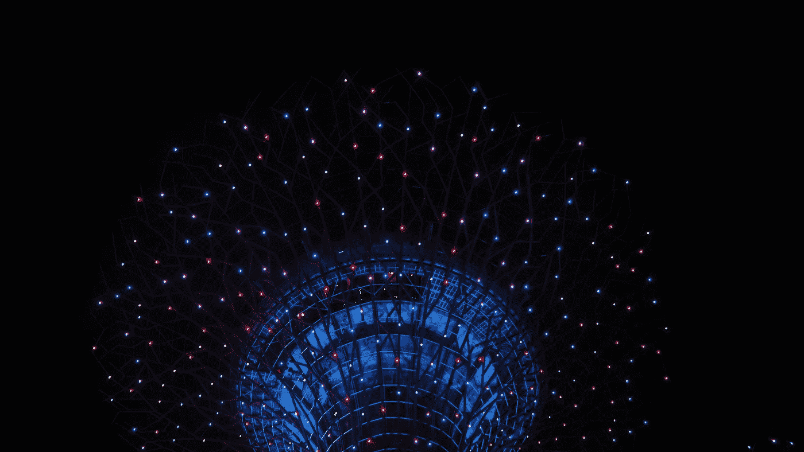

*在这里阅读***了解什么是 Autoencoder，Autoencoder 是如何工作的，在哪里使用。**

**简单介绍一下什么是自动编码器**

*自动编码器使用函数 *f.* 对输入值 *x* 进行编码，然后使用函数 *g* 对编码值 *f(x)* 进行解码，以创建与输入值相同的输出值。*

*自动编码器的目标是最小化输入和输出之间的重构误差。这有助于自动编码器了解数据中的重要特征。当一个表示允许很好地重建它的输入时，那么它就保留了输入中的大部分信息。*

# *什么是不同类型的自动编码器？*

## *欠完整自动编码器*

*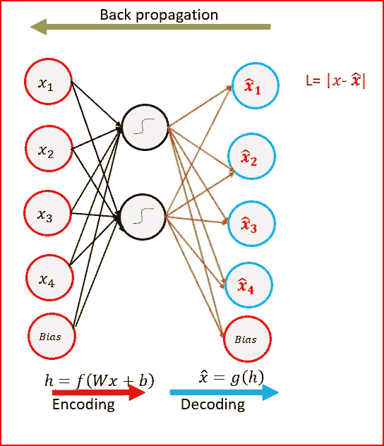*

*Undercomplete Autoencoder- Hidden layer has smaller dimension than input layer*

*   *自动编码器的目标是捕获数据中最重要的特征。*
*   *与输入层相比，欠完整自动编码器的隐藏层尺寸较小。这有助于从数据中获取重要特征。*
*   *目标是通过惩罚与输入*x*不同的*g(f(x)】*来最小化损失函数*

*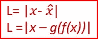*

*   *当解码器是线性的并且我们使用均方误差损失函数时，欠采样自动编码器生成一个类似于 [PCA](https://medium.com/datadriveninvestor/principal-component-analysis-pca-a0c5715bc9a2) 的缩减特征空间*
*   *当编码器函数 *f* 和解码器函数 *g* 非线性时，我们得到 PCA 的强大的非线性推广。*
*   *欠完整自动编码器不需要任何正则化，因为它们最大化了数据的概率，而不是将输入复制到输出。*

## *稀疏自动编码器*

*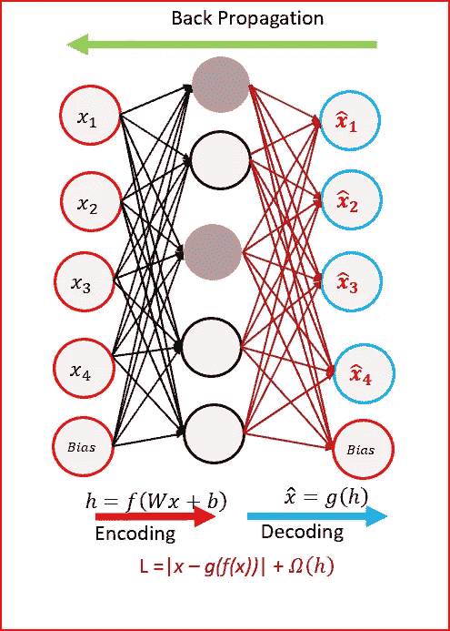*

*Sparse Autoencoders use only reduced number of hidden nodes at a time*

*   *稀疏自动编码器的隐藏节点大于输入节点。他们仍然可以从数据中发现重要的特征。*
*   *在隐含层上引入稀疏约束。这是为了防止输出层复制输入数据。*
*   *稀疏自动编码器有一个稀疏惩罚ω(h)，一个接近零但不为零的值。除了重构误差之外，稀疏性惩罚被应用于隐藏层。这可以防止过度拟合。*

*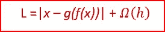*

*   *稀疏自动编码器获取隐藏层中最高的激活值，并将其余的隐藏节点清零。这防止了自动编码器一次使用所有的隐藏节点，并且只强制使用数量减少的隐藏节点。*
*   *因为我们激活和停用数据集中每一行的隐藏节点。每个隐藏节点从数据中提取一个特征*

## *去噪自动编码器(DAE)*

*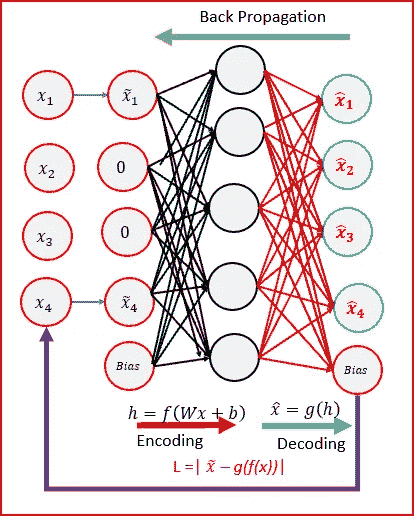*

*Denoising Autoencoders — input is corrupted*

*   *去噪指的是在将原始输入提供给网络之前，有意地将噪声添加到原始输入中。使用随机映射可以实现去噪。*
*   *去噪自动编码器通过引入一些噪声来创建输入的损坏副本。这有助于避免自动编码器在不了解数据特征的情况下将输入复制到输出。*
*   *通过使一些输入为零，可以随机地破坏输入。剩余的节点将输入复制到有噪声的输入。*
*   *去噪自动编码器必须消除损坏，以生成类似于输入的输出。输出与输入进行比较，而不是与有噪声的输入进行比较。为了最小化损失函数，我们继续直到收敛*
*   *去噪自动编码器最小化了输出节点和被破坏的输入之间的损失函数。*

*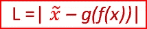*

*   *去噪有助于自动编码器学习数据中存在的潜在表示。对自动编码器进行去噪确保了良好的表示可以从被破坏的输入中稳健地导出，并且对于恢复相应的干净输入是有用的。*
*   *去噪是一种随机自动编码器，因为我们使用随机破坏过程来将一些输入设置为零*

## *收缩自动编码器(CAE)*

*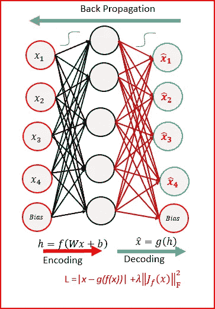*

*Contractive Autoencoders*

*   *收缩自动编码器(CAE)的目标是获得一个健壮的学习表示，它对数据中的小变化不太敏感。*
*   *数据表示的鲁棒性是通过对损失函数应用惩罚项来实现的。罚项是雅可比矩阵 **的 **Frobenius 范数。****雅可比矩阵的 Frobenius 范数对于隐含层是相对于输入计算的。雅可比矩阵的 Frobenius 范数是所有元素的平方和。*****

***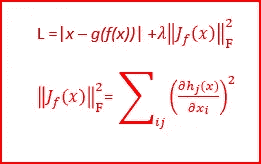***

***Loss function with penalty term — Frobenius norm of the Jacobian matrix***

*   ***收缩自动编码器是另一种正则化技术，如稀疏自动编码器和去噪自动编码器。***
*   ***CAE 优于通过使用权重衰减或去噪来调整 autoencoder 所获得的结果。CAE 是比去噪 autoencoder 更好的选择，学习有用的特征提取。***
*   ***罚项生成强烈收缩数据的映射，因此命名为收缩自动编码器。***

## ***堆叠去噪自动编码器***

***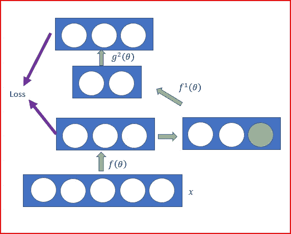***

***Stacked Denoising Autoencoder***

*   ***堆叠式自动编码器是一种具有多层稀疏自动编码器的神经网络***
*   ***当我们向自动编码器添加更多的隐藏层而不仅仅是一个隐藏层时，这有助于将高维数据简化为代表重要特征的较小代码***
*   ***每个隐藏层都比上一个隐藏层更紧凑***
*   ***我们还可以对输入进行降噪处理，然后将数据通过称为**堆叠降噪自动编码器**的堆叠自动编码器***
*   ***在堆叠去噪自动编码器中，输入损坏仅用于初始去噪。这有助于了解数据中的重要特征。一旦学习了映射函数 f(θ)。对于后面的层，我们使用来自前面层的未被破坏的输入。***
*   ***在如上所述训练一堆编码器之后，我们可以使用堆叠去噪自动编码器的输出作为独立监督机器学习的输入，如支持向量机或多类逻辑回归。***

## ***深度自动编码器***

***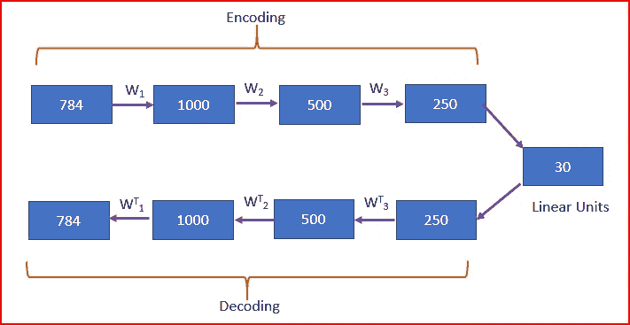***

***Deep Autoencoders (Source: G. E. Hinton* and R. R. Salakhutdinov, Science , 2006)***

*   ***深度自动编码器由两个相同的深度信念网络组成。一个网络用于编码，另一个用于解码***
*   ***通常，深度自动编码器有 4 到 5 层用于编码，接下来的 4 到 5 层用于解码。我们使用无监督的逐层预训练***
*   ***受限玻尔兹曼机(RBM)是深度信念网络的基本构件。我们将做 RBM 是一个不同的职位。***
*   ***在上图中，我们拍摄了一张 784 像素的图像。使用 4 个 RBM 的堆栈进行训练，展开它们，然后使用反向传播进行微调***
*   ***最终编码层紧凑且快速***

***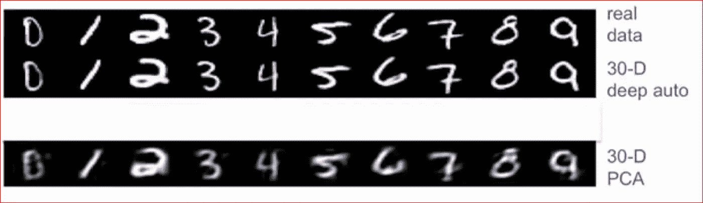***

***Reconstructions by the 30-dimensional deep autoencoder; reconstructions by 30- dimensional standard PCA. (Source: G. E. Hinton* and R. R. Salakhutdinov, Science , 2006)***

*****参考文献:*****

***[深度学习](http://www.deeplearningbook.org/)作者伊恩·古德菲勒、约舒阿·本吉奥和亚伦·库维尔***

***【http://www.icml-2011.org/papers/455_icmlpaper.pdf ***

***[http://www . jmlr . org/papers/volume 11/Vincent 10a/Vincent 10a . pdf](http://www.jmlr.org/papers/volume11/vincent10a/vincent10a.pdf)***

# ***如果你喜欢这篇文章，请分享并鼓掌！***

****也发表于 2018 年 12 月 2 日*[*MC . ai*](http://mc.ai/deep-learning-autoencoders/)*。****

# ***来自 DDI 的相关帖子:***

*** [## 用 7 个步骤解释深度学习——数据驱动投资者

### 在深度学习的帮助下，自动驾驶汽车、Alexa、医学成像-小工具正在我们周围变得超级智能…

www.datadriveninvestor.com](https://www.datadriveninvestor.com/2019/01/23/deep-learning-explained-in-7-steps/)  [## 数据科学和软件工程哪个更有前途？-数据驱动型投资者

### 大约一个月前，当我坐在咖啡馆里为一个客户开发网站时，我发现了这个女人…

www.datadriveninvestor.com](https://www.datadriveninvestor.com/2019/01/23/which-is-more-promising-data-science-or-software-engineering/)***