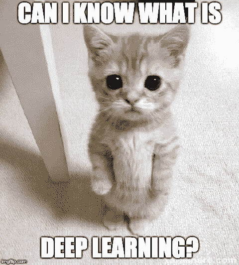
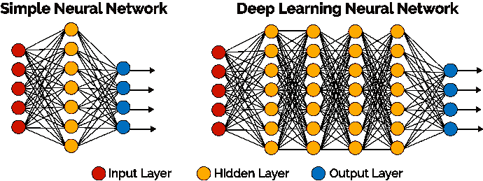
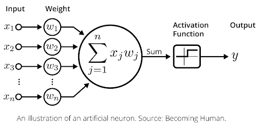

# 用 7 个步骤解释深度学习

> 原文：<https://medium.datadriveninvestor.com/deep-learning-explained-in-7-steps-9ae09471721a?source=collection_archive---------7----------------------->

自动驾驶汽车、Alexa、医学成像——在深度学习的帮助下，我们周围的小工具变得超级智能。

但是深度学习为什么有效呢？为什么 Alexa 能认出我，汽车怎么能自动驾驶？可以用猫来解释吗？

我们当然可以！

让我们深入了解深度学习的 7 个步骤！

**1。什么是深度学习？**

深度学习是机器学习的一个分支，算法从过量的信息中独立学习。与人类似，这些算法通过收集和处理越来越多的数据，随着经验的积累变得越来越聪明。

**2。深度学习是如何工作的？**

深度学习网络的魔力在于发现海量数据背后的模式和结构。计算模型由多层组成，称为神经网络，在其中处理数据。

**3。神经网络中会发生什么？**

我们在神经网络中有三个元素:输入层，这是我们要分析的数据——至少两个隐藏层，或节点，用深度学习算法完成计算。在输出层，我们有计算的结果。

Source: [https://towardsdatascience.com/mnist-vs-mnist-how-i-was-able-to-speed-up-my-deep-learning-11c0787e6935](https://towardsdatascience.com/mnist-vs-mnist-how-i-was-able-to-speed-up-my-deep-learning-11c0787e6935)

真正的行动发生在隐藏层。计算通过连接执行，连接包含输入数据、预先分配的权重和由激活函数定义的路径。

如果结果与预期相差甚远，则重新校准连接的权重，并再次运行分析。这样做，直到结果尽可能准确。例如，当配置语音识别(如 Siri)时，数据的权重被调整，直到它准确地返回说话者的书面内容。当然，这是简要的版本，如果你想深入了解神经网络，丹·贝克尔可以在这里给你一些很棒的见解[。](http://www.datadriveninvestor.com/deep-learning-in-python)

**4。深度学习算法在做什么？**

用两个词来说:相关和减少。

该算法发现彼此相似的信息，同时去除不相关的信息。这些层组合它们从前一层接收的关于数据的信息，将其定义为相关或不相关，并将相关结果发送到下一个节点。不相关的信息被丢弃，从而信息减少。如果信息不明确，它仍然是相关的。

Source: [https://www.flickr.com/photos/101181388@N07/17435969356](https://www.flickr.com/photos/101181388@N07/17435969356)

比方说，我们有一个深度学习算法，可以在图片中找到猫。当我插入这张猫图时，深度学习算法会对它进行逐像素分析。一些节点最初会看到长绿线，并将它们定义为长绿线。在下一层，节点收到许多描述，如绿色的长线。该节点将该特征定义为草地，并意识到这与找到猫无关，并丢弃它。

**5。监督和非监督学习**

深度学习有两种主要形式:监督和非监督。

在监督学习中，我们告诉计算机我们输入的信息是什么。通过这种方式，我们获得了更多的人力输入，但计算效率会更高。监督学习用于大量定义明确的数据，如天气。

另一方面，无监督学习处理未标记的信息。它对当前可用的各种数据进行预测，并在看似不相关的环境中找到模式。

**6。深度学习不是 AI**

虽然深度学习是人工智能的一个分支，但人工智能的范围更广。AI 应该是由计算机节点执行的对人类意识和独立思维过程的模仿。深度学习不能独立思考——它只能根据输入的数据和指令做出决定。

**7。为什么它很重要**

深度学习就在我们身边。经过训练的算法可以在拍照时识别我们的面部，对消费者行为进行预测分析，或检测欺诈行为。

使用深度学习使我们能够将大量数据转化为见解，并增加技术智能。这些见解已经被用于科学、医学、农业和许多其他领域的重大突破。结合物联网或机器人等其他新技术，深度学习可以帮助解决我们世界的一些最大问题，并改善人们的生活。

*原载于 2019 年 1 月 23 日*[*www.datadriveninvestor.com*](https://www.datadriveninvestor.com/2019/01/23/deep-learning-explained-in-7-steps/)*。*