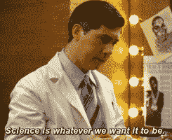
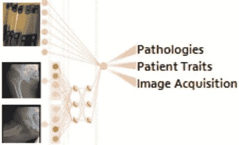
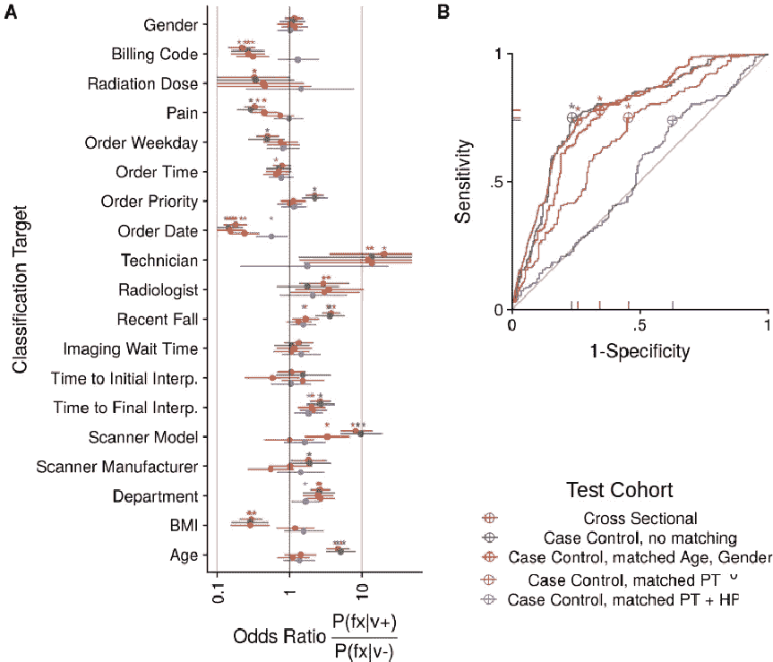
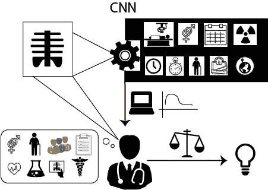

# 深度学习利用临床推理在 X 射线中预测髋部骨折

> 原文：<https://medium.datadriveninvestor.com/deep-learning-exploits-clinical-reasoning-to-predict-hip-fracture-in-x-rays-e1fd9f1a57d2?source=collection_archive---------13----------------------->

深度学习正被应用于放射学，以预测疾病。放射学数据集对于深度学习来说相对较小，因此研究人员通常使用转移学习和缩小的图像。我和我的合作者最近推动了[我们用迁移学习预测髋部骨折](https://www.nature.com/articles/s41746-019-0105-1)的研究，并揭示了该算法的预测性能取决于混杂的患者和医院流程变量。在这里，我总结了医疗保健服务中的临床推理如何将混杂结构引入医疗保健数据，以及我们用来说明深度学习如何类似地利用 x 光照片中明显的患者和医疗保健过程变量来预测疾病的方法。

# 临床推理和患者多样性将模式印入医疗保健数据

临床推理涉及无数数据源的综合。流行病学研究发现，如果患者年龄较大、女性、体重较轻、患有骨质疏松症、服用类固醇等，他们更有可能发生髋部骨折。骨折不是确定性的或自发的——患者在外伤后遭受骨折(例如，跌倒、虐待或机动车碰撞)。当医生考虑患者的临床背景时，他们更擅长解读图像(*自然医学* [深度思维](https://www.nature.com/articles/s41591-018-0107-6/figures/3)，[美国](https://www.nature.com/articles/s41591-018-0147-y))。临床诊断不仅仅是一张 x 光片。

医生根据给定患者表现和临床背景的不同疾病的概率来安排测试和成像研究。[美国放射学院](https://acsearch.acr.org/docs/69404/Narrative/)发布了各种临床情况下适合的放射影像学研究的建议。例如，临床上怀疑有髋部骨折的中年或老年患者应该接受后续的 MRI 检查，即使最初的 x 射线看起来正常。诊断检查中的差异可以导致通过统计学习算法学习的医疗保健数据的结构。

Medical practice is highly variable

地区患者多样性和健康差异是医疗服务的额外决定因素。从历史上看，如何管理患者的最强预测因素是地理区域和医院资源([扁桃体切除术](https://www.ncbi.nlm.nih.gov/pmc/articles/PMC2076749/)、[医院资源](https://www.ncbi.nlm.nih.gov/pubmed/4750608)、[外科手术](https://www.ncbi.nlm.nih.gov/pubmed/7133068))。我在纽约市学习医学并训练深度学习模型，那里的患者群体非常丰富多样。健康差异限制了临床医生，并在整个医疗保健数据中引起共鸣。在线社交应用上训练的深度学习[了解了人类的偏执](https://techcrunch.com/2016/03/24/microsoft-silences-its-new-a-i-bot-tay-after-twitter-users-teach-it-racism/)。我们之前报道过，当疾病的流行率在医院中心之间不同时，深度学习模型可能会被与疾病流行率相关的混淆信号误导，并在部署到新的医院系统时失败。在[电子医疗记录](https://www.bmj.com/content/361/bmj.k1479)和[遗传学](https://www.nature.com/articles/ng0707-807)研究中已经表明，样本处理变量可以产生比生物学更强的信号，这里我们用深度学习放射学测试了一个类似的假设。

> “没人知道医疗保健会如此复杂”——唐纳德·特朗普

# 模型可解释性

深度学习经常被批评为“黑箱”。我认为现代最伟大的东西实际上是黑箱。为了早上开机，我需要物理黑盒:我的闹钟和咖啡机。我不知道它们在内部是如何工作的，我只是提供我的输入偏好，并从输出中受益。有些人对信任难以处理的模型感到模糊的不安，并对这些模型持有不相称的标准。在这项研究中，我们提出当模型不可解释并利用混杂变量时，临床医生从计算机辅助诊断预测中获益有限。

# 调查方法

在训练了一个简单的髋部骨折模型后，我对该模型的高性能感到惊讶，并对该模型的运行方式产生了怀疑。我们之前使用可视化方法揭示了预测肺炎的[模型考虑了非生物信号](https://medium.com/@jrzech/what-are-radiological-deep-learning-models-actually-learning-f97a546c5b98)。在我们最新的 [arXived 研究](https://arxiv.org/abs/1811.03695)中，我们收集了一组全面的临床背景数据，训练了多模态模型，并进行统计实验，以剖析模型用于预测疾病的信息。

**Simplified schematic of multimodal models.** Our multimodal models start by embedding an image into a 1D tensor (after a max-pooling layer) and then concatenate scalar patient and image acquisition variables from the medical records to predict targets.

我们首先评估深度学习是否可能受益于识别与髋部骨折相关的患者和图像采集变量。我们发现，简单的深度学习模型可以预测髋部骨折，所有 5 个病人变量，以及所有 14 个医院流程变量。此外，每一个变量都与骨折显著相关(无论是在整个人群中还是在特定设备扫描的亚人群中)。然后，我们认为，通过显示多模态模型优于仅图像模型，临床背景是有益的。这些结果表明，深度学习可以通过利用非疾病变量而受益，但并没有证明这些间接关系是骨折预测的机制。

我们通过创建多个具有不同统计特性的测试集来理清骨折模型预测与骨折协变量关联的关系。由于深度学习可以直接从 x 光像素中提取协变量，因此我们无法在单个 x 光照片中分离这些变量。相反，我们使用病例对照二次抽样来统计学地改变人群中髋部骨折和相关变量之间的联系。我们在 70%的数据上训练模型，并在由 30%的数据或更小的病例控制子集组成的测试集上评估模型性能。当了解像髋部骨折这样的罕见情况时，以前的小组随机分组正常病例的数量。我们通过对正常病例进行非随机二次抽样，为这一实践增加了另一个要素，使其在患者和图像采集变量方面更类似于骨折病例(放射照片匹配二次抽样)。

# 结果

**The effect of radiograph-matched subsampling on fracture-covariate associations and model performance.** A) Odds Ratios measure the association between hip fracture and binarized forms of each covariate. B) Receiver Operator Characteristic curve for model performance on different test-sets.

优势比衡量髋部骨折与每个患者和医疗过程变量之间的联系(子图 A)。在完整的数据集(横断面，黄金)中，我们发现大多数协变量与髋部骨折之间有显著的相关性。当我们对每个骨折随机选择一个正常的 x 线照片时(病例对照，无匹配，灰色)，这些骨折关联保持不变。我们执行越来越全面的放射照片匹配方案(橙色为人口统计数据，粉红色为人口统计数据和症状，紫色为人口统计数据和症状以及医院流程)。随着我们匹配更多的混杂因素，我们消除了混杂因素和骨折之间更多的联系。

当在整个测试集、具有随机二次抽样控制的测试集或具有与患者特征匹配的控制的测试集(子图 B)上测试时，深度学习模型可以预测髋部骨折。但是，当测试集控制与患者和图像采集匹配进行子采样时，骨折和非骨折射线照片具有相似的协变量分布，图像模型不再能够预测哪些射线照片包含骨折。这表明深度学习只是因为骨折、患者和医院过程变量之间的关联而预测骨折(即，不是通过直接看到骨折)。

# 讨论

*   深度学习模型可以固有地利用来自整个 x 光照片的患者和图像采集变量
*   直接将这些变量作为解释变量可以提高模型性能
*   通过将标准的横断面研究设计重新构建为匹配的病例对照研究，我们揭示了预测骨折的能力完全由非疾病协变量介导

这项研究没有调查其他诊断、放射影像学方法或建模策略。许多最近的深度学习放射学论文使用迁移学习来克服样本大小的限制。射线照片被任意缩小并裁剪到大规模基准数据集中的图像大小(通常是每个轴的 5-10 倍)。我们对[最佳报告裂缝模型](https://arxiv.org/abs/1711.06504)进行了二次分析，该模型使用分割来避免缩小图像(以及其他优雅的预处理和建模策略),并确定并非所有模型都依赖于混杂因素。尽管如此，深度学习放射学的当前现状可能特别容易受到混杂利用的影响。

***深度学习可以利用非疾病信号预测疾病是个问题吗？***

看情况。

如果算法正在自动解读医学图像，那么临床推理的性能提升很可能是有益的。

但是混杂变量的使用可能会破坏旨在改善临床医生对临床病例的综合的算法。为了模拟不确定深度学习模型如何编码患者和医疗保健变量的临床医生，我们使用朴素贝叶斯将纯图像模型预测与临床背景相结合。其次，组合仅图像预测和临床背景不如同时在图像和临床背景上训练的多模态模型(有效地编码图像-协变量相互依赖性)。具有不可解释的深度学习的人类临床推理可能会受到来自患者和医疗保健过程变量的双重计数证据的限制。

**Schematic representation of a clinician using computer-aided diagnosis.** If deep learning algorithms are inexplicably leveraging patient and process variables in disease predictions, it is unclear how radiologists should interpret algorithm output in the context of other known patient data.

# 深度学习比适用更强大

深度学习模型可以从放射影像中学习无数的疾病、患者和图像采集规范。深度学习通常是在回顾性收集的数据而不是前瞻性控制试验上进行训练的，它可以利用非生物数据模式来间接预测疾病。如果临床医生不知道算法的预测如何与她正在考虑的其他证据重叠，这种内置的临床推理可能会使计算机辅助诊断变得复杂。

单个射线照片是对患者的近视视图。患者护理不是由一张 x 光片预测的，深度学习也不是现代性的唯一演变组成部分。未来的研究应该考虑开发多模态模型以保持相关性。生物技术和移动医疗正在创造新奇的数据流，可以将医学从被动诊断转变为主动健康。深度学习可用数据的概要可以产生更准确的模型，并增强广泛的部署和证据集成。

这项调查是我论文的最后一章*多模态深度学习，以增强放射学的实践*。查看[我的另一项研究](https://scholar.google.com/citations?user=oj69DwoAAAAJ&hl=en&oi=ao)研究。