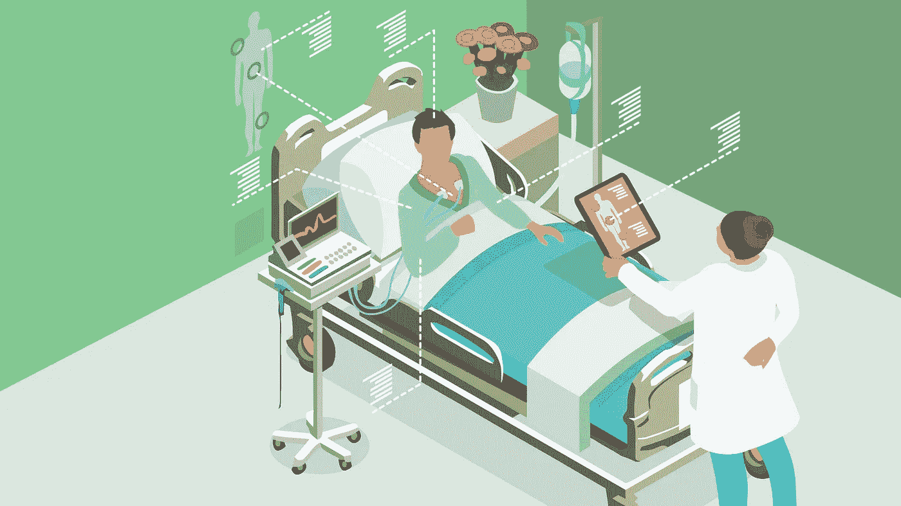

# 深度学习的差异隐私-一个例子-

> 原文：<https://medium.datadriveninvestor.com/deep-learning-for-differential-privacy-an-example-db684fca6ef7?source=collection_archive---------0----------------------->

[](http://www.track.datadriveninvestor.com/1B9E)

我们之前已经在[深度学习上下文](https://medium.com/secure-and-private-ai-writing-challenge/differential-privacy-for-deep-learning-1eb821941e0f)中定义了[差分隐私](https://medium.com/secure-and-private-ai-writing-challenge/differential-privacy-83860757f8e4)，现在，我们将讨论一个简单的例子来更好地理解它。假设你在一家医院工作，你有一大堆病人的图像，但你不知道里面有什么，因此你想开发一个神经网络模型，对他们进行自动分类，但由于图像没有被标记，所以它不能这样做。因此，我们联系其他已经有注释数据的医院，这样我们就可以用它来训练，然后用这个模型来标记我们自己的数据。

但这些医院会担心自己病人的隐私，不愿意交出他们的数据。

[](https://www.datadriveninvestor.com/2019/02/08/machine-learning-in-finance/) [## 金融中的机器学习|数据驱动的投资者

### 在我们讲述一些机器学习金融应用之前，我们先来了解一下什么是机器学习。机器…

www.datadriveninvestor.com](https://www.datadriveninvestor.com/2019/02/08/machine-learning-in-finance/) 

所以，我们需要遵循一定的技术来保护病人的隐私

*   首先，我们要求每家医院在自己的数据集上训练一个模型。这样，我们就有 10 种不同的型号了。然后，我们将使用这些模型的 arch 对我们自己的本地数据集进行预测。为每个数据点生成 10 个标签。
*   然后对每个数据点执行 dp ( [差分私有查询](https://medium.com/secure-and-private-ai-writing-challenge/towards-evaluating-the-privacy-of-a-function-24b2e705309f))，从所有 10 个标签中找出真正的标签。这个查询将是一个 max 函数，其中 max 将是所有 10 个模型中最常见的标签。
*   然后我们需要添加[拉普拉斯噪声](https://medium.com/secure-and-private-ai-writing-challenge/types-of-differential-privacy-676fd768fd17)，以确保这个函数是完全私有的。
*   最后，我们现在将使用我们自己的数据集来训练我们自己的数据点，我们现在已经对其进行了标记。

假设我们的数据将是人体的 x 射线图像，并且我们作为一家医院对识别关于这些 x 射线的现象感兴趣，比如说 10。但是我们的图像没有被标记，所以我们不能在我们的数据集上训练机器学习模型。所以我们想用其他 10 家合作医院的数据来注释我们的数据。这些医院将训练模型，使用他们喜欢的任何分类器。然后，我们将使用他们所有的模型对我们的数据进行预测，为每张图像生成 10 个标签。

当差异隐私部分出现时，我们希望获得 10 个标签并生成最佳标签。

我们将跳过训练模型，因为我们想专注于差异隐私部分，所以我们将综合生成我们对该示例的预测。

```
preds[:,0]
array([4,9,2,0,9,2,0,6,7,2)
```

以上都是所有老师(医院)对第一形象的预测。所以，标签 4 来自第一个老师，9 来自第二个老师，以此类推。

我们试图做的是，以尊重隐私的方式将这些标签合并成一个标签，我们想这样做的原因是基于一个核心假设，即这 10 家医院有不同的患者，我们假设他们没有重叠的患者，以保持差异隐私的强大定义。

所以，现在我们得到了每个图像预测的 argmax，但这仍然不是差分私有的，因为这是精确的答案，因此我们需要添加某种形式的[随机性](https://medium.com/@aisha.badrawy/formal-definition-of-differential-privacy-db99670937a6)或噪声。我们将使用[拉普拉斯噪声](https://medium.com/@aisha.badrawy/formal-definition-of-differential-privacy-db99670937a6)，它看起来会像这样。

我们正在给 label_counts 添加噪声，我们可以把 counts 看作是我们的迷你数据库。在执行 argmax 后，这种噪音可能会导致答案错误，但这就是我们实现隐私的方式。

我们的希望是，当我们稍后开始训练我们自己的模型时，在注释我们的数据之后，模型将学会过滤噪声。并学习如何合理准确地预测。

现在的问题是，我们泄露了多少信息。在下一篇文章中，我们将讨论 PATE 分析框架，以及我们如何获得 epsilon 的更好界限。

# 注意

我写这篇文章的部分原因是 Udacity 的安全和私人 AI 奖学金挑战，作为一种分享我迄今为止所学到的东西的方式。

# 60 天城市#安全和隐私