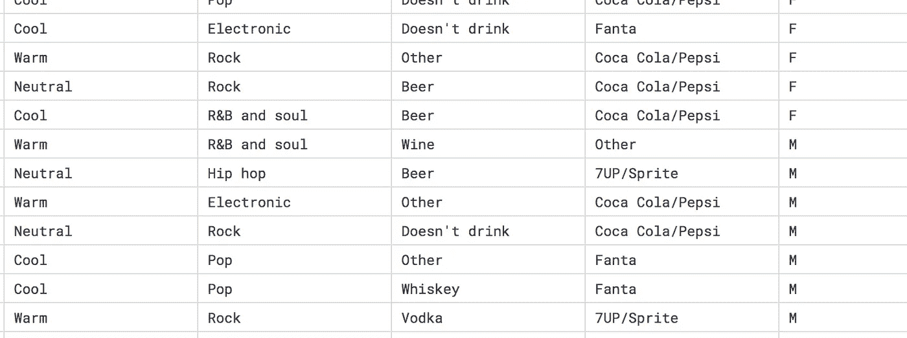
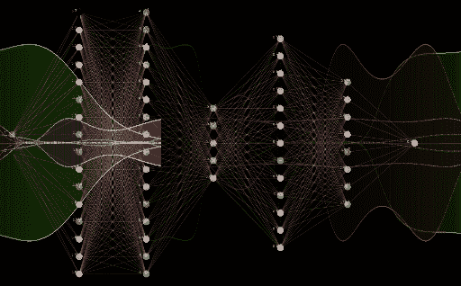
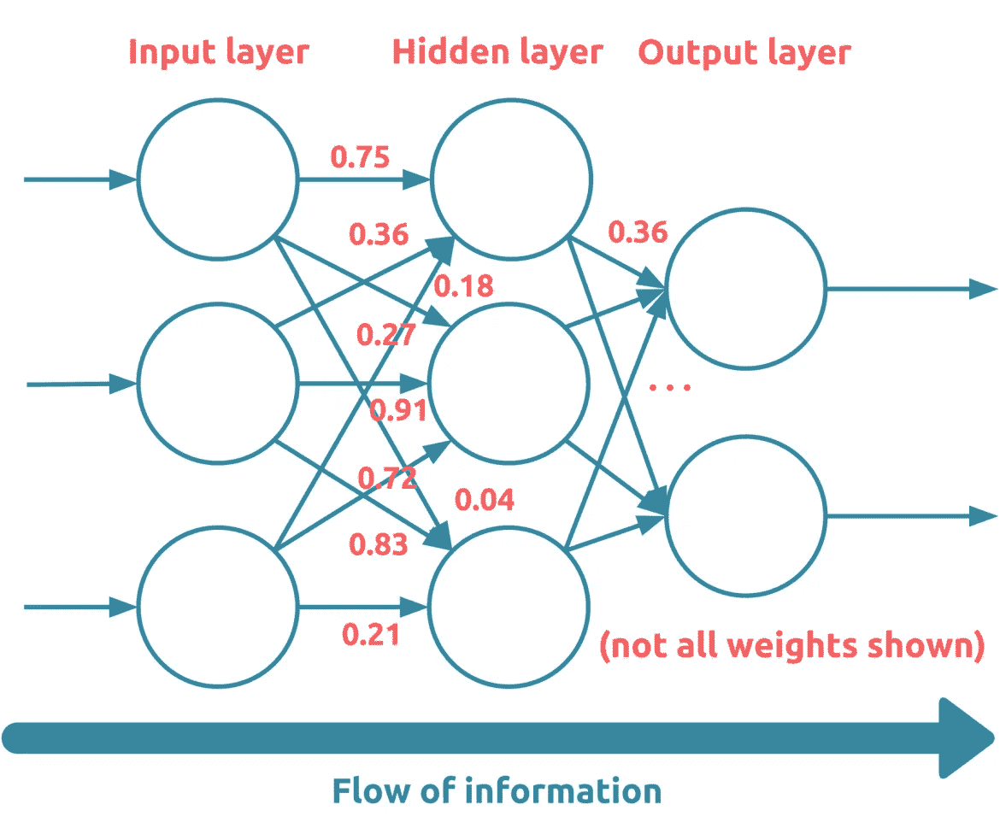

# 深度学习基础-重要概念

> 原文：<https://medium.datadriveninvestor.com/deep-learning-fundamental-important-concepts-59d7ae90901b?source=collection_archive---------0----------------------->

einfochips.com

深度学习是机器学习的子领域，使用受大脑神经网络结构和功能启发的算法。

在谈论深度学习之前，我们需要了解针对不同用例的不同类型的机器学习算法。

我们可以将机器学习算法分为四种类型

1- **监督学习** —监督学习算法正在与您的标记数据模型一起工作。监督学习有两个部分。一个叫做分类，另一个叫做回归。

**a)回归**——这用于预测特定城市的连续值，如股票价格和房屋价格。常见的算法有*线性回归、支持向量机、多元回归算法*等。

**b)分类** -用于预测布尔值，如真/假或男/女。常见的算法有*朴素贝叶斯、决策树、支持向量机(SVM)、决策树、随机森林*等。

例如，如果您需要根据某些特征向量进行性别分类，如*最喜欢的颜色、* *最喜欢的音乐、最喜欢的饮料、最喜欢的软饮料*，然后结果数据被标记为 M 或 F。您可以看到最后一列被标记为结果(M 或 F)。根据您使用的算法，模型将从训练数据中学习，然后预测新提供的数据集的结果。

2- **无监督学习-** 无监督 ML 算法在你没有如上所述的标记数据时使用。常见的算法有 *k-means 聚类，关联规则。*

3- **半监督学习-** 在上述两种类型的数据中被标记或未被标记。半监督算法用于混合数据集，其中一些数据被标记，而一些没有。通常，这种组合将包含非常少量的标记数据和非常大量的未标记数据。所涉及的基本程序是，首先，程序员将使用无监督学习算法对相似的数据进行聚类，然后使用现有的已标记数据来标记剩余的未标记数据。

4- **强化学习-** 在人工智能的背景下，强化学习是一种使用奖惩系统训练算法的动态编程。强化学习算法或代理通过与其环境交互来学习。

代理通过正确执行获得奖励，通过错误执行获得惩罚。代理通过最大化它的奖励和最小化它的惩罚在没有人类干预的情况下学习。例如玩游戏，从每个动作中学习它是正确的还是错误的。

## 深度学习:

深度学习也像其他机器学习算法一样学习数据，但使用称为人工神经网络(ANN)的神经网络。我们可以使用深度学习库，如 TenserFlow(由谷歌编写)、Keras(运行在 TensorFlow、微软认知工具包等之上)、PyTorch(由脸书编写)

## 人工神经网络:

人工神经网络是一个计算系统，它是称为神经元的连接单元的集合，神经元被组织成我们所说的层。层有三种类型-输入层，输出层，隐藏层。

1.  输入图层-输入数据的每个组件对应一个节点。
2.  隐藏层-为每个隐藏层任意选择节点数。
3.  输出层—每个可能的期望输出对应一个节点。

wikipedia.com

上图中的每个小圆圈被称为神经元。每个神经元向下一个神经元传递信号。

由于这个网络在输入层有三个节点，这就告诉我们，这个网络的每个输入都必须有三个维度，就像上面的例子*最喜欢的颜色、最喜欢的音乐、*和*最喜欢的* *饮料*。

由于该网络在输出层有两个节点，这告诉我们，通过网络向前(从左到右)传递的每个输入都有两个可能的输出。例如，*男*或*女*可以是两个输出类(预测类)。

## 为什么有不同类型的层？

人工神经网络中的神经元被组织成层。按照层的类型，我们可以在问题陈述的基础上使用 ANN。

致密层

卷积层

池层

标准化图层

循环层

每种类型的层用于不同类型的任务。通常用于图像分类的卷积层和密集层在其层内具有每个输入到每个输出。

在人工神经网络中，每一层从左到右(上图)将信息传递给下一层。每一个节点(神经元)之间的连接都会有权重关联，这只是一个数字。当任何输入传递到一个给定的节点时，该输入将乘以权重并传递到下一个节点。下一层中的下一个节点将使用激活函数计算传递的输入。这一过程将一直持续到到达外层为止。

下一个节点输出=激活(加权和)

**激活函数:**激活函数是将节点的输入映射到其对应输出的函数。

例如——乙状结肠、Relu 等。这些函数是使用不同的数学技术构建的。

**损失函数:**在训练过程中，将使用网络的输出预测和相应输入的真实标签来计算损失。

比方说，如果我们将我们的标记结果(男性/女性)指定为 0 和 1，然后如果我们将训练数据传递给模型以预测其为男性，但 ANN 将其计算为女性，则将计算损失。由于在人工神经网络中一切都只是数字，那么你的预测输出也将是一个数字。假设在这个过程中，ANN 给出的输出为 0.25。

因此错误将是:

误差= 0.25–0.00 = 0.25

实践中常用的损失函数称为*均方误差* (MSE)。

**均方误差:**我们首先计算提供的输出预测和标签之间的差异(误差)。然后我们平方这个误差。

如果我们一次向模型传递多个样本(一批样本)，那么我们将得到所有这些样本的误差平方的平均值

## 训练一个人工神经网络；

在 ANN 训练中，我们的任务是优化在模型初始化中分配的网络权重，并找出将每个输入映射到正确输出的准确权重。映射是训练过程中最重要的东西。在每次训练过程中，人工神经网络将尝试将每个输入映射到正确的输出，如果输出不匹配，则人工神经网络将计算损失函数。损失是提供的标记输出和预测输出之间的误差。在训练过程中，我们需要反复传递相同的数据，以便模型可以计算损失函数和优化网络权重。

## 神经网络如何学习:

当模型被初始化时，网络权重被设置为任意值，然后在每次通过后，ANN 将计算损失函数。在计算损失之后，相对于网络内的每个权重计算该损失函数的梯度。一旦我们有了损失函数的梯度值，我们就可以使用这个值来更新模型的权重。然后我们将梯度值乘以一个叫做*的学习速率*。学习率是一个很小的数字，通常在 0.01 和 0.0001 之间，但实际值可以变化。

新权重=旧权重-(学习率*梯度)。

在网络获得新的权重之后，所有旧的权重将被新的权重代替，并且相同的过程将一次又一次地重复，直到正确标记的输出将被网络存档。

## **人工神经网络中的过拟合和欠拟合:**

**过度拟合**:当我们的模型变得非常擅长对包含在训练集中的数据进行分类或预测，但不擅长对未经训练的数据进行分类时，就会发生过度拟合。因此，从本质上讲，模型过度拟合了训练集中的数据。

**减少过度拟合:**添加更多的训练数据，并使用不同类型的数据集来训练您的模型。例如，如果你对图像进行分类，然后用同一幅图像的不同角度训练你的模型。

我们也可以降低模型的复杂性。可能正在从网络中移除图层。

**欠拟合**:当一个模型不能对它被训练的数据进行分类时，它被认为是欠拟合的。

**减少欠拟合:**增加模型复杂度。在 ANN 中添加新层。

在训练数据中添加更多特征向量，以便模型可以针对更多特征进行预测。

非常感谢您，敬请关注即将到来的文章，我们将使用 keras 创建神经网络，我们将在 keras 程序中使用所有数学函数，如 sigmoid 和 relu。

有用的链接:

 [## 神经网络中的 7 类激活函数:如何选择？

### 神经网络激活功能是深度学习的重要组成部分。激活功能决定输出…

missinglink.ai](https://missinglink.ai/guides/neural-network-concepts/7-types-neural-network-activation-functions-right/)  [## 神经网络和深度学习初学者指南

### 自动将 RL 应用于模拟用例(例如呼叫中心、仓储等。)使用 Pathmind。开始吧…

skymind.ai](https://skymind.ai/wiki/neural-network) 

**关注我们** [**推特**](https://twitter.com/joinfaun) 🐦**[**脸书**](https://www.facebook.com/faun.dev/) 👥**并加入我们的** [**脸书集团**](https://www.facebook.com/groups/364904580892967/) 💬**。****

****加入我们的社区 Slack** 🗣️ **阅读我们每周的农牧神话题**🗞️**点击 here⬇****

****

## **如果这篇文章有帮助，请点击拍手👏按钮下面几下，以示你对作者的支持！⬇**