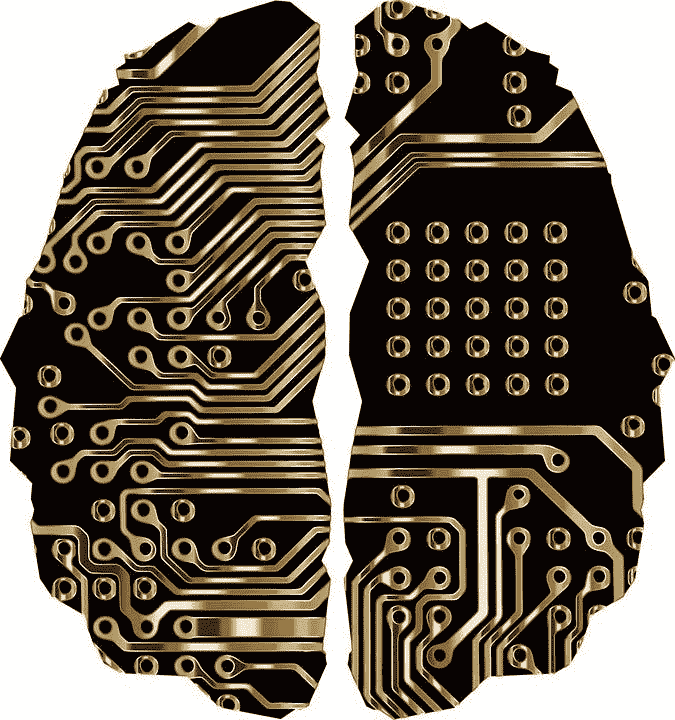

# 深度学习游戏化和人工智能作为现代学习工具或灌输剂

> 原文：<https://medium.datadriveninvestor.com/deep-learning-gamification-and-artificial-intelligence-as-a-modern-learning-tool-or-an-agent-of-d853f349c112?source=collection_archive---------11----------------------->

在阅读一些关于深度学习和人工智能的最新趋势时，我发现了一个流行的学习假说；叫做学习行为的游戏化。后者主要是关于非娱乐情境中的游戏模式因素和娱乐主义。游戏化通过使用引人入胜的游戏技术来利用人的自然渴望来加强活动或过程。在我们买下这个里程碑之前，我们必须首先通过理解技能、效用、天赋和知识的精确相互作用，以及它们如何反过来被我们学习的方式所影响，来协调我们的心理。一旦我们建立了这个想法，我们还必须区分[机器学习](https://www.datadriveninvestor.com/glossary/machine-learning/)(和深度学习)和人类学习行为，这是一个仍然模糊的理论。似乎应用科学很难通过理解学习过程背后的生物学和心理学来建造一个人。

一个人所做的任何一部分工作都是一项任务。完成这项特殊工作的先决条件是学习知识，并利用天生的才能来掌握它或拥有令人满意地完成它的能力。

他们通过联想、强化、惩罚和观察，关注环境对学习过程的影响。其中包括经典条件反射、操作数条件反射和社会学习。我不认为自己是行为学习方面的专家。因此，我无意深入探讨这个问题的细节。此外，我觉得这样做超出了本次讨论的范围。尽管如此，最新推出的学习理论之一是关于游戏化学习的。这个概念已经获得了发展 [人工智能](https://www.datadriveninvestor.com/glossary/artificial-intelligence/) ( [AI](https://www.datadriveninvestor.com/glossary/artificial-intelligence/) )领域的[初级学习概念内的数据科学家的关注。](https://www.verywellmind.com/learning-theories-in-psychology-an-overview-2795082)

# 什么是游戏化，为什么要用游戏来教学？

这份总结将对这个主题有所启发，强调它向数据科学领域的发展。

我相信你们大多数人都非常熟悉“玩耍应该是有趣的”这个概念基于这样的定理，如果我们寻找教育玩具(儿童)，小玩意，有内置插图的游戏，有引人注目的信息的书籍，理解将是有趣的。通常学术工具不太吸引人，而且会减少人们的好奇心。小提琴本质上是有教育意义的；与此同时，它应该呼吸愉快。当游戏的乐趣消失时，学习也随之消失。

术语；游戏化是现代的，因此经常有各种各样的含义。这个概念已经存在十多年了。它最初出现在 2000 年代，因为它在 2010 年代受到了越来越多的关注；Deterding 等人，2011 年；Werbach 和 Hunter，2012)。游戏化是指引入已经流行的因素或流行因素，如网站、商业应用、社交媒体，并整合游戏行为，以激发参与、投入和喜欢。游戏化仅仅利用了游戏设计者用来吸引玩家的方法，通过操纵数据集并将它们应用于非游戏的考验来激励对商业周期有价值的活动。尽管关于游戏化的独特角色对学习体验意味着什么存在重大争议，但人们可以指出它对技术的“影响”的重要性。这不是直接至关重要的，但游戏设计元素可以激发其他动机的发展。其中，自我决定的概念被用来研究游戏设计组件之间不同组合的效果。分配意义的能力和自主性受到符号的影响，[Marczewski 于 2013 年正式报道](https://www.sciencedirect.com/science/article/pii/S074756321630855X) [分类帐](https://www.datadriveninvestor.com/glossary/ledger/)董事会和绩效图表。伴随着社交互动受到虚拟角色、有意义的故事和队友的积极影响。

# 随着医疗服务的游戏化而改变行为

深入参与医疗保健服务和管理的人员必须了解个性化护理、患者参与和生活方式的改变，以帮助患者控制自己的健康习惯和临床决策。

[根据 Huron](https://www.huronconsultinggroup.com/resources/healthcare/changing-behaviors-gamification-of-healthcare?utm_source=adwd&utm_medium=psea-retargeting&utm_term=2019-hc-thoughtleadership&utm_content=adwd-hc-thoughtleadership-gamificationofhealthcare&utm_campaign=7014O000001got1&creative=378957398570&keyword=%2Bhealthcare%20%2Bgamification&matchtype=b&network=g&device=m&gclid=Cj0KCQiA2b7uBRDsARIsAEE9XpGQJxC0G-zVLweSIIlnfpbTbCFEzwS9LDZkcEkkOEGfU5LQEDKznvIaAuzIEALw_wcB) 发布的一份报告，到 2025 年，全球医疗保健游戏化市场的游戏效果预计将达到 135 亿美元。学习过程倾向于跨越 21 世纪医疗保健中两个最重要的财产，即人和技术。Fitbit、Apple Watch 等可穿戴技术，以及旨在追踪和奖励锻炼、饮食和一般健康的应用程序，已经成为健康游戏化的第一个主要前线。医疗保健游戏化的连续时代预计将解决更深入的高血压和糖尿病等慢性疾病的监测和管理。

# 学习行为中的说服技术

DeepMind 等行业是一种人工智能(AI)解决方案，它促进了游戏性计算，并通过在通常超出普通人类思维能力范围的手段上取得胜利，获得了对人工智能领域的连续掌控。简单来说[深度学习](https://www.datadriveninvestor.com/glossary/deep-learning/)利用预定的算法来记忆人类的智能模式，并增强超越社会天赋的功能。

# 认知辅助、说服或操纵艺术

深度学习是医疗保健中削减成本和提高质量的实际应用。它依赖于通过交互式技术的设计、开发和评估的说服方法，旨在通过说服模式改变学习者的行为。作者试图将后者与强迫或欺骗区分开来，同时指出使用人工智能(AI)观点进行概念设计和系统实现对医疗保健系统激发说服力的影响。根据一些研究人员的说法，基本目标是支持开发一个[，即认知辅助](https://www.aaai.org/ocs/index.php/FSS/FSS16/paper/viewFile/14087/13684) [IoT](https://www.datadriveninvestor.com/glossary/internet-of-things/) (物联网)工具箱，用于为医疗保健系统开发人工智能驱动的说服技术。

# 一般领域学习和特定领域学习的概念

[一般领域学习理论](https://en.wikipedia.org/wiki/Domain-specific_learning)与特定领域学习理论相反。(也称为模块化方法)它认为，人类有独立的，专门的知识结构，而不是一个内聚的知识模式。因此，一个领域的培训可能不会影响另一个独立的领域。这种模块化的方法认为人们拥有高度专业化的功能，这些功能彼此独立。

# 领域特异性理论如何应用于机器学习？

[领域特定语言(DSL)方法](https://www.academia.edu/25607662/Domain_Specific_Languages_for_Machine_Learning)在机器学习领域也越来越受欢迎。使用 DSL 的深度学习指的是属于建模语言的编程语言模式，领域专业人员可以通过该模式利用铭文和直觉来解释模型。从编程语言的角度来看，DSL 指的是可重用的公式，特定领域的专家可以使用它来定义具有高级语言规范的算法，

# 人类和机器人之间的标准和多样化的游戏化议程

游戏化开始被认为是一种强有力的工具，而不是浪费时间。它被认为是通过游戏化的学术分析来掌握人们的智力并保持他们的参与，从而使自己适应学校教育的未来。软件、应用甚至机器人开始吸引千禧一代。一个这样的例子是会说话的机器人“Nao”，它在教用户识字和计算机编程的同时与用户互动。为了做到这一点，计算机正在实时吸收每个人的每一个细节，作为大型[数据](https://www.datadriveninvestor.com/glossary/big-data/)招聘的一部分。因此，笔记本电脑使用特定领域的学习来记忆关于一个人的习惯和智力运作的一切；并游戏化，说服，改变他们的想法。

模拟神经元人类网络可以转化为数字网络等效。然而，它也可以毫不费力地被利用来作为洗脑工具，而不是增强基于个人偏好的个人天赋。

深度学习不一定等于人类学习，因为它需要大量的数据(大部分是深刻的和个人的)，这些数据可以从成千上万的资源中收集并通过游戏化学习的效率传递给学习者。

# 带回家的信息

常识是与日常事务相关的最终正确判断，或者是感知、理解、学习和判断公众传达给几乎所有人的信息的基本能力。常识决定了游戏、操纵和灌输之间的界限。因此，为了确保人工智能收集准确的数据，公正地学习，并教授应该了解的东西[迫使透明](https://link.medium.com/JQgMkTvTF1)，但企业和大数据行业愿意承担这样的责任吗？！

> 法律是否足够先进以确保[的透明度和问责制](https://link.medium.com/jYXZJHOcJ1)？！

毫无疑问，[医疗保健学习过程的游戏化](https://www.huronconsultinggroup.com/resources/healthcare/changing-behaviors-gamification-of-healthcare?utm_source=adwd&utm_medium=psea-retargeting&utm_term=2019-hc-thoughtleadership&utm_content=adwd-hc-thoughtleadership-gamificationofhealthcare&utm_campaign=7014O000001got1&creative=378957398570&keyword=%2Bhealthcare%20%2Bgamification&matchtype=b&network=g&device=m&gclid=Cj0KCQiA2b7uBRDsARIsAEE9XpGQJxC0G-zVLweSIIlnfpbTbCFEzwS9LDZkcEkkOEGfU5LQEDKznvIaAuzIEALw_wcB)具有赋予消费者权力、吸引医生和患者的潜在可能性。因此，它将有助于通过特定领域的学习优先考虑消费者体验。但是——我们生活在一个充斥着技术统治的时代，一个过度依赖技术的时代。对新兴工具的过度信任，除了致力于优秀质量标准修复的能力之外，注定会危及人类智慧的主权。复制人类是现代技术专家的下一个前沿领域，包括编造一个人如何有效学习的故事。但是在这条道路上，征服最基本的有效学习过程的使命可以转变为无意识的条件反射和操纵。从今以后，不管可行与否，我们必须批判性地不要借用现代化知识获取的基本原理来重新创造我们自己的妖魔化再现，因为在技术意义上，深度学习完全不同于其仁慈的、人文主义的模仿。

*原载于 2019 年 12 月 11 日*[*https://www.datadriveninvestor.com*](https://www.datadriveninvestor.com/2019/12/11/deep-learning-ai-learning-tool/)*。*

 [## 美国国家卫生研究院想要你的血液、尿液和“数据”——接下来是什么？|数据驱动型…

### 在最近的一份出版物中，美国国立卫生研究院(NIH)宣布启动一项名为“我们所有人…

www.datadriveninvestor.com](https://www.datadriveninvestor.com/2019/09/07/national-institute-of-health-wants-your-blood-urine-and-data-what-is-next/)