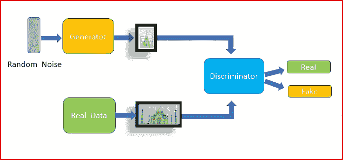
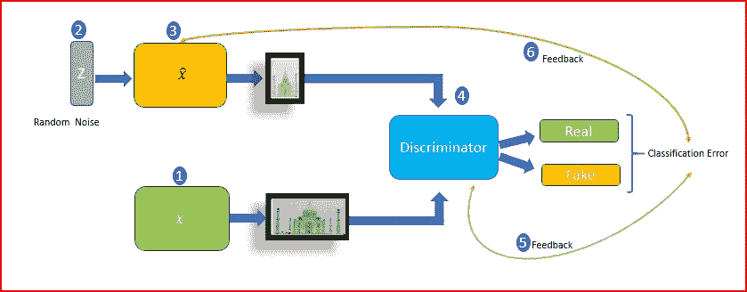

# 深度学习——生成对抗网络

> 原文：<https://medium.datadriveninvestor.com/deep-learning-generative-adversarial-network-gan-34abb43c0644?source=collection_archive---------5----------------------->

在本帖中，我们将了解生成性对抗网络(GAN)。我们将比较生成模型和判别模型，甘的工作原理以及我们可以在哪里使用甘的。

***掌握任何技能的最好方法是什么？***

学习技能，获得关于还缺少什么的反馈。重新学习缺失的技能，忘掉对技能没有帮助的事情。获取反馈。重复这个循环，直到你掌握了这项技能。

这正是甘的工作方式。

甘和强化学习帮助我们理解深度学习是如何模仿人类思维的。我喜欢机器学习，深度学习。我也有兴趣了解人类的大脑是如何工作的，这就是我如何将学习任何技能与甘联系起来的。

Generative Adversarial Network

## 什么是生成性对抗网络？

*   GAN 是一种深度学习、无监督的机器学习技术，由 [Ian Goodfellow 和包括 Yoshua Bengio 在内的少数其他研究人员在 2014 年提出](https://papers.nips.cc/paper/5423-generative-adversarial-nets.pdf)。
*   在 GAN 中，我们有一个**生成器，它与一个名为 Discriminator 的敌对网络相抗衡。**因此得名**生成对抗网络**
*   生成器和鉴别器都是多层感知器(MLP)。
*   **生成器的目标是模拟或生成与训练数据**非常相似的数据。生成器需要生成与真实数据无法区分的数据。生成的数据应该能够欺骗鉴别器将其识别为真实数据。
*   **鉴别器的目的是鉴别数据是真是假。**它得到两组输入。一个输入来自训练数据集，另一个输入是生成器生成的建模数据集。
*   生成器可以被认为是制造看起来与真货币一模一样的假币的伪造者团队。鉴别者可以被认为是一队警察，他们试图检测假币。伪造者和警察都试图在游戏中击败对方。
*   GAN 不需要任何近似推理或马尔可夫链

## 生成式和判别式模型有什么区别？

## 生成模型

*   生成模型学习输入数据 x 和输出数据 y 的联合概率 *P(x，y)* ，基于 p(x|y)进行预测。给定输出标签 y，它们重建输入 x
*   给定一些数据，它识别潜在的特征表示。
*   如果一个人患有癌症，那么有哪些特征可以帮助识别癌症的存在。创成式模型有助于重建输入数据。
*   生成模型学习单个类的分布
*   在异常值上运行良好
*   创成式建模可以从样本数据生成新的数据点
*   例子:朴素贝叶斯、受限玻尔兹曼机、深度信念网

## 判别模型

*   判别算法对条件概率 p(y|x)进行建模。他们这样做时没有对输入分布做任何假设。
*   鉴别分类器明确地学习类别之间的边界。给定数据，判别模型预测特定数据所属的类别。
*   给出一组特征，如年龄、家族史、体重、这个人是否吸烟。判别模型可以预测该人是否会患癌症。
*   判别模型在异常值上表现不佳
*   示例:决策树、SVM 是判别算法。

## 甘是怎么工作的？

**发电机**

生成器的输入是从训练数据创建的随机噪声。训练数据可以是图像。生成器尝试根据训练数据尽可能接近真实图像地模拟输入图像。生成器的目标是欺骗鉴别器。

**鉴别器**

鉴别器获得两个输入。一个是来自训练数据集的真实数据，另一个是来自生成器的虚假数据。鉴别器的目标是识别哪个输入是真的，哪个是假的。

第一步:**使用训练数据*x*训练鉴别器。**鉴别器的目标是最大化获得正确标签的概率**。对于训练数据，输出应为实数，对于生成器生成的数据，输出应为 fake。**

步骤 2:从训练数据中取一个随机输入并将噪声引入**创建随机噪声数据 *z*** 。

步骤 3: **生成器获取随机噪声数据 z，并尝试重构输入*x hat*。**

步骤 4: **鉴别器从两个来源**获取输入。一个输入是来自训练数据的真实输入。其他输入是生成器生成的数据。**鉴别器将输入分类为真或假。基于分类，计算分类误差**。

步骤 5:然后我们反向传播分类误差以更新鉴别器。**鉴别器的目标是最小化分类误差。**

步骤 6:分类错误也被反向传播以更新生成器。**发生器的目标是最大化鉴别器分类误差**。

生成器 G 生成概率 P *g* 作为从 *z.* 获得的样本 G( *z* )的分布

为了了解发电机在数据 x 上的分布 Pg，我们定义了输入噪声变量 Pz(z)的先验，

D( *x* )代表来自训练数据 *x* 的概率，而不是 P *g*

甘需要优化 **minimax** 目标函数。

Minimax objective function

在训练的早期，鉴别器将以高置信度拒绝来自生成器的生成的假数据。最初的假数据将不同于训练数据。

因为我们训练鉴别器以最大化将正确标签分配给训练样本和来自生成器的样本的概率。我们同时训练生成器以最小化鉴别器对生成的虚假数据的分类错误。

鉴别器想要最大化目标，使得对于真实数据，D(x)接近 1，对于虚假数据，D(G(z))接近 0。

生成器想要最小化目标，使得 D(G(z))接近于 1，从而使鉴别器误认为生成的 G(z)是真实的。

当生成器生成的假数据被识别为真数据时，我们停止训练。

## 氮化镓的用途

*   从低分辨率图像生成高分辨率图像
*   从粗糙图像生成精细图像
*   基于图像生成描述

## 参考资料:

[https://papers . nips . cc/paper/5423-generative-adversarial-nets . pdf](https://papers.nips.cc/paper/5423-generative-adversarial-nets.pdf)

[http://cs 231n . Stanford . edu/slides/2017/cs 231n _ 2017 _ lecture 13 . pdf](http://cs231n.stanford.edu/slides/2017/cs231n_2017_lecture13.pdf)

[https://www . cs . Toronto . edu/~ duvenaud/courses/CSC 2541/slides/gan-applications . pdf](https://www.cs.toronto.edu/~duvenaud/courses/csc2541/slides/gan-applications.pdf)

# 如果你喜欢这篇文章，请分享并鼓掌！