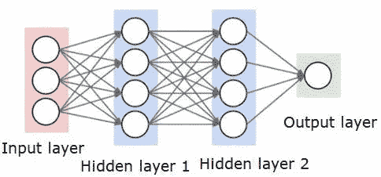
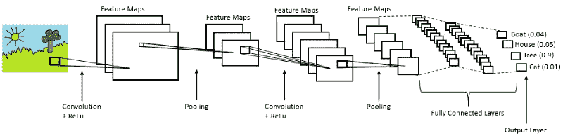
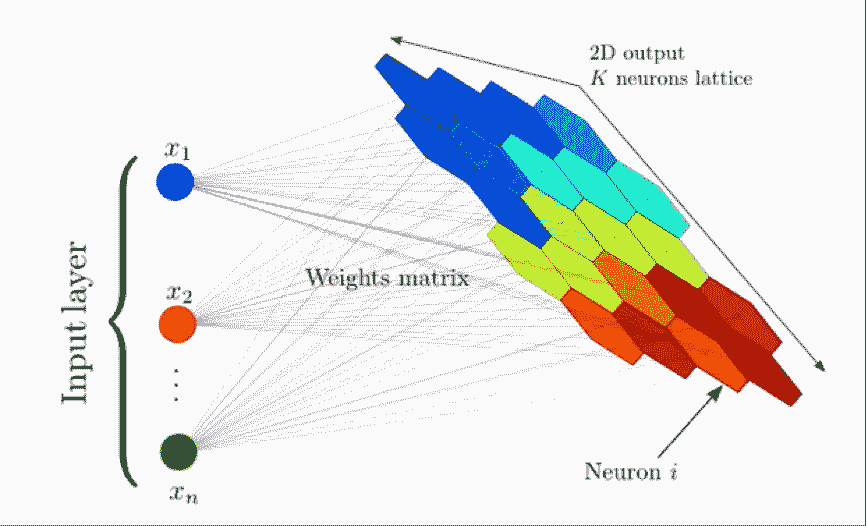
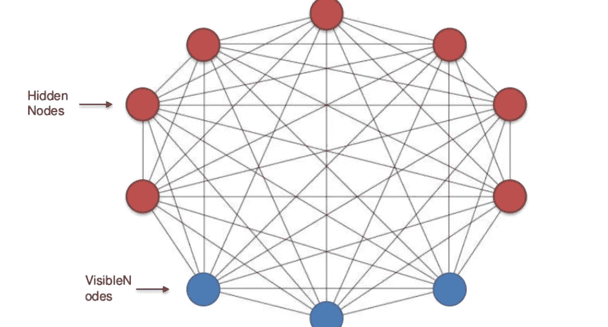

# 简而言之，深度学习

> 原文：<https://medium.datadriveninvestor.com/deep-learning-in-a-nutshell-a600a27ab371?source=collection_archive---------2----------------------->

嘿，伙计们！

当机器能够自动完成需要人类智能的任务时，人工智能领域就出现了。此外，机器学习具有通过经验学习的能力，并且在没有人类干预的情况下获得技能。深度学习是机器学习的一个分支，其中人工神经网络 ANN 的灵感来自于基本上从大量数据中学习的人脑神经元或感知机。根据维基百科-

> 深度学习是一类机器学习算法，使用多层从原始输入中逐步提取更高级别的特征。例如，在图像处理中，较低层可以识别边缘，而较高层可以识别人类有意义的项目，例如数字/字母或面部。

在现实生活中，我们如何从经验中学习类似地，深度神经网络迭代地执行每项任务，导致从每次迭代中学习会产生更好的结果。为什么叫深度学习？因为神经网络在大量深层上工作，这些深层增强了算法的学习。在现代，除了更多的数据创建之外，还产生了大量的数据，DNN 算法获得了今天可用的更强的计算能力，以及人工智能(AI)作为服务的激增。

 [## 深度学习用 7 个步骤解释-更新-数据驱动的投资者

### 在深度学习的帮助下，自动驾驶汽车、Alexa、医学成像-小工具正在我们周围变得超级智能…

www.datadriveninvestor.com](https://www.datadriveninvestor.com/2019/01/23/deep-learning-explained-in-7-steps/) 

在这篇文章中，我将简要地介绍大部分深度学习算法。这将是一个简明的点对点解释流行的监督，无监督的深度学习算法。

> **监督**

***多层感知器又称前馈神经网络***

*   感知器被命名为具有单一层的模型，或者我们可以说是神经网络中的一个隐藏层。也称为浅层神经网络。
*   简而言之，信息流从输入层开始，到“隐藏”层，在输出层结束。
*   网络不存在反向传播信息停止在输出层的环路。
*   如果我们将感知扩展到多个层次，那么它似乎就是多层感知器。下图显示了输入层，然后是中间层和输出层。
*   这是一个我们研究由感知器组成的生物大脑模型如何能够解决复杂预测模型的领域。神经网络具有学习我们的数据点并将其映射到输出以进行更好预测的能力。

Typical ANN

*   网络是密集的，这基本上意味着隐藏层中的每个神经元都连接到位于前一层中的所有神经元以及下一层中的所有神经元。
*   神经网络的预测能力来自网络的分级或多层结构。该数据结构可以从不同分辨率特征中挑选出特征，并将它们合并到高级特征中。
*   多层感知器的 Python 实现由 [Keras](https://keras.io/) 提供动力。

*安的流行数据集*

*   [CIFAR10 / CIFAR100](http://www.cs.utoronto.ca/~kriz/cifar.html)
*   [MNIST:手写数字](http://yann.lecun.com/exdb/mnist/)
*   [优步 2B 行程数据](https://movement.uber.com/cities)

***卷积神经网络***

*   卷积神经网络是一种多层架构，旨在提取每层数据中日益复杂的特征，以确定输出。主要用于图像(非结构化数据)，其中 peeps 能够从图像中提取信息。
*   CNN 的出现是因为传统的人工神经网络需要更多的时间来训练非结构化数据，但 CNN 过去常常首先使用卷积层和池层来减少图像的大小，然后将减少的数据提供给完全连接的层。
*   举一个简单的例子，卷积神经网络接收狗的图像，在计算方法中，它只是具有一个灰度层和三个彩色层的像素的集合，在特征提取过程中，它基本上抓取像狗的尾巴、头、耳朵和其他实例的特征。
*   学习完成后，CNN 为每幅图像提供一个概率。概率最高的标签会成为你 CNN 的预测。
*   卷积网络能够通过相关滤波器捕捉图像中的时间和空间关系。由于减少的参数和权重的可重用性，该架构对图像数据集执行更好的拟合。
*   已经用于最大化性能的一些基于 CNN 的架构是 [AlexNet](https://papers.nips.cc/paper/4824-imagenet-classification-with-deep-convolutional-neural-networks) 、 [GoogLeNet](https://ai.google/research/pubs/pub43022) 、VGGNet、[残差神经网络](https://towardsdatascience.com/an-overview-of-resnet-and-its-variants-5281e2f56035) (ResNet)。
*   CNN 的关键概念围绕卷积层、步幅、填充、池层和全连接层。有关这些术语的更多信息，请查看此[链接](https://medium.com/@datasciencehub/story-behind-the-convolutional-neural-networks-cnn-with-pytorch-part-i-977acdce01bf?source=your_stories_page---------------------------)。

CNN Architecture

*   简而言之，CNN 包括提供输入图像到卷积层，选择参数，应用滤波器，如果需要，填充。对矩阵执行卷积和 Relu 激活函数，执行汇集以减少维度大小，展平输出并馈入完全连接的层，使用激活函数输出类并对图像进行分类。

*CNN 的热门数据集*

*   [MNIST:手写数字](http://yann.lecun.com/exdb/mnist/)
*   [CIFAR10 / CIFAR100](http://www.cs.utoronto.ca/~kriz/cifar.html)
*   [MS-Celeb-1M](https://www.microsoft.com/en-us/research/project/ms-celeb-1m-challenge-recognizing-one-million-celebrities-real-world/)
*   [可可女士](http://mscoco.org/)
*   [谷歌的开放图片](https://research.googleblog.com/2016/09/introducing-open-images-dataset.html)
*   [Imagenet](http://image-net.org/index)
*   [头部 CT 扫描数据集:491 次扫描的 CQ500 数据集](http://headctstudy.qure.ai/)

***【RNN】递归神经网络***

*   递归神经网络是一种人工神经网络算法，旨在发现序列数据中的模式，如文本、基因组、手写、口语或源自传感器的数字时间序列数据。这些算法需要时间和顺序，但是它们有一个时间因素。
*   我们可以把 RNN 想象成同一个网络的多个副本，把信息传递给它的后继者。RNN 将数据存储到节点中，节点所处的环境允许它学习数据序列，然后输出甚至一个数字或另一个序列。简单地说，这是一个在神经元之间循环连接的人工神经网络。

RNN Block Diagram

*   RNN 甚至可以应用于图像，因为每个图像都可以分成小块，然后作为序列处理。
*   RNN 的能从过去的信息中学习有一些缺点，但是很少有情况下我们需要更多的上下文，有必要查看最近的信息来执行当前的任务。然而，它们不能处理长依赖问题。
*   **LSTM**RNN 能够处理长期依赖关系的特殊类型。这里是克里斯多夫·奥拉关于 LSTM 的精彩解释的[链接](http://colah.github.io/posts/2015-08-Understanding-LSTMs/)。
*   即使在这个人工智能时代，RNN 正在超越 LSTM 的门控循环单元(GRU)，旨在解决**消失梯度问题。** GRU 也可以被认为是 LSTM 的变体，因为两者在大多数情况下都输出优秀的结果。查看这个关于 GRU 的教程。
*   在过去的几年中，将 RNNs 应用于各种问题，如语音识别、语言建模、翻译、图像字幕等，取得了令人难以置信的成功。

*RNN 的流行数据集*

*   [住宅用电量](https://www.kaggle.com/amirrezaeian/time-series-data-analysis-using-lstm-tutorial/data)
*   [IMDB 数据集](http://ai.stanford.edu/~amaas/data/sentiment/)
*   20 个新闻组
*   [路透社新闻数据集](https://archive.ics.uci.edu/ml/datasets/Reuters-21578+Text+Categorization+Collection)

> **无监督学习**

**自组织地图**

*   在训练样本中生成输入样本的低维表示的无监督 ANN。低维表示基本上被称为 Map，因此直接来说，它是一种用于数据点降维的方法。
*   SOM 不同于其他 ANN 算法，因为它应用竞争学习，这是梯度下降反向传播学习的反义词。
*   SOM 的核心动机是降维，也用于寻找多维数据的适当结构，即 2D 表示。在这个 2D 表示中，每个原始输入都映射到 2D 网格上的一个节点。高维输入将映射到相同的 2D 节点或至少 2D 空间中的相同区域。

SOM’s

*   此外，SOM 帮助我们很容易地将 2D 的高维数据可视化，这在你的数据是三维的情况下是不可能的。
*   一个典型的例子是颜色，具有 3D 向量的数据点被表示为红色、绿色、蓝色。当映射到 2D SOM 时，你可以看到相似颜色的区域出现在颜色空间中。

*SOM 的流行数据集*

*   [虹膜数据集](https://archive.ics.uci.edu/ml/machine-learning-databases/iris/)
*   [用于聚类的信用卡数据](https://www.kaggle.com/arjunbhasin2013/ccdata)
*   [葡萄酒数据](https://archive.ics.uci.edu/ml/datasets/wine)
*   [学生评价数据集](http://archive.ics.uci.edu/ml/datasets/turkiye+student+evaluation)

**玻尔兹曼机器**

*   玻尔兹曼机器是无监督的深度学习模型，专注于基于统计力学的 [*玻尔兹曼分布*](https://en.wikipedia.org/wiki/Boltzmann_distribution) 。玻尔兹曼机器被认为是深度学习与物理相遇的一个点。
*   玻尔兹曼机器大致分为两类，主要是**基于能量的模型**和**受限玻尔兹曼机器(RBM)** 。此外，还有一种情况是 RBM 的堆叠在彼此之上，称为**深度信念网络**。
*   所以玻尔兹曼机器只不过是只有输入节点和隐藏节点的随机/生成深度学习模型。
*   在玻尔兹曼中，我们可以观察到输入节点相互连接，因此这使得这种无监督算法不同于其他算法。下图所示的所有节点相互交换数据，从而生成自生成数据，因此称为生成式深度模型。

Boltzmann System Inter-connections Source: [https://www.slideshare.net/KirillEremenko/deep-learning-az-boltzmann-machine-module-5-boltzmann-machine](https://www.slideshare.net/KirillEremenko/deep-learning-az-boltzmann-machine-module-5-boltzmann-machine)

*   当我们将数据输入玻尔兹曼机器时，网络中的节点将学习所有参数以及它们之间的相互关系。该模型将监控所学模式的异常行为。
*   *解释详细的玻尔兹曼机器将超出本文*的范围，所以从[受限玻尔兹曼机器](https://medium.com/@neuralnets/boltzmann-machines-transformation-of-unsupervised-deep-learning-part-1-42659a74f530)开始，这些属于[基于能量的模型](https://towardsdatascience.com/generating-training-datasets-using-energy-based-models-that-actually-scale-4e1f83bb9e00)。目的是找到最大化对数似然函数的联合概率分布。
*   当 RBM 的隐藏节点相互堆叠时，深度信念网络就形成了。它是一个由无向关联存储器和隐藏层组成的模型，形成一个有向非循环图，将关联存储器中的表示转换为可观察变量，如图像的像素。DBM 进一步分解为[贪婪分层训练](http://www.iro.umontreal.ca/~lisa/pointeurs/BengioNips2006All.pdf) & [唤醒-睡眠算法](http://www.gatsby.ucl.ac.uk/~dayan/papers/hdfn95.pdf)。
*   深度玻尔兹曼机器是无监督算法，专注于学习单独的*识别*模型，该模型用于快速初始化，在单次自下而上传递中的值，然后这些值被传递给所有隐藏层中的潜在变量。详细解释[此处](http://proceedings.mlr.press/v9/salakhutdinov10a/salakhutdinov10a.pdf)。

*RBM 的流行数据集*

*   [电影推荐系统](https://www.kaggle.com/rounakbanik/movie-recommender-systems)
*   [电影镜头](http://grouplens.org/datasets/movielens/)
*   [最后。调频](https://grouplens.org/datasets/hetrec-2011/)

**自动编码器**

*   学习输入图像的压缩表示的无监督神经网络。使用监督方法训练，有时称为自我监督学习算法。作为模型的一部分进行训练，目的是重新创建输入。
*   自动编码器使用函数 f 对输入值 x 进行编码。编码后，它使用函数 g 对编码值 f(x)进行解码，从而创建与输入值相同的输出值。
*   自动编码器的目标是最小化输入和输出值之间的重构误差。这项技术有助于 autoencoder 学习数据点之间的模式。
*   自动编码器的工作基本上从编码输入开始，以便识别潜在的特征表示来重新创建输入。然而，损耗是通过比较输入和输出来计算的。autoencoder 中的权重根据造成误差的权重进行更新。

Deep AutoEncoders

*   通常，自动编码器有三层，即编码器，编码器和解码器。编码器将输入图像压缩成具有缩减维度的压缩表示。编码器是 Autoencoder 的一部分，它负责将压缩输入馈送到解码器。解码器将编码图像解码回原始尺寸。
*   自动编码器大致分为**卷积自动编码器、稀疏自动编码器、深度自动编码器和收缩自动编码器**。
*   由于具有多层非线性激活函数的非线性变换，自动编码器通常优于主分量分析。
*   LSTM 自动编码器的 Keras 实现是这样触发的

*流行的自动编码器数据集*

*   [*AutoEncoder 分类使用 MINST*](https://www.datacamp.com/community/tutorials/autoencoder-classifier-python)
*   [*股价预测*](https://www.kaggle.com/camnugent/sandp500)

> **参考文献**

*   [http://yann.lecun.com/exdb/publis/pdf/lecun-98b.pdf](http://yann.lecun.com/exdb/publis/pdf/lecun-98b.pdf)
*   [http://neuralnetworksanddeeplearning.com/chap2.html](http://neuralnetworksanddeeplearning.com/chap2.html)
*   [http://yann.lecun.com/exdb/publis/pdf/lecun-01a.pdf](http://yann.lecun.com/exdb/publis/pdf/lecun-01a.pdf)
*   [http://colah.github.io/posts/2015-08-Understanding-LSTMs/](http://colah.github.io/posts/2015-08-Understanding-LSTMs/)
*   [http://www.bioinf.jku.at/publications/older/2604.pdf](http://www.bioinf.jku.at/publications/older/2604.pdf)
*   [https://sci2s . ugr . es/keel/pdf/algorithm/articulo/1990-koho nen-piee . pdf](https://sci2s.ugr.es/keel/pdf/algorithm/articulo/1990-Kohonen-PIEEE.pdf)
*   [http://www.utstat.toronto.edu/~rsalakhu/papers/dbm.pdf](http://www.utstat.toronto.edu/~rsalakhu/papers/dbm.pdf)
*   [https://blog.keras.io/building-autoencoders-in-keras.html](https://blog.keras.io/building-autoencoders-in-keras.html)

如果你喜欢这个帖子，请跟我来，只要你认为我值得，就按下那个按钮。如果你注意到思维方式、公式、动画或代码有任何错误，请告诉我。

*干杯！*