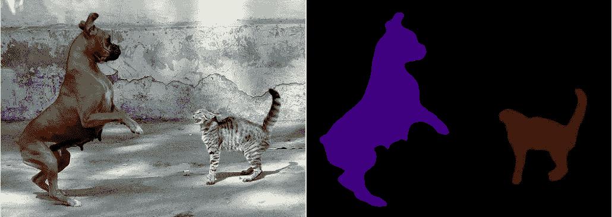
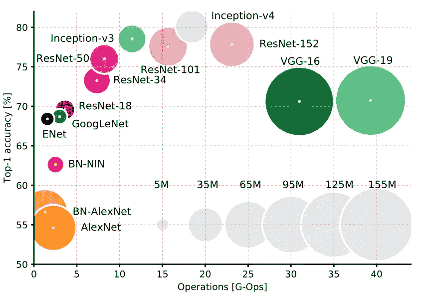

# 医学影像深度学习 3

> 原文：<https://medium.datadriveninvestor.com/deep-learning-in-medical-imaging-2d757bb5e108?source=collection_archive---------1----------------------->

# 三个问题

感知器。Tensorflow，Theano 和 Caffe 后端。可可，帕斯卡-VOC 和 MNIST 数据集。过度拟合。迁移学习。喀拉斯。Softmax。随机梯度下降，动量，汇集，退出，再利用。亚历克斯网，雷斯网，VGG-16，盗梦空间…

对于那些刚接触深度学习的人来说，承认的认知和计算代价并不小。在过去的一年里，我发现自己在观看斯坦福计算机科学系的 CS231n YouTube 讲座，阅读 Adrian Rosenbock 博士关于使用 Python 进行计算机视觉深度学习的综合*以及参考 Michael Nielson 和 Adit Deshpande 的优秀在线卷积神经网络教程。我做了斯坦福课程和阿德里安书上的家庭作业。然后我看了讲座，又看了一遍书。然后看了其他的讲座，看了其他的书和教程。最后，我仔细阅读了图 1 所示的性能最佳的卷积神经网络(简称为 CNN 或 ConvNets)的发明者撰写的学术论文，思考如何将这些模型应用于医学成像。*

这是一个迷人的长达一年的深潜，一直持续到今天。这也非常令人兴奋。正如本系列第一章中所暗示的，一旦我掌握了 ConvNets 背后的算法魔力，*我意识到，它们最终将通过匹配放射科医生的解剖分类和分割准确性来彻底改变医学成像，但其吞吐量却让人类的能力相形见绌。*随着每个新成立的 CNN 比上一个表现得更好，未来看起来一片光明:

**Figure 1\. A comparison of the Prediction Accuracy vs. Computational Size and Efficiency of the best performing Convolutional Neural Networks on the ImageNet visual challenge database**

这些深度网络在年度 ImageNet 大规模视觉识别挑战赛(ILSVRC)中的表现已经开始超过人类的表现。ImageNet 数据集包含大约 22，000 个类别中超过 1，500 万张日常物品的标记高分辨率图像。一年一度的 ImageNet 竞赛使用了 ImageNet 的一个子集，大约有 120 万幅图像被平均分为 1000 个类别。据报道，在大规模 ImageNet 数据集上，人类 top-5 分类错误率约为 5%，而目前最先进的神经网络达到了 3.6%。

据估计，放射学实践中的日常诊断错误率在 3-5%之间，这与 ILSVRC 的人为错误率非常相似。有针对性的研究表明错误率要高得多:

【https://pubs.rsna.org/doi/pdf/10.1148/rg.2015150023 

然而，正如第 2 章所讨论的，医学图像在上下文和结构上都不同于一般的消费者图像。这使我产生了以下问题:

(1)性能最佳的 CNN 架构是否能稳健地适应医学成像数据？还是他们的杰出成果对他们苦心训练的通用对象挑战数据库过于敏感？

(2)《健康保险便携性和责任法案》( HIPAA)是一部美国联邦法律，为保护患者医疗信息提供了数据隐私和安全条款。由于患者的隐私权，与常见对象的图像的可用性相比，可用于深度学习的医学图像数据要少得多。因此，比 ILSVRC 的挑战数据库小三个数量级的医学图像数据集仍然被认为是大的。这些小型训练数据集会在多大程度上降低深度网络性能？数据增强或迁移学习有帮助吗？

(3)并不是所有的 CNN 架构都容易在本地工作站或云中实现。有些无法运行，因为它们的代码库没有得到很好的维护，即操作系统、驱动程序或软件更新破坏了它们。其他型号表现平平。最后，像 DeepLab v3+这样的模型需要相对慷慨的 GPU 资源。为了匹配他们声明的分割结果，批量大小必须大于 12。我简陋的 8GB GTX 1080 返回了一个资源耗尽错误，批处理大小仅为 4。在基于云的 GPU 资源上运行日常实验或购买多个或百万级 GPU 可能会变得昂贵。利用“合理”成本的 GPU 资源在医学数据集上训练高性能的 CNN 是可能的吗？

关于问题 3，以下是深度学习公共服务公告:谷歌的联合实验室提供免费的 K80 GPUs 访问，实例超时 12 小时。像所有深度学习一样，有一点点学习曲线。我将在后面的章节中探讨 CoLab 的效用:

 [## Google Colab 免费 GPU 教程

### 现在，您可以使用 Keras 在免费的 Tesla K80 GPU 上与 Google 合作开发深度学习应用程序

medium.com](https://medium.com/deep-learning-turkey/google-colab-free-gpu-tutorial-e113627b9f5d) 

对于下一章，我将通过分享我使用 NVIDIA 的深度学习 GPU 训练系统(DIGITS)开发医学图像语义分割网络的经验来解决这三个问题。敬请期待！

