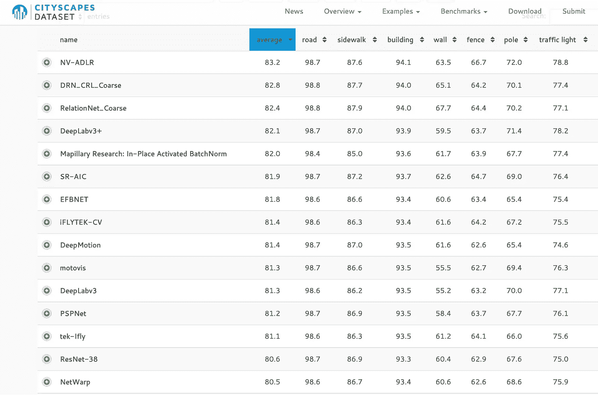
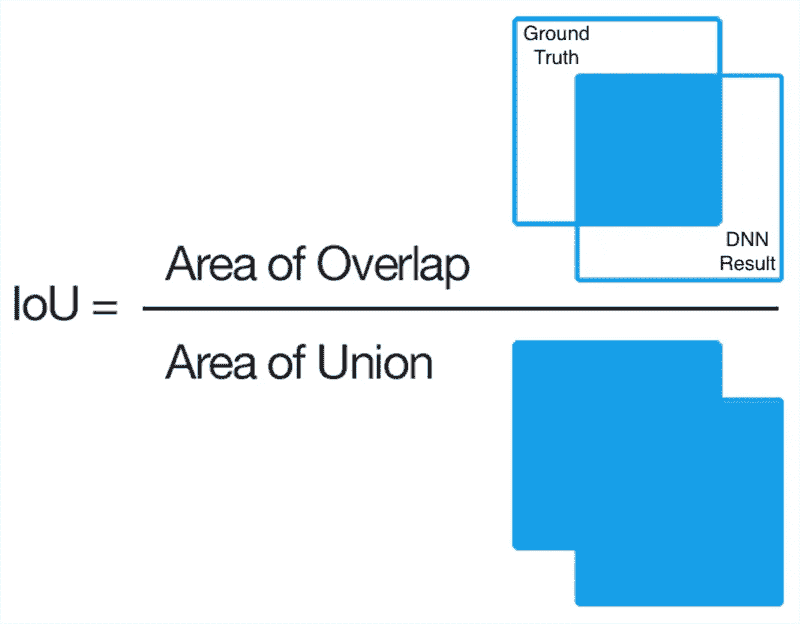
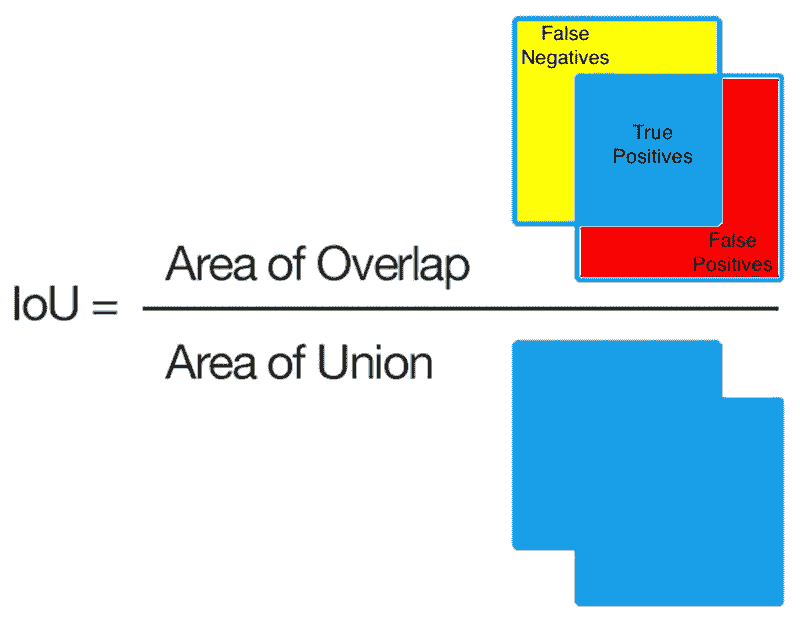
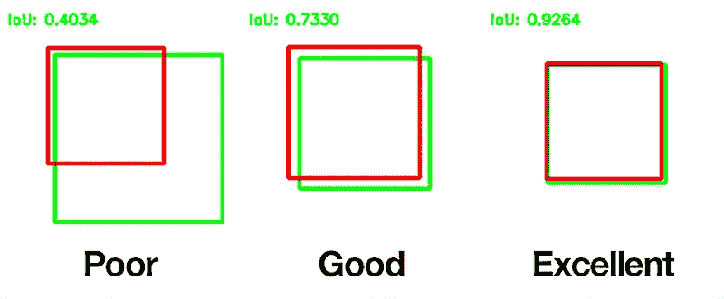
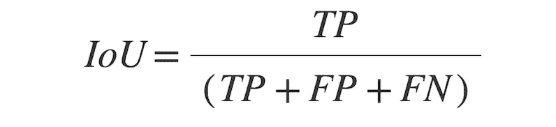

# 医学影像中的深度学习

> 原文：<https://medium.datadriveninvestor.com/deep-learning-in-medical-imaging-3c1008431aaf?source=collection_archive---------0----------------------->

**Figure 1\.** [**Cityscapes Dataset**](https://www.cityscapes-dataset.com/) **image segmentation leaderboard at the time of this writing**

# 骰子相似系数与 IoU

一些读者发来电子邮件，询问我在第四章中培训的 FCN-8s 模型的分段性能。具体来说，他们要求提供有关用于测量深度神经网络(DNN)分割性能的量化指标的更多细节。回想一下，**骰子相似性系数(**又名**骰子得分)** 用于量化 FCN-8 与训练数据集的手写注释**基础事实**分段的匹配程度。当在预处理的 CT 图像上训练时，使用 Adam 自适应优化器的 FCN-8s 模型具有超过 96%的 Dice 分数。但是这个分数到底衡量的是什么呢？在本文中，我们将了解更多关于 Dice 系数的信息，并将其与**交集/并集(IoU)** 分数进行对比，后者是另一种衡量算法像素级图像分割性能的常用指标。

看看图 1 中的 Cityscapes 数据集细分排行榜。该影像数据集中感兴趣的分割特征是典型城市场景中的常见对象，如建筑物、道路和交通灯。显然，Cityscapes 数据集对于训练自动驾驶深度学习网络非常有用！第一栏列出了 DNN 的竞争车型。第 2 列列出了每个 DNN 的*平均 IoU* 分数，这是每个类别 IoU 分数的简单平均值。前 7 类(道路、人行道、建筑物等)的每类 IoU 分数。)显示在第 3 到第 9 列中。为了进一步迷惑你，IoU 也被称为 **Jaccard 相似系数**或 **Jaccard 得分。**

IoU 和 Dice 使用略有不同的方法来衡量图像分割算法的结果与其对应的地面真实分割的相似程度。让我们先来看看 IoU，因为它很容易用几何图形表示:

**Figure 2\. Intersection over Union example using squares modified from** [**Wikipedia**](https://en.wikipedia.org/wiki/Jaccard_index#/media/File:Intersection_over_Union_-_visual_equation.png)

在图 2 中，假设左上角标有“地面实况”的框是由人类标注的分割区域。标有“DNN 结果”的方框是深度学习算法在同一幅图像上产生的分割结果。人类和人工智能结果之间的*重叠区域*是分子图像中的蓝色方块。这是图像分割算法识别与注释的基本事实分割完全匹配的像素的区域*。* *这些像素被称为*****【TP】***。*分母中的*联合区域*结合了人类和人工智能的分割结果，然后减去真阳性以防止这些像素被重复计算:**

****

****Figure 3\. True Positives, False Positives and False Negatives described****

**在图 3 中，*红色区域的像素被 DNN 错误地分割，称为***【FP】**。*黄色区域的像素本应被 DNN 分割，但被遗漏*。这些丢失的像素被称为**假阴性(FN)。**如果重叠面积等于并集面积，我们就有了完美的分割，IoU 等于 1。在这种情况下，FP、TP 和 FN 都等于 0:**

****

****Figure 4\. IoU examples courtesy of** [**Wikipedia**](https://en.wikipedia.org/wiki/Jaccard_index#/media/File:Intersection_over_Union_-_poor,_good_and_excellent_score.png)**

**借据得分与骰子的相似系数有什么关系？让我们重写图 3 所示 TP、FP 和 FN 区域的 IoU 术语:**

****

****Equation 1\. IoU in terms of TP, FP and FN****

**骰子点数的推导不像 IoU 那样容易用几何学来描述，这超出了本文的范围。鼓励感兴趣的读者查看副标题 **F-measure 下的[这里的](https://en.wikipedia.org/wiki/Precision_and_recall)。**骰子点数可以用 TP、FP 和 FN 表示如下:**

****

****Equation 2\. Dice similarity coefficient in terms of TP, FP and FN****

**一点代数就会产生以下等价关系:**

****

****Equation 3\. IoU/Dice equivalence relation****

**回顾第 4 章，在我的预处理 CT 训练图像数据集上使用 Adam 优化器的 FCN-8s DNN 的 [Dice 值为 0.961951](https://medium.com/@nigel.m.parsad/deep-learning-in-medical-imaging-b2b664540f97) (~96%)。将该值代入等式 3，我们得到相应的 IoU 得分为 0.926691 (~93%)。无论选择何种度量，考虑到 Cityscapes 数据集中的最佳平均 IoU 值为 83.2%，这是一个高性能的完全卷积神经网络！**

**感谢阅读，请继续提问…**

****