# 医学影像中的深度学习

> 原文：<https://medium.datadriveninvestor.com/deep-learning-in-medical-imaging-b2b664540f97?source=collection_archive---------0----------------------->

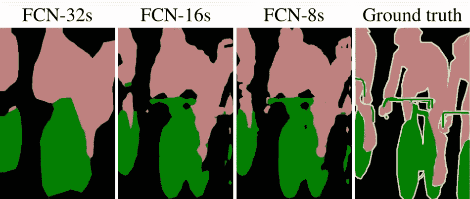

**Courtesy of** [https://arxiv.org/pdf/1605.06211.pdf](https://arxiv.org/pdf/1605.06211.pdf)

# **训练 FCN-8 进行分段**

> 在这篇文章中，我将演示如何使用[英伟达的深度学习 GPU 训练系统](https://developer.nvidia.com/digits)(数字)，训练一个完全卷积的网络(FCN)来分割计算机断层扫描(CT)腹部图像中发现的皮下脂肪组织。

**临床意义**

脂肪组织鉴别包括将皮下脂肪组织(SAT)与内脏脂肪组织(VAT)分开。SAT 是皮下脂肪，通常被称为腹部脂肪。VAT 是储存在腹腔内的脂肪，它包围着重要的内脏器官，如肝脏、胰腺和肠道。研究表明，总 VAT 以及 VAT 与 SAT 的比率是心脏代谢健康的重要替代指标。异常的增值税水平是导致一些严重的、长期的、威胁生命的疾病的风险因素。其中包括:

*   心脏病发作和心脏病
*   二型糖尿病
*   中风
*   乳腺癌
*   结直肠癌
*   阿耳茨海默氏病

**细分挑战**

使这一分割任务变得困难的是 SAT 和 VAT 是相同的组织。它们唯一的区别在于它们在体内的空间位置。图 1 显示黄色的 SAT 和橙色的 VAT。如果 SAT 被精确地分割，剩余的脂肪可以被表征为 VAT:

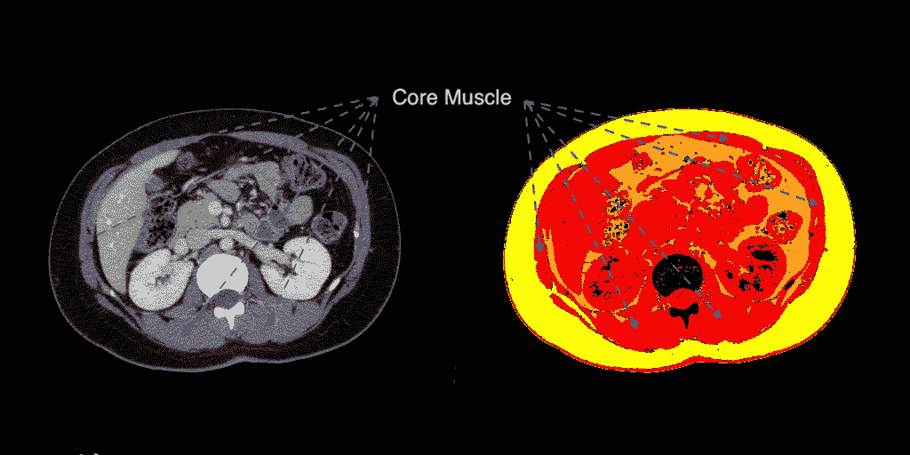

**Figure 1\. Original CT image on the left is a cross-sectional scan of a patient’s abdomen. A false color representation of different tissue types is on the right. SAT is in yellow, VAT is in orange and soft tissue (muscle, organs, blood vessels, skin etc.) is in red.**

*为了方便读者，尽管在图 1 至图 3 中 SAT 和 VAT 像素的颜色不同，但它们的像素值范围是相同的。胖就是单纯的胖。相比之下，软组织像素值(红色)不同于所有脂肪组织。在横断面 CT 图像中将 SAT 与 VAT 分类的是其各自的形状和空间位置。*

在图 1 中，核心肌肉在 CT 图像中是明显的灰色厚环，在假彩色图像中是红色厚环。核心肌肉环在 SAT 和 VAT 之间提供了一个明显的界限。在这种情况下，非学习算法可以很好地将 SAT 与 VAT 区分开来。*然而，在 CT 图像中，肌肉边界有开口是常见的。* 图 2 在比图 1 低几英寸的腹部采集的图像的假彩色表示中举例说明了这种情况:

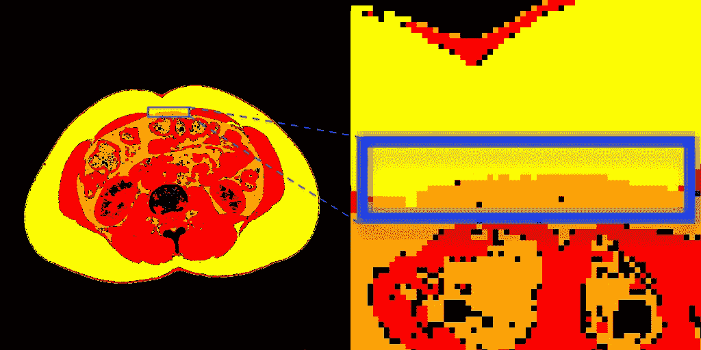

**Figure 2\. Manually extrapolated boundary (exploded view on right). There is no numerical difference between the range of pixel values of SAT (yellow) and VAT (orange) within the blue bounding box.**

图 2 中 SAT 和 VAT 之间的边界是通过根据解剖结构的其余部分的形状推断出合理的解决方案而手动创建的。*在蓝色边界框* **内，SAT(黄色)和 VAT(橙色)的像素值范围没有数值差异。**虽然在这种情况下不知道确切的 SAT/VAT 分割界限，但不正确的解决方案是显而易见的:

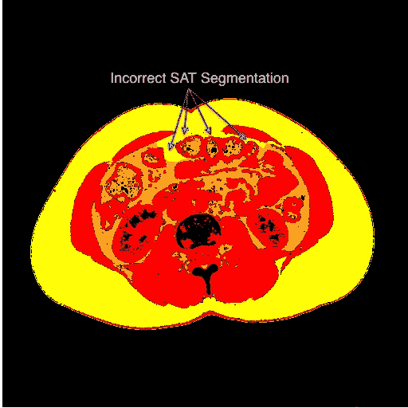

**Figure 3\. Note how a watershed algorithm incorrectly classifies VAT as SAT well into the abdominal cavity. By definition, only VAT is adjacent to internal organs**

如何设计一个基于规则的脂肪分类器来包含人体解剖学中所有可能的 SAT 变异？已经有一些巧妙的方法，但是非学习算法被意外反例愚弄的可能性是很大的。例如，由于疾病、营养不良或年龄而具有非常少肌肉和皮下脂肪的患者的腹部 CT 扫描很难手动分割，即使对于有经验的放射科医生来说也是如此。区域增长、分水岭和洪泛算法特别容易返回不正确的 SAT 分割结果(图 3)。随机森林似乎很有前途，直到几年前被深度神经网络的性能击败。

**CT 数据**

癌症影像档案(TCIA)是一个在线、开放的医学影像数据库，可用于癌症研究，也是我培训数据的来源。在本文发表时，TCIA 有 175 个腹部 CT 数据集，每个数据集包含几百幅图像。在这些 CT 图像中，大约有 1000 张被认为对这个项目有用:

[](http://www.cancerimagingarchive.net/about-the-cancer-imaging-archive-tcia/) [## 关于癌症影像档案馆(TCIA) -癌症影像档案馆(TCIA)

### 什么是 TCIA？TCIA 是一项服务，它可以识别和托管癌症医学图像的大型档案库

www.cancerimagingarchive.net](http://www.cancerimagingarchive.net/about-the-cancer-imaging-archive-tcia/) 

然而，1000 张图片对于深度学习练习来说太少了。两万五还是不够。一般来说，深度神经网络在对数十万到数百万张图像进行训练时效果最佳，因为数据变化至关重要。这就是为什么公开可用的非医学图像数据库如此之大。不幸的是，公开可用的、分类的和实例标记的医学图像的数量比它们的非医学图像对应物少几个数量级。幸运的是，有两种技术可以帮助克服医学图像数据的差距*。*

**①。数据扩充**

像 AlexNet 这样的深度神经网络可能会被像素值的微小扰动所欺骗:

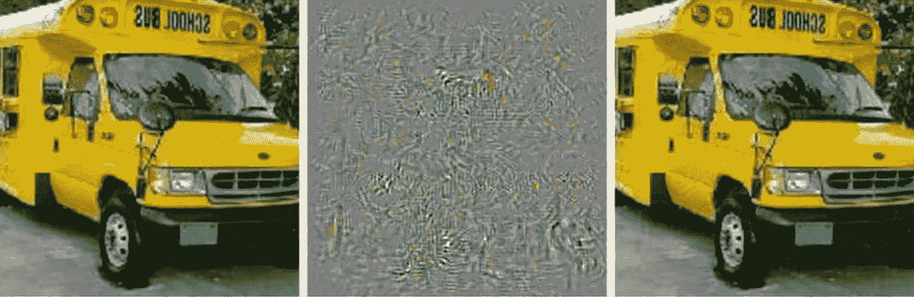

**Figure 4\. AlexNet classified the original image left as a school bus (left). The middle image shows the distortions made to the original that produced the adversarial example (right) which Alexnet classified as an ostrich. Courtesy of** [https://arxiv.org/pdf/1312.6199.pdf?not-changed](https://arxiv.org/pdf/1312.6199.pdf?not-changed)

被扰乱的图像被称为对立的例子。对人类来说，这两幅图像的内容实际上是相同的。对 AlexNet 来说，原始图像是一辆校车，反面例子是一只鸵鸟！尽管如此，这个令人惊讶的结果表明了一个简单的技术来增加我们的训练数据的大小。受干扰的图像对 CNN 来说是完全不同的图像，即使它们的内容对人类来说没有变化。类似地，对人类来说不同的轻微失真图像对 CNN 来说也是完全不同的图像。因此，可以通过扭曲原始图像来合成创建附加的训练图像。这些*数据增量*被添加到训练数据集以增加其大小。常见的数据扩充技术包括翻转图像像素以创建镜像图像、应用扭曲图像的图像处理变换以及修改原始图像的像素强度直方图。

数据扩充使这个实验的图像增加了 6 倍(总共约 6000 张)。此外，训练数据多样性增加，即，与单独的原始数据集相比，原始+扩充数据覆盖了更大范围的可能解剖变化:

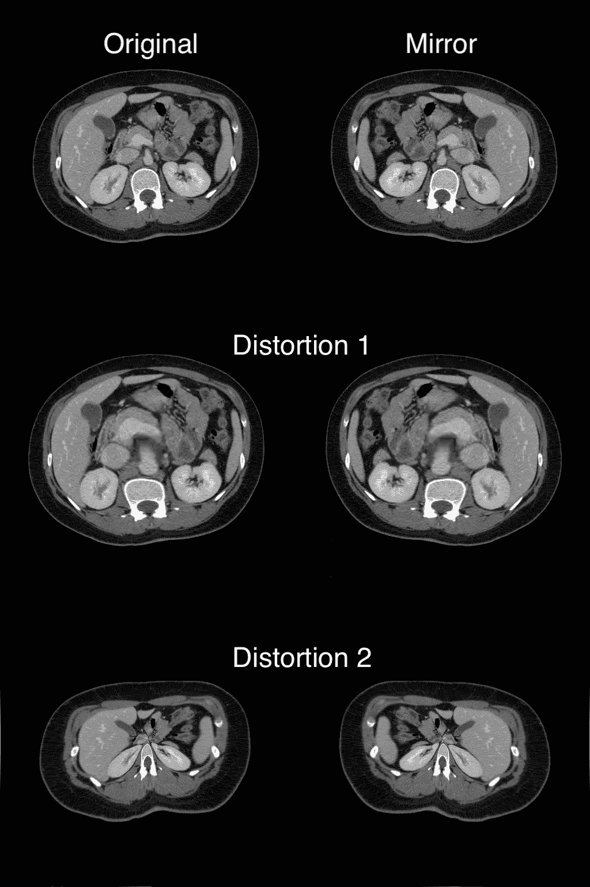

**Figure 5\. Five data augments created by the application of mirroring and/or distortion image processing algorithms to the original CT image**

**②。转移学习**

卷积神经网络(CNN)是深度学习模型的核心。许多人已经在数百万张图像中识别出日常物品，其准确度接近人类。将这些经过彻底训练的深度学习神经网络重新应用于完全不同的成像类别(如 CT)通常很有用。我知道你在想什么。一个 CNN 以前训练过的描绘成千上万日常物品如猫、椅子、飞机和郁金香的图像如何帮助识别复杂的人体解剖？

还记得图 4 中的校车图片吗？CNN 看不到内容，而是在图像中搜索人们认为是内容的模式。如果一个 CNN 在一个大而多样的非医学图像数据库上被训练，那么这个模型很有可能已经学会识别大量复杂的空间和强度模式。*这些图案中的一些(例如形状、颜色、边缘)也可能出现在医学图像中发现的解剖特征中。*

全卷积网络扩展了 CNN 架构，非常适合图像分割。他们经常将 AlexNet、VGG-16 和 GoogleNet 等高性能 CNN 整合到他们的设计中。有关 FCNs 和 CNN 之间差异的深入概述以及 FCN 分割性能的真实示例，请参见 NVIDIA 的图像分割教程:

[](https://devblogs.nvidia.com/image-segmentation-using-digits-5/) [## 使用数字 5 的图像分割

### 今天，我们很高兴地宣布 NVIDIA DIGITS 5。DIGITS 5 有许多新功能，其中两个是…

devblogs.nvidia.com](https://devblogs.nvidia.com/image-segmentation-using-digits-5/) 

FCN-8s 是本练习中用于迁移学习的 FCN 模型。FCN-8s 在 [PASCAL VOC 2011 分段挑战数据集](http://host.robots.ox.ac.uk/pascal/VOC/voc2011/index.html)上接受训练。在 [NVIDIA 的医学成像语义分割示例](https://github.com/NVIDIA/DIGITS/blob/master/examples/medical-imaging/README.md)中讨论了迁移学习和 FCNs 在医学成像中的应用，该示例是本教程的灵感来源。

**标签数据**

深度神经网络通过实例学习。标签图像就是一个例子。*标签图像突出显示了我们希望我们的深度神经网络学习的解剖特征的像素位置。*训练数据必须由一个特征图像及其对应的标记图像组成:

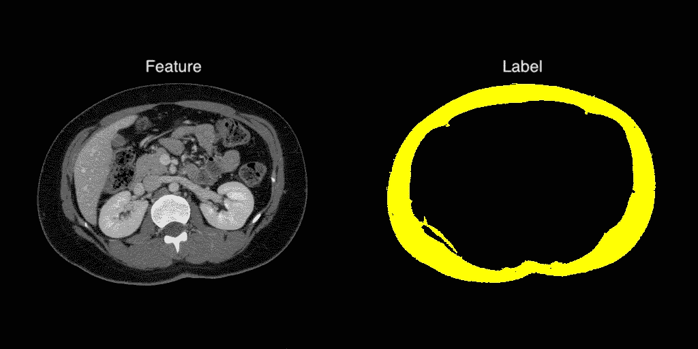

**Figure 6\. A example of a feature and label image pair. SAT is colored yellow for illustrative purposes but would be a grayscale color in practice.**

深度学习网络试图确定与标签图像中的像素相对应的特征图像像素中的潜在模式。如果它检测到的模式与标记的数据不匹配，它会“返回”以发现导致它误入歧途的计算，并在嵌套层中迭代地最小化这些错误。这种误差最小化就是深度学习中的*学习*。

获取具有所需解剖特征的 CT 图像并为每个图像创建标记图像是一项极其耗时的任务。对于本教程，为 6000 多张 CT 图像中的每一张图像创建一个标签图像，以完成训练数据集。

**英伟达数字**

我开始研究深度神经网络是为了回答一个问题:它们能以有希望的准确度分割临床相关的解剖结构吗？作为一名前航空航天工程师，我不热衷于编程库或深度学习架构。相反，我想知道深度学习是否可以成为一个强大的*工具*用于创新医学成像研究，最重要的是*医疗保健。*

理解一项技术的最好方法是将它应用到一个具体的问题中。因此，我希望并行构建几个深度学习细分网络的原型，以获得对其工作流、资源要求和架构的亲身感受。如果一个模型显示出前景，那么下一个合乎逻辑的步骤就是深入定制它的架构、优化它的训练数据并编码。

幸运的是，NVIDIA 的优秀员工创造了 DIGITS，这是为试图建造一些东西的工程师量身定制的。我向初学者和有经验的研究人员推荐 DIGITS，因为从教程到 UX 的一切都是精心构思的。这也是一个相当容易的，如果有点长，安装在我个人的 GPU 工作站上(NVIDIA 为心脏虚弱的人提供了 DIGITS docker 容器)。我将把对平台细节的探索留给读者:

[](https://developer.nvidia.com/digits) [## NVIDIA 数字

### 英伟达深度学习 GPU 训练系统(DIGITS)将深度学习的力量交到了工程师和…

developer.nvidia.com](https://developer.nvidia.com/digits) 

本教程将以一系列 a DIGITS 界面截图的形式呈现，以突出创建 FCN-8s SAT 分段模型的必要步骤。所有读者需要做的就是使用他们自己的数据重复这些步骤。毕竟，通过例子学习不仅仅是神经网络…

**数字 6.1 教程**

DIGITS 在本地主机实例的端口 5000 上的 web 浏览器中运行。其主页由 3 个子选项卡组成:

*   *数据集*
*   *车型*
*   *预训练模型*


**Figure 7\. NVIDIA DIGITS Main Interface with *Datasets, Models* and Pretrained Models subtabs.**

我不会在本教程中讨论预训练模型，但如图 7 所示，DIGITS model zoo 维护了一些众所周知的深度学习模型，可供立即下载。

**①。数据集创建(图 8)**

*   点击*数据集*选项卡。在*新建数据集图像*下拉菜单中，选择*分割*
*   (以黄色突出显示)在*新分割数据集*屏幕上，输入本地或远程主机上的*特征和*标签图像*文件夹的目录路径*
*   FCN-8s 的特征和标签数据分别是 3 通道 RGB 和 1 通道灰度 PNG 图像
*   (用黄色突出显示)输入您的*类标签*文本文件的路径
*   由于这是两个类的分割练习，类标签文本文件只包含两行(第 1 行:*背景*，第 2 行:*脂肪*)
*   (以黄色突出显示)创建一个*数据集名称…* **教程**在这种情况下:

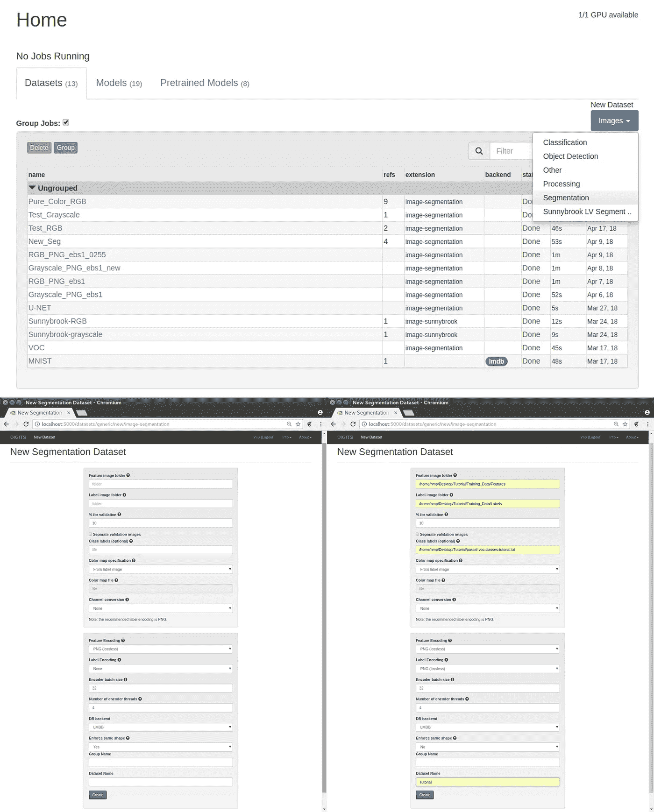

**Figure 8\. Dataset Creation**

**②。模型创建(图 9)**

在下面的列表中，选择的值在括号中以粗体显示。为了方便读者，初始屏幕和完成的屏幕并排显示:

*   点击*型号*标签。在*新型号图像*下拉菜单中，选择*分割*
*   在*新分割模型*屏幕上，从左上角的*选择数据集* **(教程)**部分显示的列表中选择您的数据集
*   在*解算器选项*部分，选择所需数量的*训练时期***【20】***【批量大小】***【4】***【解算器类型】***【SGD】**和*批量学习率* **(0.0001)**
*   在*数据转换*部分，从下拉菜单中选择*减去平均值*选项**(无)**
*   这是一个两类分割问题，即*黑色背景像素是第 1 类，代表 SAT 的像素是第 2 类*(见图 6)。在只有很少几个类的情况下，深度学习网络可能会遭受所谓的*类不平衡*。例如，在任何给定的 CT 图像中，代表 SAT 的像素平均占所有像素的 13%。声称训练和验证准确率约为 87%的 FCN 可以简单地将每个像素归类为背景！显然，精确度不是衡量分割性能的最佳指标。对于这个模型，我们使用*骰子系数*来确定表示 SAT 标签的像素和特征图像*中由模型学习的像素之间的相似性得分或重叠。*将以下代码粘贴到 python 文件中，并在 *Python 层*部分提供该文件的路径:

```
import random

import numpy as np
import caffe

class Dice(caffe.Layer):
    """
    A layer that calculates the Dice coefficient
    """
    def setup(self, bottom, top):
        if len(bottom) != 2:
            raise Exception("Need two inputs to compute Dice coefficient.")
        # compute sum over all axes but the batch and channel axes
        self.sum_axes = tuple(range(1, bottom[0].data.ndim - 1))

    def reshape(self, bottom, top):
        # check input dimensions match
        if bottom[0].count != 2*bottom[1].count:
            raise Exception("Prediction must have twice the number of elements of the input.")
        # loss output is scalar
        top[0].reshape(1)

    def forward(self, bottom, top):
        label = bottom[1].data[:,0,:,:]
        # compute prediction
        prediction = np.argmax(bottom[0].data, axis=1)
        # area of predicted contour
        a_p = np.sum(prediction, axis=self.sum_axes)
        # area of contour in label
        a_l = np.sum(label, axis=self.sum_axes)
        # area of intersection
        a_pl = np.sum(prediction * label, axis=self.sum_axes)
        # dice coefficient
        dice_coeff = np.mean(2.*a_pl/(a_p + a_l))
        top[0].data[...] = dice_coeff

    def backward(self, top, propagate_down, bottom):
        pass
```

*   点击页面下方的*自定义网络*标签，将下面的 [Caffe prototxt](https://github.com/NVIDIA/DIGITS/blob/master/examples/semantic-segmentation/fcn_alexnet.prototxt) 粘贴到窗口中。原型定义了 FCN 的建筑。
*   将下面的 dice 系数网络层添加到刚刚粘贴的 Caffe prototxt 中:

```
# Dice coefficient
layer {
    type: 'Python'
    name: 'dice'
    bottom: 'score'
    bottom: 'label'
    top: 'dice'
    python_param {
      module: "digits_python_layers"
      layer: "Dice"
    }
    exclude { stage: "deploy" }
}
```

*   是时候进行一些*转移学习了。*如前所述，在 Pascal VOC 图像数据库上训练的 FCN-8 用于迁移学习。[下载模型](http://dl.caffe.berkeleyvision.org/pascalcontext-fcn8s-heavy.caffemodel)并在*预训练模型*字段中输入其在本地或远程主机上的路径。
*   最后，在最后一个字段中命名您的模型，并单击*创建:*

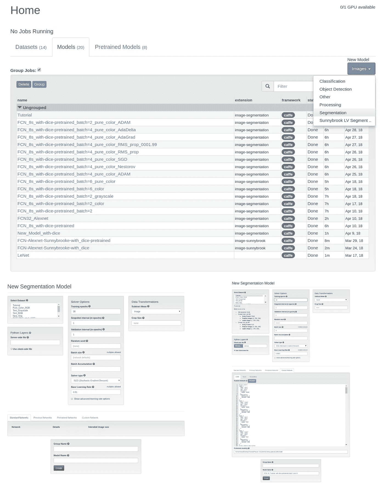

**Figure 9\. Model Creation**

**(③。)模型训练(图 10)**

根据您的计算资源，可能需要一分钟左右的时间才会弹出培训屏幕:

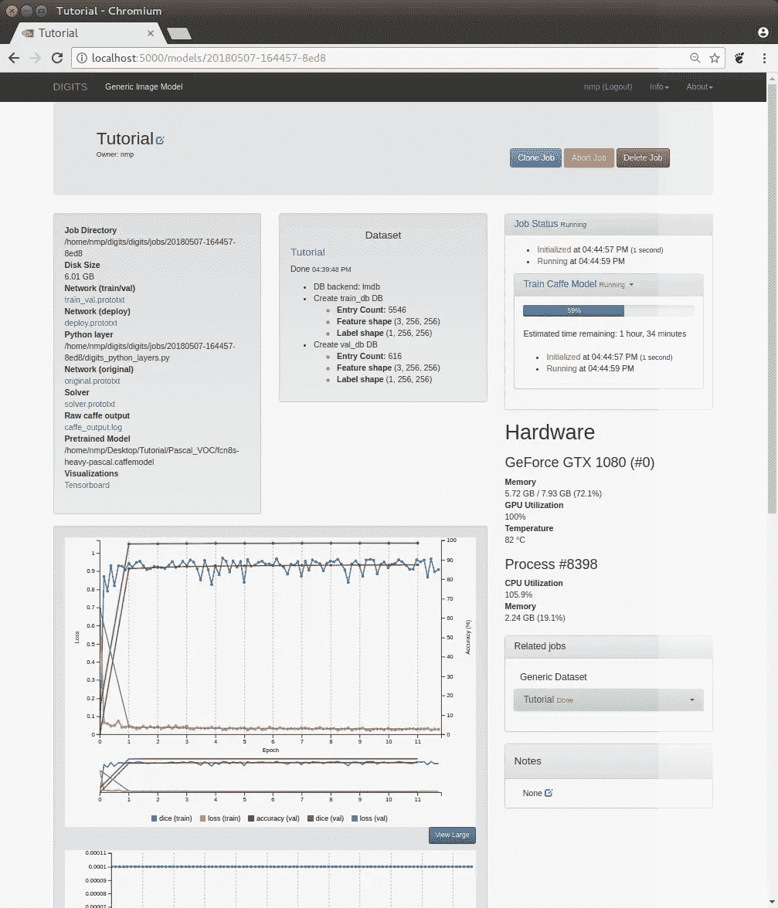

**Figure 10\. Model Training**

该模型在一个中等大小的 GeForce GTX 1080 8GB NVIDIA GPU 上总共花了大约 5 个半小时进行训练。DIGITS 提供深度学习网络可视化工具，因此用户可以实时跟踪他们的实验。GPU、CPU 和 RAM 资源也受到动态监控。

**④。结果**

让我们来看两个结果，一个实现了上面讨论的 SGD 解算器，另一个用不同的解算器进行了相同的实验。SGD 代表*随机梯度下降*可以稀疏地概括为一种用于最小化深度学习网络训练误差的算法。迭代误差最小化是每个深度学习神经网络的核心特征。虽然 SGD 是一种常用的技术，DIGITS 有额外的内置解算器，允许更彻底的原型制作。每个求解器的适用性和性能的优缺点是正在进行的研究的主题。但是为了好玩(因为我们可以)，我将盲目地比较使用 SGD(图 11)和使用自适应矩估计算法，或*亚当*(图 12)的 FCN-8 的训练和验证结果:

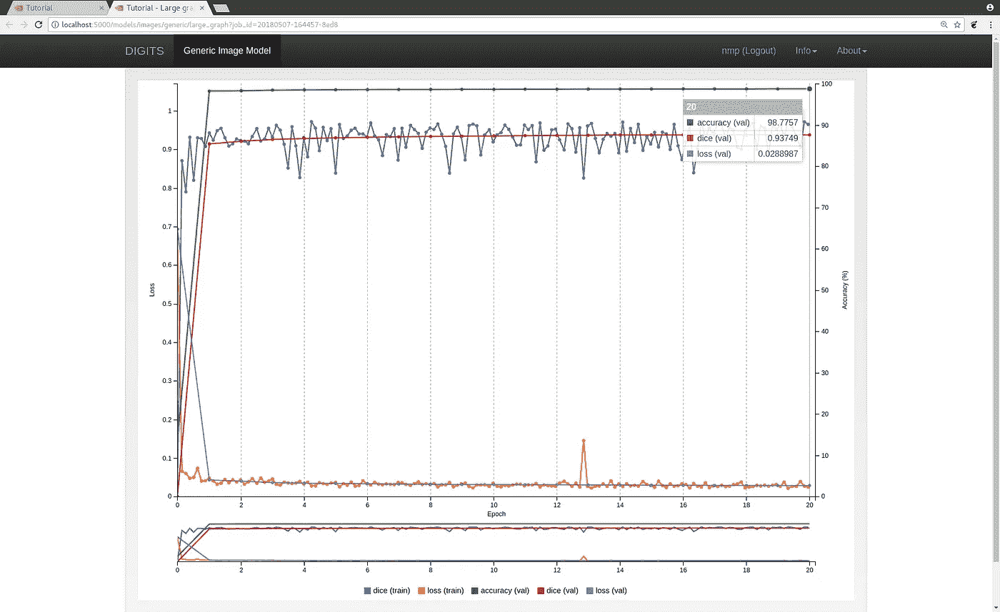

**Figure 11\. FCN-8s final training result (epoch 20) using Stochastic Gradient Descent (SGD)**

对于 SGD 来说，该模型的准确率接近 99%。更重要的是它的骰子系数接近 94%。训练和验证损失没有表现出任何明显的欠拟合或过拟合行为，并且它们的损失非常低。不算太寒酸。让我们来看看亚当的结果:

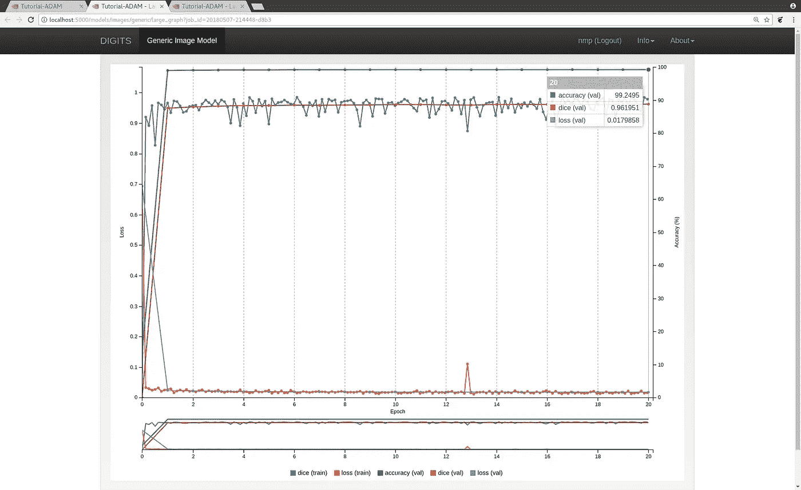

**Figure 12\. FCN-8s final training result (epoch 20) using Adam**

哇哦。亚当的准确率超过 99%，骰子系数超过 96%！训练和验证损失曲线也没有显示出明显的拟合不足或拟合过度的迹象，它们的损失仍然微不足道。Adam 的额外百分点可能会为你赢得未来的 Kaggle 比赛。；-).

**讨论**

这两个结果对医学图像分割意味着什么？在非医疗领域，深度学习网络在挑战数据集上的表现显示在[在线排行榜上。你的模型越接近顶端，你就越有可能成为深度学习大师。96%是一个令人印象深刻的声音骰子分数，但这个值是否保证我们的完全卷积网络是一个有用的医学图像分割工具？](http://image-net.org/challenges/LSVRC/2017/results)

> 在我的下一篇博文中，我将偏离通常的排行榜成功指标。相反，我将使用亚当 FCN-8s 模型在新的 TCIA 腹部 CT 数据集上运行推理测试，并显示实际的 SAT 分割结果。我将通过评论这些结果来翻译模型的数字性能，以发现模型成功和/或失败的地方。我将讨论在模型创建步骤中选择参数的原因。我还会谈到 FCN-8s 的分割极限以及其他深度学习神经网络的分割潜力。还会有一些其他有趣的花絮来奖励你的慷慨耐心。敬请期待！

[](http://eepurl.com/dw5NFP)