# 医学影像中的深度学习 2

> 原文：<https://medium.datadriveninvestor.com/deep-learning-in-medical-imaging-ddc38ced7caf?source=collection_archive---------1----------------------->

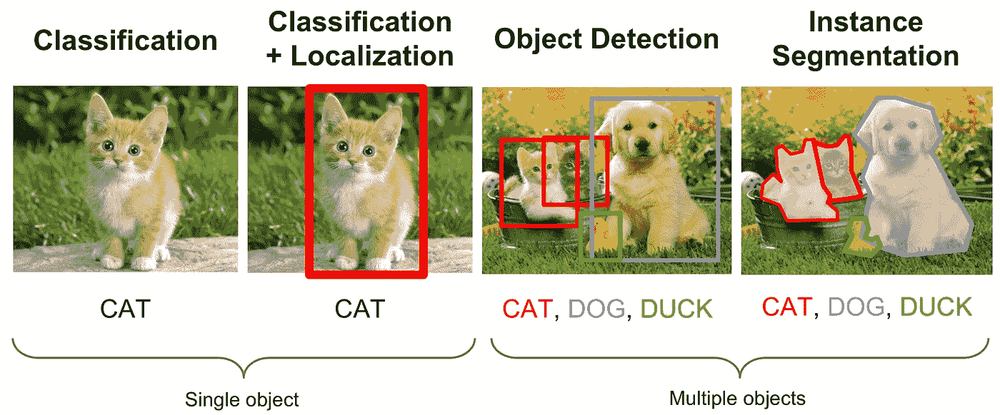

# Cat 照片与 CAT 扫描

我希望为遥远未来的数字考古学家辩护。当他们煞费苦心地从仅存的少量二进制文物碎片中重建 21 世纪文明的本质时，他们无疑会将猫的巨大文化意义与具有里程碑意义的人工智能的出现联系起来。毕竟在 2012 年，第一批深度学习努力之一的 anno artificial is intelligent ia 试图在视频帧中识别猫:

 [## 谷歌的人工大脑学习寻找猫的视频

### 当谷歌神秘的 X 实验室的计算机科学家建立了一个由 16，000 个计算机处理器组成的神经网络，其中一个…

www.wired.com](https://www.wired.com/2012/06/google-x-neural-network/) 

在随后的几个世纪里，我们可能会迷失的是，我们新生的卷积神经网络往往会随着更大、更多样的数据集而变得更加准确。大量在线 cat 图片的可用性为深度网络的图像分类、检测和分割提供了可访问的训练数据:

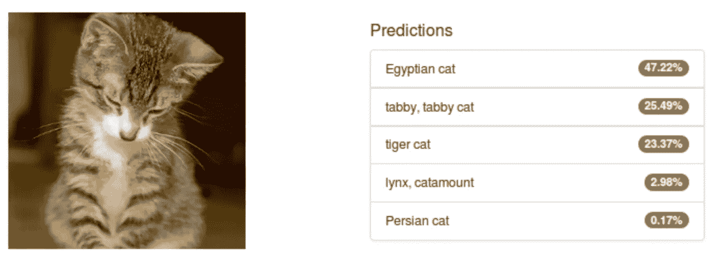

**Figure 1:** **Alexnet classification of an image of a cat from the PASCAL VOC dataset** ([source](https://devblogs.nvidia.com/image-segmentation-using-digits-5/))

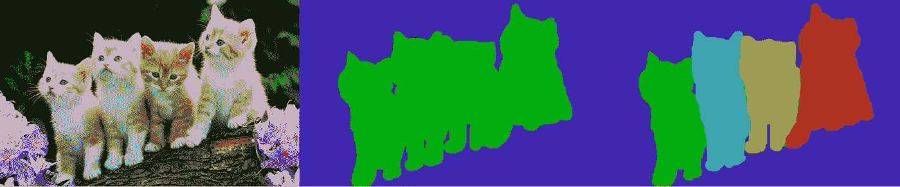

**Figure 2:** **Semantic and instance segmentation masks of an image of kittens** ([source](https://chaosmail.github.io/deeplearning/2016/10/22/intro-to-deep-learning-for-computer-vision/))

每个深度学习数据集总是包括猫的图像…有些还包括狗的图像…还有汽车、人和熊猫的图像。微软的上下文中的公共对象(COCO)数据集包含 328，000 张照片，分为 91 个对象类别(例如，猫、汽车、椅子)，4 岁的孩子很容易识别。ImageNet 大规模视觉识别挑战(ILSVRC)数据集由大约 120 万张训练图像组成，分为 1000 个不同的对象类别。

然而，尽管这些数据集存在巨大的差异和规模，但它们的图像有一个共同点:它们与医学图像，特别是计算机断层扫描(ct)和磁共振成像(MRI)有着根本的不同。在这篇文章中，我将重点介绍 CT，因为 CAT 扫描是很常见的。CT 扫描仪对现代医疗保健如此重要，以至于它的发明者获得了 1979 年的诺贝尔医学奖。因此，在可预见的未来，医学成像中的深度学习将利用 CT 数据集。请注意，其中一些讨论也适用于磁共振成像(其发明者在 2003 年获得了诺贝尔奖)。然而，尽管核磁共振成像对公共卫生同样重要，但其潜在的物理和图像解释更难解释。

那么 CT 图像和 JPEG 图片的根本区别是什么呢？毕竟，这两幅图像都是由带有传感器的相机拍摄的，这些传感器可以捕捉光的数量(强度)和频率(波长)。“光”实际上是什么超出了本文的范围。但是我们凭直觉知道可见光主要与物体表面相互作用。不同颜色的物体吸收某些频率的光，而透射其他频率的光。例如，苹果的表面会散射人眼识别为红色的可见光频率，同时吸收其他颜色的频率。在我陷入与物理学家更深的麻烦之前，让我们继续…

CT 探测器也能捕捉 X 射线形式的光线。可见光和 X 射线都被认为是电磁辐射。CT 扫描仪发射 X 射线辐射，该辐射穿透人体并与内部解剖结构相互作用，而不仅仅与表面相互作用。关键的区别在于 X 射线是一种比可见光能量大得多的电磁形式:

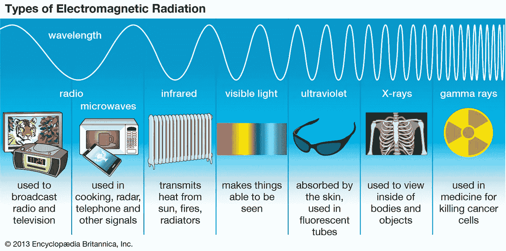

**Figure 3.** **Comparing the energy of visible light to X-rays**

不同的表面材料与可见光相互作用，在照片中产生各种颜色，而不同的内部组织与 X 射线相互作用，在 ct 图像中产生各种灰度强度。例如，CT X 射线被骨骼散射与被脂肪或肌肉散射不同。同样，肌肉散射 X 射线的方式不同于骨骼或脂肪。实际上，ct 扫描对人体组织的密度差异很敏感。

CT 扫描仪以 Hounsfield 单位(HU)测量材料密度。胡是以戈弗雷·洪斯菲尔德爵士的名字命名的，他是前面提到的发明了计算机断层摄影的诺贝尔奖获得者之一。HU，也称为*衰减值，*不线性缩放。也就是说，HU 值为+1000 的密集骨骼组织的密度不是 HU 值为+500 的组织的两倍。Hounsfield 单位根据空气和蒸馏水的密度进行校准，根据定义，空气和蒸馏水的密度分别设置为-1000 HU 和 0 HU。*该校准将每幅 CT 图像标准化，以显示以下 HU 范围内的组织类型*:

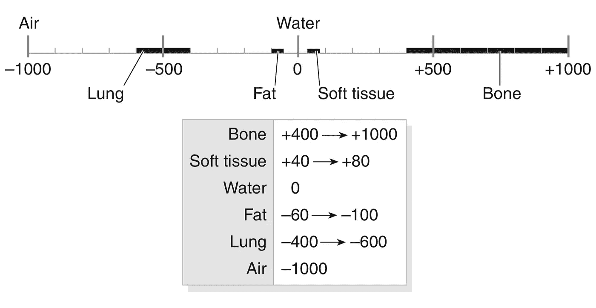

**Figure 4\. The Hounsfield density scale**

CT 图像中的每个像素将相应的 HU 衰减值映射到特定的灰度，类似于智能手机相机中的 CCD 将可见光频率映射到颜色。注意:在医学文献中，HU 范围有点不固定，例如，一些临床研究可能将软组织范围映射到+20 HU 到+100 HU，或将脂肪映射到-150 HU 到-50 HU 之间。这些定制的范围只是组织范围的临床定义中的小变化，与上述 CT 的基本成像物理学没有关系。你永远不会看到一篇论文大幅度改变映射，比如脂肪映射到+100 HU 到+ 400 HU。我们可以暂时忽略这些细节。

让我们来看看 3 个轴位 CT 图像的例子。每个都是腹部的横截面螺旋切片，大约在胸腔的中点成像:

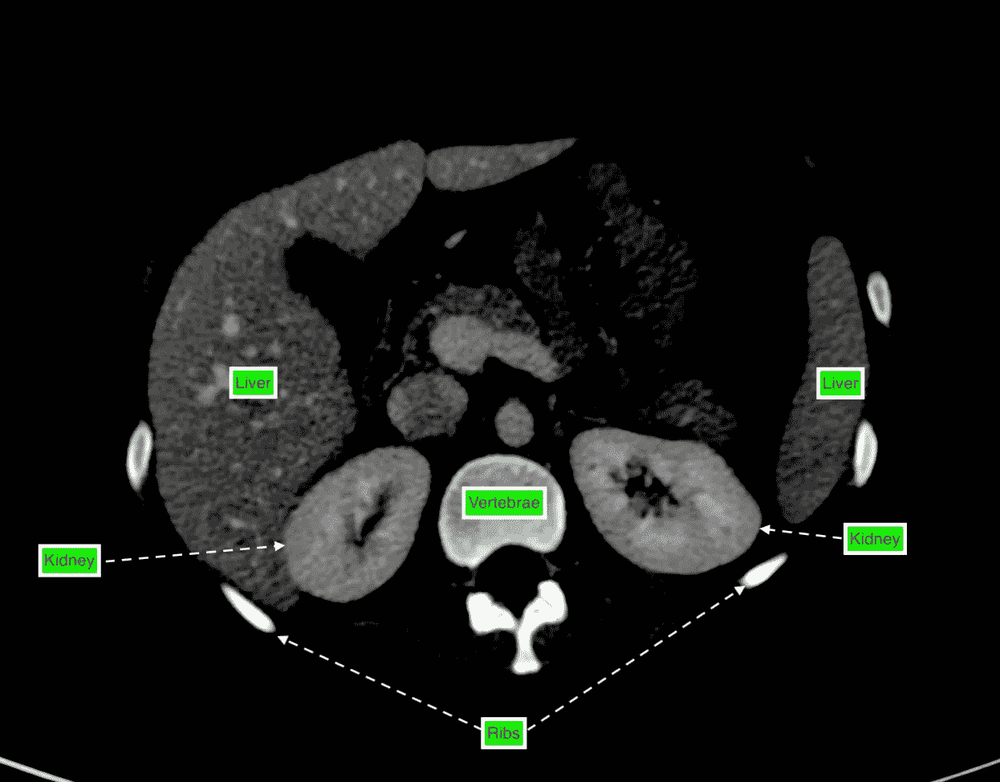

**Figure 5a. Liver and Kidney tissue with some Bone and Vasculature (40 HU to 80 HU)**

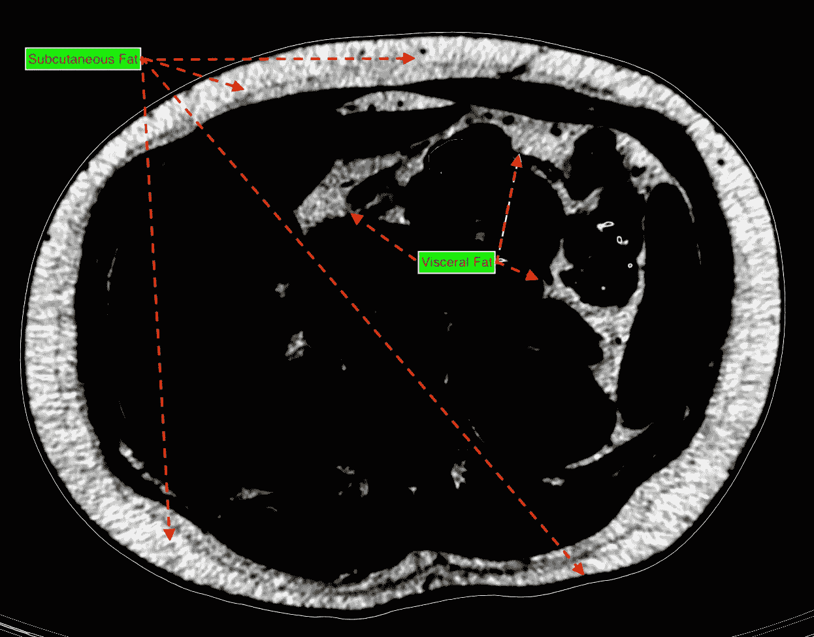

**Figure 5b. Subcutaneous and Visceral Adipose (Fat) Tissue (-100 HU to -60 HU)**

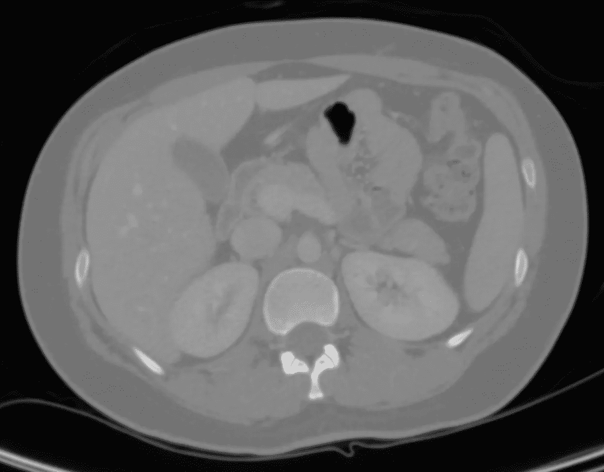

**Figure 5c. Full Dynamic Range encompassing all tissue types (-1000 HU to 1000 HU)**

注意图 5a 到 5c 之间的联系吗？所有 3 幅图像均来自*的一幅 CT 图像。*为了获得每个视图，放射科医生和医学成像专家通过 DICOM 查看器软件操作 CT 图像的*不透明度* *传递函数(也称为“开窗”)*。DICOM 是 CT 和其他医学成像设备(如 MRI)的原始医学成像格式。如果您天真地将 DICOM 格式的 CT 图像转换为 JPEG(或 PNG 或 TIFF ),则只会返回一个带有默认窗口参数的图像:

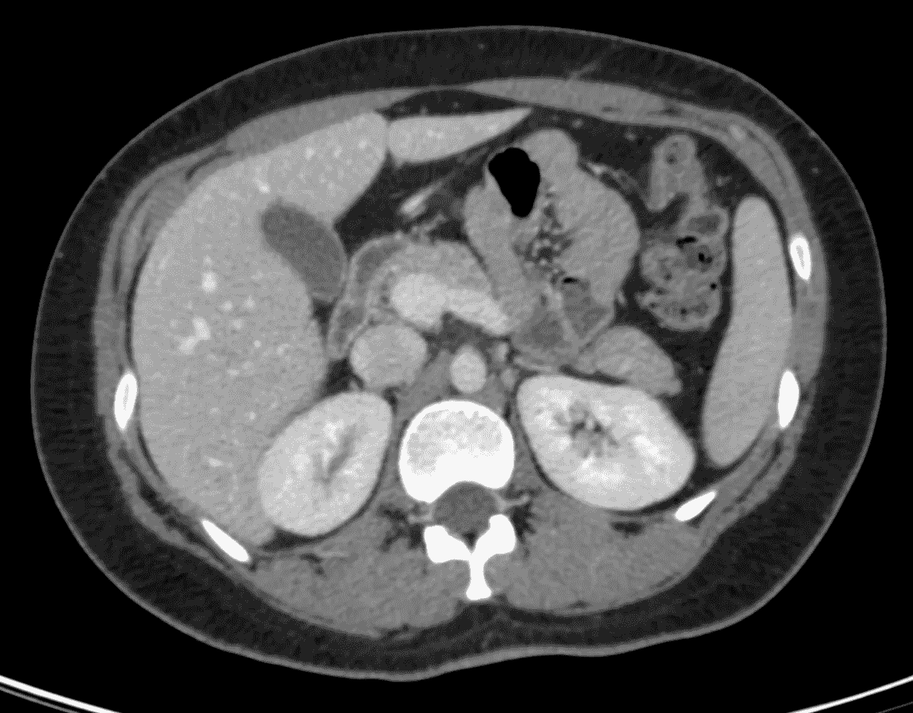

**Figure 5d. A standard Default Opacity Transfer Function (-160 HU to +240 HU)**

该默认视图仅对于特定范围的组织密度是最佳的。如果期望的感兴趣解剖区域(ROI)在此范围内是*而不是*，您就不走运了。例如，脂肪组织在该视图中没有被清楚地分辨。此外，包括图 5a 在内的所有其他视图。到 5c。永远消失了。*你的训练数据缩小到一个默认选项。*非医学成像没有类似的不透明度窗口，因为小猫不会出现在每张小猫图像的规定强度范围内。

考虑肝肾分割。对于这些期望的解剖 ROI，精明地对 DICOM 格式的 CT 图像进行开窗将创建更有用的训练数据集(图 5a)。图 5c 和 5d 示出了这两个器官，但是它们要么具有相对较差的对比度辨别能力(5c)，要么与相似对比度的附加复杂解剖结构相混淆(5d)。图 5a 将是内部器官 ROI 训练的更好的起点，因为它主要由肝脏、肾脏和容易识别的骨组织和血管组成。类似地，图 5b 将是用于脂肪分割的较好的训练数据模板。添加颜色以进一步区分解剖 ROI 还可以提高深度学习模型的性能(剧透警告..见我即将到来的第四章！).

总而言之，将医学成像数据视为普通照片忽略了隐藏在其中的大量未知信息。图 5d 清楚地显示了肝脏和肾脏。然而，卷积神经网络无疑将在训练图像方面表现更好，这些图像将那些器官与身体的其他部分分开(本质上是噪声)。之后，我们可以将分割后的 ROI 叠加到我们想要的任何特定 CT 图像窗口上。这种数据预处理可以显著提高深度学习模型的准确性，同时减少训练和验证损失。

**不要立即向你的卷积神经网络添加自定义层，投入更多的 GPU 来解决问题，创建充满不合标准图像的巨大训练数据集，或将工作流应用于旨在区分猫和狗的医学成像，努力思考你想要的解剖 ROI 并相应地进行预处理！**

记住老巴贝奇先生的格言:

有两次有人问我，“请问，巴贝奇先生，如果你把错误的数字输入机器，会不会得到正确的答案？”“……我不能正确地理解会引起这样一个问题的那种思想混乱。”

还在迷茫？考虑这个简单的例子:

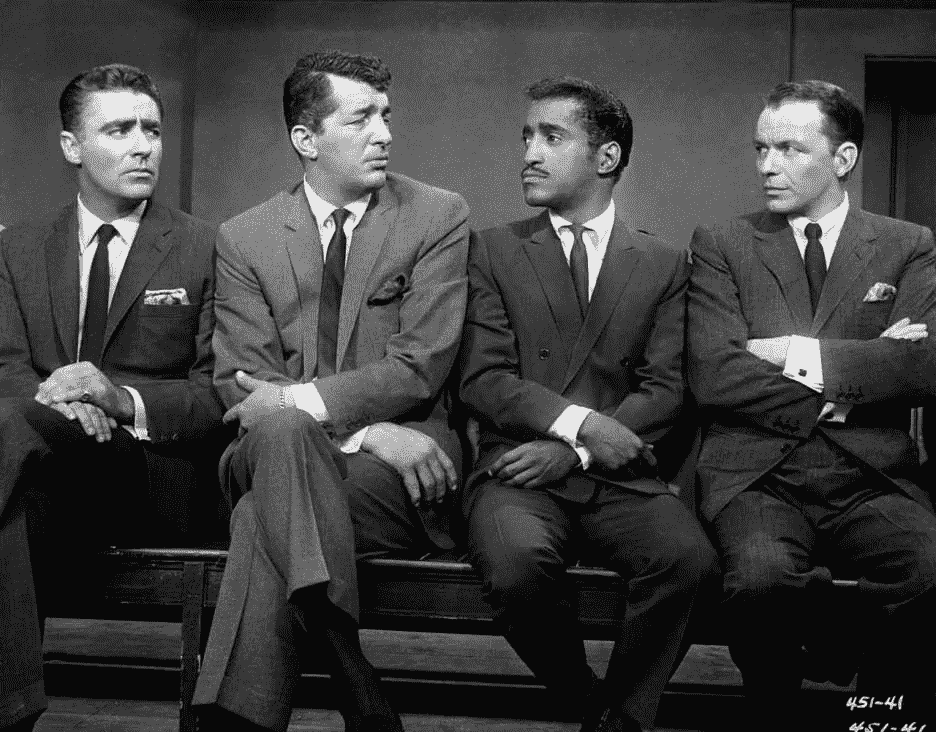

**Figure 6\. If you have to ask, you aren’t cool enough to ask**

想象一下，如果鼠帮的每一张照片都以假设的“鼠帮格式”输出。这种格式的结构类似于 DICOM 格式的 CT 图像。换句话说(看到我在那里做了什么吗？)、Peter、Dean、Sammy 和董事会主席各自以他们自己独特的灰度强度值范围显示，类似于独特的组织类型，例如脂肪、骨骼和肌肉。也许它们各自的灰度范围映射到每个成员特有的“酷”，而不是 CT 中的组织密度。无论如何，在拍摄的每张鼠群图像中，每个成员都可以通过其各自标准化的灰度强度值范围来唯一识别。

让我们假设 Dean 的灰度范围对应于图像的默认不透明度传递窗口。如果你用 Dean 的默认窗口参数把我们的 Rat Pack 格式的图像转换成 JPEG 格式，你只会看到 Martin 先生:

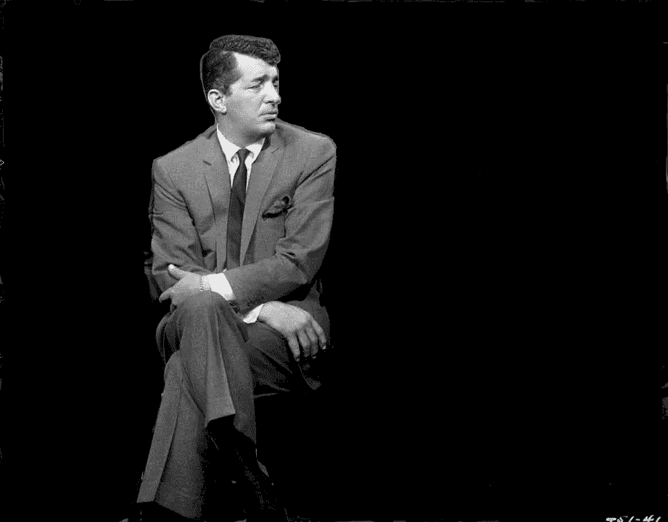

**Figure 7\. Output from the Dean Default Opacity Transfer Function (between -160 and +240 in too cool for school units).**

图 6 中嵌入的 Rat Pack 图像数据覆盖了灰度强度的整个动态范围，但在图 7 的 JPEG 转换中丢失了很多。这就是当你从图 5c 到 5d 时发生的事情。*如果您创建 CT 图像的 JPEG(或 PNG 或 TIFF)转换，请确保默认窗口是分类或分割您想要的解剖 ROI 的最佳窗口。*否则，这种二次抽样将是不可取的……当然也不会更好。

话说回来，我总是偏爱托尼·本内特…

