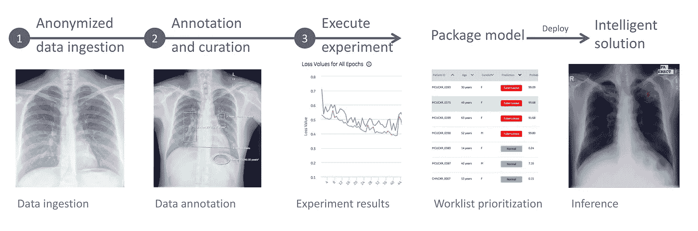
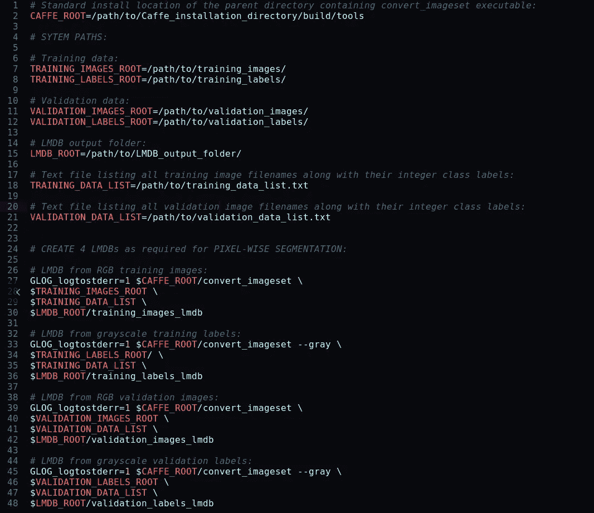
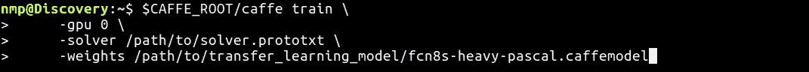
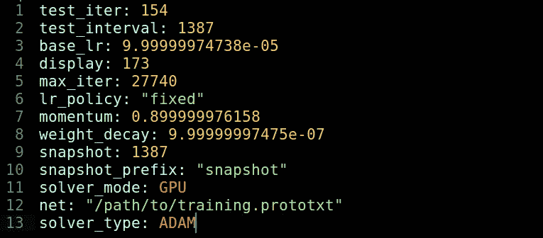
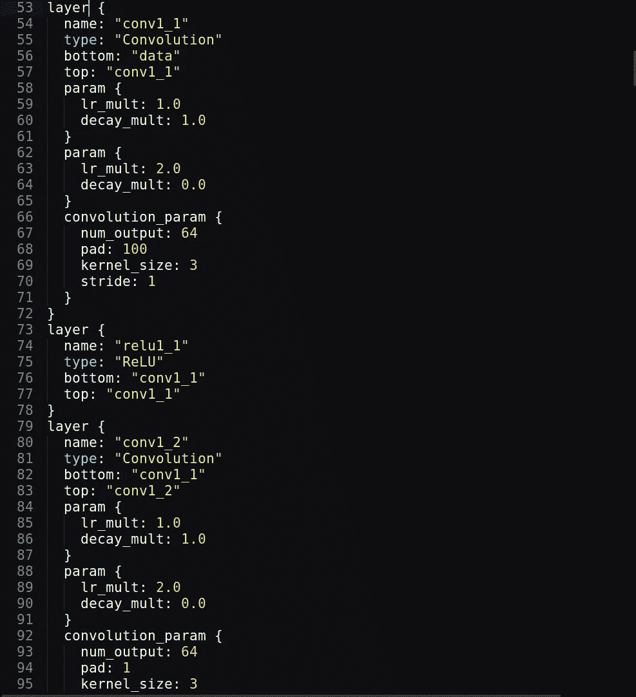
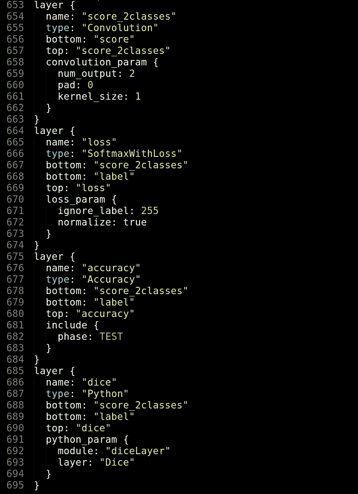
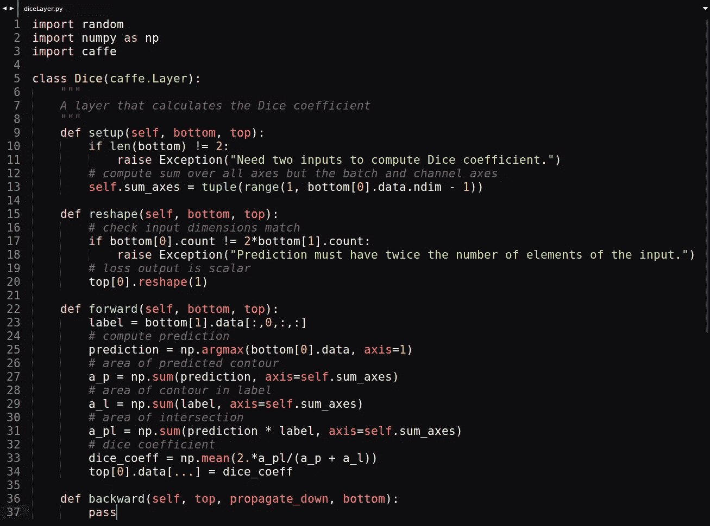
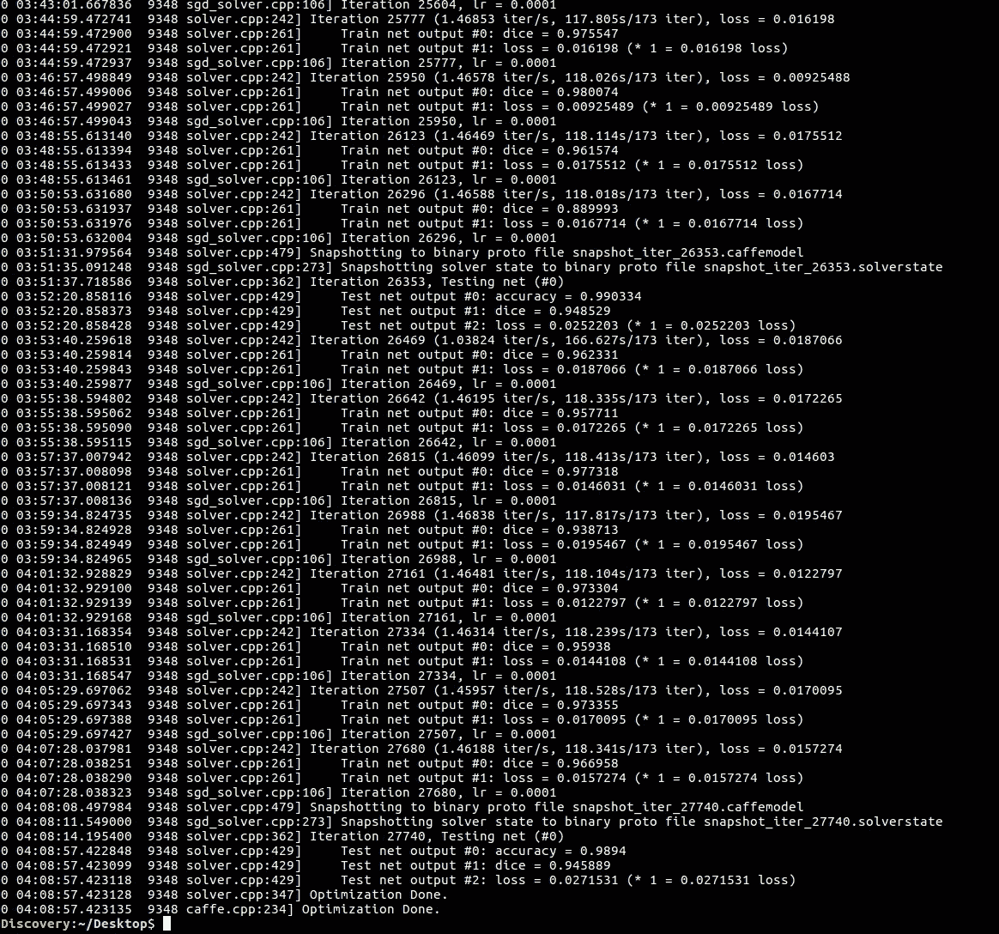
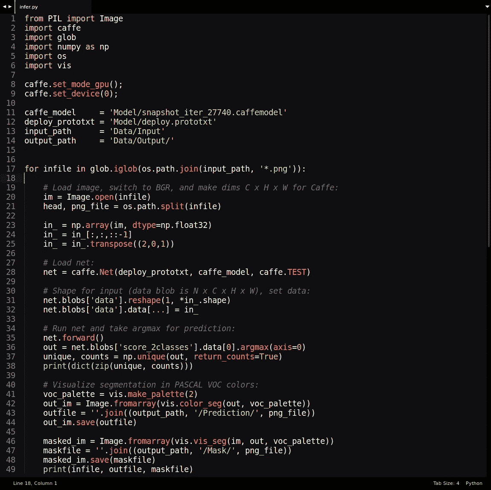
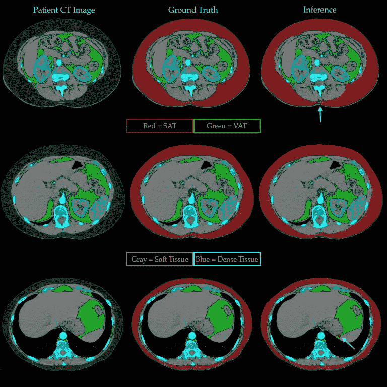

# 医学成像中的深度学习

> 原文：<https://medium.datadriveninvestor.com/deep-learning-in-medical-imaging-vi-b3b38aba74c5?source=collection_archive---------1----------------------->



**Deep Learning for Precision Medicine. Courtesy of GE Medical**

# **在定制的 CT 数据集上用 Caffe 训练 FCN-8**

> 在这篇文章中，我将演示如何使用 [Caffe 深度学习框架](http://caffe.berkeleyvision.org/)训练一个完全卷积网络(FCN)来分割在计算机断层扫描(CT)腹部图像中发现的皮下脂肪组织。

在[第四章](https://medium.com/p/b2b664540f97/edit)中，我介绍了如何使用 [NVIDIA 的深度学习 GPU 训练系统](https://developer.nvidia.com/digits) (DIGITS)训练一个完全卷积的神经网络(即 FCN-8s)来分割 CT 图像中的解剖感兴趣区域(ROI)。DIGITS 在 FCN-8 的引擎盖下使用 Caffe，它是一个出色的原型工具，因为它使用户能够以最小的学习曲线优化复杂人工智能模型的训练。与 Caffe 或 Tensorflow 等流行的深度学习框架相关的陡峭学习曲线相比，我说的是最小。

人工智能研究人员显然必须掌握他们行业的工具。然而，人工智能研究的目标是在有限的时间内开发优化的学习模型。人工智能原型工具是非常宝贵的，因为它们促进了各种深度神经网络(DNN)的实验，包括它们相关的权重和优化算法。然而，DIGITS 对于运行推理测试来预测新 ct 图像上的 ROI 分割并不理想。也就是说，如果我想给我训练有素的 FCN-8s 输入新的 CT 图像进行分割，我必须使用 DIGITS web 界面。DIGITS 在其网络界面上显示结果，但我找不到将预测下载到本地驱动器进行进一步分析的选项。为此，我必须用传统的方法训练模型。输入 Caffe。

来自 Caffe 网站: *Caffe 是一个深度学习框架，考虑到了表达、速度和模块化。它是由伯克利人工智能研究所(BAIR)和社区贡献者开发的。* Caffe 为深度神经网络的设计和实现提供了许多工具和演示，可以在 CPU 或 GPU 硬件上运行。简单来说，如果你想成为深度学习革命的一部分，掌握 Caffe 是必须的。然而，大多数深度学习教程都冗余地展示了如何在公开可用的精选图像数据集上使用 Caffe。如果要用自己的成像数据训练模型呢？如果您希望将自己定制的 Python Caffe 层添加到您的神经网络中，该怎么办？如果您希望修改 FCN 以分割 10 个而不是 1000 个对象类，该怎么办？接下来是一个快速和肮脏的教程，将回答上述问题。请注意，临床意义、数据扩充和 FCN-8s 迁移学习已经在第四章中讨论过:

**从自定义数据集创建 LMDB**

Lightning 内存映射数据库(LMDB)是一个具有键值存储架构的高性能事务数据库，是 Caffe 使用的几种数据模型选项之一。LMDB 的软件库从自定义图像和标签数据创建内存映射文件，为大型数据集提供良好的 I/O 性能。幸运的是，Caffe 标配了一个名为 *convert_imageset* 的便捷可执行文件，可以将训练数据转换成 LMDB。或者，如果您希望编写自己的转换器，Python 有一个方便的 LMDB 库。

Caffe 的默认 *convert_imageset* 有可选标志，如 *shuffle* 常用于对象分类和检测。对于这种逐像素的 FCN 分割任务，这是不必要的。此外，在数据预处理期间调整了训练和验证数据的大小，消除了对 *resize_height* 和 *resize_width* 标志的需要。这个特殊的 FCN-8s 需要灰度标签，需要 convert_imageset 的*灰色*标志。

以下脚本模板调用 *convert_imageset* 4 次，以根据训练/验证数据创建 4 个 mdb 文件，这些文件将保存在名为 training_images_lmdb、training_labels_lmdb、validation_images_lmdb 和 validation_labels_lmdb 的文件夹中:



**Figure 1\. Caffe LMDB creation script**

分别列出所有训练或验证图像文件名及其整数类标签的两个必要文本文件具有以下结构:

```
img00041.png 1
img00042.png 3
img00048.png 7
img00039.png 2
img00046.png 1
...
...
...
```

第一列是训练或验证文件名。第二列是对应于其相关文件中的对象的整数类标签，即 1 =汽车，3 =猫，7 =飞机等。注意，对于本教程，我们只有两个类别标签，0 =背景，1 =皮下脂肪组织。因此，对于二进制分段任务，每个文件名都有一个 1 作为其整数类标签。由于没有其他类别标签，这实际上是多余的。然而，Caffe 要求在它的类标签字段中有一个整数值，否则它将崩溃。

**训练日**

转换完数据后，让我们检查一下用于训练 FCN-8 的命令行选项:



**Figure 2\. Caffe command-line options used to train our FCN-8s**

1.  $CAFFE_ROOT 在图 1 中定义
2.  *-gpu* 标志告诉 Caffe 使用哪个 GPU(GPU‘0’，GPU‘1’，GPU‘2’，等等)。).例如，在我的工作站上，GPU“0”映射到 GeForce GTX 1080，而 GPU“1”映射到 GeForce GTX 1060。
3.  *-权重*标志是迁移学习模型的权重路径，该模型在更大的数据集上进行训练，这提高了我们的训练和验证性能(再次参见[第四章](https://medium.com/datadriveninvestor/deep-learning-in-medical-imaging-b2b664540f97)了解详细信息)。我们的患者 CT 数据集包含 6162 张图像，这对于充分学习来说太小了，即使有数据扩充也不行。当深度神经网络缺乏数据时，它们的学习参数(也称为权重)是欠确定的，因此通常是不准确的。
4.  *-solver* 标志是 solver.prototxt 文件的路径。让我们来看看它，了解更多关于 Caffe 的信息:



**Figure 3\. Caffe solver.prototxt describing the optimizations used to train FCN-8s**

我们立即看到 solver.prototxt 将神经网络架构细节(第 12 行)与神经网络优化细节(第 3、6–8 和 13 行)分离。求解器类型(第 13 行)是用于在每个训练时期的反向传播期间最小化预测误差的优化方法。这种误差(或损失)的最小化就是深度学习背后实际的 ***学习*。**

第 12 行指向一个文件，该文件包含用于训练的 DNN 模型架构的细节(数据、卷积、池层等)。).本练习中使用的全卷积网络(如 FCN-8s)非常复杂，因为它们包含一个卷积神经网络和去卷积层，以输出逐像素预测。我们的 training.prototxt 文件(图 4 所示的第 53–95 行)详细说明了我们的 FCN-8s 模型架构，该文件长达 695 行！这就是深度学习背后的实际 ***深度*。**



**Figure 4\. Portion of Caffe’s training.prototxt which details FCN-8s’s network architecture**

**添加自定义 Python 层**

深度学习库为用户提供了各种各样的内置类，几乎可以复制任何网络模型。在图 4 中，您会注意到预先构建的 Caffe 层用于卷积和 ReLU，以及用于学习速率和衰减参数的参数选项。但是，有时您希望创建自己的类层来扩展 DNN 或创建新的 DNN 架构。Caffe 接受定制的 Python 层，作为从`caffe.Layer`基类派生的 Python 类来实现。

在这种二进制分割练习中，像素可以是感兴趣的解剖特征或黑色背景，传统的 DNN 精度度量会给出错误的性能感觉。这是典型的*阶级不平衡问题*的结果。在这个练习中，大约 87%的输入像素是黑色背景，剩余的 13%代表皮下内脏脂肪。如果我们的完全卷积神经网络预测所有像素为黑色背景，它可以声称有 87%的准确性！

因此，我在 training.prototxt 的末尾添加了一个自定义 Python 层，引入了在第五章中详细讨论的骰子得分指标:



**Figure 5\. Custom Python Dice Layer beginning on Line 685**

Python 骰子评分类定义如下:



**Figure 6\. Python class definition of Dice Score metric**

注意第 3 行的*进口咖啡*模块。培训(通过使用图 2 中描述的命令行选项按 Enter 键)需要 5-6 个小时才能在我的普通 GPU 工作站上完成，最终输出如下所示:



**Figure 7\. We have a trained model with a 94.6% Dice Score and a 2.7% loss on our validation dataset!**

请注意，在图 7 的底部，我们看到迭代 27740 的最后几行计算了最后一个优化步骤中验证数据的准确性、骰子得分和损失。还要注意，上面几行我们看到最终优化的深度神经网络模型被命名为*snapshot _ ITER _ 27740 . caffemodel*。我们将很快使用它…

你还记得我一开始不得不喝咖啡的原因吗？我希望将我训练过的 FCN-8s 模型应用到新的预测数据中。在深度学习中，这个过程被称为*推理*，因为模型正在*推断一个结果。*现在，我训练的模型在训练和验证数据上表现出了出色的学习性能，让我们给它输入一些新的 CT 图像，看看它分割皮下脂肪组织(也就是我们腹部周围的性感备胎)的准确性如何。

**推理**

开发 FCN-8s 的天才研究人员之一埃文·谢尔哈默在 Github 上发布了一个非常有用的 Python 程序(infer.py ),该程序对用 Caffe 设计的 FCN 模型进行推理。我为这个教程修改了它:



**Figure 8\. Running inference with our trained neural network using a modified version of infer.py**

即使对于刚接触 Caffe 的人来说，该准则也有一些显而易见的方面:

1.  我们再次*在第 3 行导入 caffe* ,这样我们就可以使用 Python 的 caffe 库
2.  第 8 行和第 9 行告诉 Caffe 使用 GPU 而不是 CPU，并指定运行哪个 GPU(记得我的 GTX 1080 是 GPU '0 ')
3.  第 11 行是到*snapshot _ ITER _ 27740 . caffe model*的路径，它是图 7 中经过训练和优化的 FCN-8s 模型
4.  第 12 行是一个全新的 prototxt 文件，我很快就会看到。 *deploy.prototxt* 与 *training.prototxt* 相同，除了关于训练和验证数据的信息已经被删除。这是有意义的，因为我们不是向模型提供用于训练它的旧数据，而是用于推理的新数据。代替具有关于训练数据的详细信息的数据层， *deploy.prototxt* 具有包含关于新输入图像的预期分辨率的信息的数据层。
5.  第 13 行是到一个输入文件夹的路径，该文件夹中装满了准备由第 11 行中列出的 Caffe 模型分割的新 CT 文件。
6.  第 14 行是输出文件夹的路径，用于存储由第 11 行中列出的 Caffe 模型产生的推断分割结果
7.  第 17 行是一个循环，它将读入输入文件进行分段
8.  第 28 行发送 *deploy.prototxt* 和训练好的模型作为推理测试的参数
9.  第 36 行有很多内容，但读者可能还记得在自定义 Python 层以及图 5 中显示的 training.prototxt 的 *loss* 和 *accuracy* 层中看到的 *score2_classes* 标签。回想一下，DNN 只上过两堂课，黑色背景和 SAT。来自输入图像的像素被分类为一个或另一个。这一行 *infer.py* 使用自定义 Python 层中定义的骰子得分度量来计算 FCN-8s 的分段性能。

**结果**



**Figure 9\. SAT = subcutaneous adipose tissue. VAT = visceral adipose tissue. Soft tissue is primarily composed of muscle and organs. Tissue with blue hues include bone and contrasted vasculature. Note white arrows in Inference column showing minor differences from Ground Truth.**

*患者 CT 图像默认为灰度*。这使得外行很难辨别组织。我在图 9 的图像网格中添加了假色，以帮助读者辨别感兴趣的相关解剖特征。

为了保真，我没有缩放 FCN-8 的输出，因为缩放会引入伪像。 *FCN-8s 输出一幅 256x256 的图像，该图像由红色 SAT 像素预测掩模组成，显示为覆盖图 9* 推理栏中的患者 CT 数据。FCN-8s 的输入和输出图像分辨率都是 256x256 像素。此外:

1.  *内脏脂肪组织(VAT )* 在所有图像中被着色为**绿色**
2.  *软组织*，主要是肌肉和内部器官，保留了患者 CT 扫描的原始**灰色**颜色
3.  *密度大于脂肪的组织和软组织*(如骨骼)以表示密度差异的**蓝白**色调显示(解剖结构越白，组织密度越大)
4.  由于所有 3 个测试示例都是对比增强腹部 CT 扫描，血管也显得密集(蓝白色)。在这种扫描中，诸如钡或碘的造影剂被吞咽或通过静脉给药。这些药剂会暂时增加血液的密度。对比极大地增强了 CT 图像中患者血管系统的可视性。
5.  在*推断*栏中，3 幅图像中的 2 幅有轻微的分割错误，用白色箭头标出。与相邻列中的*地面实况*相比，第 1 行中的预测遗漏了几个像素。第 3 行的预测混淆了 SAT 的 VAT 的几个像素。

**结论**

> **除了空间位置，SAT 与 VAT 无法区分。CT 测量组织密度，所有身体脂肪都在相同的密度范围内。除了它们在图像中的相对位置之外，SAT 的像素和 VAT 的像素之间没有区别。脂肪就是脂肪……**

我们的全卷积神经网络被输入 CT 腹部图像以及该图像的唯一 SAT 图像标签，即在图 9 的*地面实况*栏中以红色显示像素值的图像。 *FCN-8s* *在训练中学习了 SAT 在患者扫描中的位置。* **FCN-8s 能够预测新患者 ct 图像中的 SAT，结果几乎完美无缺，如图 9 所示。**

当 SAT 和 VAT 在空间上相邻时，非学习算法通常不能区分它们，如第一和第三个例子中那样。在两张图片的顶部，内脏脂肪非常靠近皮下脂肪。很难编写一个基于规则的算法来考虑描述 SAT 和 VAT 邻接的所有可能情况，因为人体解剖结构因患者而异(参见第四章中的图 2 和图 3)。决策树和条件句经常成为不可预见的解剖学反例的牺牲品。然而，FCN-8s 成功地从其训练数据和迁移学习中学习到了腹部脂肪的空间特征。

有改进的余地。图 9 所示的用于训练该模型的患者相对健康。由于疾病、营养不良或年龄相关的消瘦而导致 SAT 很少的患者将无法准确分割，因为 FCN-8s 的分辨率限制为 8×8 像素。虽然这种分辨率对于本练习来说是足够的，但是对于其他医学成像挑战来说可能是不够的，例如确定肿瘤边缘的分割边界。对于这种情况，医学将要求 FCN 分割极限优于 64 平方像素。或者，能够处理全分辨率 CT 图像(512×512 像素对 256×256 或 227×227 像素)的 fcn 将减少源于其分辨率限制的误差，而不需要下采样 CT 图像用于训练。如果用更多反映这些低体脂患者群体的图像来训练 FCN-8s，性能也将明显提高。