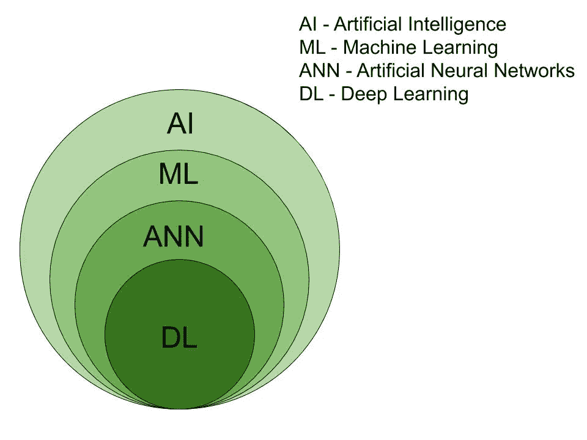

# 深度学习只是一个营销术语|误解和真相。

> 原文：<https://medium.datadriveninvestor.com/deep-learning-is-just-a-marketing-term-misconceptions-and-truths-9c7cd9e7ffec?source=collection_archive---------10----------------------->

Image by [Ahmed Gad](https://pixabay.com/users/ahmedgad-9403351/?utm_source=link-attribution&utm_medium=referral&utm_campaign=image&utm_content=3501528) from [Pixabay](https://pixabay.com/?utm_source=link-attribution&utm_medium=referral&utm_campaign=image&utm_content=3501528)

> 在进入这篇文章之前，请参考我以前的博客[数据科学和机器学习|简介](https://link.medium.com/f6cjsdJSlZ)。为了更好的理解。

深度学习是计算机科学领域的一个热门词汇。对数据科学和机器学习感兴趣的人大多用这个词。但是初学者对深度学习有一些误解。因此，一些招聘人员和求职者将深度学习作为一种营销工具来建立他们的业务并获得报酬。

本文涵盖了对深度学习与 ann(**A**人工 **N** eural **N** etworks)和机器学习的两种常见误解，以及开发人员如何将它们用作营销工具。

 [## 2019 年深度学习的终极学习路径及更多...数据驱动的投资者

### 又一个美好的一周，一些好的教育内容将会到来。我最喜欢的&最受欢迎的帖子之一…

www.datadriveninvestor.com](https://www.datadriveninvestor.com/2019/01/07/the-ultimate-learning-path-for-deep-learning-in-2019-more/) 

# 什么是深度学习？

Image by [Gerd Altmann](https://pixabay.com/users/geralt-9301/?utm_source=link-attribution&utm_medium=referral&utm_campaign=image&utm_content=4115193) from [Pixabay](https://pixabay.com/?utm_source=link-attribution&utm_medium=referral&utm_campaign=image&utm_content=4115193)

深度学习是以人脑解决问题的方式解决问题的编程技术(即人工神经网络)。

深度学习有许多定义，但它们都给出了相同的概念。

 [## 深度学习

### 深度学习(也称为深度结构化学习或分层学习)是更广泛的机器家族的一部分

en.wikipedia.org](https://en.wikipedia.org/wiki/Deep_learning) 

为了详细说明，考虑人工神经网络。

**ann**(**A**artificial**N**eural**N**etworks)是机器学习系统，用于以与生物神经系统相同的方法解决问题，但有一些例外。

由此，我们可以假设*深度学习和 ANN 是一样的。*

完全没有。这是对深度学习的第一个误解。

# 深度学习 VS 人工神经网络

上面的文氏图解释了深度学习是人工神经网络的子集。因为人工神经网络从 90 年代开始流行，但深度学习是最近演变的术语。

深度学习的这种演变受到了一段时间内以下研究论文的影响。

1.  1958 年— [罗森布拉特的感知机](http://citeseerx.ist.psu.edu/viewdoc/download?doi=10.1.1.335.3398&rep=rep1&type=pdf)
2.  1958 年— [由 D. R. Cox 进行的逻辑回归](https://www.nuffield.ox.ac.uk/users/cox/cox48.pdf)
3.  1986 年— [大卫·e·鲁梅尔哈特，杰弗里·e·辛顿&罗纳德·j·威廉姆斯](https://www.iro.umontreal.ca/~vincentp/ift3395/lectures/backprop_old.pdf)的神经网络反向传播
4.  1997 年— [长短期记忆(LSTM)作者塞普·霍克雷特&于尔根·施密德胡伯](https://www.bioinf.jku.at/publications/older/2604.pdf)
5.  1998 年—[Yann le Cun、Leon Bottou、Yoshua Bengio 和 Patrick Haffner](http://vision.stanford.edu/cs598_spring07/papers/Lecun98.pdf) 将基于梯度的学习应用于文档识别

*附上相关研究论文的链接，点击即可查看。*

这些论文清楚地表明，人工神经网络在深度学习之前很久就诞生了。

但是他们中的大多数将人工神经网络和深度学习视为不同的方面，并且只经常使用深度学习这个术语。

一些开发人员将人工神经网络描述为深度学习的子集，并为自己的利益推销深度学习。但事实是深度学习包含在人工神经网络中。

# 需要深度学习而不是机器学习

Photo by [Alex Knight](https://www.pexels.com/@agk42?utm_content=attributionCopyText&utm_medium=referral&utm_source=pexels) from [Pexels](https://www.pexels.com/photo/high-angle-photo-of-robot-2599244/?utm_content=attributionCopyText&utm_medium=referral&utm_source=pexels)

上图(在前面的小标题下)已经建立了深度学习和机器学习之间的关系。但是为什么需要它呢？

机器学习有一些缺点。所以为了拯救它，深度学习占据了上风，如下所示。

1.  当处理具有大量输入和输出的高维数据时，机器学习受到限制。但深度学习凭借其特征选择能力，可以完美地处理海量数据。
2.  图像分类、语音识别、自动驾驶汽车等复杂的人工智能问题，机器学习很难处理。深度学习用于在现实世界中构建它们。

由此，我们可以得出结论*深度学习比机器学习更好。但并不总是如此。这是产生的另一个误解。*

原因是这是一种误解，

1.  简单的数据科学问题由机器学习高效且有效地解决。使用深度学习解决这个问题可能会导致其他问题，如*过拟合*。
2.  由于深度学习过程复杂，需要强大的硬件或者硬件加速。它们都花了你很多钱。所以对于一个普通人来说，深度学习是很难管理的。

这些误解是用来表明与机器学习相比，深度学习是更好的选择。所以他们认为，深度学习工程师的薪酬应该高于机器学习工程师。*这可能是营销还是非营销？*

# 结论

Photo by [rawpixel.com](https://www.pexels.com/@rawpixel?utm_content=attributionCopyText&utm_medium=referral&utm_source=pexels) from [Pexels](https://www.pexels.com/photo/laptop-with-marketing-display-1496192/?utm_content=attributionCopyText&utm_medium=referral&utm_source=pexels)

深度学习是吸引大多数开发人员的趋势领域。关于深度学习有一些误解，例如深度学习是人工神经网络的子集，深度学习比机器学习更好。这些误解被一些开发者用于营销，以建立深度学习术语，产品是最好的，应该支付更多。实际上，深度学习是现有算法 ann 的增强版本的术语。没有比这更尴尬的了。

*深度学习营销可以接受？*在评论区告诉我。