# 深度学习的直观介绍

> 原文：<https://medium.datadriveninvestor.com/deep-learning-is-not-just-import-tensorflow-c27136aaa65e?source=collection_archive---------4----------------------->

## 深度学习和神经网络基础的简单指南！🧠

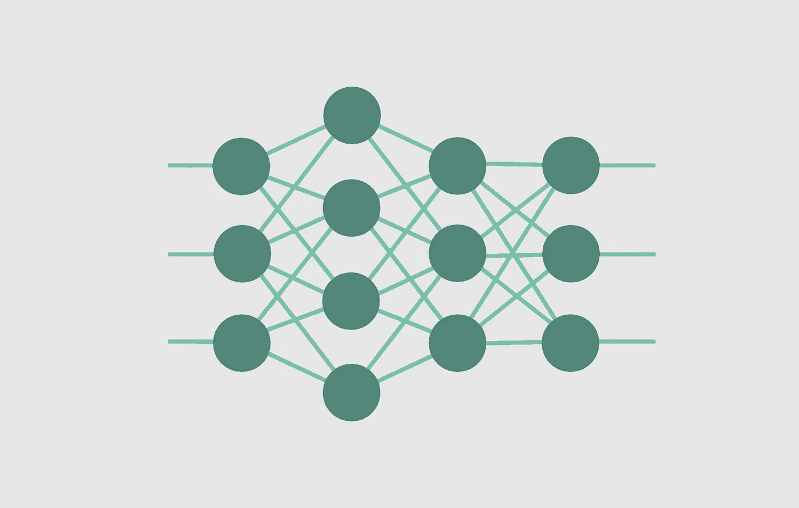

虽然人工智能在 20 世纪 50 年代至 80 年代一直是科学家们的热门话题，但该行业只是在最近二十年才开始席卷全球。

它最近的流行可以归功于多伦多大学教授 Geoffrey Hinton 在**深度学习**方面取得的突破，以及世界上计算能力和可用数据量的指数增长。

Geoffrey Hinton, known by many as the “godfather of deep learning.” Image sourced from [Toronto Life](https://torontolife.com/tech/ai-superstars-google-facebook-apple-studied-guy/).

深度学习是人工智能的一个子集，它使用模仿人脑的算法，称为**神经网络。**

# 🧱神经网络的基本结构

本质上，神经网络学习输入变量和输出变量之间的关系。给定关于一组 x 和 y 的足够数据，神经网络学习从 x 到 y 的精确映射。

神经网络由多层互连的处理元件组成。这些元素被称为**‘节点’或‘神经元’，**，它们一起工作来解决复杂的问题。节点被分成三个主要类型的层:**输入层、隐藏层和输出层**。

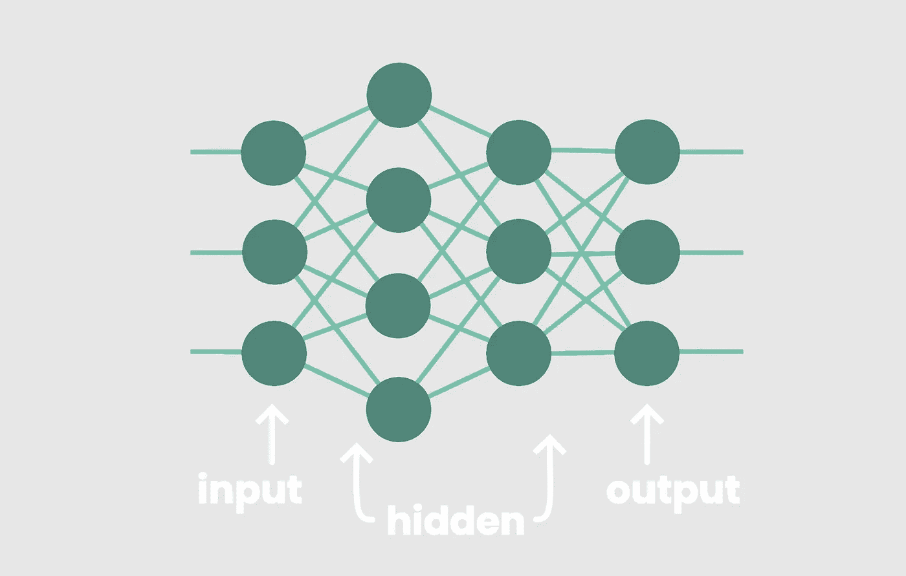

输入层中的节点接收输入值，隐藏层中的节点执行隐藏计算，输出层中的节点返回网络预测。

假设我们正在训练我们的网络识别 16x16 像素网格中的手写数字。为了从该图像接收输入，我们将为输入层分配 16x16 或 256 个节点。从图像的左上角开始，**每个像素由一个节点表示。**

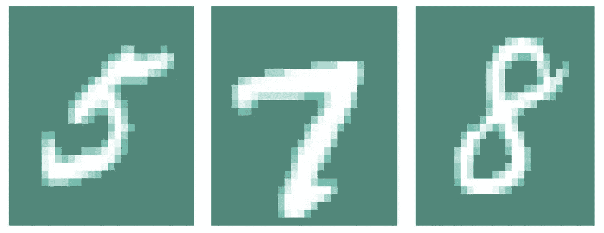

Each pixel corresponds to one input node.

一个输入节点将包含一个介于-1 和 1 之间的数值来表示其对应像素的**亮度，其中-1 表示暗，1 表示白。**

随着这些值被输入到网络中，它们从一层神经元向前传播到下一层。

Visualizing forward propagation.

在它们通过隐藏层中的一系列计算之后，我们期望接收十个输出，其中**每个输出节点代表从 0 到 9 的一个数字**。

假设，如果我们给网络看一个手写的‘4’，网络应该把我们的图像归类为‘4’。数学上，对应于数字“4”的节点将返回输出层中的最高值。

总之，输入层**中的节点接收输入值**，隐藏层**中的节点执行计算**，输出层**中的节点返回预测。**

# 了解单个节点！☝️️

最大的问题是，*我们的神经网络如何对关系建模？为了理解神经网络的工作原理，我们必须首先理解隐藏层中单个节点的**功能。我们可以把单个节点的功能比作统计学中的一个标志性模型——**线性回归。*****

线性回归可以定义为试图建立线性关系的模型。

假设给你一组包含两个定量变量的数据:

如果你把学生的分数和他们学习的小时数绘制成散点图，你会发现一个正的线性关系。

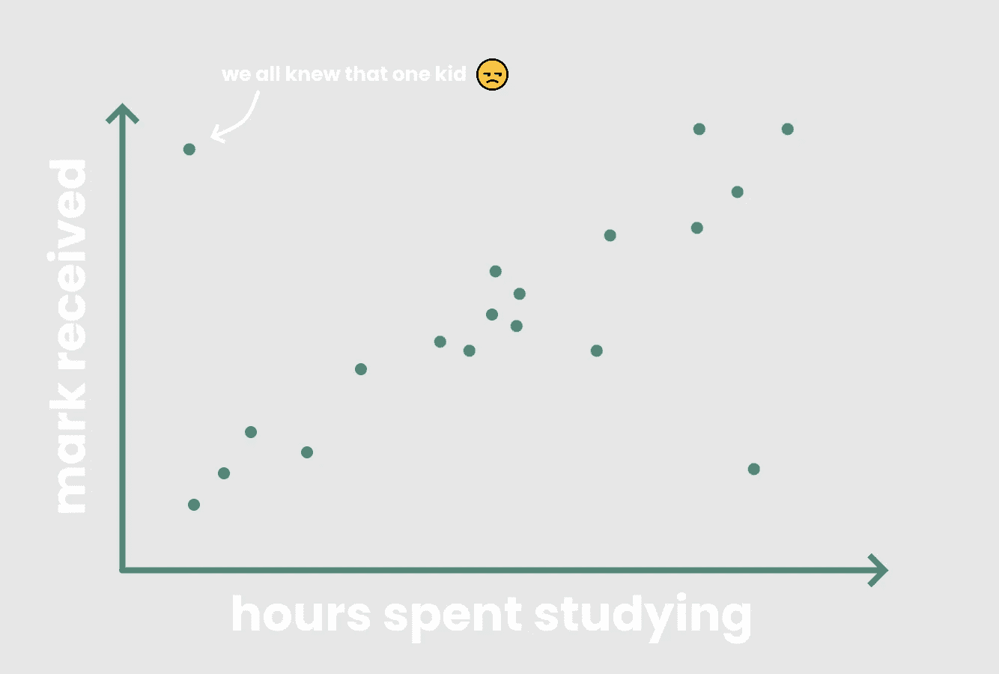

一般来说，学生花在学习上的时间越长，就越有可能在考试中取得高分。线性回归试图通过绘制一条穿过散点图上的点的最佳拟合线来模拟这种线性关系，称为线性模型。

线性模型基本上是一条线， *y = mx + b* ，它传递尽可能多的数据。

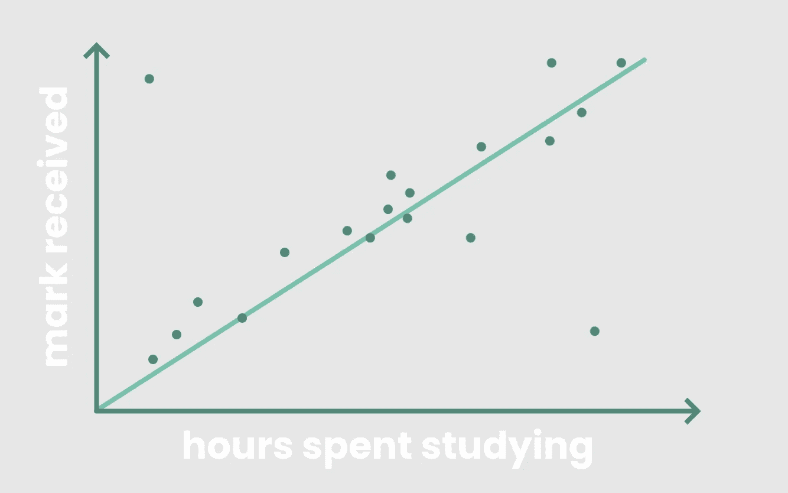

理想的线性模型应该使学生的实际分数与模型预测的分数之间的误差最小，或者使模型的实际 y 值*与其预测的 y 值 T10 之间的误差最小。*

让我们仔细看看数学。

在线性模型中，输入 *x* 乘以常数 *m* 。然后添加一个输入 *b* ，称为“截距”。然后将这些输入相加得到我们的输出， *y* 。

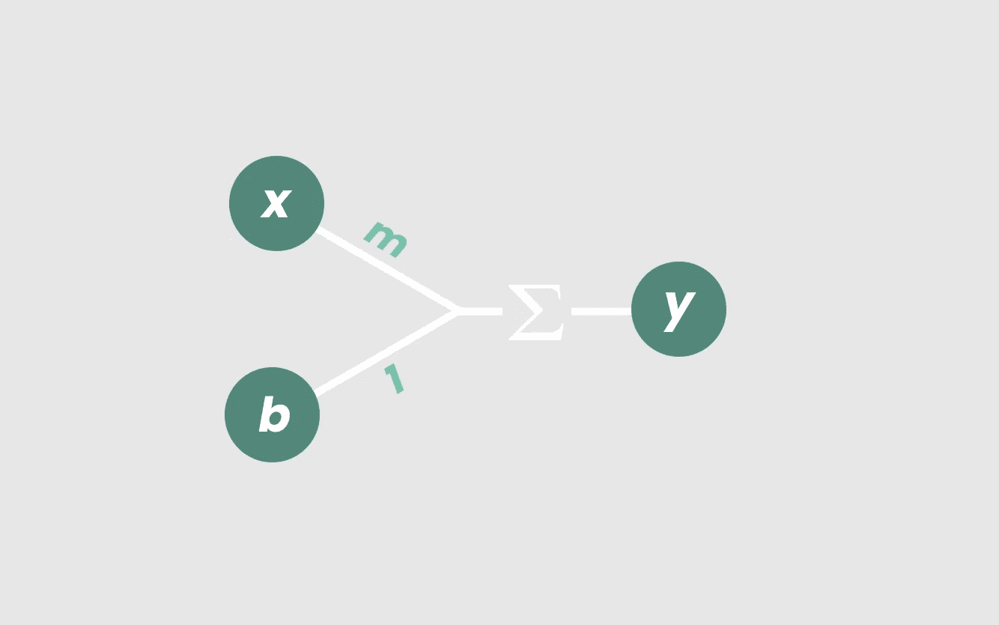

得到的线， *y = mx + b，* **模拟了 *x* 和 *y* 之间的关系。**

如果我们要修改输入的值，我们期待一个不同的行。例如，将常数 *b* 从 *2* 更改为 *3* 意味着向上移动我们的直线，使其在 *y = 3* 处与 y 轴相交，而不是在 *y = 2* 处。

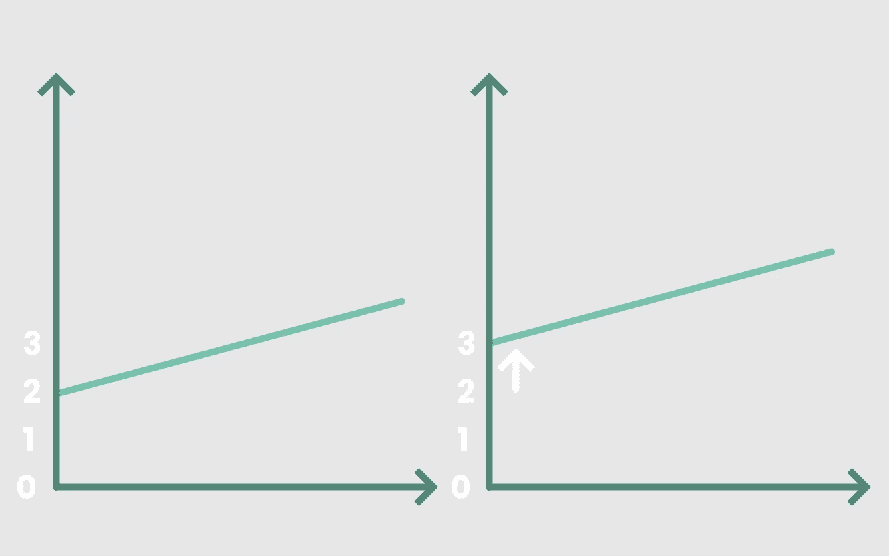

我花这么长时间和你一起复习九年级数学的原因很简单。单个神经元的工作方式完全相同！

在神经元中，一个输入 *x₁* 乘以一个权重 *w₁* 。我们的输入 *x₁* 乘以 *w₁* 后，我们称之为‘加权输入’。

然后添加一个常数*b₁*——它的行为类似于线性模型中的 y 截距，被称为“偏差”。然后加权输入和偏差相加得到我们的输出， *v₀* 。

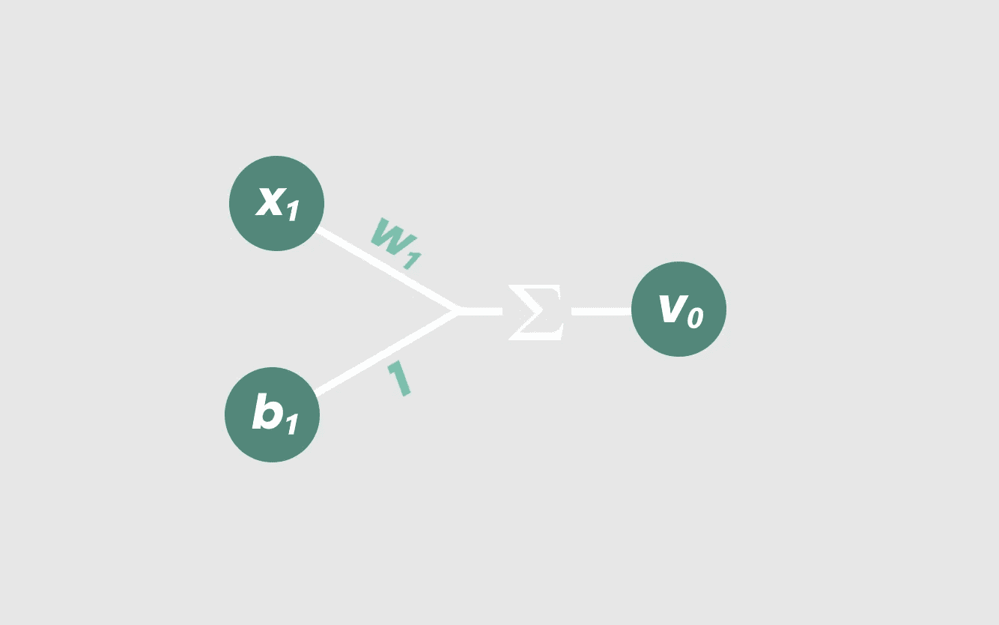

Hmmm… looks familiar, doesn’t it?

我们走吧！**基本神经元。**

同样，我们可以通过调整重量、 *w₁* 或偏差、 *b₁* 来调整 *v₀* 的值。如果我们修改这两个参数中的任何一个，我们将再次期望看到不同的线性模型。

# 但是如果我们增加更多的输入呢？🤔

线性回归模型可以最小化输入的实际输出和模型的预测输出之间的误差。类似地，理想的神经网络试图做到这一点。

神经元与线性回归模型的区别在于，神经元可以接收多个加权输入，其中输入的数量由字母 *i* 表示。

数学上看起来是这样的:

> vₖ= x*₁*×w*₁*+x*₂*×w*₂*。。。+ xᵢ × wᵢ + bₖ.

换句话说，任何一个神经元的输出 *vₖ* 就是 *i* 的所有值加上 *x* ᵢ × *w* ᵢ和 *bₖ* 的总和。

但是想象一下，我们有 17 个输入……用手把它们全部写出来不是非常乏味吗？

这就是为什么我们将函数简化为一个简单、优雅的等式:

> *v*ₖ*=∑(x*ᵢ×*w*ᵢ*)+b*ₖ

*为了澄清，下标ₖ代表节点的当前层，从输入层开始。*

看起来不是更好吗？从视觉上看，我们的新节点如下所示:

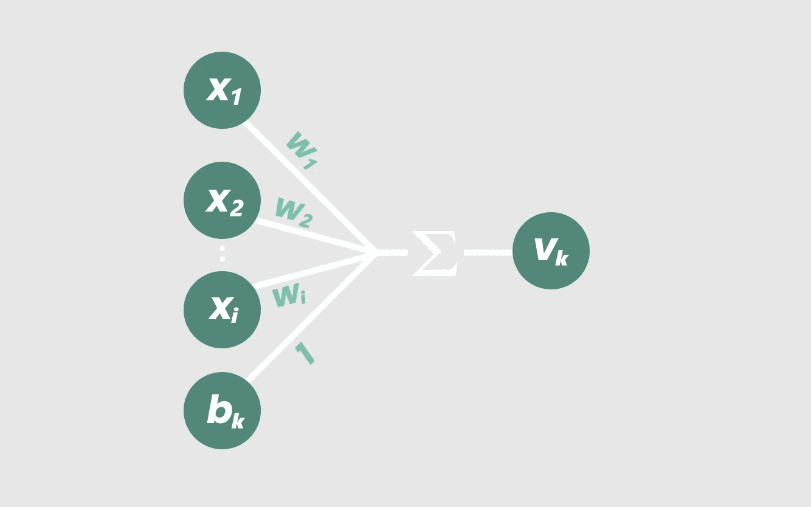

随着输入数量的增加，我们的方程开始在越来越高的维度上模拟线性关系。例如，具有三个加权输入的节点

> vₖ= x*₁*×w*₁*+x*₂*×w*₂*+x*₃*×w*₃*+b*₁*

会产生一条线的三维等价物:一个平面。

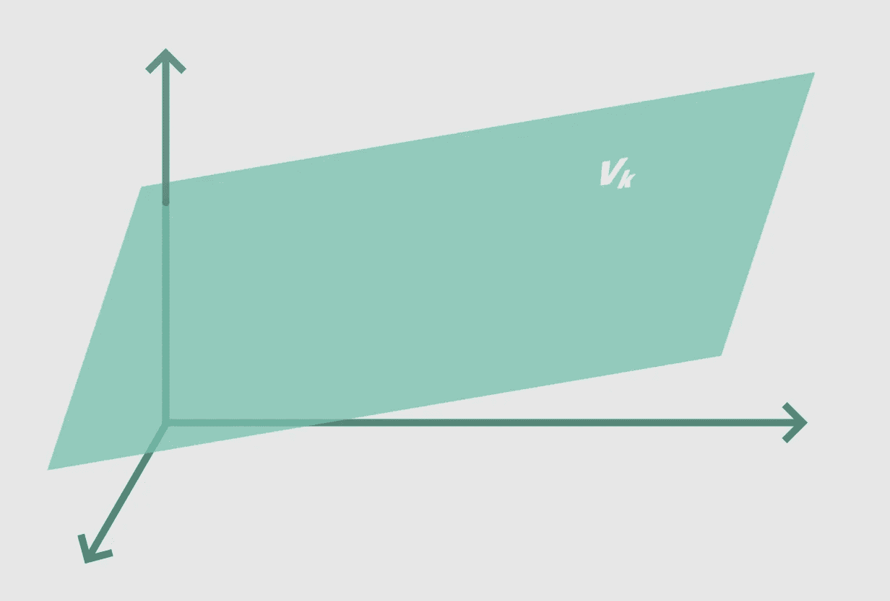

如果我们向节点添加更多的输入，我们将增加由节点方程模拟的维数。它最终会模拟一个 I 维超平面——相当于 I 维空间中的一条直线。

(如果你想象不到，不要担心，因为我也想象不到😂).

到目前为止，我们概述的函数仅适用于神经网络一层中的单个节点。每个节点的输出， *vₖ* ，成为下一层中每个节点的输入。

然后在神经网络的每一层中的每一个节点上重复这个过程**！我知道，很难理解如此高的维度复杂性。不幸的是，我们只局限于我们的三维大脑——至少目前如此。但那是以后的事了。**

# 非线性〰️会计

请记住，如果我们采用当前的分层神经网络，并随机设置所有权重和偏差，则在输出节点处得到的加权函数仍将是直的和线性的。

无论我们如何组合我们的权重和总和，我们总是会得到一个线性模型…这就是目前为止数学是如何工作的。

虽然对线性关系建模可能很有趣，但这并不十分有用。我们希望我们的神经网络能够解释复杂的非线性关系。

因此，我们将修改每个节点的线性方程，使用我们称之为**的激活函数，为我们的网络增加一些非线性**

把这想象成**‘激活’我们的神经网络的一个函数，**因为它的目的是使我们的网络能够从建模**线性** *i* 维超平面到建模**非线性** *i* 维函数。

一个流行的激活函数是逻辑曲线，也称为**sigmoid 函数:**

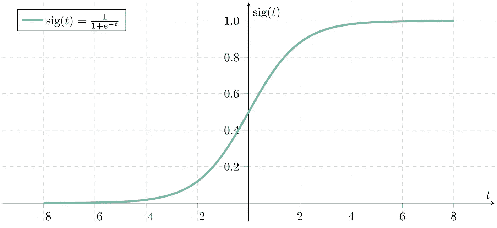

这个函数“挤压”我们的加权和，这样无论它们变得多高或多低，它们将总是在 *0* 和 *1* 之间结束。在将我们在每个节点的现有方程通过 sigmoid 函数后，我们修改后的方程变成:

> yₖ = σ ( vₖ)
> 
> 或者
> 
> yₖ = σ ( ∑ ( xᵢ × wᵢ ) + bₖ)

将这个组件添加到我们的图中，我们现在有:

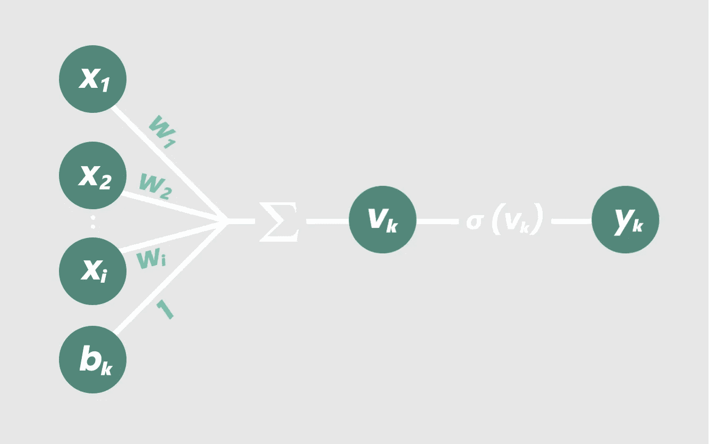

而现在，我们的节点实际上已经*完成了*！

sigmoid 函数允许我们的节点考虑交互效应和多个输入之间的非线性关系。当与网络中的所有其他节点连接时，我们的神经网络获得了模拟复杂的**非线性 *i-* 维度关系的能力。**

只对三个输入之间的关系进行建模的神经网络最终可能看起来像这样:

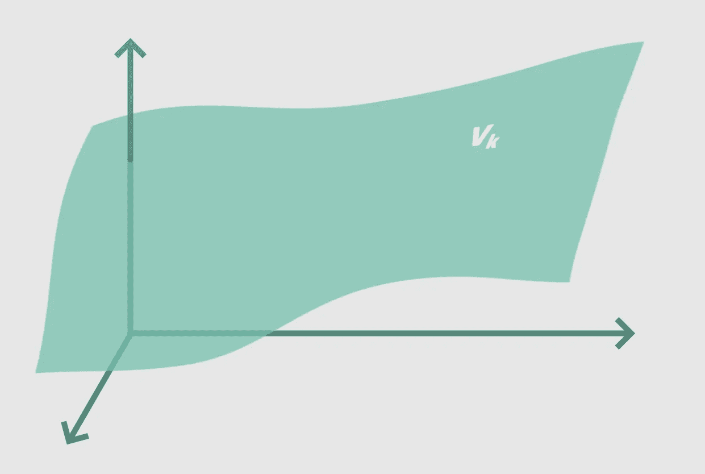

但是像上面看到的非线性平面这样简单的东西，人类也可以计算出来。我们并不真的*需要*一个神经网络来模拟 3D 空间中的函数。

但是当我们开始操纵越来越多的变量并进入越来越高的维度时，神经网络变得极其有用。我的意思是，我们怎么能想出一个在成千上万个变量之间精确映射的模型呢？！

答案是——我们没有。这就是神经网络的作用！

让我重申一下

随着加权输入被加在一起并通过每个节点的激活函数，神经网络获得了模拟复杂非线性维度关系的能力。

这就是神经网络如此有用的原因。

由于我们可以修改每个节点的权重和偏差，理论上，我们的神经网络现在应该能够学习和模拟任何数量的变量之间的任何关系。

# 现在我们才开始训练我们的网络！🏋️

考虑到这一点，我们开始在每个节点用一组随机的权重和偏差来训练我们的神经网络。

当我们向网络输入大量包含输入和正确输出的数据和训练示例时，网络会尝试将输入映射到相应的输出。

输出层中最“活跃”的节点(换句话说，它返回比其他输出节点中的加权和更高的值)是神经网络对给定输入集的“正确答案”的选择。

# 该死，这么多错误！😬

显然，由于我们从每个节点的随机权重和偏差开始，网络的预测从一开始就不准确。这就是为什么我们需要训练网络。

我们向网络显示我们的训练示例的正确答案，并且我们基本上告诉网络每次它的预测与正确答案有多接近。为此，我们使用损失函数来计算输出中的误差:

> 误差= ×(实际产量-预测产量)

我们的目标是最小化误差，以提高网络的准确性。形象化这一过程的一个简单方法是将误差想象成一个向上开口的抛物线函数，其中底部的波谷代表最小误差。

我们使用一种叫做梯度下降的方法来最小化我们点在这个损失函数上的导数。这是一种奇特的说法，如果我们要画一条与点相切的线，我们希望**的斜率尽可能小。**

想想看:我们的抛物线的切线斜率为 0 的唯一一点是在**最底部的点，在那里损失最小**！

知道我们点在损失函数上的导数非常有用，因为它变得越小，误差就越小。

因此，梯度下降函数通过将神经网络的误差点下移至损失函数的局部最小值**来帮助我们最小化损失。**

在实践中，我们的损失函数不会是双变量抛物线，因为大多数神经网络不止有两个输入，因此也不止有两个变量。

相反，损失函数就像多维空间中的山丘和山谷。因此，梯度下降函数通过最小化损失函数上我们点的“梯度”或多变量导数来减少误差。

因此，与其在抛物线上降低我们的损失，不如将梯度下降的过程想象为将球滚下山坡，其中球代表我们神经网络中的误差量。

We’re using a linear regression model here to keep the visualization simple. Watch how the model’s accuracy improves (right) as its point on the loss function (left) “rolls down the hill”.

简而言之，梯度下降允许网络在给定一组输入的情况下计算其输出需要更正还是更负，以便在进行预测时提高网络的整体准确性。

# 该死，纠正他们的错误！😤

一旦通过损失函数计算出误差，网络中的权重和偏差就被修改以最小化误差。这是通过一种称为反向传播的方法实现的:

> W(k+1) = W(k) —(学习率)×(应用于误差的梯度下降)

*其中 W(k+1)代表新的权重，W(k)代表我们当前的权重。*

反向传播函数将误差从输出层反向传播到网络中的每一层。它本质上允许我们修改神经网络中节点之间的每个权重值，以便一些节点变得比其他节点更“活跃”。

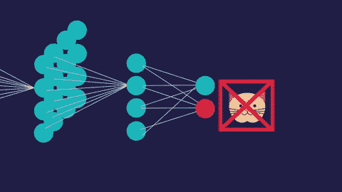

Visualizing back-propagation. Image sourced from [Fiction to Fact](http://www.fictiontofact.com/files/media/43803/neuralnet.gif).

这些修改的目的是使我们的神经网络中的损失或误差最小化。经过无数次反复的训练，损失被最小化，我们的神经网络在工作中变得越来越准确，无论是识别手写数字还是推荐你的下一个 YouTube 视频。

# 关键要点🔑

*   神经网络**学习输入变量和输出变量之间的** **关系**。
*   给定足够的数据进行训练，神经网络学习从 x 到 y 的精确映射
*   神经网络由输入层、隐藏层和输出层组成。
*   单个节点的功能可以比作线性回归，其中每个节点都有一组**权重和偏差。**
*   神经元与线性回归模型的不同之处在于，一个节点可以接收多个加权输入，并且一层中的每个节点都可以输入下一层中的节点。这一特性使得神经网络能够模拟数十、数百或数千个变量之间极其复杂的关系。
*   我们使用**激活函数**来说明变量之间关系的非线性。
*   **梯度下降**用于识别和最小化神经网络中的损失，其工作原理类似于一个球滚下山坡和山谷。
*   一旦识别出损失，通过**反向传播将其最小化；**输出层的误差使用微积分中的链式法则向后传播，以便在每一层调整**权重和偏差。**

# 恭喜你！🎉

你绝对是个传奇。我没有耐心通读所有的内容(这很有趣，因为这是我写的)。向你致敬！

更重要的是，现在你对**神经网络如何工作有了更直观的理解，**超越导入 TensorFlow。

希望你学到了有价值的东西，下一篇文章再见！

## 如果你喜欢这篇文章，一定要留下一些掌声来表示支持，并在这里跟我来。