# 早期检测结肠癌的深度学习模型

> 原文：<https://medium.datadriveninvestor.com/deep-learning-model-to-detect-colon-cancer-in-the-early-stage-50965c9d4f0?source=collection_archive---------2----------------------->

[](http://www.track.datadriveninvestor.com/1B9E)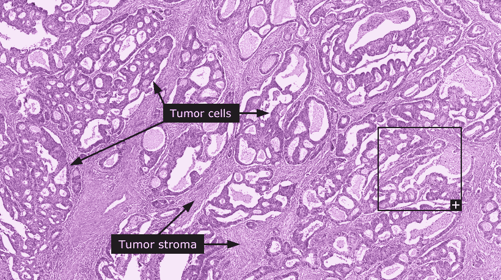

如果我们能在早期发现结肠的异常以预防结肠癌会怎么样？我们现在处于一个技术时代，它能够做我们以前想象不到的令人印象深刻的事情。使用人工智能可以检测出比常规检查更多的异常。医生应该利用这一点。

根据*美国癌症协会*的数据，在美国，结肠直肠癌是男性和女性癌症相关死亡的第三大原因，也是癌症死亡的第二大常见原因。预计 2019 年 *期间将造成约***51020*******人死亡。*****

*[](https://www.datadriveninvestor.com/2019/01/28/ai-creativity-deep-dream-comes-true/) [## 人工智能与创造力:梦想成真——数据驱动的投资者

### 人工智能总是让我着迷。不仅作为一套有用的工具，不断发展，而且作为一个…

www.datadriveninvestor.com](https://www.datadriveninvestor.com/2019/01/28/ai-creativity-deep-dream-comes-true/) 

受 Siraj Raval 创建的**# aistartupchange**的启发，我决定加入挑战！你可以在他的 Instagram 账号( [Siraj Raval](https://medium.com/u/54526471f9bf?source=post_page-----50965c9d4f0--------------------------------) )查看一下。动态是创建一个使用人工智能解决问题的应用程序，为你的应用程序获得 3 个付费客户，并提交它以赢得不同的奖项。

我将从这个医疗保健项目开始，它对人类结肠直肠癌的组织学图像中的 8 种不同组织进行分类。

# MNIST 结肠直肠组织学

让我们进一步了解我将使用的数据集。我在 Kaggle 得到了这个数据集，它包含了人类结肠直肠癌组织学图像的纹理集合。它有大约 5，000 个 150X150 像素的组织学 RGB 样本，分为八个组织类别(由文件夹名称指定):

*   肿瘤
*   基质
*   复杂的
*   淋巴细胞
*   碎片
*   粘膜
*   脂肪的
*   空的

我的目标是识别每个类别。您还可以创建一个模型，在**正常**和**良性、**之间进行分类，但在这种情况下，让我们识别所有不同的异常。

# FastAi 模型


该模型将在 **PyTorch** 和 **fastai** 库中创建。我正在参加 FastAi 课程，正在学习不同的深度学习技术。您可以通过以下链接了解有关本课程的更多信息:

[](https://course.fast.ai/) [## 程序员实用深度学习，v3 | fast.ai 课程 v3

### 要完成本课程中的几乎所有内容，您需要使用一台配有 NVIDIA GPU 的计算机(不幸的是，其他品牌…

course.fast.ai](https://course.fast.ai/) 

我喜欢这个库，因为它简化了训练过程，并提供了准确的模型。

首先，让我们导入创建或建模所需的库， **Vision** 库对于这个计算机视觉项目很重要。

```
from fastai import *
from fastai.vision import *
from pathlib import Path
```

在接下来的几行中，我将创建一个用于训练分类器的 **DataBunch** 对象。数据集位于 **colon2** 文件夹中，该文件夹包含 8 个子文件夹，每个类一个。

FastAi 有一个用 PyTorch 从头开始编写的漂亮而完整的图像转换库。我会用它来扩充数据。记住，模型需要输入不同种类的图像，给原始图像增加一些不同，如旋转、缩放、翻转和光照等。

我正在对 **ds_fms** 函数中的图像应用一点数据增强: **do_flip、max_lighting、max_rotate 和 max_zoom。**

```
data = ImageDataBunch.from_folder(path=Path('colon2/').resolve(), train='.', valid_pct=0.2, dl_tfms=get_transforms(do_flip=True, max_lighting=0.1, max_rotate=180, max_zoom=1.05), num_workers=0, bs=16, size=224).normalize(imagenet_stats)
```

如果您想查看对数据集应用转换后的结果，请使用以下代码:

假设我们想对数据集应用翻转:

```
dl_tfms = get_transforms(do_flip=True);
```

我们告诉函数将变换应用于该图像，并定义函数显示应用了变换的图像:

```
def get_ex(): return open_image('colon2/01_TUMOR/10009_CRC-Prim-HE-03_009.tif_Row_301_Col_151.jpg')def plots_f(rows, cols, width, height, **kwargs):
    [get_ex().apply_tfms(dl_tfms[0], **kwargs).show(ax=ax) for i,ax in enumerate(plt.subplots(
        rows,cols,figsize=(width,height))[1].flatten())]
```

**翻转**

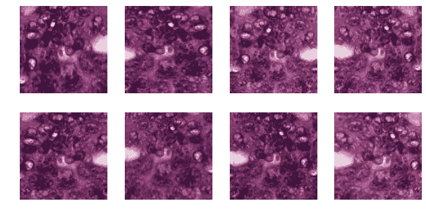

**照明**

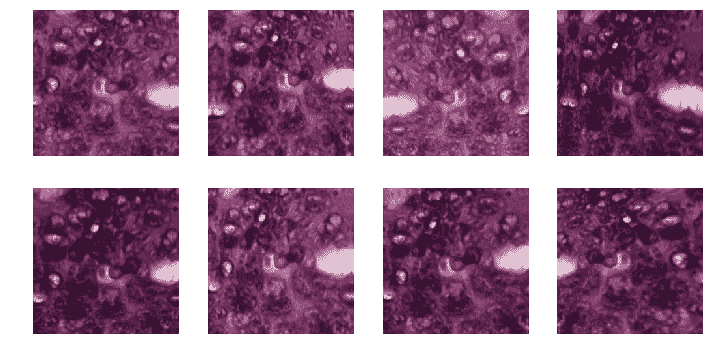

**缩放**

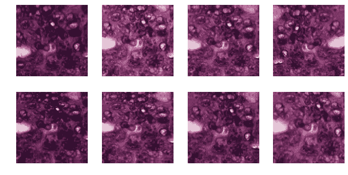

**翘曲**

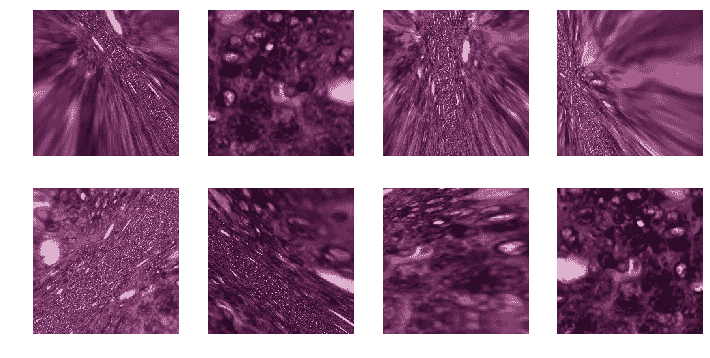

我使用的是一个名为 **ResNet 34** 的预训练模型，所以我们图片的目标尺寸是 224，这是这个模型使用的尺寸。

```
data = ImageDataBunch.from_folder(path=Path('colon2/').resolve(), train='.', valid_pct=0.2, dl_tfms=get_transforms(do_flip=True, max_lighting=0.1, max_rotate=30, max_zoom=1.05, max_warp=0.1), num_workers=0, bs=16, size=224).normalize(imagenet_stats)
```

如果想看几张图，可以使用 **DataBunch.show_batch。**rows 参数是要显示的行数和列数。

```
data.show_batch(rows=3, figsize=(9,9))
```

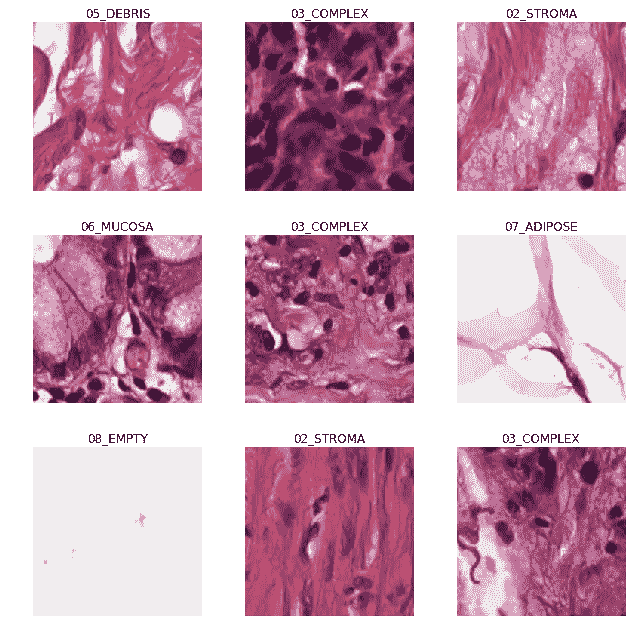

现在，让我们创建我们的学习者对象，为培训过程做准备:

```
learn_34 = cnn_learner(data, models.resnet34, metrics=[accuracy, error_rate])
learn_34.fit_one_cycle(5)
```

如您所见，我正在调用 Resnet34 预训练模型并定义指标，在本例中，我希望显示准确性和 error_rate，以查看模型的运行情况。我将运行 5 个时期并查看结果:

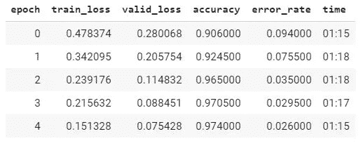

5 epochs got a 97.40% accuracy

让我们来看看预测:

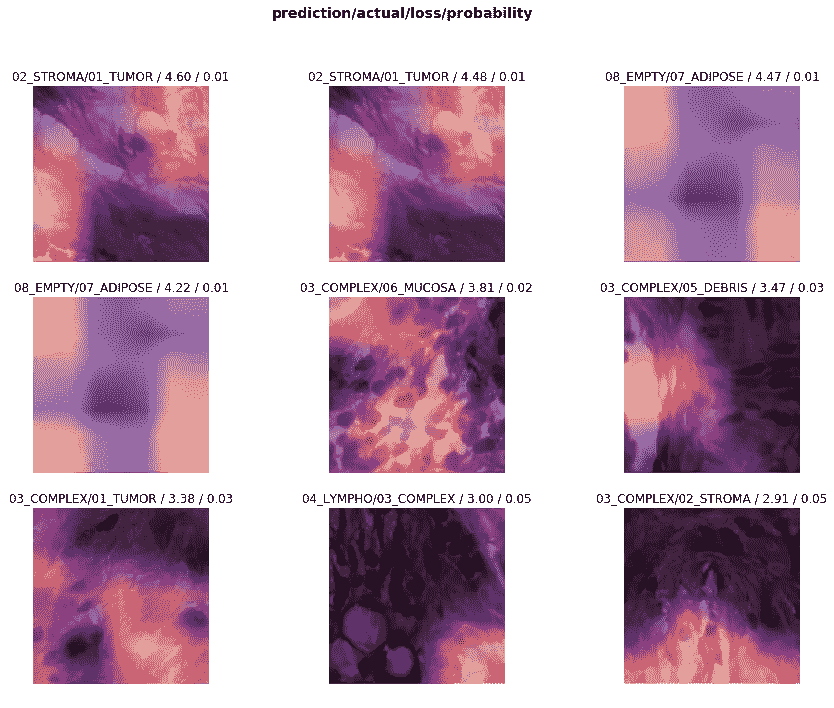

我建议使用混淆矩阵来查看模型正在处理哪些类，并对它们进行错误分类:

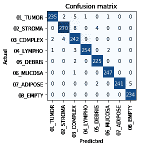

该模型在区分淋巴细胞和复合细胞以及复合细胞和间质细胞方面存在问题。

让我们得到一个更大的预训练模型，从数据集中学习更多的特征。我选了 ResNet152(好吧，我的最爱！！).让我们看看结果:

```
learn_152 = cnn_learner(data, models.resnet152, metrics=[accuracy, error_rate])
learn_152.fit_one_cycle(5)
```

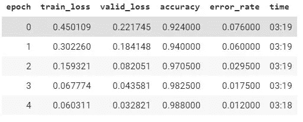

Reached an accuracy of 98.80!

更大的模型提高了精确度和错误率。

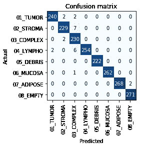

你可以在混淆矩阵中看到，该模型在复合体和间质以及复合体和淋巴之间的分类仍然是错误的。这只是一个微调模型的问题，如改变数据扩充或尝试不同的时代和学习率。98.80%的准确率我感觉不错。

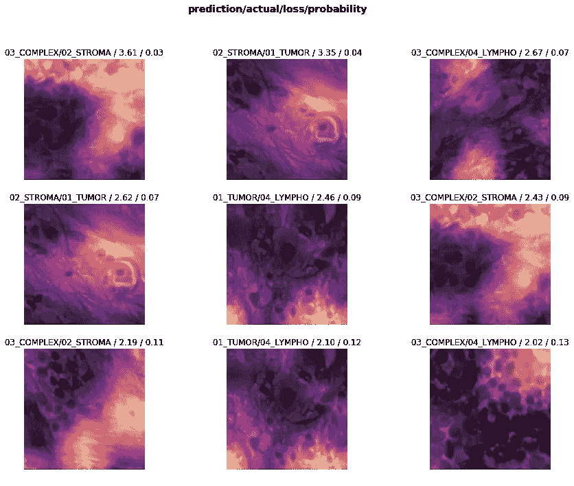

# 结论

*   了解更多关于组织病理学图像所使用的数据增强可能是有用的
*   我敢肯定，我们只是需要时间来获得更准确的模型，以便在早期发现癌症，并获得良好的治疗来消除它。这些模型需要更多的数据。
*   接下来要做的事情是在 Render 中创建一个 web 应用程序，这样人们就可以使用他们自己的图像模型

# 参考

FastAi 文档

[](https://docs.fast.ai/) [## 法斯泰

### fastai 库使用现代最佳实践简化了快速准确神经网络的训练。它基于…

docs.fast.ai](https://docs.fast.ai/) 

**MNIST 结肠直肠组织学**

[](https://www.kaggle.com/johnyquest/colon-histo) [## 结肠组织

### 编辑描述

www.kaggle.com](https://www.kaggle.com/johnyquest/colon-histo) 

**结直肠癌关键统计**

[](https://www.cancer.org/cancer/colon-rectal-cancer/about/key-statistics.html) [## 结肠直肠癌的关键统计数据

### 美国癌症协会对美国结肠直肠癌的最新估计和统计是…

www.cancer.org](https://www.cancer.org/cancer/colon-rectal-cancer/about/key-statistics.html)*