# 我如何训练计算机学习书法风格:第一部分

> 原文：<https://medium.datadriveninvestor.com/deep-learning-models-by-fast-ai-library-c1cccc13e2b3?source=collection_archive---------3----------------------->

## 用 fast.ai 库构建深度学习模型

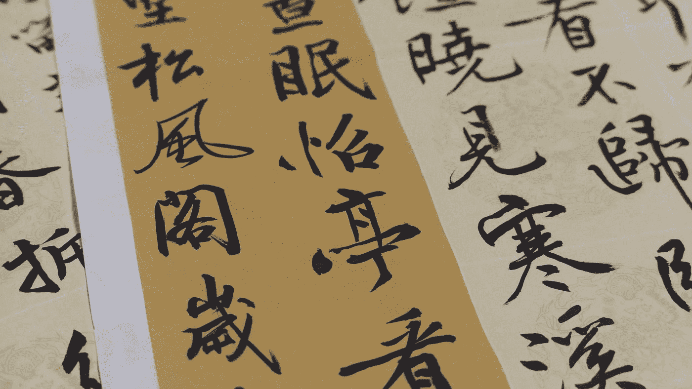

Photo by [Raychan](https://unsplash.com/@wx1993?utm_source=medium&utm_medium=referral) on [Unsplash](https://unsplash.com?utm_source=medium&utm_medium=referral)

我想为我的[程序员实用深度学习](https://course.fast.ai/) fast.ai 课程完成/润色的项目发布一系列帖子。由于我在 ML/DL 领域相当生疏，我希望我所面临和克服的挑战对其他经历相同旅程的人有价值。

型号[1](https://medium.com/@lymenlee/deep-learning-models-by-fast-ai-library-c1cccc13e2b3)[1a](https://medium.com/datadriveninvestor/chinese-calligraphy-classifier-fine-tuning-cbfbf0e304d8)

## **为什么要建立一个中国书法分类器**

像任何书法一样，中国书法也是一种艺术形式。一些古代大师写的一些伟大作品既有很高的艺术价值，也有很高的经济价值(在拍卖会上可以卖到数百万美元)。

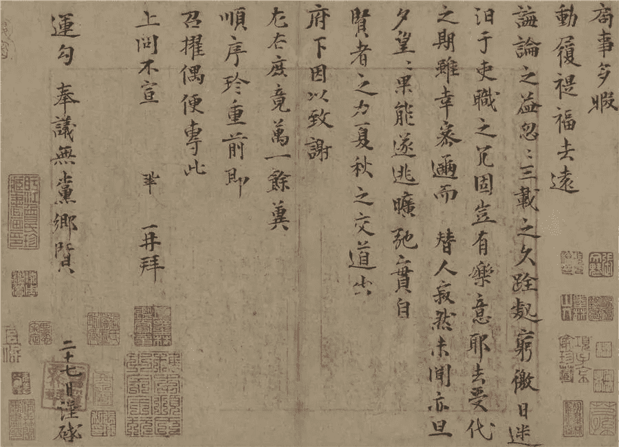

*Jieshi Tie* by Song Dynasty politician and scholar Zeng Gong, $30,000,000

书法有多种主要风格/流派，主要属于不同的朝代。每个人都有自己塑造角色和安排角色的方式。差别是微妙而抽象的。看看一个经过训练的深度学习模型是否能很好地分辨出这是哪种风格是有意义的。

 [## DDI 编辑推荐:5 本让你从新手变成专家的机器学习书籍|数据驱动…

### 机器学习行业的蓬勃发展重新引起了人们对人工智能的兴趣

www.datadriveninvestor.com](https://www.datadriveninvestor.com/2019/03/03/editors-pick-5-machine-learning-books/) 

我选了三种风格:

*   Lishu(隶书)
*   Kaishu(楷书)
*   Xiaozhuan(小篆)

作为概念验证。一旦训练成功，该模型可以作为更细粒度分类器(例如，书法家分类器)的迁移学习基础模型。这有一定的现实价值。不时发现一些古代文物，其中一些是书法艺术品。有时候很难分辨这是谁的作品。它有价值吗(比如一位著名书法家的未被发现的作品)？

> 这个书法家分类器可以作为一种快速识别伟大书法家作品的方法。(发现未经雕琢的钻石*😉*)

## 收集数据

为了构建一个书法分类器，我们需要每种风格的一些书法例子。我在网上搜索了一下，没有找到任何好的现成的不同书法风格的数据集。所以我得自己造。

由于 Google 的图片搜索功能和一些 JavaScript 代码片段，建立一个图片数据集并不困难。方法如下:

1.  Go to [Google Images](https://www.google.com/imghp?hl=en) and search for “`隶书 字帖 网格`” (`lishu, characters book, grid`), this will give you the most relevant results.
2.  向下滚动以显示更多结果，您可以点击底部的`*Show more results*`按钮。如果您想要更多，请单击，但请记住， **700** 图像是这里的最大值。

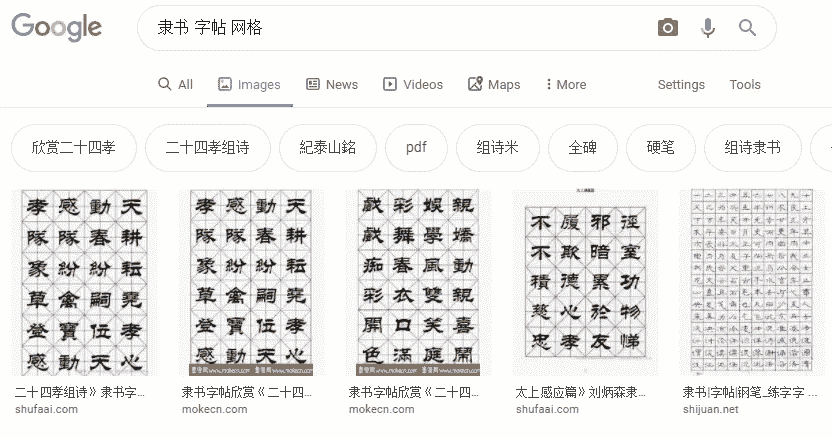

Google search results for Lishu style

3.现在奇迹发生了。在 Windows/Linux 中按`Ctrl+Shift+J`,在 Mac 中按`Cmd+Opt+J`,调出浏览器的 JavaScript“控制台”窗口。下面的 JavaScript 代码片段将获取每张图片的 URL。

4.如果成功运行，将下载一个文本文件，其中包含搜索结果中图像的所有 URL。然后你可以建立一个文件夹，使用 fast.ai 的‘download _ images’功能下载这些图片。

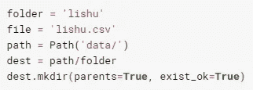

5.冲洗，并重复其他风格。你可能想把它们放在不同的文件夹里，比如`kaishu`、`xiaozhuan` ，然后把它们都放在一个叫做`train` 的文件夹下，这样以后，fast.ai 可以很容易地把它们导入到模型中。

6.或者，你也可以去 Baidu.com 搜索图片，使用这个[片段](https://gist.github.com/wayofnumbers/39842bb909c04070de49e53c418d512f)自动下载你搜索的图片。(代码太长，不能放在这篇文章里，所以我把它链接到这里)。

## 让我们看一下数据

如果您将下载的图像组织成`train/lishu`、`train/kaishu,` `train/xiaozhuan`，那么您可以运行以下代码将它们导入并进行相应的转换，以适应模型。fast.ai 强大的`ImageDataBunch`对象，其中所有数据都进行了相应的组织、拆分和转换，以适应模型。

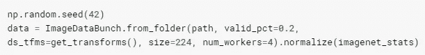

请注意，我们以 80/20 的比例分割训练/验证集，图像大小调整为 224，这对于任何图像识别任务都是一个很好的默认设置。

既然数据已经正确导入，让我们来看看我们的图像:

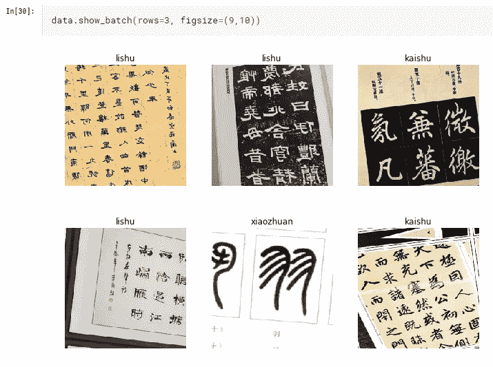

从上面的几个例子中我们可以看出，数据集相当“脏”。这些图像没有被适当地裁剪，有些边注有不同的书法风格，有些图像只有一个或两个字符。但是没关系。让我们快速训练模型，看看它的表现如何，这样我们就可以对我们的数据有所了解。

## 快速肮脏的训练

L et 首先创建一个模型。我们将使用迁移学习并使用`ResNet50`作为我们的模型。将下载预先训练的重量。

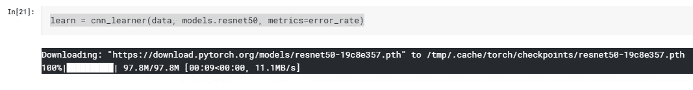

通过 3 次`fit_one_cycle`，我们在验证集上达到了 90%的准确率。还不错！

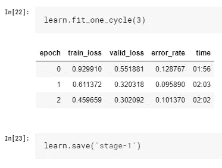

## 解冻和微调我们的培训

S 由于`fit_one_cycle`函数将冻结初始层，仅训练最后几层以加快训练速度(这种方法有效，因为通常对于迁移学习，初始层将捕捉图像的基本特征，这些特征不太可能发生很大变化)，我们有望通过解冻所有层并再次训练来进一步提高我们的准确性。

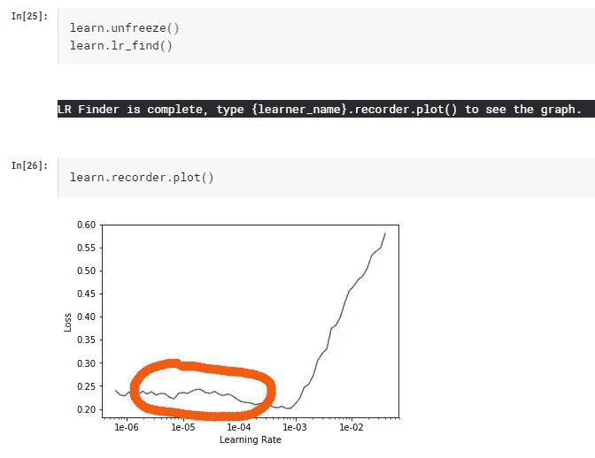

我们用上面的`lr_find`函数找到了一个好的学习率范围。关键是找到学习曲线中最陡的斜率(如上面的橙色圆圈所示)，并将其切片以进行进一步的训练。例如，在上图中，曲线的底部位于 1e-03，那么我们可以在其中的 1/10 处选取一个点，即 1e-04，另一个点位于 1e-06 或 1e-05(这是从一个实验概念“超收敛”中得到的启发，在 [fast.ai 课程](https://course.fast.ai)中有详细描述)。有时你需要做一些实验来找到最佳的学习率组合，但话说回来，fast.ai 总是宣扬迭代和交互的方法。)想法仍然是训练前几层较慢，最后几层较快。

让我们再训练两个纪元:

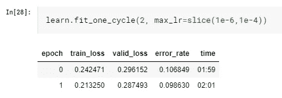

稍好一点，`validation_loss`开始超过`train_loss`，这是过度拟合的迹象。让我们在这儿停下来，把事情结束。

## 结果解释

我们达到了 90%的准确率。虽然不是最先进的，但考虑到我们每类数据集只有大约 700 张图片，这已经相当令人印象深刻了。更多的数据一定会带来更好的结果。让我们看看我们的结果，看看我们是否能找到一些见解。

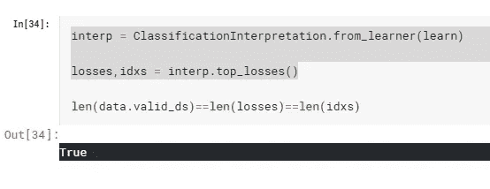

使用 fast.ai 中的`ClassificationIntepretation`对象，我们可以很容易地计算出`top_losses`，看看它们是什么:

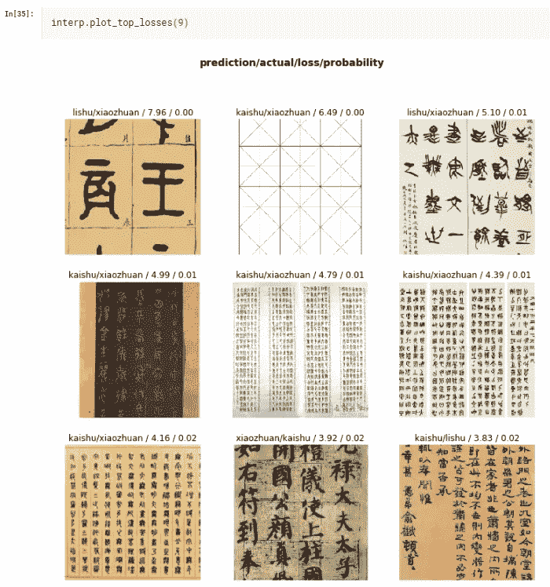

看看混淆矩阵，该模型在识别“小篆”方面做得非常好，这可能是由于其独特的笔画排列。

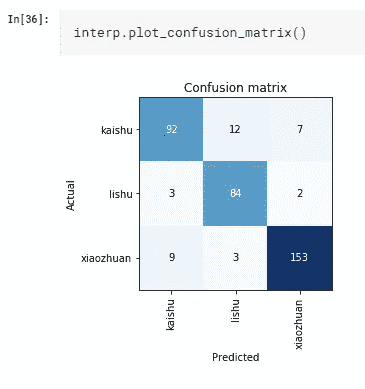

**一些见解:**

> 我们仍然有完全错误的图像，如网格图像(第一行第二个)
> 
> 如果字符太少(第一行，第一列)或太多(第二行，第二列)，模型就会出现问题。
> 
> 一些图像显示了“中间”类型的风格，模型也很难对其进行分类。这是完全正常的，因为即使是人类也很难分辨它属于哪种风格。

## 最后的想法

他的实验项目实际上与 fast.ai 库配合得非常好。[杰瑞米·霍华德](https://medium.com/u/34ab754f8c5e?source=post_page-----c1cccc13e2b3--------------------------------)在课程上说，我在这里引用(不完全是逐字逐句，但我希望我抓住了它的要点。🙏):

> fast.ai 是一个非常固执己见的库。只要我们知道最佳默认值，我们就会为您选择它。无论我们知道什么最佳实践行之有效，我们都会为您做到。

这一点至少在这个项目中得到了证明。只用很少的几行代码和很少的数据收集工作，我们就管理了一个 90%准确的模型。我相信有了更多更好的数据。最先进的结果是可以实现的，我们的书法家分类器的愿景并非遥不可及。

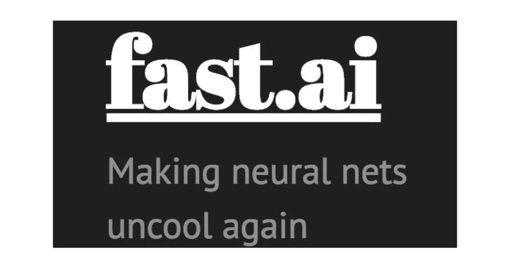

fast.ai’s tagline: Making neural nets uncool again.

最后，请允许我用一位中国诗人的话来诠释上面的口号:

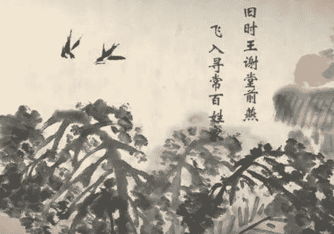

“Where once the swallows knew the mansions of the great, They now to humbler homes would fly to nest and mate.“

欢迎任何反馈或建设性的批评。你可以在 Twitter [@lymenlee](https://twitter.com/lymenlee) 或者我的博客网站[wayofnumbers.com](https://wayofnumbers.com)上找到我。

您可以通过下面的链接了解我是如何微调模型并获得更高精度的:

 [## 我如何训练计算机学习书法风格:第二部分

### 用 fast.ai 库构建深度学习模型

medium.com](https://medium.com/datadriveninvestor/chinese-calligraphy-classifier-fine-tuning-cbfbf0e304d8)