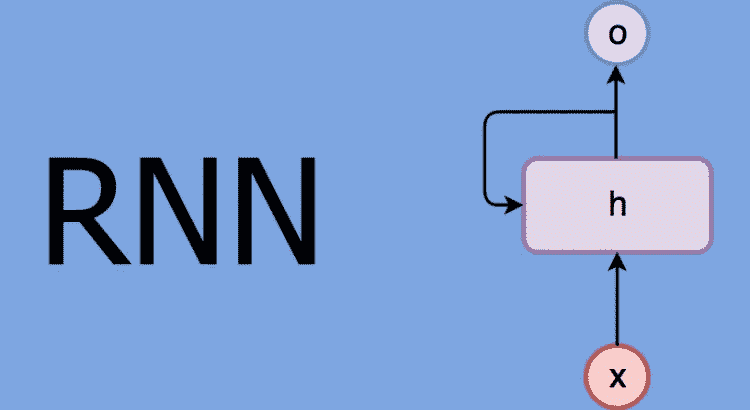
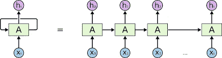

# 深度学习-递归神经网络(第三天)

> 原文：<https://medium.datadriveninvestor.com/deep-learning-recurrent-neural-networks-day-3-938e6d64bac7?source=collection_archive---------6----------------------->

Source -Google

几天前，我和我的朋友去看电影，不知什么原因，他迟到了，猜猜他在电影中间说了些什么，直到最后，他问了些关于男主角、人物和故事的问题，让我很恼火。RNNs 居住在我们的权利！

我们不是每秒钟都从零开始思考。当我们看或读一些东西时，我们基于对以前事件的理解来理解每一个部分/事件。我们不能直接预测或假设任何事情，应该有一个循环来搅动输入(或基本上是以前的输入)以获得某种感觉。这就是发生在我朋友身上的事，因为他错过了电影的一半，他无法理解那里发生了什么。

 [## 2019 年深度学习的终极学习路径及更多...数据驱动的投资者

### 又一个美好的一周，一些好的教育内容将会到来。我最喜欢的&最受欢迎的帖子之一…

www.datadriveninvestor.com](https://www.datadriveninvestor.com/2019/01/07/the-ultimate-learning-path-for-deep-learning-in-2019-more/) 

在传统的神经网络中，我们假设所有的输入(和输出)都是独立的，但是假设你想预测一个句子中的下一个单词，你最好知道在它之前有哪些单词。这就是传统神经网络失败的地方。

# **递归神经网络:**

在基本的神经网络中，模型通过将输入乘以权重来产生输出，然后激活函数应用适当的函数来获得输出。在 RNN 中，该输出被发送回自身多次。rnn 中有循环，允许信息持续存在。看，基本的前馈网络也“记得”事情，但是他们记得他们在训练期间学习的事情。例如，图像分类器在训练中学习“1”的样子，然后使用该知识对生产中的事物进行分类。除了培训期间的学习之外，在生成输出时，记住从之前的输入中学到的东西。正如我们在下图中看到的，RNN 接受输入 X 并提供 h 作为输出，我们看到下面还有一个环路，允许信息从网络的一个步骤传递到下一个步骤。
这些就像普通的神经网络，但是将它们的输出传递给它们的继任者，正如你所看到的，它们有一种链状的结构。

An unrolled recurrent neural network

最常用的是 RNNs LSTMs 和 Vanilla RNNs
这里需要注意的几件事:
你可以把隐藏状态想象成网络的记忆，它捕捉关于在所有之前的时间步骤中发生了什么的信息。每一步的输出都是根据当时的内存单独计算的。传统的深度神经网络在每一层使用不同的参数，而 RNN 共享相同的参数，这大大减少了我们需要使用的参数总数。

rnn 特别用于自然语言处理，如文本分类、语音识别、图像字幕等。

> **反向传播和消失梯度问题**
> 
> 我们不会深入数学和方程，而只是简单地学习反向传播背后的概念。简而言之，我们知道对于传统的前馈神经网络，应用于特定层的权重更新是学习速率、来自前一层的误差项和该层的输入的倍数。因此，特定层的误差项是所有先前层的误差的产物。当处理像 sigmoid 函数这样的激活函数时，当我们向起始层移动时，其导数的小值(出现在误差函数中)会成倍增加。因此，当我们向起始层移动时，梯度几乎消失，并且训练这些层变得困难。
> 
> 权重更新的一般规则是[德尔塔规则](http://www.cs.stir.ac.uk/courses/ITNP4B/lectures/kms/3-DeltaRule.pdf):
> 
> *新权重=旧权重—导数率*学习率*
> 
> 反向传播导致**消失梯度问题，**一些激活函数—

## **1。乙状结肠激活功能:**

Sigmoid function and its derivative

sigmoid 函数只是将线性值转换为值 b/w 0 和 1。上面的蓝线是 sigmoid 函数。我们知道，神经网络对输出进行求导，并每次更新权重(橙色线是导数)。sigmoid 函数的导数非常低(最大值为 0.2)。假设我们有 5 个导数值为 0.2 的层，然后通过反向传播，该值将被一次又一次地馈送到神经网络，最终我们将得到 0.2 ^ 5 的乘积，这太小了，实际上我们有许多深层，梯度将以 0 结束，因为它们不断乘以非常小的值，因此无法再学习，因为它们的权重为 0，神经网络将会死亡！而这就是我们所说的***消失渐变问题*。**更多可以参考**[https://adventuresinmachinehlearning . com/vanishing-gradient-problem-tensor flow/](https://adventuresinmachinelearning.com/vanishing-gradient-problem-tensorflow/)**

## **2.整流线性单位**

**我们需要一个不同的激活函数，让我们将激活函数改为 ReLU(校正线性单位)。只要大于零，它就返回参数 *x* ，否则返回 0。ReLU 的一阶导数也很简单，当 *x* 为正(大于零)时等于 1，否则等于 0。**

> **ReLU 激活函数看起来像，**
> 
> **f(x)=max(0，x)**

****

**ReLU and its derivative**

**它只有一个问题，我们知道当 x>0 时导数为 1 否则为 0 所以当 x < 0 the derivative becomes 0 and certain weights get killed. Thus whenever there is a negative input, the backpropagated error is canceled out and therefore the gradient will also fall to zero and again we end up with the ***消失时的梯度问题。*****

## ****3。泄漏 ReLU:****

**对 ReLU 做了一个小的改变，当 x>0 时，我们得到 1，如果引入 x <0 instead of 0 we get a value that is close to 0 but not actually 0 i.e 0.01.**

> **The Leaky ReLU activation looks like:**
> 
> **f(x)=max(0.01x,x)**

****

**Source Google**

**Leaky ReLU was good but it doesn’t solve the problem. we are continuously multiplying with a small number and gradually in this case also we will wind up with a gradient with value 0.**

# **What is the solution?**

*****LSTM 或长/短时记忆*** 来解决消失梯度的问题。我会尽可能简单地解释，所以下面是一个 LSTM 的示意图。(图片来源:[http://colah.github.io/posts/2015-08-Understanding-LSTMs/?source=post_page](http://colah.github.io/posts/2015-08-Understanding-LSTMs/?source=post_page)**

****

**Repeating module in an LSTM**

**在一个 LSTM 单元中有 4 个门控制存储和输出。在每一层中，我们连接当前输入和先前的隐藏状态，并将其传递给一个线性层。**

> ***h:先前的隐藏状态***
> 
> ***xt:电流输入***
> 
> ***ct1:先前的记忆***
> 
> ***Ct:新存储器***
> 
> **金融时报:忘记栅极层**
> 
> **it:输入栅极层**

## ****忘记大门:****

****

**这个门控制着我们想要保留多少旧的记忆 Ct-1。它使用 Sigmoid 作为激活函数，并通过连接当前输入和先前的隐藏状态来构建。在线性层中运行后，我们将输出应用于 Sigmoid 函数，该函数输出 0 到 1 之间的值。**

**0:忘记所有以前的记忆**

**1:保留所有以前的记忆**

**0.5:保留一些以前的记忆**

## **输入门:**

****

**这个门控制着我们想要添加到我们将要构建的新内存 Ct 中的量。它还使用 Sigmoid 作为激活函数，输出 0 到 1 之间的值。**

**0:不要从您将收到的内容中添加任何内容。**

**1:添加你将收到的所有内容。**

**0.5:只添加你将收到的一部分。**

## **tanh 门:**

****

**基本上，它负责创建一个新的内存并通过 tanh 函数传递它。这是基于 ***输入门构建的新存储器。*****

## **新记忆的构建:**

**新记忆的构建依赖于这三个门。**

**从旧记忆中保留多少+我们想从新记忆中得到多少**

****

## **输出层:**

****

**现在需要构造输出，为此我们有了 ***输出门层。*** 这一层控制着我们需要输出多少。*T5 取先前隐藏的图层和当前输入。我们用新的内存运行 tanh 激活，并与输出门层相乘。***

**这都是关于 RNNs 的，有很多网站和视频对 RNNs 和 LSTMs 做了很好的简要解释，**

 **[## 了解 LSTM 网络

### 2015 年 8 月 27 日发布人类不是每秒钟都从零开始思考。当你读这篇文章时，你…

colah.github.io](http://colah.github.io/posts/2015-08-Understanding-LSTMs/?source=post_page)** 

**[https://www . analyticsvidhya . com/blog/2017/12/fundamentals-of-deep-learning-introduction-to-lstm/](https://www.analyticsvidhya.com/blog/2017/12/fundamentals-of-deep-learning-introduction-to-lstm/)**

**一定要检查一下，在那之前**

**编码快乐！**