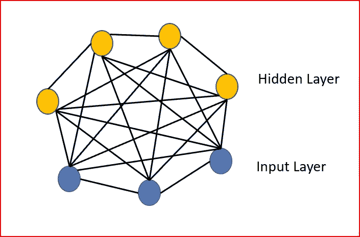
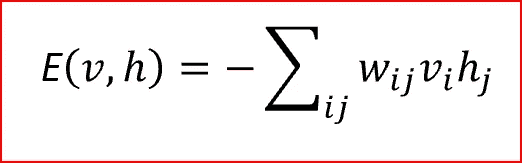
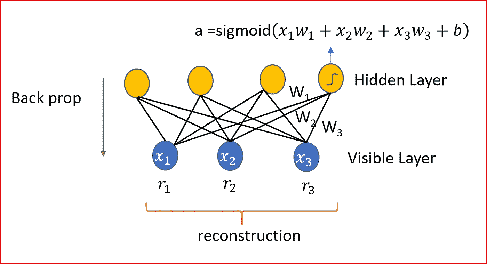
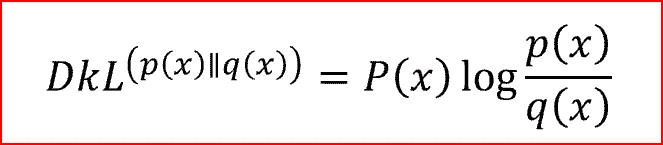
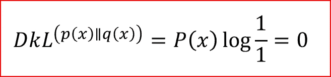
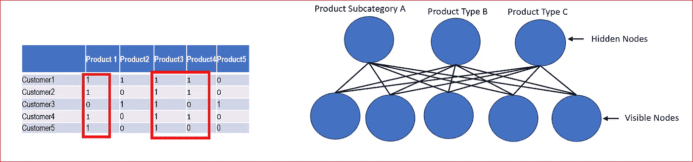
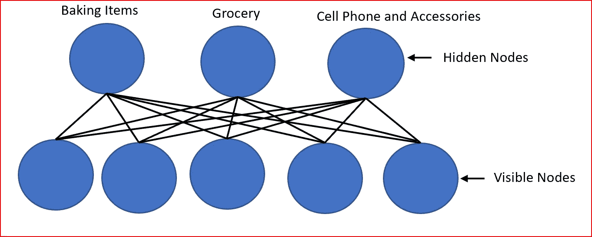

# 深度学习——受限玻尔兹曼机器

> 原文：<https://medium.datadriveninvestor.com/deep-learning-restricted-boltzmann-machine-b76241af7a92?source=collection_archive---------0----------------------->

*在本帖中，我们将讨论玻尔兹曼机，受限玻尔兹曼机(RBM)。需要 RBM，RBM 建筑，使用 RBM 和吉隆坡的分歧。我们将通过一个例子*用 RBM 来解释推荐系统是如何工作的

## 什么是玻尔兹曼机？

*   玻尔兹曼机器是一个由对称连接的节点组成的 T2 网络
*   **节点随机决定开启或关闭。**
*   **玻尔兹曼机器是一种无监督的机器学习算法。它**有助于发现数据集中存在的潜在特征。数据集由二元向量组成。
*   节点之间的连接是无向的。玻尔兹曼机器中的每个节点都与其他节点相连。
*   我们**有输入层和隐藏层，但没有输出层**。这是因为**每个节点都被视为相同。所有节点都是系统的一部分。每个节点生成系统的状态，因此它是一个生成模型**。
*   我们把数据输入波尔兹曼机器。该模型帮助学习节点之间的不同连接和参数的权重。
*   玻尔兹曼机是一种**基于能量的模型**
*   玻尔兹曼机器可以比作温室。在温室中，我们需要监测湿度、温度、气流、光照等不同的参数
*   像玻尔兹曼机器一样，温室也是一个系统。对于温室，我们学习湿度、温度、光线和气流之间的关系。了解湿度、气流、土壤条件等不同参数之间的关系，有助于我们了解对温室产量的影响。

Boltzmann machine

## 为什么限制玻尔兹曼机？

在玻尔兹曼机器中，每个节点都与其他节点相连..所有节点之间的连接都是无向的。波尔兹曼机器还没有被证明对实际的机器学习问题有用。

通过设置某些限制，玻尔兹曼机器可以变得有效。像在可见层和隐藏层中没有层内连接这样的限制。

## 什么是受限玻尔兹曼机？

*   RBM 是属于基于能量模型的神经网络
*   它是概率性的、无监督的、生成式深度机器学习算法。
*   RBM 的目标是找到最大化对数似然函数的联合概率分布。
*   RBM 是无向的，只有两层，输入层和隐藏层
*   所有可见节点都连接到所有隐藏节点。RBM 它有两层，可见层或输入层和隐藏层，所以它也被称为**对称二部图。**
*   可见节点之间不存在层内连接。隐藏节点之间也没有层内连接。只有输入节点和隐藏节点之间有连接。
*   最初的玻尔兹曼机器在所有节点之间都有连接。由于 RBM 限制了层内连接，它被称为受限玻尔兹曼机
*   像玻尔兹曼机器一样，RBM 节点也进行**随机决策来决定开启或关闭**
*   RBM 是基于能量的模型，具有类似玻尔兹曼机器的联合概率

Energy function for Restricted Boltzmann Machine. V is vector for visible or input node, h is vector for hidden node and W is the weights between the input and hidden nodes

## 受限玻尔兹曼机的体系结构

我们将输入数据从每个可见节点传递到隐藏层。

我们将输入数据乘以分配给隐藏层的权重，添加偏置项，并应用类似 sigmoid 或 softmax [激活函数](https://medium.com/datadriveninvestor/neural-networks-activation-functions-e371202b56ff)的激活函数。

正向传播给出了给定权重 w 的输出概率，这给出了权重 w 的 P(a|x)。

在反向传播过程中，我们重建输入。在重建期间，给定激活 a，RBM 估计输入 x 的概率，这给我们权重 w 的 P(x|a)

我们可以导出输入 x 和激活 a 的联合概率 P(x，a)

重构是关于原始输入的概率分布。

我们使用 KL 散度比较输入和重建之间的差异。

## Kullback Leibler 散度

*   KL 散度测量相同数据的两个概率分布之间的差异 *x* 。
*   它是两个概率 *p(x)* 和 *q(x)之间的非对称度量。*当我们用一个分布 *q(x)* 来近似一个分布 *p(x)* 时，它是一种信息损失的度量
*   KL 散度衡量两个分布之间的距离。它不是距离度量，因为 KL 散度不是度量度量，并且不满足三角形不等式

KL 散度可以使用下面的公式计算

这里我们有两个数据 *x* 的概率分布 *p(x)* 和 *q(x)* 。 *p(x)* 和 *q(x)* 加起来都是 1，p(x) > 0 和 q(x) > 0。

*p(x)* 是数据的真实分布，而 *q(x)* 是基于我们的模型的分布，在我们的例子中是 RBM。

如果模型分布与真实分布相同， *p(x)=q(x)* 那么 KL 散度=0

## RBM 的用法

RBM 是用来

*   降维
*   推荐系统中的协同过滤
*   特征学习
*   主题建模
*   有助于提高监督学习的效率

***让我们直观地下 RBM 是如何使用的。***

## 什么是对比分歧？

步骤 1:将输入向量带到可见节点

步骤 2:并行更新所有隐藏节点的权重。给定另一层中单元的当前状态，并行更新一层中的所有单元。

步骤 3:用用于隐藏节点的相同权重重构输入向量。即使我们使用相同的权重，重构的输入也会不同，因为多个隐藏节点贡献了重构的输入。

步骤 4:将输入与基于 KL 散度的重构输入进行比较。

步骤 5:再次重建输入向量，并对所有输入数据和多个时期重复。如此反复，直到系统达到平衡分布。这也被称为吉布斯采样

## 如何利用 RBM 推荐产品？

在我们的例子中，我们有 5 个产品和 5 个客户。在现实生活中，我们会有大量的产品和数以百万计的客户购买这些产品。值 1 表示产品是由客户购买的。值为 0 表示客户没有购买该产品。

我们知道 RBM 是生成模型，生成不同的状态。在此过程中，它会识别输入数据集的隐藏要素。

以红色突出显示的数据表明产品 1、产品 3 和产品 4 之间存在某种关系。不同的顾客一起购买了这些产品。

RBM 分配一个节点来处理解释产品 1、产品 3 和产品 4 之间关系的特征。

基于输入数据集，RBM 为输入数据确定了三个重要特征。

RBM 根据顾客购买的产品来识别潜在的特征。顾客基于某种用途购买产品。

为了便于我们理解，我们将这三个特性命名如下。

一旦模型被训练，我们已经确定了输入节点和隐藏节点之间的连接的权重。

我们拿一个客户数据，看看推荐系统会怎么做推荐。

我们的顾客正在购买小苏打。基于在训练中学习到的特征，我们看到烘焙和杂货的隐藏节点将具有更高的权重，并且它们被点亮。用于手机和配件的隐藏节点将具有较低的重量，并且不会被点亮。

在反向传播过程中，RBM 将尝试重建输入。在推荐过程中，权重不再调整。在推荐产品时使用从训练中得出的权重。

对于我们的测试客户，我们从我们的数据中看到最好的推荐商品是糖。糖点亮了烘焙项目隐藏节点和杂货隐藏节点。

希望这个基本的例子有助于理解 RBM 以及 RBM 是如何用于推荐系统的

## 参考

[https://www . cs . Toronto . edu/~ hint on/CSC 321/readings/boltz 321 . pdf](https://www.cs.toronto.edu/~hinton/csc321/readings/boltz321.pdf)

https://www.cs.toronto.edu/~rsalakhu/papers/rbmcf.pdf

# 也发表在 [mc.ai](http://mc.ai/deep-learning%e2%80%8a-%e2%80%8arestricted-boltzmann-machine/)

# 如果你喜欢这篇文章，请分享并鼓掌！