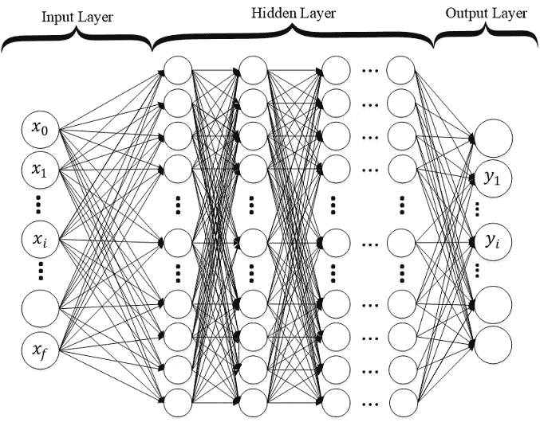
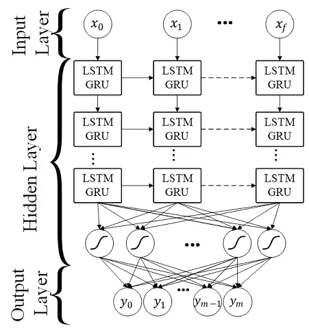
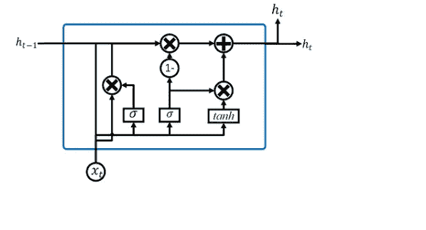
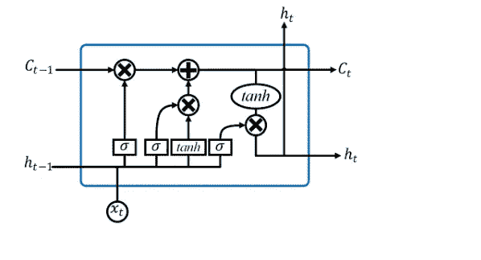
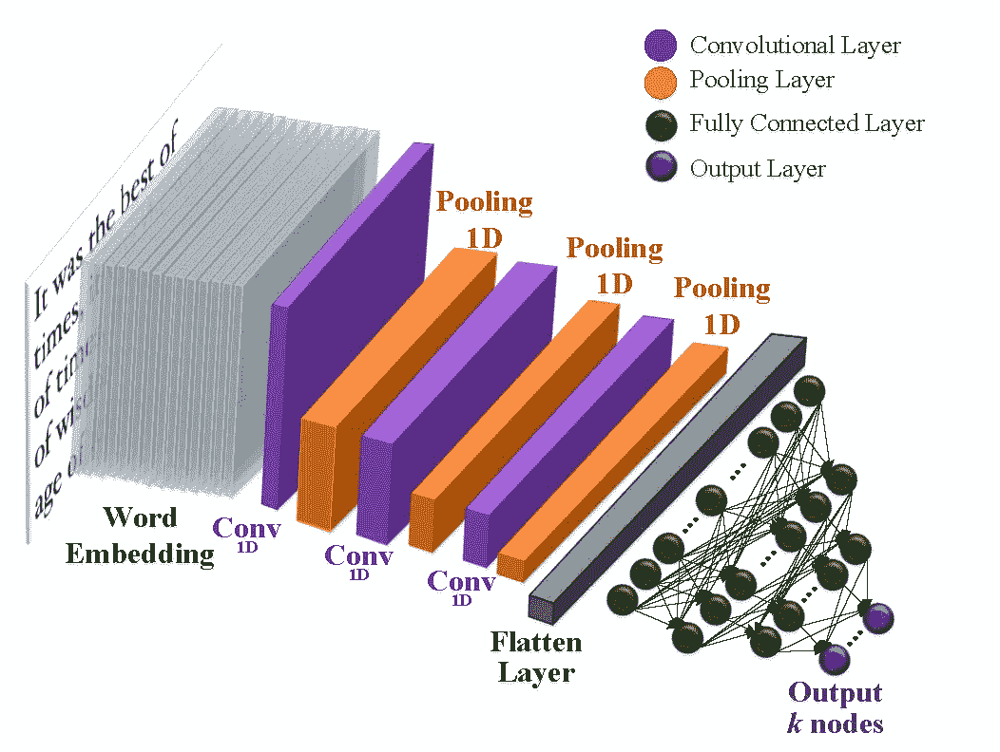
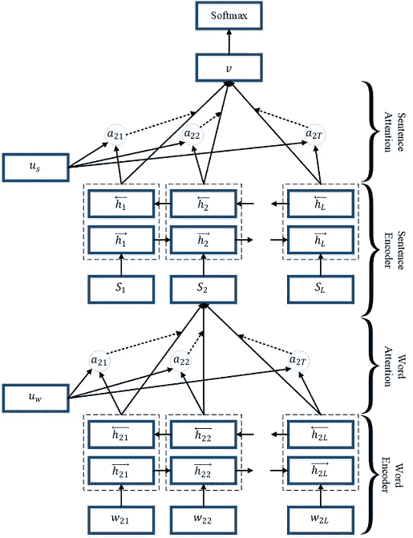
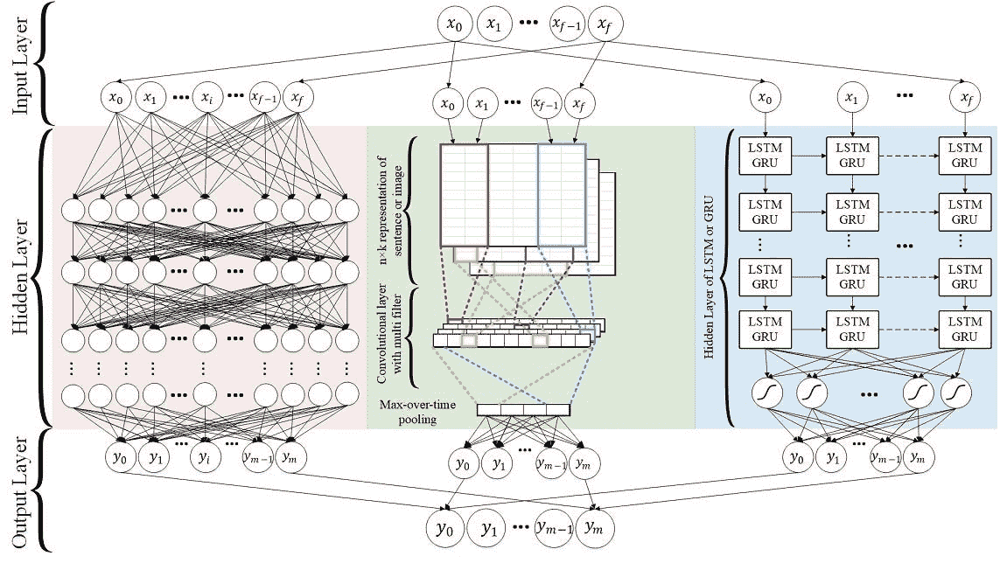
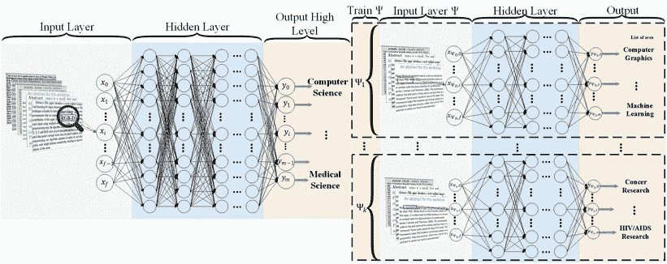

# 文本分类的深度学习技术

> 原文：<https://medium.datadriveninvestor.com/deep-learning-techniques-for-text-classification-9392ca9492c7?source=collection_archive---------0----------------------->

每年复杂数据集数量的指数级增长需要机器学习方法的更多改进，以提供稳健和准确的数据分类。最近，与以前的机器学习算法相比，深度学习方法在图像分类、自然语言处理、人脸识别等任务上取得了更好的结果。这些深度学习算法的成功依赖于它们对数据中复杂和非线性关系进行建模的能力。

然而，为这些模型找到合适的结构对研究人员来说是一个挑战，这是利用杠杆解决的。转移学习技术，我们不再从头开始训练一个模型，而是重新使用一个预先训练好的模型，然后针对另一个相关任务对其进行微调，这导致了许多 NLP 任务的最新结果的巨大飞跃，通过各种方法，如 [ULMFiT](http://nlp.fast.ai/classification/2018/05/15/introducting-ulmfit.html) 、 [OpenAI Transformer、](https://blog.openai.com/language-unsupervised/) [ELMo](https://allennlp.org/elmo) 和谷歌人工智能的 [BERT](https://arxiv.org/pdf/1810.04805.pdf) 。

[](https://www.datadriveninvestor.com/2019/01/07/the-ultimate-learning-path-for-deep-learning-in-2019-more/) [## 2019 年深度学习的终极学习路径及更多...数据驱动的投资者

### 又一个美好的一周，一些好的教育内容将会到来。我最喜欢的&最受欢迎的帖子之一…

www.datadriveninvestor.com](https://www.datadriveninvestor.com/2019/01/07/the-ultimate-learning-path-for-deep-learning-in-2019-more/) 

# 这篇文章的主题包括:

*   深度神经网络
*   递归神经网络(RNN)
*   门控循环单元(GRU)
*   长短期记忆(LSTM)
*   卷积神经网络(CNN)
*   分层注意网络
*   递归卷积神经网络
*   随机多模型深度学习
*   文本分层深度学习(HDLTex)

**深度神经网络**

深度神经网络架构被设计为通过层的多个连接进行学习，其中每一层仅接收来自前一层的连接，并且仅提供到隐藏部分中的下一层的连接。输入层正在嵌入矢量，如下图所示。对于多类分类，输出层神经元等于类的数量，而对于二类分类，输出层神经元只有一个。这里，我们有多类 DNNs，其中每层中的节点数以及层数是随机分配的。深度神经网络(DNN)的实现基本上是使用标准反向传播算法和 sigmoid 或 ReLU 作为激活函数的区别训练模型。多类分类的输出图层应使用 Softmax。



导入包:

```
from sklearn.datasets import fetch_20newsgroups
from keras.layers import  Dropout, Dense
from keras.models import Sequential
from sklearn.feature_extraction.text import TfidfVectorizer
import numpy as np
from sklearn import metrics
```

将文本转换为 TF-IDF:

```
def TFIDF(X_train, X_test,MAX_NB_WORDS=75000):
    vectorizer_x = TfidfVectorizer(max_features=MAX_NB_WORDS)
    X_train = vectorizer_x.fit_transform(X_train).toarray()
    X_test = vectorizer_x.transform(X_test).toarray()
    print("tf-idf with",str(np.array(X_train).shape[1]),"features")
    return (X_train,X_test)
```

为文本建立一个 DNN 模型:

```
def Build_Model_DNN_Text(shape, nClasses, dropout=0.5):
    """
    buildModel_DNN_Tex(shape, nClasses,dropout)
    Build Deep neural networks Model for text classification
    Shape is input feature space
    nClasses is number of classes
    """
    model = Sequential()
    node = 512 # number of nodes
    nLayers = 4 # number of  hidden layer model.add(Dense(node,input_dim=shape,activation='relu'))
    model.add(Dropout(dropout))
    for i in range(0,nLayers):
        model.add(Dense(node,input_dim=node,activation='relu'))
        model.add(Dropout(dropout))
    model.add(Dense(nClasses, activation='softmax')) model.compile(loss='sparse_categorical_crossentropy',
                  optimizer='adam',
                  metrics=['accuracy']) return model
```

加载文本数据集(20 个新闻组):

```
newsgroups_train = fetch_20newsgroups(subset='train')
newsgroups_test = fetch_20newsgroups(subset='test')
X_train = newsgroups_train.data
X_test = newsgroups_test.data
y_train = newsgroups_train.target
y_test = newsgroups_test.target
```

运行 DNN 并查看结果:

```
X_train_tfidf,X_test_tfidf = TFIDF(X_train,X_test)
model_DNN = Build_Model_DNN_Text(X_train_tfidf.shape[1], 20)
model_DNN.fit(X_train_tfidf, y_train,
                              validation_data=(X_test_tfidf, y_test),
                              epochs=10,
                              batch_size=128,
                              verbose=2)predicted = model_DNN.predict(X_test_tfidf)print(metrics.classification_report(y_test, predicted))
```

模型摘要:

```
_________________________________________________________________
Layer (type)                 Output Shape              Param #
=================================================================
dense_1 (Dense)              (None, 512)               38400512
_________________________________________________________________
dropout_1 (Dropout)          (None, 512)               0
_________________________________________________________________
dense_2 (Dense)              (None, 512)               262656
_________________________________________________________________
dropout_2 (Dropout)          (None, 512)               0
_________________________________________________________________
dense_3 (Dense)              (None, 512)               262656
_________________________________________________________________
dropout_3 (Dropout)          (None, 512)               0
_________________________________________________________________
dense_4 (Dense)              (None, 512)               262656
_________________________________________________________________
dropout_4 (Dropout)          (None, 512)               0
_________________________________________________________________
dense_5 (Dense)              (None, 512)               262656
_________________________________________________________________
dropout_5 (Dropout)          (None, 512)               0
_________________________________________________________________
dense_6 (Dense)              (None, 20)                10260
=================================================================
Total params: 39,461,396
Trainable params: 39,461,396
Non-trainable params: 0
_________________________________________________________________
```

输出:

```
Train on 11314 samples, validate on 7532 samples
Epoch 1/10
 - 16s - loss: 2.7553 - acc: 0.1090 - val_loss: 1.9330 - val_acc: 0.3184
Epoch 2/10
 - 15s - loss: 1.5330 - acc: 0.4222 - val_loss: 1.1546 - val_acc: 0.6204
Epoch 3/10
 - 15s - loss: 0.7438 - acc: 0.7257 - val_loss: 0.8405 - val_acc: 0.7499
Epoch 4/10
 - 15s - loss: 0.2967 - acc: 0.9020 - val_loss: 0.9214 - val_acc: 0.7767
Epoch 5/10
 - 15s - loss: 0.1557 - acc: 0.9543 - val_loss: 0.8965 - val_acc: 0.7917
Epoch 6/10
 - 15s - loss: 0.1015 - acc: 0.9705 - val_loss: 0.9427 - val_acc: 0.7949
Epoch 7/10
 - 15s - loss: 0.0595 - acc: 0.9835 - val_loss: 0.9893 - val_acc: 0.7995
Epoch 8/10
 - 15s - loss: 0.0495 - acc: 0.9866 - val_loss: 0.9512 - val_acc: 0.8079
Epoch 9/10
 - 15s - loss: 0.0437 - acc: 0.9867 - val_loss: 0.9690 - val_acc: 0.8117
Epoch 10/10
 - 15s - loss: 0.0443 - acc: 0.9880 - val_loss: 1.0004 - val_acc: 0.8070
 precision    recall  f1-score   support 0       0.76      0.78      0.77       319
          1       0.67      0.80      0.73       389
          2       0.82      0.63      0.71       394
          3       0.76      0.69      0.72       392
          4       0.65      0.86      0.74       385
          5       0.84      0.75      0.79       395
          6       0.82      0.87      0.84       390
          7       0.86      0.90      0.88       396
          8       0.95      0.91      0.93       398
          9       0.91      0.92      0.92       397
         10       0.98      0.92      0.95       399
         11       0.96      0.85      0.90       396
         12       0.71      0.69      0.70       393
         13       0.95      0.70      0.81       396
         14       0.86      0.91      0.88       394
         15       0.85      0.90      0.87       398
         16       0.79      0.84      0.81       364
         17       0.99      0.77      0.87       376
         18       0.58      0.75      0.65       310
         19       0.52      0.60      0.55       251avg / total       0.82      0.81      0.81      7532
```

**递归神经网络(RNN)**

递归神经网络(RNN)是另一种神经网络体系结构，由研究人员用于文本挖掘和分类。RNN 给序列中前面的数据点分配更多的权重。因此，这种技术对于文本、字符串和顺序数据分类是一种强有力的方法。在 RNN，神经网络以一种非常复杂的方法考虑以前节点的信息，这种方法允许对数据集中的结构进行更好的语义分析。



**门控循环单元(GRU)**

门控递归单元(GRU)是由 [J. Chung et al.](https://arxiv.org/abs/1412.3555) 和 [K.Cho et al.](https://arxiv.org/abs/1406.1078) 提出的 RNN 门控机制。GRU 是 LSTM 架构的简化变体，但有如下区别:GRU 包含两个门，不拥有任何内存(如图；最后，不应用第二非线性(图中的 tanh)。



**长短期记忆(LSTM)**

长短期记忆~(LSTM)由 S. Hochreiter 和 J. Schmidhuber 提出，并由许多科学家发展。

为了处理这些问题，长短期记忆(LSTM)是一种特殊类型的 RNN，与基本的 RNNs 相比，它以更有效的方式保持长期依赖性。这对于克服消失梯度问题特别有用，因为 LSTM 使用多个门来仔细调节将被允许进入每个节点状态的信息量。该图显示了 LSTM 模型的基本单元。



导入包:

```
from keras.layers import Dropout, Dense, GRU, Embedding
from keras.models import Sequential
from sklearn.feature_extraction.text import TfidfVectorizer
import numpy as np
from sklearn import metrics
from keras.preprocessing.text import Tokenizer
from keras.preprocessing.sequence import pad_sequences
from sklearn.datasets import fetch_20newsgroups
```

将文本转换为文字嵌入(使用手套):

```
def loadData_Tokenizer(X_train, X_test,MAX_NB_WORDS=75000,MAX_SEQUENCE_LENGTH=500):
    np.random.seed(7)
    text = np.concatenate((X_train, X_test), axis=0)
    text = np.array(text)
    tokenizer = Tokenizer(num_words=MAX_NB_WORDS)
    tokenizer.fit_on_texts(text)
    sequences = tokenizer.texts_to_sequences(text)
    word_index = tokenizer.word_index
    text = pad_sequences(sequences, maxlen=MAX_SEQUENCE_LENGTH)
    print('Found %s unique tokens.' % len(word_index))
    indices = np.arange(text.shape[0])
    # np.random.shuffle(indices)
    text = text[indices]
    print(text.shape)
    X_train = text[0:len(X_train), ]
    X_test = text[len(X_train):, ]
    embeddings_index = {}
    f = open("C:\\Users\\swayam\\Documents\\Glove\\glove.6B.50d.txt", encoding="utf8")
    for line in f: values = line.split()
        word = values[0]
        try:
            coefs = np.asarray(values[1:], dtype='float32')
        except:
            pass
        embeddings_index[word] = coefs
    f.close()
    print('Total %s word vectors.' % len(embeddings_index))
    return (X_train, X_test, word_index,embeddings_index)
```

为文本建立一个 RNN 模型:

```
def Build_Model_RNN_Text(word_index, embeddings_index, nclasses,  MAX_SEQUENCE_LENGTH=500, EMBEDDING_DIM=50, dropout=0.5):
    """
    def buildModel_RNN(word_index, embeddings_index, nclasses,  MAX_SEQUENCE_LENGTH=500, EMBEDDING_DIM=50, dropout=0.5):
    word_index in word index ,
    embeddings_index is embeddings index, look at data_helper.py
    nClasses is number of classes,
    MAX_SEQUENCE_LENGTH is maximum lenght of text sequences
    """ model = Sequential()
    hidden_layer = 3
    gru_node = 32 embedding_matrix = np.random.random((len(word_index) + 1, EMBEDDING_DIM))
    for word, i in word_index.items():
        embedding_vector = embeddings_index.get(word)
        if embedding_vector is not None:
            # words not found in embedding index will be all-zeros.
            if len(embedding_matrix[i]) != len(embedding_vector):
                print("could not broadcast input array from shape", str(len(embedding_matrix[i])),
                      "into shape", str(len(embedding_vector)), " Please make sure your"
                                                                " EMBEDDING_DIM is equal to embedding_vector file ,GloVe,")
                exit(1)
            embedding_matrix[i] = embedding_vector
    model.add(Embedding(len(word_index) + 1,
                                EMBEDDING_DIM,
                                weights=[embedding_matrix],
                                input_length=MAX_SEQUENCE_LENGTH,
                                trainable=True)) print(gru_node)
    for i in range(0,hidden_layer):
        model.add(GRU(gru_node,return_sequences=True, recurrent_dropout=0.2))
        model.add(Dropout(dropout))
    model.add(GRU(gru_node, recurrent_dropout=0.2))
    model.add(Dropout(dropout))
    model.add(Dense(256, activation='relu'))
    model.add(Dense(nclasses, activation='softmax')) model.compile(loss='sparse_categorical_crossentropy',
                      optimizer='adam',
                      metrics=['accuracy'])
    return model
```

运行 RNN 并查看结果:

```
newsgroups_train = fetch_20newsgroups(subset='train')
newsgroups_test = fetch_20newsgroups(subset='test')
X_train = newsgroups_train.data
X_test = newsgroups_test.data
y_train = newsgroups_train.target
y_test = newsgroups_test.targetX_train_Glove,X_test_Glove, word_index,embeddings_index = loadData_Tokenizer(X_train,X_test) model_RNN = Build_Model_RNN_Text(word_index,embeddings_index, 20)model_RNN.fit(X_train_Glove, y_train,
                              validation_data=(X_test_Glove, y_test),
                              epochs=10,
                              batch_size=128,
                              verbose=2)predicted = Build_Model_RNN_Text.predict_classes(X_test_Glove)print(metrics.classification_report(y_test, predicted))
```

模型摘要:

```
_________________________________________________________________
Layer (type)                 Output Shape              Param #
=================================================================
embedding_1 (Embedding)      (None, 500, 50)           8960500
_________________________________________________________________
gru_1 (GRU)                  (None, 500, 256)          235776
_________________________________________________________________
dropout_1 (Dropout)          (None, 500, 256)          0
_________________________________________________________________
gru_2 (GRU)                  (None, 500, 256)          393984
_________________________________________________________________
dropout_2 (Dropout)          (None, 500, 256)          0
_________________________________________________________________
gru_3 (GRU)                  (None, 500, 256)          393984
_________________________________________________________________
dropout_3 (Dropout)          (None, 500, 256)          0
_________________________________________________________________
gru_4 (GRU)                  (None, 256)               393984
_________________________________________________________________
dense_1 (Dense)              (None, 20)                5140
=================================================================
Total params: 10,383,368
Trainable params: 10,383,368
Non-trainable params: 0
_________________________________________________________________
```

输出:

```
Train on 11314 samples, validate on 7532 samples
Epoch 1/20
 - 268s - loss: 2.5347 - acc: 0.1792 - val_loss: 2.2857 - val_acc: 0.2460
Epoch 2/20
 - 271s - loss: 1.6751 - acc: 0.3999 - val_loss: 1.4972 - val_acc: 0.4660
Epoch 3/20
 - 270s - loss: 1.0945 - acc: 0.6072 - val_loss: 1.3232 - val_acc: 0.5483
Epoch 4/20
 - 269s - loss: 0.7761 - acc: 0.7312 - val_loss: 1.1009 - val_acc: 0.6452
Epoch 5/20
 - 269s - loss: 0.5513 - acc: 0.8112 - val_loss: 1.0395 - val_acc: 0.6832
Epoch 6/20
 - 269s - loss: 0.3765 - acc: 0.8754 - val_loss: 0.9977 - val_acc: 0.7086
Epoch 7/20
 - 270s - loss: 0.2481 - acc: 0.9202 - val_loss: 1.0485 - val_acc: 0.7270
Epoch 8/20
 - 269s - loss: 0.1717 - acc: 0.9463 - val_loss: 1.0269 - val_acc: 0.7394
Epoch 9/20
 - 269s - loss: 0.1130 - acc: 0.9644 - val_loss: 1.1498 - val_acc: 0.7369
Epoch 10/20
 - 269s - loss: 0.0640 - acc: 0.9808 - val_loss: 1.1442 - val_acc: 0.7508
Epoch 11/20
 - 269s - loss: 0.0567 - acc: 0.9828 - val_loss: 1.2318 - val_acc: 0.7414
Epoch 12/20
 - 268s - loss: 0.0472 - acc: 0.9858 - val_loss: 1.2204 - val_acc: 0.7496
Epoch 13/20
 - 269s - loss: 0.0319 - acc: 0.9910 - val_loss: 1.1895 - val_acc: 0.7657
Epoch 14/20
 - 268s - loss: 0.0466 - acc: 0.9853 - val_loss: 1.2821 - val_acc: 0.7517
Epoch 15/20
 - 271s - loss: 0.0269 - acc: 0.9917 - val_loss: 1.2869 - val_acc: 0.7557
Epoch 16/20
 - 271s - loss: 0.0187 - acc: 0.9950 - val_loss: 1.3037 - val_acc: 0.7598
Epoch 17/20
 - 268s - loss: 0.0157 - acc: 0.9959 - val_loss: 1.2974 - val_acc: 0.7638
Epoch 18/20
 - 270s - loss: 0.0121 - acc: 0.9966 - val_loss: 1.3526 - val_acc: 0.7602
Epoch 19/20
 - 269s - loss: 0.0262 - acc: 0.9926 - val_loss: 1.4182 - val_acc: 0.7517
Epoch 20/20
 - 269s - loss: 0.0249 - acc: 0.9918 - val_loss: 1.3453 - val_acc: 0.7638
 precision    recall  f1-score   support 0       0.71      0.71      0.71       319
          1       0.72      0.68      0.70       389
          2       0.76      0.62      0.69       394
          3       0.67      0.58      0.62       392
          4       0.68      0.67      0.68       385
          5       0.75      0.73      0.74       395
          6       0.82      0.74      0.78       390
          7       0.83      0.83      0.83       396
          8       0.81      0.90      0.86       398
          9       0.92      0.90      0.91       397
         10       0.91      0.94      0.93       399
         11       0.87      0.76      0.81       396
         12       0.57      0.70      0.63       393
         13       0.81      0.85      0.83       396
         14       0.74      0.93      0.82       394
         15       0.82      0.83      0.83       398
         16       0.74      0.78      0.76       364
         17       0.96      0.83      0.89       376
         18       0.64      0.60      0.62       310
         19       0.48      0.56      0.52       251avg / total       0.77      0.76      0.76      7532
```

**卷积神经网络(CNN)**

卷积神经网络(CNN)是另一种深度学习架构，用于分层文档分类。尽管 CNN 最初是为图像处理而构建的，其架构类似于视觉皮层，但它也已经被有效地用于文本分类。在用于图像处理的基本 CNN 中，图像张量与一组大小为 d×d 的核进行卷积。这些卷积图层称为要素地图，可以堆叠在一起以在输入中提供多个过滤器。为了减少计算的复杂性，CNN 使用池化技术来减少网络中从一层到下一层的输出大小。不同的池技术用于减少输出，同时保留重要的特性。

最常用的汇集方法是最大汇集，其中最大要素从“汇集”窗口中选择。为了将堆叠的要素地图的合并输出提供给下一个图层，地图被展平为一列。CNN 中的最后几层通常是完全连接的密集层。通常，在卷积神经网络的反向传播步骤中，不仅调整权重，而且调整特征检测器滤波器。用于文本的 CNN 的一个潜在问题是‘通道’的数量，*适马*(特征空间的大小)。对于文本来说，这可能非常大(例如 50K)，但是对于图像来说，这不是什么问题(例如只有 3 个 RGB 通道)。这意味着 CNN 的文本维度非常高。



导入包:

```
from keras.layers import Dropout, Dense,Input,Embedding,Flatten, MaxPooling1D, Conv1D
from keras.models import Sequential,Model
from sklearn.feature_extraction.text import TfidfVectorizer
import numpy as np
from sklearn import metrics
from keras.preprocessing.text import Tokenizer
from keras.preprocessing.sequence import pad_sequences
from sklearn.datasets import fetch_20newsgroups
from keras.layers.merge import Concatenate
```

将文本转换为文字嵌入(使用手套):

```
def loadData_Tokenizer(X_train, X_test,MAX_NB_WORDS=75000,MAX_SEQUENCE_LENGTH=500):
    np.random.seed(7)
    text = np.concatenate((X_train, X_test), axis=0)
    text = np.array(text)
    tokenizer = Tokenizer(num_words=MAX_NB_WORDS)
    tokenizer.fit_on_texts(text)
    sequences = tokenizer.texts_to_sequences(text)
    word_index = tokenizer.word_index
    text = pad_sequences(sequences, maxlen=MAX_SEQUENCE_LENGTH)
    print('Found %s unique tokens.' % len(word_index))
    indices = np.arange(text.shape[0])
    # np.random.shuffle(indices)
    text = text[indices]
    print(text.shape)
    X_train = text[0:len(X_train), ]
    X_test = text[len(X_train):, ]
    embeddings_index = {}
    f = open("C:\\Users\\swayam\\Documents\\Glove\\glove.6B.50d.txt", encoding="utf8")
    for line in f:
        values = line.split()
        word = values[0]
        try:
            coefs = np.asarray(values[1:], dtype='float32')
        except:
            pass
        embeddings_index[word] = coefs
    f.close()
    print('Total %s word vectors.' % len(embeddings_index))
    return (X_train, X_test, word_index,embeddings_index)
```

为文本构建 CNN 模型:

```
def Build_Model_CNN_Text(word_index, embeddings_index, nclasses, MAX_SEQUENCE_LENGTH=500, EMBEDDING_DIM=50, dropout=0.5): """
        def buildModel_CNN(word_index, embeddings_index, nclasses, MAX_SEQUENCE_LENGTH=500, EMBEDDING_DIM=50, dropout=0.5):
        word_index in word index ,
        embeddings_index is embeddings index, look at data_helper.py
        nClasses is number of classes,
        MAX_SEQUENCE_LENGTH is maximum lenght of text sequences,
        EMBEDDING_DIM is an int value for dimention of word embedding look at data_helper.py
    """ model = Sequential()
    embedding_matrix = np.random.random((len(word_index) + 1, EMBEDDING_DIM))
    for word, i in word_index.items():
        embedding_vector = embeddings_index.get(word)
        if embedding_vector is not None:
            # words not found in embedding index will be all-zeros.
            if len(embedding_matrix[i]) !=len(embedding_vector):
                print("could not broadcast input array from shape",str(len(embedding_matrix[i])),
                                 "into shape",str(len(embedding_vector))," Please make sure your"
                                 " EMBEDDING_DIM is equal to embedding_vector file ,GloVe,")
                exit(1) embedding_matrix[i] = embedding_vector embedding_layer = Embedding(len(word_index) + 1,
                                EMBEDDING_DIM,
                                weights=[embedding_matrix],
                                input_length=MAX_SEQUENCE_LENGTH,
                                trainable=True) # applying a more complex convolutional approach
    convs = []
    filter_sizes = []
    layer = 5
    print("Filter  ",layer)
    for fl in range(0,layer):
        filter_sizes.append((fl+2)) node = 128
    sequence_input = Input(shape=(MAX_SEQUENCE_LENGTH,), dtype='int32')
    embedded_sequences = embedding_layer(sequence_input) for fsz in filter_sizes:
        l_conv = Conv1D(node, kernel_size=fsz, activation='relu')(embedded_sequences)
        l_pool = MaxPooling1D(5)(l_conv)
        #l_pool = Dropout(0.25)(l_pool)
        convs.append(l_pool) l_merge = Concatenate(axis=1)(convs)
    l_cov1 = Conv1D(node, 5, activation='relu')(l_merge)
    l_cov1 = Dropout(dropout)(l_cov1)
    l_pool1 = MaxPooling1D(5)(l_cov1)
    l_cov2 = Conv1D(node, 5, activation='relu')(l_pool1)
    l_cov2 = Dropout(dropout)(l_cov2)
    l_pool2 = MaxPooling1D(30)(l_cov2)
    l_flat = Flatten()(l_pool2)
    l_dense = Dense(1024, activation='relu')(l_flat)
    l_dense = Dropout(dropout)(l_dense)
    l_dense = Dense(512, activation='relu')(l_dense)
    l_dense = Dropout(dropout)(l_dense)
    preds = Dense(nclasses, activation='softmax')(l_dense)
    model = Model(sequence_input, preds) model.compile(loss='sparse_categorical_crossentropy',
                  optimizer='adam',
                  metrics=['accuracy']) return model
```

运行 CNN 并查看结果:

```
newsgroups_train = fetch_20newsgroups(subset='train')
newsgroups_test = fetch_20newsgroups(subset='test')
X_train = newsgroups_train.data
X_test = newsgroups_test.data
y_train = newsgroups_train.target
y_test = newsgroups_test.targetX_train_Glove,X_test_Glove, word_index,embeddings_index = loadData_Tokenizer(X_train,X_test) model_CNN = Build_Model_CNN_Text(word_index,embeddings_index, 20) model_CNN.summary()model_CNN.fit(X_train_Glove, y_train,
                              validation_data=(X_test_Glove, y_test),
                              epochs=15,
                              batch_size=128,
                              verbose=2)predicted = model_CNN.predict(X_test_Glove)predicted = np.argmax(predicted, axis=1) print(metrics.classification_report(y_test, predicted))
```

型号:

```
__________________________________________________________________________________________________
Layer (type)                    Output Shape         Param #     Connected to
==================================================================================================
input_1 (InputLayer)            (None, 500)          0
__________________________________________________________________________________________________
embedding_1 (Embedding)         (None, 500, 50)      8960500     input_1[0][0]
__________________________________________________________________________________________________
conv1d_1 (Conv1D)               (None, 499, 128)     12928       embedding_1[0][0]
__________________________________________________________________________________________________
conv1d_2 (Conv1D)               (None, 498, 128)     19328       embedding_1[0][0]
__________________________________________________________________________________________________
conv1d_3 (Conv1D)               (None, 497, 128)     25728       embedding_1[0][0]
__________________________________________________________________________________________________
conv1d_4 (Conv1D)               (None, 496, 128)     32128       embedding_1[0][0]
__________________________________________________________________________________________________
conv1d_5 (Conv1D)               (None, 495, 128)     38528       embedding_1[0][0]
__________________________________________________________________________________________________
max_pooling1d_1 (MaxPooling1D)  (None, 99, 128)      0           conv1d_1[0][0]
__________________________________________________________________________________________________
max_pooling1d_2 (MaxPooling1D)  (None, 99, 128)      0           conv1d_2[0][0]
__________________________________________________________________________________________________
max_pooling1d_3 (MaxPooling1D)  (None, 99, 128)      0           conv1d_3[0][0]
__________________________________________________________________________________________________
max_pooling1d_4 (MaxPooling1D)  (None, 99, 128)      0           conv1d_4[0][0]
__________________________________________________________________________________________________
max_pooling1d_5 (MaxPooling1D)  (None, 99, 128)      0           conv1d_5[0][0]
__________________________________________________________________________________________________
concatenate_1 (Concatenate)     (None, 495, 128)     0           max_pooling1d_1[0][0]
                                                                 max_pooling1d_2[0][0]
                                                                 max_pooling1d_3[0][0]
                                                                 max_pooling1d_4[0][0]
                                                                 max_pooling1d_5[0][0]
__________________________________________________________________________________________________
conv1d_6 (Conv1D)               (None, 491, 128)     82048       concatenate_1[0][0]
__________________________________________________________________________________________________
dropout_1 (Dropout)             (None, 491, 128)     0           conv1d_6[0][0]
__________________________________________________________________________________________________
max_pooling1d_6 (MaxPooling1D)  (None, 98, 128)      0           dropout_1[0][0]
__________________________________________________________________________________________________
conv1d_7 (Conv1D)               (None, 94, 128)      82048       max_pooling1d_6[0][0]
__________________________________________________________________________________________________
dropout_2 (Dropout)             (None, 94, 128)      0           conv1d_7[0][0]
__________________________________________________________________________________________________
max_pooling1d_7 (MaxPooling1D)  (None, 3, 128)       0           dropout_2[0][0]
__________________________________________________________________________________________________
flatten_1 (Flatten)             (None, 384)          0           max_pooling1d_7[0][0]
__________________________________________________________________________________________________
dense_1 (Dense)                 (None, 1024)         394240      flatten_1[0][0]
__________________________________________________________________________________________________
dropout_3 (Dropout)             (None, 1024)         0           dense_1[0][0]
__________________________________________________________________________________________________
dense_2 (Dense)                 (None, 512)          524800      dropout_3[0][0]
__________________________________________________________________________________________________
dropout_4 (Dropout)             (None, 512)          0           dense_2[0][0]
__________________________________________________________________________________________________
dense_3 (Dense)                 (None, 20)           10260       dropout_4[0][0]
==================================================================================================
Total params: 10,182,536
Trainable params: 10,182,536
Non-trainable params: 0
__________________________________________________________________________________________________
```

输出:

```
Train on 11314 samples, validate on 7532 samples
Epoch 1/15
 - 6s - loss: 2.9329 - acc: 0.0783 - val_loss: 2.7628 - val_acc: 0.1403
Epoch 2/15
 - 4s - loss: 2.2534 - acc: 0.2249 - val_loss: 2.1715 - val_acc: 0.4007
Epoch 3/15
 - 4s - loss: 1.5643 - acc: 0.4326 - val_loss: 1.7846 - val_acc: 0.5052
Epoch 4/15
 - 4s - loss: 1.1771 - acc: 0.5662 - val_loss: 1.4949 - val_acc: 0.6131
Epoch 5/15
 - 4s - loss: 0.8880 - acc: 0.6797 - val_loss: 1.3629 - val_acc: 0.6256
Epoch 6/15
 - 4s - loss: 0.6990 - acc: 0.7569 - val_loss: 1.2013 - val_acc: 0.6624
Epoch 7/15
 - 4s - loss: 0.5037 - acc: 0.8200 - val_loss: 1.0674 - val_acc: 0.6807
Epoch 8/15
 - 4s - loss: 0.4050 - acc: 0.8626 - val_loss: 1.0223 - val_acc: 0.6863
Epoch 9/15
 - 4s - loss: 0.2952 - acc: 0.8968 - val_loss: 0.9045 - val_acc: 0.7120
Epoch 10/15
 - 4s - loss: 0.2314 - acc: 0.9217 - val_loss: 0.8574 - val_acc: 0.7326
Epoch 11/15
 - 4s - loss: 0.1778 - acc: 0.9436 - val_loss: 0.8752 - val_acc: 0.7270
Epoch 12/15
 - 4s - loss: 0.1475 - acc: 0.9524 - val_loss: 0.8299 - val_acc: 0.7355
Epoch 13/15
 - 4s - loss: 0.1089 - acc: 0.9657 - val_loss: 0.8034 - val_acc: 0.7491
Epoch 14/15
 - 4s - loss: 0.1047 - acc: 0.9666 - val_loss: 0.8172 - val_acc: 0.7463
Epoch 15/15
 - 4s - loss: 0.0749 - acc: 0.9774 - val_loss: 0.8511 - val_acc: 0.7313
 precision    recall  f1-score   support 0       0.75      0.61      0.67       319
          1       0.63      0.74      0.68       389
          2       0.74      0.54      0.62       394
          3       0.49      0.76      0.60       392
          4       0.60      0.70      0.64       385
          5       0.79      0.57      0.66       395
          6       0.73      0.76      0.74       390
          7       0.83      0.74      0.78       396
          8       0.86      0.88      0.87       398
          9       0.95      0.78      0.86       397
         10       0.93      0.93      0.93       399
         11       0.92      0.77      0.84       396
         12       0.55      0.72      0.62       393
         13       0.76      0.85      0.80       396
         14       0.86      0.83      0.84       394
         15       0.91      0.73      0.81       398
         16       0.75      0.65      0.70       364
         17       0.95      0.86      0.90       376
         18       0.60      0.49      0.54       310
         19       0.37      0.60      0.46       251avg / total       0.76      0.73      0.74      7532
```

**分层注意力网络**



**递归卷积神经网络**

递归卷积神经网络(RCNN)也用于文本分类。该技术的主要思想是用递归结构捕获上下文信息，并使用卷积神经网络构建文本的表示。这种架构是 RNN 和 CNN 的结合，在一个模型中使用两种技术的优点。

导入包:

```
from keras.preprocessing import sequence
from keras.models import Sequential
from keras.layers import Dense, Dropout, Activation
from keras.layers import Embedding
from keras.layers import GRU
from keras.layers import Conv1D, MaxPooling1D
from keras.datasets import imdb
from sklearn.datasets import fetch_20newsgroups
import numpy as np
from sklearn import metrics
from keras.preprocessing.text import Tokenizer
from keras.preprocessing.sequence import pad_sequences
```

将文本转换为文字嵌入(使用手套):

```
def loadData_Tokenizer(X_train, X_test,MAX_NB_WORDS=75000,MAX_SEQUENCE_LENGTH=500):
    np.random.seed(7)
    text = np.concatenate((X_train, X_test), axis=0)
    text = np.array(text)
    tokenizer = Tokenizer(num_words=MAX_NB_WORDS)
    tokenizer.fit_on_texts(text)
    sequences = tokenizer.texts_to_sequences(text)
    word_index = tokenizer.word_index
    text = pad_sequences(sequences, maxlen=MAX_SEQUENCE_LENGTH)
    print('Found %s unique tokens.' % len(word_index))
    indices = np.arange(text.shape[0])
    # np.random.shuffle(indices)
    text = text[indices]
    print(text.shape)
    X_train = text[0:len(X_train), ]
    X_test = text[len(X_train):, ]
    embeddings_index = {}
    f = open("C:\\Users\\swayam\\Documents\\Glove\\glove.6B.50d.txt", encoding="utf8")
    for line in f:
        values = line.split()
        word = values[0]
        try:
            coefs = np.asarray(values[1:], dtype='float32')
        except:
            pass
        embeddings_index[word] = coefs
    f.close()
    print('Total %s word vectors.' % len(embeddings_index))
    return (X_train, X_test, word_index,embeddings_index)def Build_Model_RCNN_Text(word_index, embeddings_index, nclasses, MAX_SEQUENCE_LENGTH=500, EMBEDDING_DIM=50): kernel_size = 2
    filters = 256
    pool_size = 2
    gru_node = 256 embedding_matrix = np.random.random((len(word_index) + 1, EMBEDDING_DIM))
    for word, i in word_index.items():
        embedding_vector = embeddings_index.get(word)
        if embedding_vector is not None:
            # words not found in embedding index will be all-zeros.
            if len(embedding_matrix[i]) !=len(embedding_vector):
                print("could not broadcast input array from shape",str(len(embedding_matrix[i])),
                                 "into shape",str(len(embedding_vector))," Please make sure your"
                                 " EMBEDDING_DIM is equal to embedding_vector file ,GloVe,")
                exit(1) embedding_matrix[i] = embedding_vector model = Sequential()
    model.add(Embedding(len(word_index) + 1,
                                EMBEDDING_DIM,
                                weights=[embedding_matrix],
                                input_length=MAX_SEQUENCE_LENGTH,
                                trainable=True))
    model.add(Dropout(0.25))
    model.add(Conv1D(filters, kernel_size, activation='relu'))
    model.add(MaxPooling1D(pool_size=pool_size))
    model.add(Conv1D(filters, kernel_size, activation='relu'))
    model.add(MaxPooling1D(pool_size=pool_size))
    model.add(Conv1D(filters, kernel_size, activation='relu'))
    model.add(MaxPooling1D(pool_size=pool_size))
    model.add(Conv1D(filters, kernel_size, activation='relu'))
    model.add(MaxPooling1D(pool_size=pool_size))
    model.add(LSTM(gru_node, return_sequences=True, recurrent_dropout=0.2))
    model.add(LSTM(gru_node, return_sequences=True, recurrent_dropout=0.2))
    model.add(LSTM(gru_node, return_sequences=True, recurrent_dropout=0.2))
    model.add(LSTM(gru_node, recurrent_dropout=0.2))
    model.add(Dense(1024,activation='relu'))
    model.add(Dense(nclasses))
    model.add(Activation('softmax')) model.compile(loss='sparse_categorical_crossentropy',
                  optimizer='adam',
                  metrics=['accuracy']) return modelnewsgroups_train = fetch_20newsgroups(subset='train')
newsgroups_test = fetch_20newsgroups(subset='test')
X_train = newsgroups_train.data
X_test = newsgroups_test.data
y_train = newsgroups_train.target
y_test = newsgroups_test.targetX_train_Glove,X_test_Glove, word_index,embeddings_index = loadData_Tokenizer(X_train,X_test)
```

运行 RCNN:

```
model_RCNN = Build_Model_CNN_Text(word_index,embeddings_index, 20) model_RCNN.summary()model_RCNN.fit(X_train_Glove, y_train,
                              validation_data=(X_test_Glove, y_test),
                              epochs=15,
                              batch_size=128,
                              verbose=2)predicted = model_RCNN.predict(X_test_Glove)predicted = np.argmax(predicted, axis=1)
print(metrics.classification_report(y_test, predicted))
```

模型概述:

```
_________________________________________________________________
Layer (type)                 Output Shape              Param #
=================================================================
embedding_1 (Embedding)      (None, 500, 50)           8960500
_________________________________________________________________
dropout_1 (Dropout)          (None, 500, 50)           0
_________________________________________________________________
conv1d_1 (Conv1D)            (None, 499, 256)          25856
_________________________________________________________________
max_pooling1d_1 (MaxPooling1 (None, 249, 256)          0
_________________________________________________________________
conv1d_2 (Conv1D)            (None, 248, 256)          131328
_________________________________________________________________
max_pooling1d_2 (MaxPooling1 (None, 124, 256)          0
_________________________________________________________________
conv1d_3 (Conv1D)            (None, 123, 256)          131328
_________________________________________________________________
max_pooling1d_3 (MaxPooling1 (None, 61, 256)           0
_________________________________________________________________
conv1d_4 (Conv1D)            (None, 60, 256)           131328
_________________________________________________________________
max_pooling1d_4 (MaxPooling1 (None, 30, 256)           0
_________________________________________________________________
lstm_1 (LSTM)                (None, 30, 256)           525312
_________________________________________________________________
lstm_2 (LSTM)                (None, 30, 256)           525312
_________________________________________________________________
lstm_3 (LSTM)                (None, 30, 256)           525312
_________________________________________________________________
lstm_4 (LSTM)                (None, 256)               525312
_________________________________________________________________
dense_1 (Dense)              (None, 1024)              263168
_________________________________________________________________
dense_2 (Dense)              (None, 20)                20500
_________________________________________________________________
activation_1 (Activation)    (None, 20)                0
=================================================================
Total params: 11,765,256
Trainable params: 11,765,256
Non-trainable params: 0
_________________________________________________________________
```

输出:

```
Train on 11314 samples, validate on 7532 samples
Epoch 1/15
 - 28s - loss: 2.6624 - acc: 0.1081 - val_loss: 2.3012 - val_acc: 0.1753
Epoch 2/15
 - 22s - loss: 2.1142 - acc: 0.2224 - val_loss: 1.9168 - val_acc: 0.2669
Epoch 3/15
 - 22s - loss: 1.7465 - acc: 0.3290 - val_loss: 1.8257 - val_acc: 0.3412
Epoch 4/15
 - 22s - loss: 1.4730 - acc: 0.4356 - val_loss: 1.5433 - val_acc: 0.4436
Epoch 5/15
 - 22s - loss: 1.1800 - acc: 0.5556 - val_loss: 1.2973 - val_acc: 0.5467
Epoch 6/15
 - 22s - loss: 0.9910 - acc: 0.6281 - val_loss: 1.2530 - val_acc: 0.5797
Epoch 7/15
 - 22s - loss: 0.8581 - acc: 0.6854 - val_loss: 1.1522 - val_acc: 0.6281
Epoch 8/15
 - 22s - loss: 0.7058 - acc: 0.7428 - val_loss: 1.2385 - val_acc: 0.6033
Epoch 9/15
 - 22s - loss: 0.6792 - acc: 0.7515 - val_loss: 1.0200 - val_acc: 0.6775
Epoch 10/15
 - 22s - loss: 0.5782 - acc: 0.7948 - val_loss: 1.0961 - val_acc: 0.6577
Epoch 11/15
 - 23s - loss: 0.4674 - acc: 0.8341 - val_loss: 1.0866 - val_acc: 0.6924
Epoch 12/15
 - 23s - loss: 0.4284 - acc: 0.8512 - val_loss: 0.9880 - val_acc: 0.7096
Epoch 13/15
 - 22s - loss: 0.3883 - acc: 0.8670 - val_loss: 1.0190 - val_acc: 0.7151
Epoch 14/15
 - 22s - loss: 0.3334 - acc: 0.8874 - val_loss: 1.0025 - val_acc: 0.7232
Epoch 15/15
 - 22s - loss: 0.2857 - acc: 0.9038 - val_loss: 1.0123 - val_acc: 0.7331
 precision    recall  f1-score   support 0       0.64      0.73      0.68       319
          1       0.45      0.83      0.58       389
          2       0.81      0.64      0.71       394
          3       0.64      0.57      0.61       392
          4       0.55      0.78      0.64       385
          5       0.77      0.52      0.62       395
          6       0.84      0.77      0.80       390
          7       0.87      0.79      0.83       396
          8       0.85      0.90      0.87       398
          9       0.98      0.84      0.90       397
         10       0.93      0.96      0.95       399
         11       0.92      0.79      0.85       396
         12       0.59      0.53      0.56       393
         13       0.82      0.82      0.82       396
         14       0.84      0.84      0.84       394
         15       0.83      0.89      0.86       398
         16       0.68      0.86      0.76       364
         17       0.97      0.86      0.91       376
         18       0.66      0.50      0.57       310
         19       0.53      0.31      0.40       251avg / total       0.77      0.75      0.75      7532
```

**随机多模型深度学习(RMDL)**

一种新的集成深度学习分类方法。深度学习模型已经在许多领域取得了最先进的成果。RMDL 解决了寻找最佳深度学习结构和架构的问题，同时通过不同深度学习架构的集成来提高鲁棒性和准确性。RDMLs 可以接受各种数据作为输入，包括文本、视频、图像和符号。



用于分类的随机多模型深度学习(RDML)架构。RMDL 包括 3 个随机模型，左边是一个 DNN 分类器，中间是一个深度 CNN 分类器，右边是一个深度 RNN 分类器(每个单元可以是 LSTMor GRU)。

装置

RMDL 安装有 pip 和 git:

使用画中画

```
pip install RMDL
```

使用 git

```
git clone --recursive [https://github.com/kk7nc/RMDL.git](https://github.com/kk7nc/RMDL.git)
```

这个包的主要需求是带有 Tensorflow 的 Python 3。requirements.txt 文件包含所需 Python 包的列表；要安装所有要求，请运行以下命令:

```
pip -r install requirements.txt
```

或者

```
pip3  install -r requirements.txt
```

或者:

```
conda install --file requirements.txt
```

**文本分层深度学习(HDLTex)**

越来越大的文档集合需要改进的信息处理方法来搜索、检索和组织文本文档。这些信息处理方法的核心是文档分类，这已经成为监督学习旨在解决的重要任务。近年来，随着文档数量的增加，传统监督分类器的性能下降。文档数量的指数级增长也增加了类别的数量。[本文](https://arxiv.org/abs/1709.08267)以不同于当前文档分类方法的方式处理该问题，当前文档分类方法将该问题视为多类分类。相反，我们使用一种称为文本分类分层深度学习(HDLTex)的方法来执行分层分类。HDLTex 采用深度学习架构的堆栈来提供对文档的分层理解。



# 结论

这应该给你一个如何利用深度学习进行文本分类任务的好主意！这里的技术列表并不详尽，但肯定涵盖了一些最流行和最广泛使用的方法来训练用于文本分类任务的神经网络模型。我建议您用自己的数据来尝试这些方法。