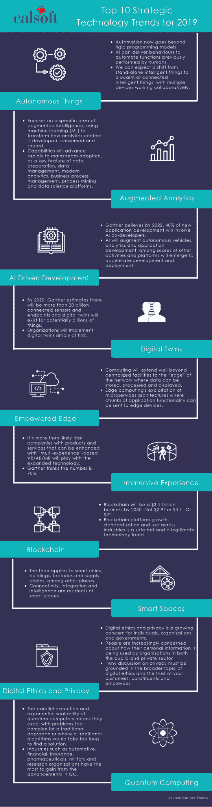
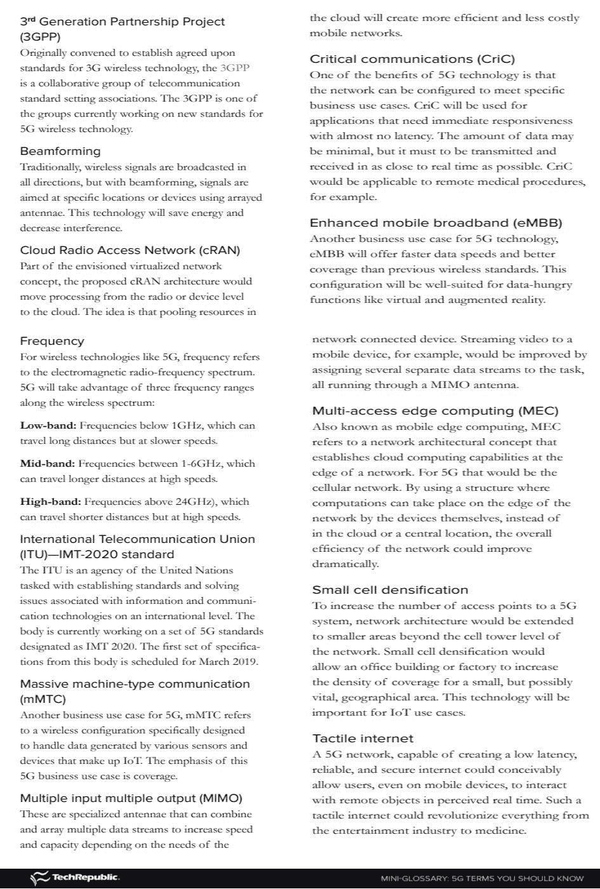
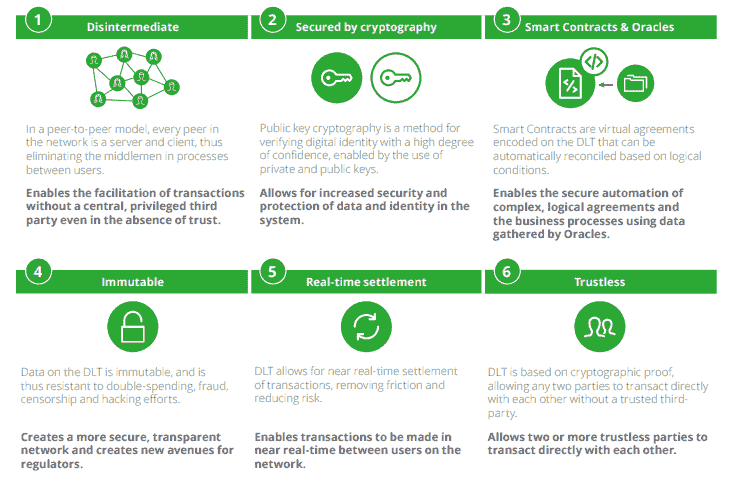
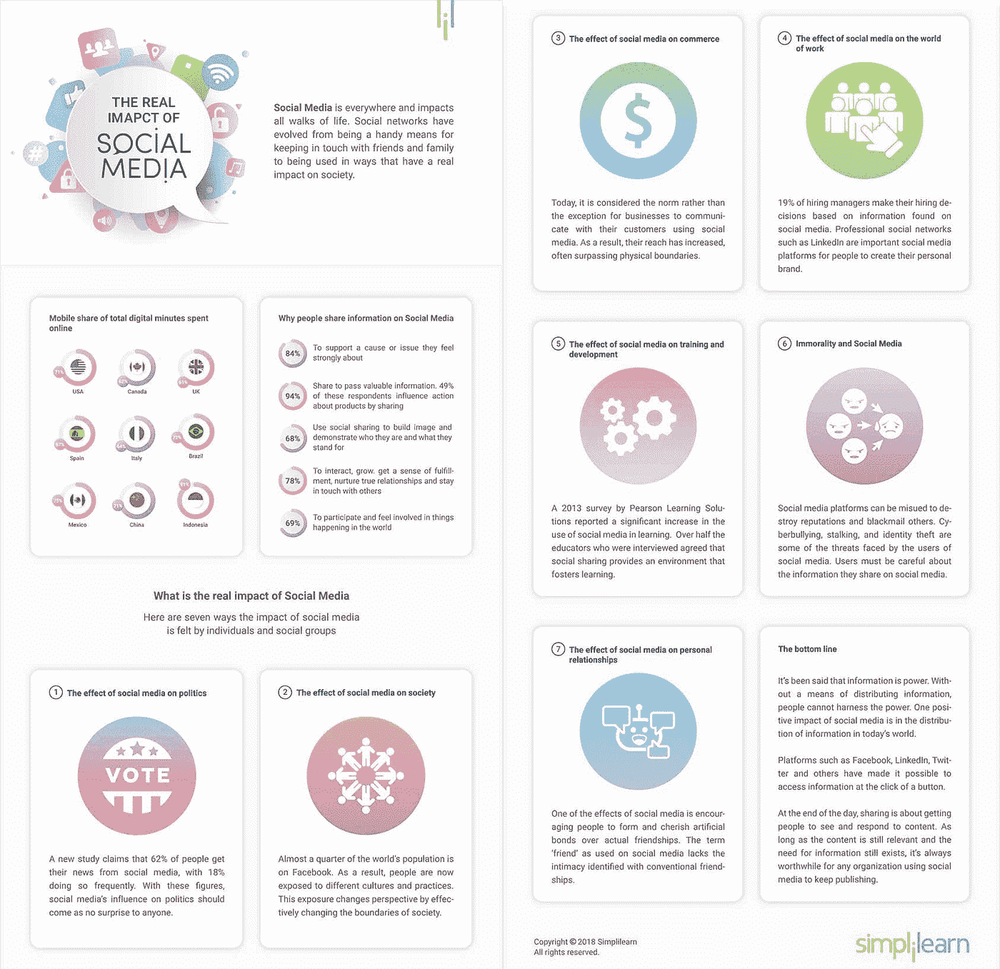
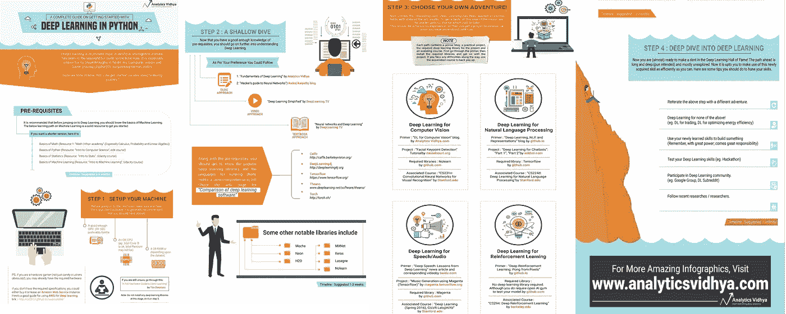
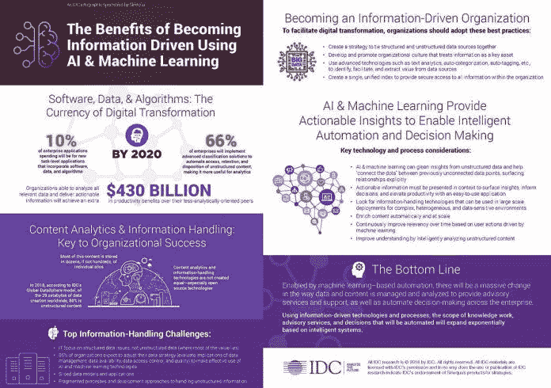
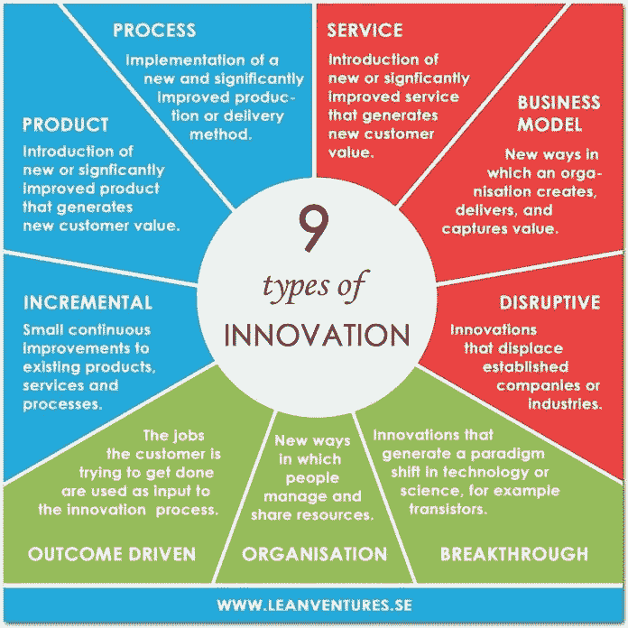
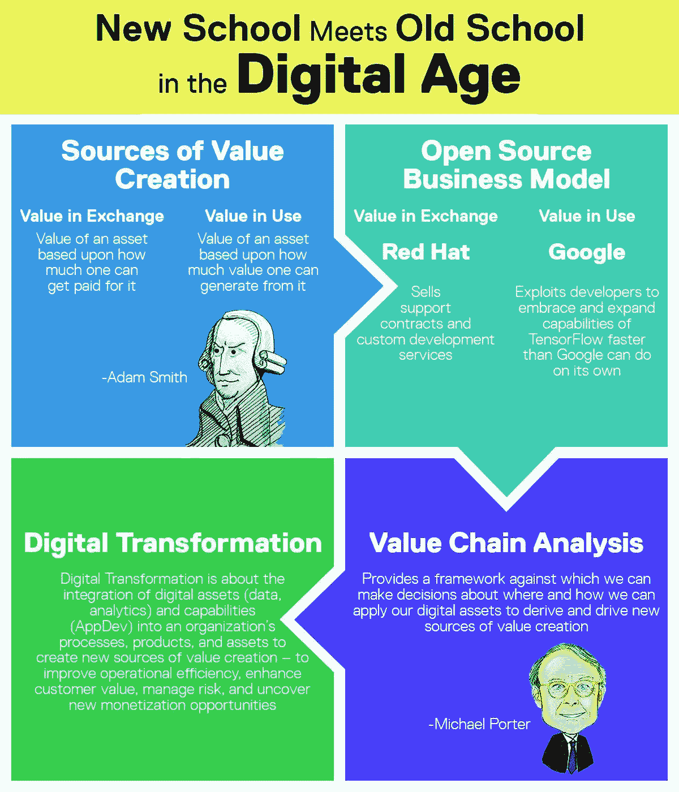
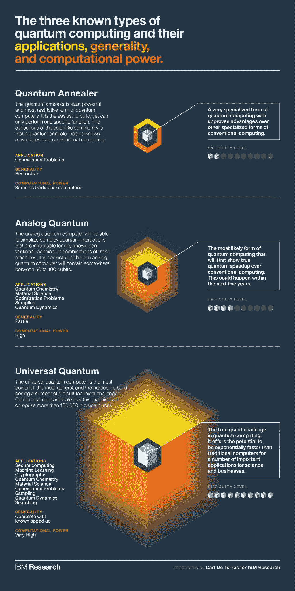
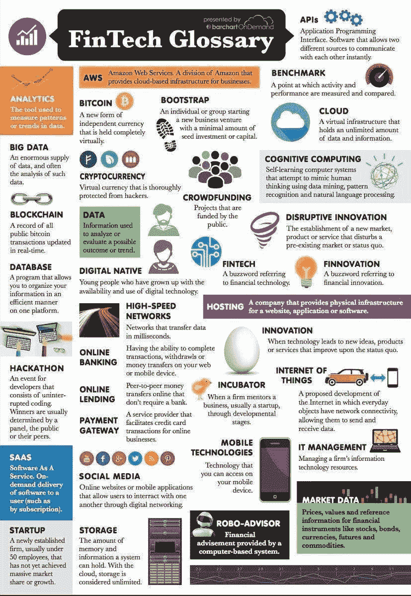

# 深度学习、2019 年顶级技术趋势、金融科技术语表及更多…

> 原文：<https://medium.datadriveninvestor.com/deep-learning-top-technology-trends-for-2019-fintech-glossary-more-595f37985388?source=collection_archive---------5----------------------->

这是本周我的 Twitter feed 的增值内容。希望你能从中学习、享受并有所收获。如果你喜欢这些内容，你可以随时在 twitter 上关注我的每日更新。保持饥渴，做一个终身学习者！

以下是 2019 年的顶级技术趋势&它们将如何推动数字化转型:

以下是如何在网上建立一个成功的个人品牌:

5G 迷你词汇表—您应该知道的术语:

区块链的用途:

移动显示的发展&三星如何革新它:

关注社交媒体对我们生活、工作和人际关系的真正影响(点击放大):

使用 Python 进行深度学习的完整指南(点击放大):

使用人工智能和机器学习实现信息驱动的好处 **:**

通过减轻压力和提高效率来应对自卑的小贴士:

9 种创新的可视化指南:

在这个数字化转型的时代，新学校遇到了旧学校:

3 种类型的量子计算及其使用案例:

帮助您导航的金融科技术语表:

**近期文章:**

 [## 什么是 SaaS &为什么科技投资者喜欢这种模式

### 投资者喜欢将资金投入声誉良好的企业，从长远来看，这些企业拥有可持续的商业模式…

medium.com](https://medium.com/datadriveninvestor/what-is-saas-why-do-the-tech-investors-love-this-model-920d427b58d6)  [## 比特币迷你崩盘、股市暴跌和英镑困境的市场评估

### 本周，世界金融市场——密码、股票和外汇市场——充满了波动。我们看到了一些野生的…

medium.com](https://medium.com/datadriveninvestor/market-evaluation-of-bitcoin-mini-crash-stocks-slump-pounds-woes-784d35dd5cc8)  [## 新加坡 Ubin &加拿大 Jasper power 向 DLT 系统的数字化转型

### 自从中国严厉禁止加密货币以来，新加坡一直是区块链和加密活动的中心。不仅…

medium.com](https://medium.com/datadriveninvestor/singapores-ubin-canada-s-jasper-power-the-digital-transformation-to-dlt-systems-f5aafa54581e)  [## 使用 IPFS 来分散互联网

### 随着数字技术的出现，去中心化的主题已经成为日常谈话的话题。

medium.com](https://medium.com/datadriveninvestor/clouldflare-employing-ipfs-to-decentralize-the-internet-20652dffa834)  [## 用重要的内容来教育自己…

### 我一周大部分时间都活跃在 Twitter 上，发布关于区块链/加密货币、金融科技、技术和……

medium.com](https://medium.com/datadriveninvestor/educate-yourself-with-content-that-matters-20b119d593ea) 

保持联系:[Twitter](https://twitter.com/fklivestolearn)|[LinkedIn](https://www.linkedin.com/in/faisal-khan-2a3009b/)|[trade alike](http://www.tradealike.com/)|[StockTwits](https://stocktwits.com/trade_nut)|[Telegram](https://t.me/joinchat/IWzyHBGWCFwPQTe8Tm5H_Q)

*原载于 2018 年 11 月 18 日*[*【www.datadriveninvestor.com】*](https://www.datadriveninvestor.com/2018/11/18/deep-learning-top-technology-trends-for-2019-fintech-glossary-more/)*。*

