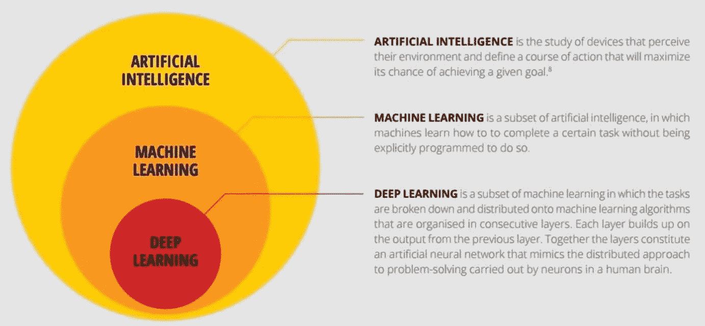
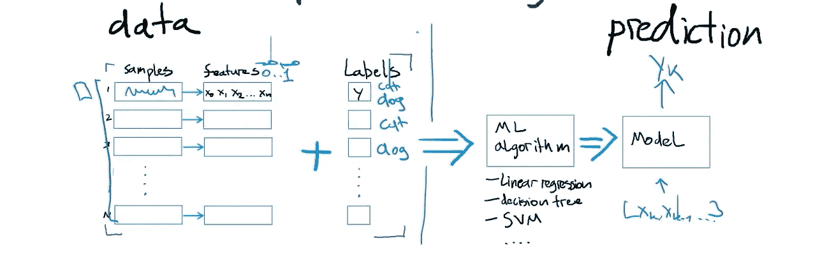
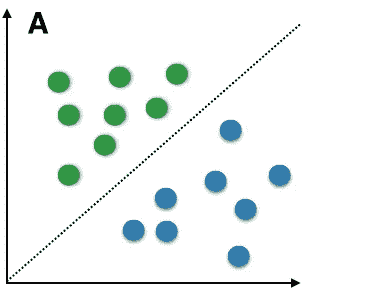
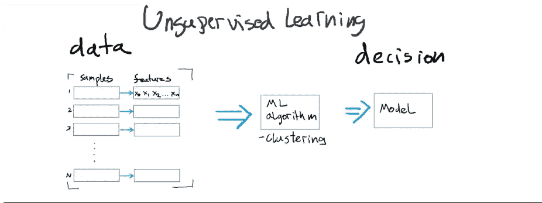
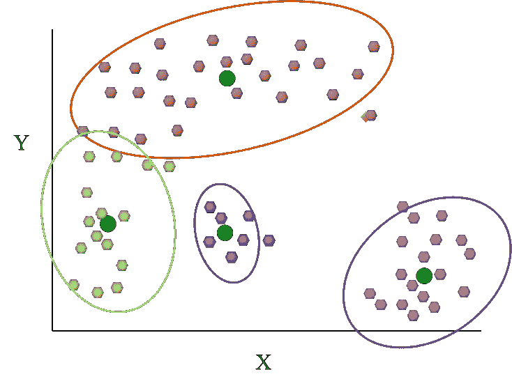
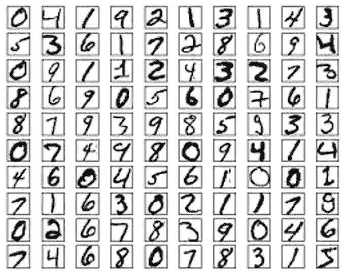
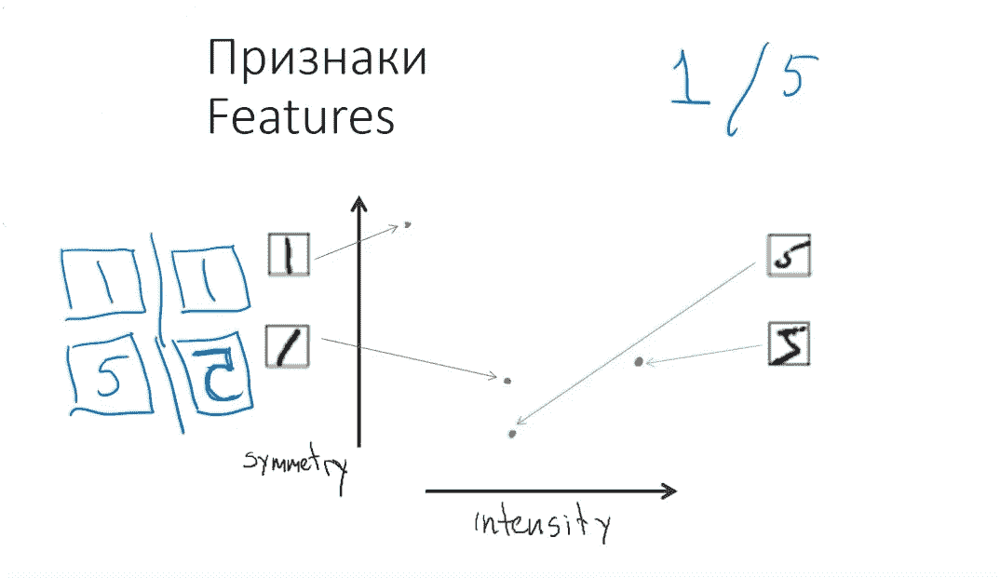
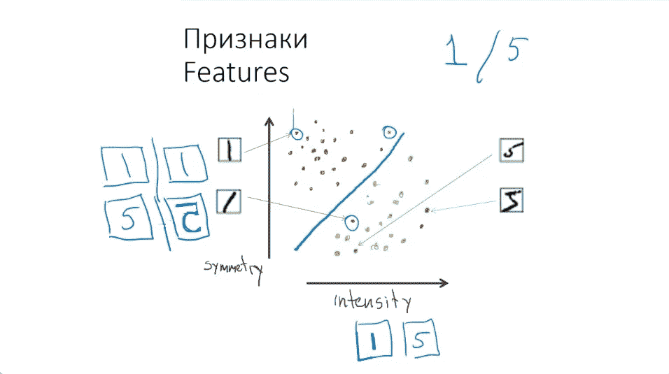
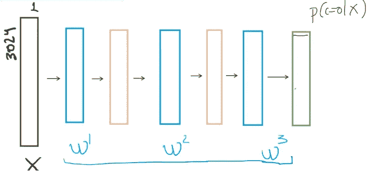

# 深度学习。这是什么？完全的白痴指南。

> 原文：<https://medium.datadriveninvestor.com/deep-learning-what-is-it-complete-idiots-guide-938699eae377?source=collection_archive---------15----------------------->

上次周围所有的人都只谈论人工智能。我试着进入状态，所以开始阅读很多关于人工智能、人工智能、数字图书馆等的书籍。
***声多意少。*** 这就是为什么我决定创建这个关于人工智能的小傻瓜指南！

# 人工智能定义

根据定义，人工智能是

1.  计算机科学的一个分支，研究计算机智能行为的模拟；
2.  机器模仿人类智能行为的能力。

> “每当我们弄清楚它的一部分，它就不再神奇；我们说，‘哦，那只是一个计算。’
> ‘我们过去常常开玩笑说，人工智能意味着‘几乎实现’’[鲁尼·布鲁克斯，麻省理工学院人工智能实验室主任。](https://www.forbes.com/sites/bernardmarr/2017/07/25/28-best-quotes-about-artificial-intelligence/#756d9384a6fc)

# 机器学习

机器学习是计算机科学的一个领域，它赋予计算机在没有明确编程的情况下进行学习的能力。

**监督学习。**

我们有一些数据(图像、波形等)。)然后，我们将数据转换成数字格式(特征)。
因此，我们有一些数据，我们自己决定如何用某种算法将这些数据转换成数字格式。然后，我们为每个数据示例添加标签，我们添加标签(如猫/狗等。).然后，我们将所有这些带有标签的特征发送到使用不同的可接受的 ML 算法进行计算。得到一个模型，从这个结果中，我们可以了解他的模型与哪些对象相关联。预测。

监督学习结果将以下一种方式显示在图表中(见上图)。结果将被分类到各个部分。每个部分将对应于我们在函数中指定的标签。

**无监督学习。**

无监督学习类似于监督学习，但有一些变化和不同的结果。类似的算法，但没有标签。所以，我们不是所有的图像，视频，音频等盖章。我们要求我们的算法将所有输入信息(数据)分类。

用于数据分组的无监督学习。

# 让我们来练习一下:

1.  我们有很多数字，我们应该用 ML 算法来定义我们可以在那里看到什么数字。
2.  让我们从两个数字开始。5 和 1

3.我们将使用两个功能来解决问题。对称性和强度(我们用了多少 px)。

4.定义每个数字适合哪个轴。

5.用这些特征分析上述所有数据，并与标签相关联。

# 深度学习

在 Geoffrey E. Hinton 和 Simon Osindero 于 2006 年 7 月 7 日发表了一篇名为“深度信念网络的快速学习算法”的文章后，深度学习获得了标志性的地位。发表后，人工智能领域的每个人都开始谈论深度学习和算法。

深度学习的灵感来自大脑的结构和功能，即许多神经元的相互连接。所以，深度学习——神经网络的同义词。
“神经元”具有离散的层和与其他“神经元”的连接。每一层挑选出一个特定的特征来学习，例如图像识别中的曲线/边缘。

# 神经网络

让我们回顾一下神经元的解剖结构

树突状分支——像接入点(x)，轴突——预测。
树突是起源于细胞体的细小结构，往往延伸数百微米，分支多次，形成复杂的“树突树”。
大多数神经元通过树突接收信号，并沿着轴突发出信号。

1 —一些数据，如树枝状分支；
W —最简单的线性函数；
橙色矩形——非线性函数；
p —预测。

使用非线性函数的算法可以被认为是深度学习。