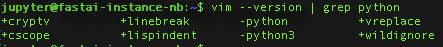

# 用 Fast.ai 进行深度学习

> 原文：<https://medium.datadriveninvestor.com/deep-learning-with-fast-ai-db93d0006bef?source=collection_archive---------1----------------------->

## 一些见解、方便的待办事项和设置指南

Oh we’re learning alright! ([src](https://www.wallyandosborne.com/comic/its-a-bird-its-a-plane/))

2018 年秋天，我在 USF 上了 fast.ai 的“[程序员实用深度学习(第一部分)](https://course.fast.ai/)”课程。这门课程以面对面(我是如何做到的)和 MOOC 的形式提供。这是一次很棒的经历，我学到了很多东西；但是现在回想起来，如果我准备得稍微不同一点，我会得到更多。我在这里分享我的经验和一些方便的 todos，希望它能帮助其他人更好地利用他们用 fast.ai 进行深度学习的时间。

## 谁应该阅读这篇文章？

我的秘密愿望:每个人(我可以使用反馈！).但是，如果你是一名一流的深度学习实践者，正在学习这门课程以跟上 SOTA(最先进的)的步伐，那么你已经知道我要说的所有内容。如果你是一个正在进入深度学习的活跃的程序员，你会发现这在某些方面很有用。但是如果你像我一样，也就是 Python 和深度学习的新手，那么在课程开始前阅读这篇文章会让你进步更快。最后但同样重要的是，如果你是少数仍然在现实世界中工作的幸运儿(即不要呼吸代码)，那么我们需要你！留下来帮助我们变得更好！

## 为什么发这个帖子？

在这门课程之前，我对深度学习、技术或数学一无所知。然而，我对人工智能将如何塑造社会，以及社会在塑造人工智能方面是否有发言权深感兴趣。我现在明白了第一点，足以看到对第二点的迫切需要。该领域的专家一直在倡导和支持让社会能够积极塑造人工智能的事业。Fast.ai 就是这样一个冠军。他们的目标是将深度学习主流化；把它带给所有人。其中很大一部分是降低准入门槛。

我下面分享的都不是火箭科学，但对于第一次尝试的人来说可能会有些吓人。如果你来自一个不是典型的极客群体，这可能会非常可怕。我不是极客。我没有数据科学方面的背景。我会编码，但是我不喜欢编码。然而，我喜欢的是我的代码如何帮助解决问题。越来越多，如果有的话，它可以不造成更大的问题！

我自己的深度学习之旅才刚刚开始，但从杰里米的评论中得到启示，即有更多像我一样的人需要帮助起步，而不是写论文的专家，我决定暂停并写下这一点。我想照亮杰里米的号角“你，无论你是谁，都可以进行深度学习”，同时保持它在所需的努力和期望方面的真实性。

目前的课程是用 Python 讲授的。几年前自学 Python 但是后婴儿时代的大脑迷雾把这一切都抹去了，连同关于它的极客言论和部落知识。但是很多年前我确实以编码为生(用 C++ ),这个基础一直保持着。所以这一次，我处于一种“不知道如何面对这个闪亮的新事物，但我会想出办法”的状态。当然伴随着焦虑！

## fast.ai 有什么独特之处？

回到课程上来。fast.ai 团队让它超级容易进去；符合他们让深度学习对所有人开放的目标。有意将先决条件设置为最低限度，并且设置指南易于遵循。论坛是一个充满信息的商店。但是课程很紧张，节奏像坐过山车一样加快。系好安全带。

然而，独特的是强度的本质。杰里米的教学风格可以用“做-学-做”来形容。在理解科学之前享受实验。学习技巧，然后交易。对于我们大多数受多年传统学习影响的人来说，这可能会很不和谐。除此之外，自由流动的 [Jupyter](https://jupyter.org/) 笔记本电脑永远在进步，这可能需要一两个班级来适应。提前做好准备对你聚集能量的速度有很大的影响。

另一件让我感到天壤之别的事情是 fast.ai 的数学方法。杰里米非常直观地展示了它，并淡化了复杂的部分。对于一个非常害怕数学的人来说，这是一种解放。我突然有能力探索我感兴趣的领域，而不用担心一气呵成地理解它的全部、全部深度。事实上，我记得他在最后一次演讲中说，“你们所有人现在都准备好阅读深度学习论文了；忽略花哨的希腊文，只关注文字”！这很好。但是如果你以前没见过它，或者像我们大多数人一样，在高中时看到它时心不在焉，那么数学需要一些时间来回归。再次，预期并为此做好准备。

最后是你应该有的期望。这门课程不会把你变成发表论文的专家(至少不会马上)；但它也没有声称。目标很简单——让尽可能多的人成为各自领域的专家(尽管我甚至不敢断言！)，去了解机器学习能做什么，教他们快速做的方法。在这一点上，它提供了很多，然后更多。这是一个开始探索该领域及其应用的好地方。如果您感兴趣，它还为您提供了深入挖掘和升级所需的所有方法和工具。努力是属于你的。

现在让我们来看看待办事项，我最初的承诺！

课程前和课程中要做什么才能克服被抛入深水区的焦虑(双关)！

## 变暖

我强烈建议在课程开始前一两周做以下事情:

1.  设置您的本地机器，使其至少可以浏览代码。在这里了解[如何](https://medium.com/p/db93d0006bef#3913)。
2.  不要钻研深度学习(技术或数学)！不知道自己在做什么的优势是巨大的，不应该被低估。特别是考虑到杰里米的教学风格，它基本上是一条正弦曲线，在“哇，看到那种魔力了吗？”和“不要让那成为魔术！”。
3.  但是，在课程中，预算的时间要比建议的多。因为有一半的时间这些东西不会起作用。
4.  如果你从未用 Python 编码，但对编码很在行，就花两天时间阅读类似于[这个](https://www.stavros.io/tutorials/python/)或[这个](https://wiki.python.org/moin/MovingToPythonFromOtherLanguages)或[这个](https://docs.python-guide.org/)……(你明白了)并编写代码。我没有这样做，并且能够在东西不起作用时跟踪并找到我需要的东西……但是这样做可以让我花更多的时间来试验深度学习概念，而不是花更少的时间来担心我的语法是否正确。
5.  一旦学会建立深度学习模型(第一堂课！)你需要训练它。这需要一台 unix/linux 机器或一台配备 Nvidia GPUs 的强大 PC，或者使用远程计算环境。所谓远程，我指的是在云上，像谷歌云、亚马逊 AWS 等为机器学习提供计算引擎的东西。如果您使用远程计算，您还需要设置远程环境来浏览代码(或者 IDE，如果您愿意的话)。你可以按照规定，在第一节课后这样做，或者提前试一试。这里看[如何](https://medium.com/p/db93d0006bef#285c)。

## 投入

以下是本课程中需要考虑的一些事情:

1.  拆包——每门课都包含许多新概念，温和地介绍，然后在后面的课上积极地使用。有几次我在复习讲课视频/笔记本时落后了，第二节课完全失败了。如果你亲自参加，不要这样做。我的意思不是理解每一个概念的每一个细节，而是获得一个大概的想法，运行 Jupyter 笔记本(即执行其中的代码),并在下节课之前花一些时间。
2.  倾听杰里米——我的意思是真正倾听，倾听一切。如果他说，去编码吧——去做吧。如果他说“试试废话”…去试试废话。我做了这件事，但做得还不够。想先了解“为什么”再了解“怎么样”的旧习惯很难打破；在编写任何代码之前做软件规格和架构图的基础设施软件模型也是如此。我希望我早点改掉这两个习惯。他们有价值，只是不在这里。
3.  个人项目——在第 3 或第 4 周，确定一个你可以继续成长的有趣项目。浏览课堂笔记是了解新概念的好方法，但真正的学习将发生在项目上，所以早点开始。我真的很难让我的项目起飞，当我这样做的时候，课程已经结束了…当然，我仍然在努力，但如果能够在课程中尝试更多的概念，会使它们更好地坚持下去。
4.  论坛——这是我最害怕的部分。每个人似乎都已经知道了一切，在一周之内，人们就发布了惊人的模型和项目，展示他们取得的所有进展。我在这里努力寻找那匹马，更不用说试图骑上它了。fast.ai 团队鼓励人们寻求帮助。我照做了。起初开始张贴问题，然后一些评论，最终也有一些进展。我给自己定下的规则是:1)如果我在某件事情上坚持了一天以上而没有任何效果，它就会被放到论坛上；2)对任何使用我在课堂上还没见过的术语的帖子进行屏蔽。我向新人强烈推荐这些规则！
5.  学习小组——如果你的时间和地点与学习小组一致，一定要加入。在这个过程中，我还要应付其他一些事情(找工作、蹒跚学步的孩子和糟糕的通勤状况)，所以我发现自己在家里效率最高。我希望在不久的将来解决这个问题！

## 就这样结束了。

每当我看到这个领域的其他人(学生、专家、除了我之外的几乎所有人)正在做的惊人的工作时，我都会为自己这方面的微小进步感到压抑。但是我停下来告诉自己，我不需要它很容易，我只需要知道我能到达那里。这也是我希望这个博客向像我一样的其他人重申的，这样他们就可以克服他们的焦虑，投入其中。

问题，反馈，见解，想法都欢迎！对于那些想开始设置的人，请参见下面的部分。快乐深度学习！

## Mac 的本地设置

(Linux 见[此处](https://codeyarns.com/2018/04/01/how-to-configure-local-computer-for-fastai-course/)和[此处](https://hackernoon.com/ubuntu-18-04-deep-learning-environment-setup-345ba0b11892)。对于 Windows，请参见此处的[和此处的](https://mariolurig.com/coding/machine-learning-install-windows-fast-ai/)。)

如果你的本地机器是 Mac，那么你将无法在其上运行或训练 fast.ai 模型(不支持 Nvidia GPU 和 fast.ai v1，仅在 Linux 上支持)。但是您仍然希望能够从第一天开始浏览代码。为此，你需要一些软件和软件包管理器——home brew、miniconda/anaconda、pip、git、python 3.6 或更高版本、pytorch、jupyter(编写 DL 代码和运行模型的首选工具)和任何编辑器(我用的是 VS 代码)。

1.  如果你有一台干净的机器，也就是说没有安装上述任何一项，那么你很幸运。这个[博客](https://www.davidculley.com/installing-python-on-a-mac/)是让你前进的各种牛逼。我会说无论如何都要看看博客！
2.  我有一堆前世的随机包和 python 安装，想要一个全新的开始。[这个](https://stackoverflow.com/a/52123490/4222580)和[这个](https://stackoverflow.com/questions/25840961/how-to-find-all-python-installations-on-mac-os-x-and-uninstall-all-but-the-nativ)真的帮助了清理工作，然后第一步中的博客工作了。
3.  在步骤 1 之后，您应该已经安装了 Homebrew 和 Anaconda/Miniconda 包管理器；还有皮普。我使用了 Miniconda，它安装了包括 python 在内的所有其他包。这份[康达小抄](https://conda.io/docs/_downloads/conda-cheatsheet.pdf)有助于沿途检查。对于家酿/pip，您还需要安装额外的软件包。
4.  您将需要的主要软件包是 Python 3.6 或更高版本、NumPy、SciPy、Matplotlib 和 Jupyter。“conda list”命令将列出所有已安装的软件包。
5.  VS 代码[安装指南](https://code.visualstudio.com/docs/setup/setup-overview)简单易懂。Python 入门文档[在这里](https://code.visualstudio.com/docs/languages/python)和[在这里](https://code.visualstudio.com/docs/python/python-tutorial)——你将需要 VSCode 的 Python 扩展。我还安装了用于踢腿的 [Vim](https://marketplace.visualstudio.com/items?itemName=vscodevim.vim) 和 [Jupyter](https://github.com/DonJayamanne/vscodeJupyter) 扩展。VS 代码备忘单这里是[这里是](https://code.visualstudio.com/docs/editor/editingevolved)。
6.  从[这里](https://pytorch.org/get-started/locally/)安装 Pytorch。
7.  从[这里](https://github.com/fastai/fastai)安装 fast.ai。

此时，您可以启动 VS 代码，为您的 fast.ai 和 pytorch 代码库创建一个工作区，链接、引用、定义等都应该在两者之间无缝工作。浏览愉快！

## 远程设置(GCP、VIM、ctags 等)

Fast.ai 在多个平台上得到支持，如谷歌云平台(GCP)、亚马逊网络服务(AWS)、火蜥蜴等。因此，我们这些没有 linux 机箱、车库里没有漂亮 GPU 的普通人也可以进行深度学习！课程论坛上提供的设置指南非常适合入门。选择一个远程计算平台，浏览设置指南。我使用了 GCP，没有遇到任何论坛中没有涉及的问题。所以我在这里没有什么要补充的。

为了浏览代码，我想要一个像 Jeremy 那样的 Vim 设置。这很棘手，我要做的不仅仅是“复制他的”。vimrc 文件”。顺便说一句，太棒了，所以从[这里](https://github.com/fastai/dotfiles/blob/master/.vimrc)得到它。预装在 GCP 计算引擎上的 vim 版本没有启用 python 支持。您可以使用“vim — version”或“vim — version | grep python”命令进行检查，应该会看到类似这样的内容:

把负号变成正号需要做一些工作。您可以从源代码编译 VIM 这是我不想在远程平台上做的(如果你想做，请看[这个](https://www.vim.org/sources.php)和[这个](https://github.com/Valloric/YouCompleteMe/wiki/Building-Vim-from-source))。或者您可以下载一个预编译的版本，并启用 python。经过一番搜寻，我选定 Vim-NOX 作为最简单的选择。您可以使用此处的说明[安装 Vim-NOX。](https://vi.stackexchange.com/a/17559/20330)

一旦设置了 Vim-NOX，Vim-version 应该显示带有加号的 python3，这意味着您现在已经为 Vim 启用了 python 语法支持。只需在。vimrc 并安装更多的包来使用 Vim 的简单代码浏览特性，如自动完成、代码折叠等。你就可以走了。

*   安装[电源线](https://powerline.readthedocs.io/en/latest/overview.html)(用于状态/提示):`pip install powerline-status`
*   安装[vu ndle](http://manhnt.github.io/vim/2016/06/25/vundle-beginner.html)(vim 的捆绑包/包管理器):

`mkdir ~/.vim/bundle
git clone [https:*//github.com/VundleVim/Vundle.vim.git*](https://github.com/VundleVim/Vundle.vim.git) *~/.vim/bundle/Vundle.vim*`

*   改变。vimrc 查找 python3 和 vundle(将红色文本更改为 python 站点包的位置；如果不使用康达版本，可能会有所不同):

`python3 **import** sys; sys.path.append(“/opt/anaconda3/lib/python3.6/site-packages”)
python3 **from** powerline.vim **import** setup **as** powerline_setup
python3 powerline_setup()
python3 **del** powerline_setup`

*   安装 [ctags](http://vim.wikia.com/wiki/Browsing_programs_with_tags) : `sudo apt-get **install** exuberant-ctags`
*   为您想要浏览的代码创建标签。对我来说，这是 fast.ai 和 pytorch 库，所以这是我用来创建标签的代码:

`sudo ctags -R -o ~/tags /opt/anaconda3/pkgs/fastai-1.0.34-py_1/site-packages/fastai /opt/anaconda3/pkgs/pytorch-nightly-1.0.0.dev20181024-py3.6_cuda9.2.148_cudnn7.1.4_0`

*   配置 ctag:`echo — python-kinds=-i > ~/.ctags`
*   在中设置标签。vimrc 指向生成的标签:`set tags=~/tags`
*   改变代码折叠方法:在杰里米的。vimrc 将代码折叠方法设置为“expr”，这显然是 Vim 中[折叠代码最复杂也是最强大的方法！Expr 使用正则表达式来创建折叠规则。有趣的事实:我最后一次使用正则表达式是在我作为助教教授 PERL 的时候，我现在已经不记得了！所以，我修改了我的。并将 foldmethod 设置为“indent ”,这就足够了！](http://vim.wikia.com/wiki/Folding)

一切都准备好了。差不多！如果你像我一样，无论你使用多少次工具或编程语言，你仍然需要一个备忘单。所以这里有一个用于 [Vim](https://www.cs.cmu.edu/~15131/f17/topics/vim/vim-cheatsheet.pdf) 和一个用于 [Ctags](http://www.held.org.il/blog/2011/02/configuring-ctags-for-python-and-vim/) 。