# 使用 Python 和 fast.ai 的深度学习，第 2 部分:使用迁移学习的 NLP 分类

> 原文：<https://medium.datadriveninvestor.com/deep-learning-with-python-and-fast-ai-part-2-nlp-classification-with-transfer-learning-e7aaf7514e04?source=collection_archive---------1----------------------->


在本教程中，我们将处理一个自然语言处理(NLP)分类任务。

令人悲伤的消息是，即使在今天，计算机仍然不能理解自然语言 T2。然而，在现代语言建模技术的帮助下，机器可以从单词、短语、句子和段落中掌握越来越多的信息。

几种不同的方法已经应用于 NLP 分类问题。

第一种方法叫做**词汇袋**。我们只是把一个单词看成一个符号。在这种情况下，我们可以计算每个符号在句子中出现的次数。因此，一个句子可以转换成一个向量，其中包含一系列的数字。


有用吗？

答案是肯定的。许多人仍然在使用这种方法，因为它简单。但是，你可以想象，**词袋**的性能不可能很好，因为很多有用的信息，比如单词的**语义**都丢失了。

为了解决这个问题，人们提出了第二种方法，即给单词添加语义信息。每个单词都被表示为一个高维向量。例如，单词“苹果”可以表示为`(0.73, -0.25, 0.40, ..., 0.86, -0.10, 0.77)`。这叫做“单词嵌入”。

你可能无法想象如此高维的向量。没关系。我也做不到。但是，如果将高维向量压缩为三维，它们可以显示如下图所示:

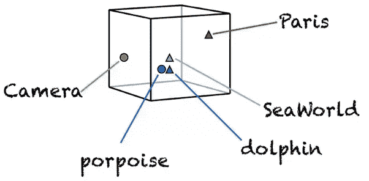

现在，你可以要求计算机做出一些猜测，例如:

> 国王-王后=男人-？

在单词嵌入的帮助下，机器会告诉你“女人”是最有利的答案。

很神奇，对吧？

坏消息是，要获得这些单词嵌入，你需要花费大量的训练时间，以及大量的计算资源。

好消息是，一旦你完成了这个过程，你就可以和其他人，甚至公众分享单词嵌入的结果。很多人可以从你的工作中受益，因为他们不需要再培训他们。

[Word2vec](https://arxiv.org/abs/1402.3722) 、 [Glove](https://nlp.stanford.edu/projects/glove/) 和 [fasttext](https://github.com/facebookresearch/fastText) 是这种“单词嵌入”技术的几个很好的例子。

然而，即使你现在可以处理语义，还有一个问题需要解决，那就是单词的排序。

单词嵌入可能很好地代表了一个单词，但它们在句子中的顺序没有得到很好的处理。例如，如果您仅考虑出现的唯一单词，则以下两个句子的转换将是相同的:

> 那条狗咬了那个人。
> 
> 那个人咬了那条狗。

太荒谬了，对吧？

为解决这一问题，提出了第三种办法。不仅单词被转换成高维向量，而且通过引入神经网络层来保持排序。

一种方法是使用一维卷积神经网络(1D CNN)。这个想法是从图像分类中借鉴来的。由于 2D 滤波器可以很好地捕捉像素矩阵的结构，为什么 1D 滤波器不能从单词序列中捕捉排序信息？

这里有一个 1D 有线电视新闻网的例子。

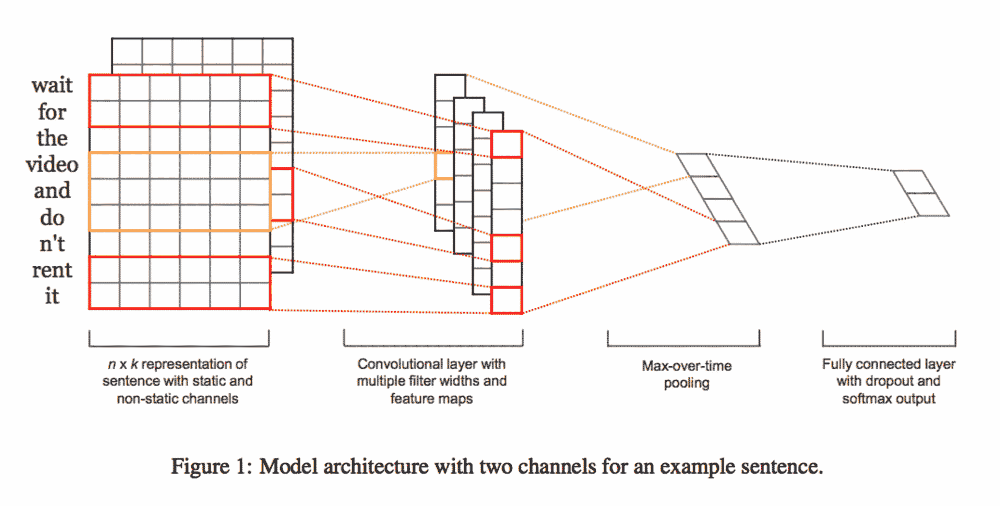

另一种方法是引入递归神经网络(RNN)。注意当试图处理长句时，最初的 RNN 不足以解决几个严重的问题，所以引入了 RNN 的不同变体，例如长短期记忆(LSTM)或门控循环单元(GRU)。

这是 LSTM 的一个例子。

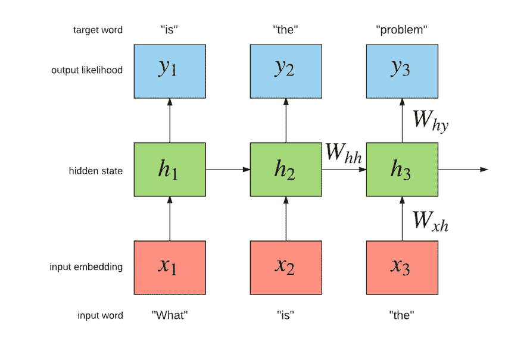

谷歌甚至走得更远，他们训练了一个名为 [**通用句子编码器**](https://arxiv.org/abs/1803.11175) 的模型，将整个句子翻译成单个向量，这样你就不需要在自己的模型中添加任何 1D CNN 或 RNN 层。


多神奇啊！不是吗？

一些人认为这种方法在很多情况下没有多大意义。

主要问题是你试图直接使用别人**训练的矢量表示法**。如果有人在维基百科上训练了单词嵌入，而你想把它们用于你的 IMDB 评论分类。虽然两个语料库都是英文的，但是对于同一个单词，意思可能是不同的。如果你强迫你的模型使用从不同任务中训练出来的向量，性能就不会那么好。

你能微调单词嵌入吗？不，因为它们是静态的。

当然，你可以从头开始训练单词嵌入。但这样做意味着要花费大量的时间和计算能力。此外，如果每个人都需要训练他们自己的单词嵌入，分享你努力工作的向量表示(几乎)对任何人都没有帮助，除非你试图处理同样的任务。

有没有一种方法可以实现高绩效，同时充分利用他人长期训练的成果？

你可能还记得在[上一篇文章](https://medium.com/@wshuyi/deep-learning-with-python-and-fast-ai-part-1-image-classification-with-pre-trained-model-cd9364107872)中展示的迁移学习对图像分类的作用。同样的方法可以用在 NLP 分类上吗？

答案是**是的**。

在有人已经用数百个 GPU(或 TPU)小时从头开始训练了一个**语言模型**之后，他们可以向公众发布这个模型。

如果你想用它来完成你自己的 NLP 分类任务，这里列出了你需要做的事情。

*   下载预先训练好的模型；
*   用一种叫做**区别学习率**的技术在你的任务中微调它(请参考本教程的[第一部分](https://medium.com/@wshuyi/deep-learning-with-python-and-fast-ai-part-1-image-classification-with-pre-trained-model-cd9364107872))；
*   现在你已经得到了一个适合你任务的语言模型，你可以用它对你的训练数据进行分类；
*   如果您对性能不满意，您可以**解冻**并保持**微调**分类模型。

下图来自杰瑞米·霍华德的[论文](https://www.google.com/url?sa=t&rct=j&q=&esrc=s&source=web&cd=1&cad=rja&uact=8&ved=2ahUKEwib3PezvqreAhUSTt8KHU_gA3YQFjAAegQICRAB&url=https%3A%2F%2Farxiv.org%2Fabs%2F1801.06146&usg=AOvVaw2FNx0vgMxhtRs1UgRSALQg) ( *Howard，j .，& Ruder，S. (2018)。用于文本分类的通用语言模型微调。科尔，政务司司长。CL，arXiv:1801.06146。*)，而且它已经把我上面说的步骤可视化了。

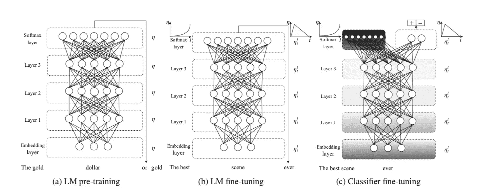

正如我在[图像分类部分](https://medium.com/@wshuyi/deep-learning-with-python-and-fast-ai-part-1-image-classification-with-pre-trained-model-cd9364107872)中向您展示的，这种方法的一个副作用是，通过使用迁移学习，您不需要大量数据。

你可能想知道你自己是否能实现它。幸运的是，在 fast.ai 框架的帮助下，这项任务只需要十几行代码就可以完成。

是时候把手弄脏了。让我们运行 Python 和 fast.ai。

# 资料组

我们将使用 **Yelp 评论极性**数据集。由 fast.ai 分享，AWS 托管。

这是 fast.ai 数据集完整列表的[链接](http://course.fast.ai/datasets)。请注意，有许多高质量的研究数据集可以直接使用。


进入 NLP 部分，找到`Yelp reviews - Polarity`。

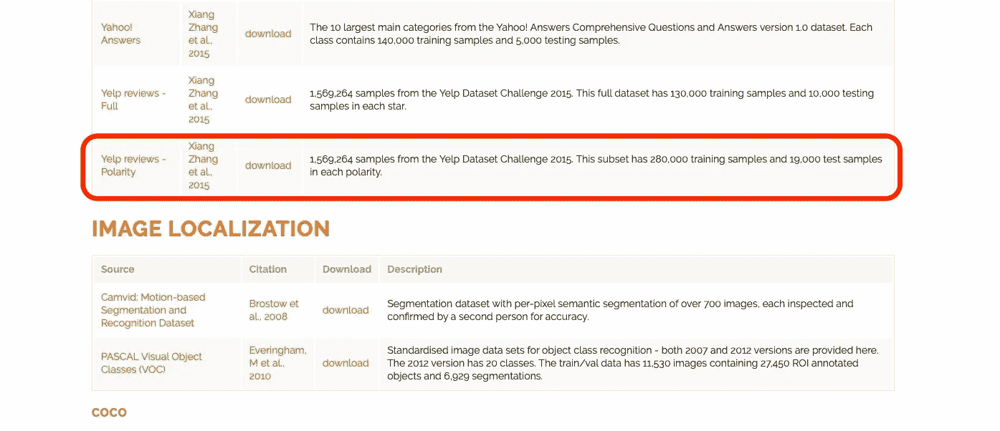

也就几百兆而已。所以你可以下载，提取和检查它。

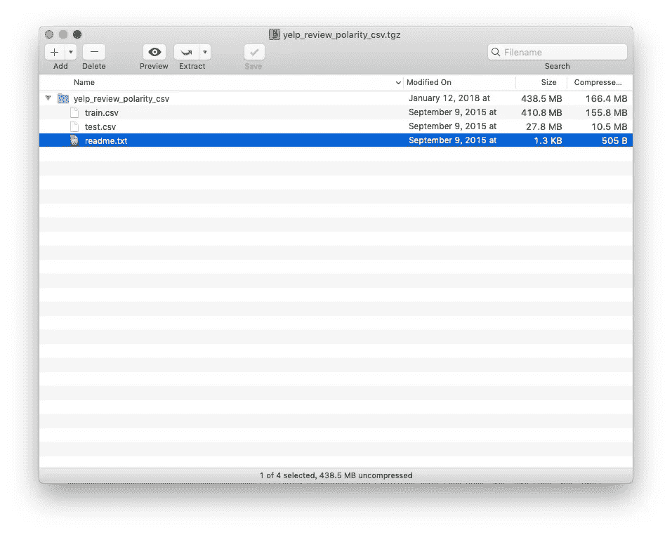

tarball 中有两个`csv`文件。一个叫`train.csv`，另一个叫`test.csv`。

`readme.txt`文件描述了数据集的细节。

正如作者所描述的，

> Yelp 评论极性数据集是通过考虑 1 号星和 2 号星为负，3 号星和 4 号星为正来构建的。对于每个极性，随机抽取 280，000 个训练样本和 19，000 个测试样本。总共有 560，000 个训练样本和 38，000 个测试样本。负极性为 1 级，正极性为 2 级。

数据集不是很大，但是足够大以训练和验证 NLP 分类模型。

在作者于 2015 年发表的[论文](https://arxiv.org/abs/1509.01626)中，他们展示了不同方法的基准[结果](http://xzh.me/docs/charconvnet.pdf)。

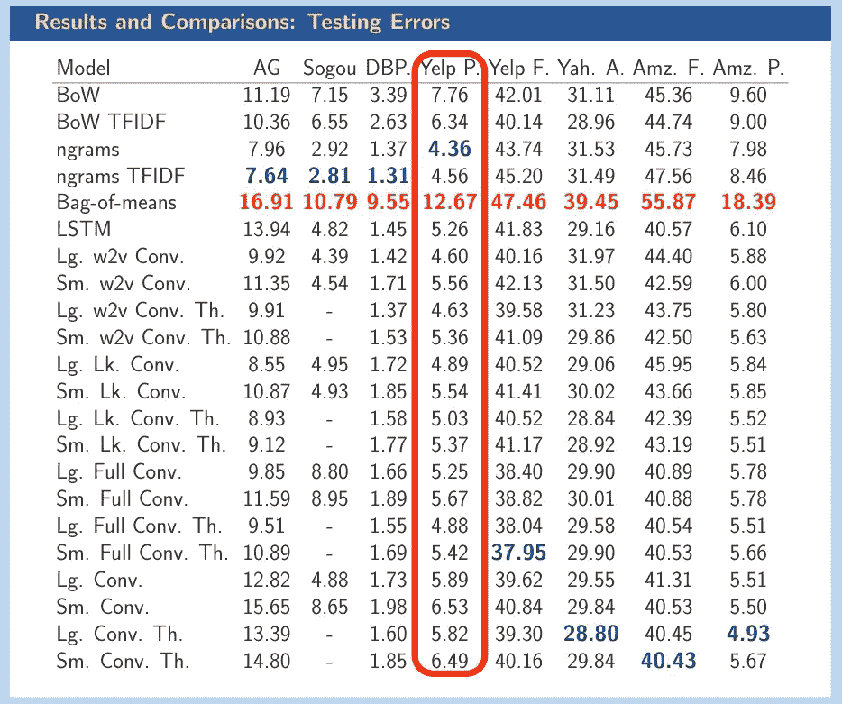

yelp 极性的最小错误率是 4.36，即 95.64%的准确度。

让我们看看我们是否能达到，甚至打破这里的最高分。

请注意，如果您想将该数据集用于研究目的，您需要引用作者的原始研究论文，如下所示:

> 张翔，赵军波，杨乐存。用于文本分类的字符级卷积网络。神经信息处理系统进展 28 (NIPS 2015)。

# 环境

你需要有一个安装了 fast.ai 1.0 框架的 GPU 就绪的 Google Cloud 虚拟机来遵循本教程。如果你不知道如何去做，请参考[上一篇文章](https://medium.com/@wshuyi/deep-learning-with-python-part-0-setup-fast-ai-1-0-on-google-cloud-c3d41aadbc8c)。


使用`gcloud`成功连接虚拟机后，会看到这个提示。


你需要从 github 获取代码和数据集。为此，请运行以下命令。

```
git clone [https://github.com/wshuyi/demo-nlp-classification-fastai.git](https://github.com/wshuyi/demo-nlp-classification-fastai.git)
```

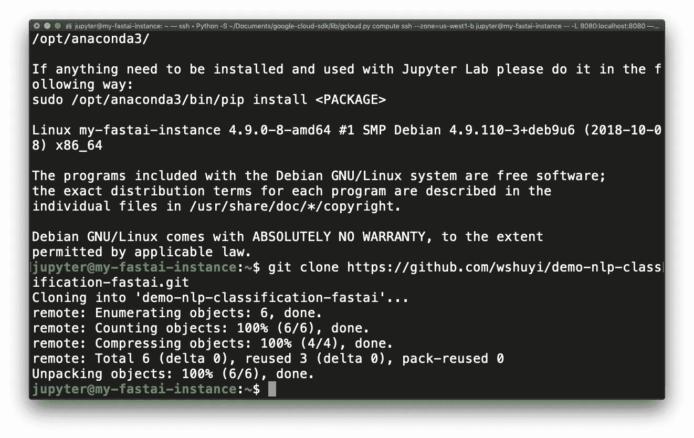

现在您可以运行:

```
jupyter lab
```


打开你的 firefox 浏览器，进入[这个网址](http://localhost:8080/lab?)。

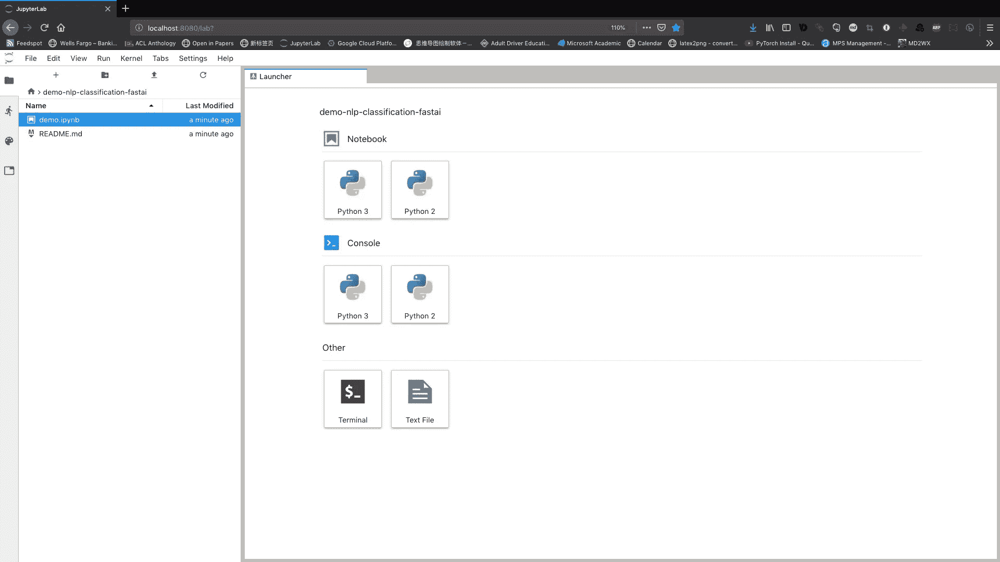

从左侧栏打开 demo.ipynb。

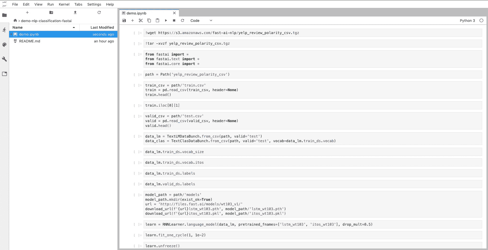

现在代码已经显示在主窗口中，您可以通过点击`Run->Run All Cells`来运行所有的代码块。


然而，为了从本教程中获得更多，我建议您按照说明一步一步地运行它们，并仔细检查结果。

# 加载数据

我们将使用`!+command`在 Jupyter 笔记本单元中运行 bash 命令。`wget`用于从 AWS 下载 yelp 数据集。

```
!wget [https://s3.amazonaws.com/fast-ai-nlp/yelp_review_polarity_csv.tgz](https://s3.amazonaws.com/fast-ai-nlp/yelp_review_polarity_csv.tgz)
```

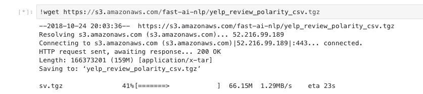

现在在左边栏，你可以看到下载的文件`yelp_review_polarity_csv.tgz`。

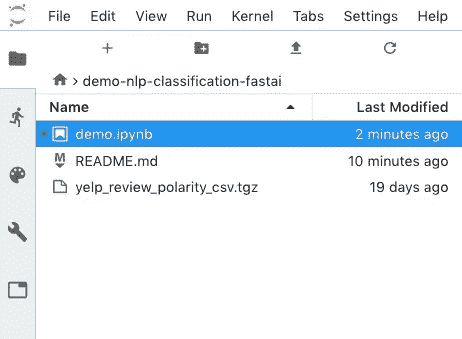

我们使用`tar`命令来解压它。

```
!tar -xvzf yelp_review_polarity_csv.tgz
```

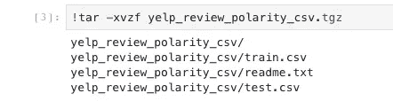

如您所见，创建了一个新文件夹`yelp_review_polarity_csv`。

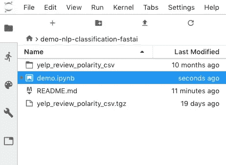

让我们双击并打开它。

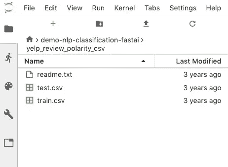

好的，数据下载正确。

现在让我们从 fast.ai 导入一些有用的函数和模块。

```
from fastai import *
from fastai.text import *
from fastai.core import *
```

我们需要将`path`设置为我们将使用的数据。

```
path = Path('yelp_review_polarity_csv')
```

让我们看看训练数据。

```
train_csv = path/'train.csv'
train = pd.read_csv(train_csv, header=None)
train.head()
```

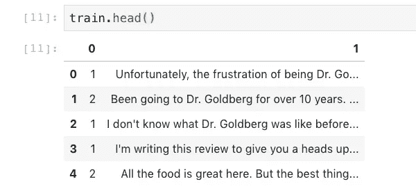

我们可以看到第一个数据项的整个复习内容。

```
train.iloc[0][1]
```

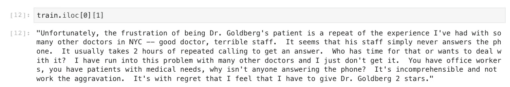

让我们在有效集合上做类似的操作。取名`test.csv`，不过还好。

```
valid_csv = path/'test.csv'
valid = pd.read_csv(valid_csv, header=None)
valid.head()
```

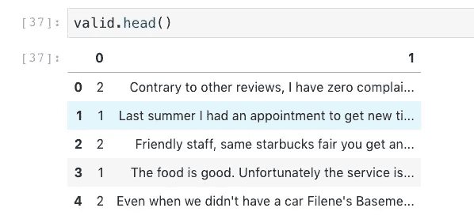

现在让我们把数据装入我们的程序。

```
data_lm = TextLMDataBunch.from_csv(path, valid='test')
data_clas = TextClasDataBunch.from_csv(path, valid='test', vocab=data_lm.train_ds.vocab)
```

这需要几分钟。请耐心等待。

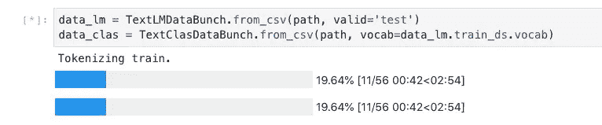

这两行代码将帮助我们做几件事。

*   将训练数据符号化和数值化
*   有效数据的符号化和数值化
*   通过使用来自 csv 文件的标签和来自第一和第二步的 vocabs 来初始化数据分类器。


让我们看看数据加载是否正确。

```
data_lm.train_ds.vocab_size
```

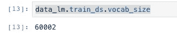

词汇量为 60002。

让我们研究一下这个问题。

```
data_lm.train_ds.vocab.itos
```

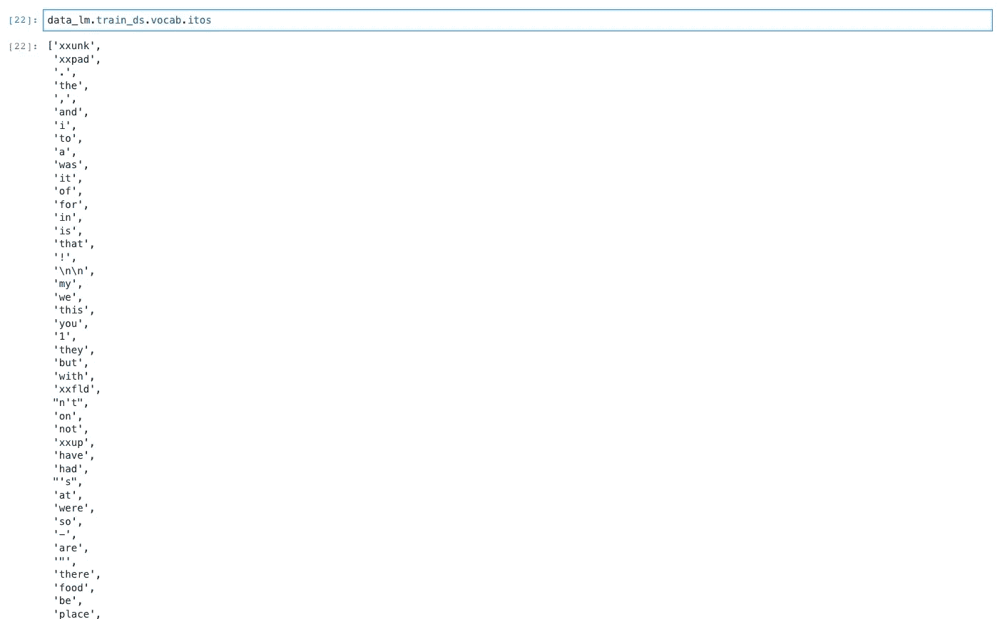

标签呢？

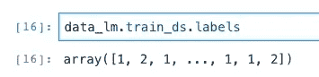

我们在有效集合上检查相同的性质。

```
data_lm.valid_ds.labels
```

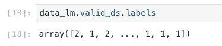

现在我们已经有了数据，让我们**借用**预先训练好的语言模型。

# 语言模型

该语言模型在名为 [Wikitext-103](https://openreview.net/pdf?id=Byj72udxe) 的语料库上进行训练。如果你想知道一些详细的信息，请参考杰瑞米·霍华德的[论文](http://arxiv.org/abs/1801.06146v5)。


运行下面的代码块来获取模型。

```
model_path = path/'models'
model_path.mkdir(exist_ok=True)
url = 'http://files.fast.ai/models/wt103_v1/'
download_url(f'{url}lstm_wt103.pth', model_path/'lstm_wt103.pth')
download_url(f'{url}itos_wt103.pkl', model_path/'itos_wt103.pkl')
```

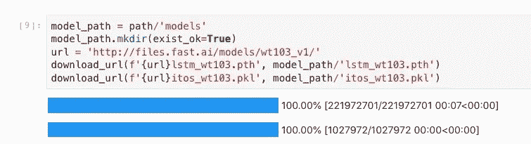

如您所见，在数据目录中创建了一个名为`models`的新目录。

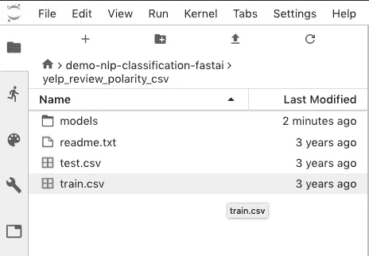

现在里面只有两个文件。

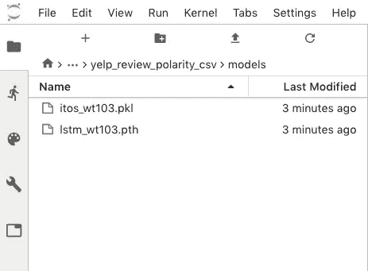

让我们尝试使用预训练语言模型中的参数来初始化我们自己的语言模型。

```
learn = RNNLearner.language_model(data_lm, pretrained_fnames=['lstm_wt103', 'itos_wt103'], drop_mult=0.5)
```

现在我们可以使用这个初始语言模型来拟合我们的训练数据。

```
learn.fit_one_cycle(1, 1e-2)
```

同样，我们使用“一个周期策略”来训练模型。如果你忘了它的意思，请参考[上一篇](https://medium.com/@wshuyi/deep-learning-with-python-and-fast-ai-part-1-image-classification-with-pre-trained-model-cd9364107872)。

由于我们有一个大的数据集，训练过程将需要大约 1 个小时。请耐心等待。

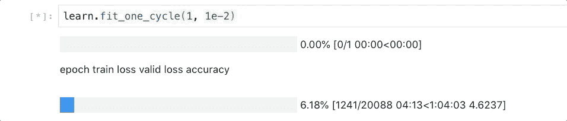

50 多分钟后，它仍在运行。


终于，完成了。

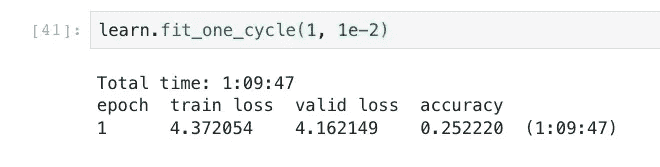

准确率相当低。不过没关系。因为我们会对模型进行微调。

我们会解冻预训练的部分，用“判别学习率”来微调参数。

还是那句话，万一你忘了什么是“判别学习率”，可以参考[上一篇](https://medium.com/@wshuyi/deep-learning-with-python-and-fast-ai-part-1-image-classification-with-pre-trained-model-cd9364107872)。

```
learn.unfreeze()
learn.fit_one_cycle(1, 1e-3)
```

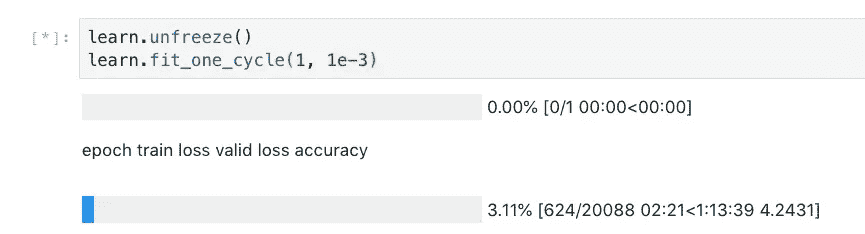

如你所见，微调将花费你一个多小时。耐心点！

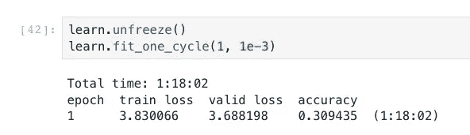

78 分钟后，微调步骤完成。

现在，我们可以将经过训练的微调模型的参数存储到一个文件中。

```
learn.save_encoder('ft_enc')
```

所以下次如果需要从微调好的模型开始，可以直接加载这个文件，没有必要再重复上面的训练步骤。

请把文件保存在安全的地方。

# 分类

现在我们已经得到了微调的语言模型，我们可以用它来构建我们的分类器。

```
learn = RNNLearner.classifier(data_clas, drop_mult=0.5)
learn.load_encoder('ft_enc')
learn.fit_one_cycle(1, 1e-2)
```

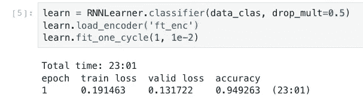

我们还是用`fit_one_cycle`函数，单次运行后，准确率接近 95%。

这很好，但并不令人兴奋，因为我们需要将其与他人的工作进行比较。


从张翔的论文中回忆这张表，最高准确率为 95.64%。

让我们试着通过微调我们的分类器来改进它。我们冻结了模型中的所有层，除了最后两层。让我们再训练一次。

```
learn.freeze_to(-2)
learn.fit_one_cycle(1, slice(5e-3/2., 5e-3))
```


这一次，准确率提高到 97%左右。已经高于上表显示的最高值(95.64%)。

微调预训练的 NLP 模型的好处是不那么容易发生过拟合。正如您在这里看到的，列车损耗大于有效损耗，因此没有过度拟合的证据。

如果你还不满足(这么挑剔！)，可以尝试用判别学习率对整个模型进行微调来改善结果。请注意，这将花费你更长的时间。

```
learn.unfreeze()
learn.fit_one_cycle(1, slice(2e-3/100, 2e-3))
```

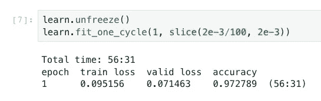

近 1 小时后，我们获得了更高的准确率(97.3%)。

注意，有效损失仍然小于训练损失，因此过拟合仍然没有意义。能不能持续改进？

自己试试吧！

# 摘要

在本教程中，我向您展示了如何训练 NLP 分类器来判断 Yelp 评论是正面还是负面。训练花费的时间比我在[上一篇文章](https://medium.com/@wshuyi/deep-learning-with-python-and-fast-ai-part-1-image-classification-with-pre-trained-model-cd9364107872)中展示的图像分类器要长，但这意味着我们这次处理的任务更加**实际**。

注意，语言模型可以在任何语言语料库上训练，而不仅仅是英语。

你可以在中文维基百科语料库上训练自己的语言模型，并在你的评论分类器上进行微调，比如豆瓣或大众点评。

实际上，最近有一个团队在这种方法和 fast.ai 框架的帮助下赢得了 PolEval'18。这是他们与杰瑞米·霍华德合著论文的链接。

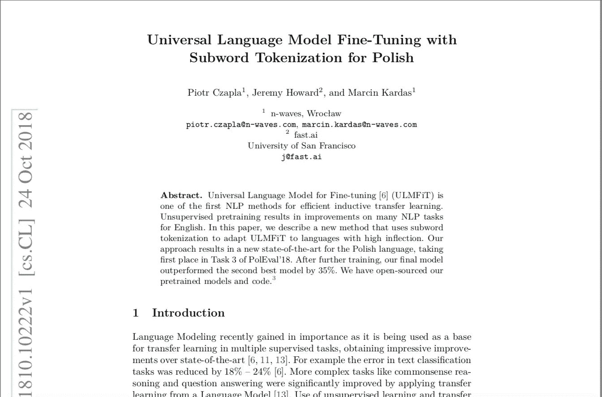

还是那句话，如果你想了解更多关于 fast.ai 的知识，可以去[这个网站](http://course-v3.fast.ai/)上 fast.ai 的奇幻 MOOC。


快乐深度学习！