# 使用 PyTorch 进行深度学习

> 原文：<https://medium.datadriveninvestor.com/deep-learning-with-pytorch-5978a8337fb9?source=collection_archive---------6----------------------->

MNIST Dataset Image

# 使用 MNIST 数据集学习 PyTorch 深度学习

在使用 TensorFlow 作为机器学习工具的几个项目之后，我这次专注于 Pytorch，使用 MNIST 数据库运行该项目。我将使用 Colaboratory(来自 google)在在线 Jupyter 上使用 Python。

**PyTorch** 是 Python 的开源机器学习库，基于 Torch，用于自然语言处理等应用。它主要由脸书的人工智能研究小组开发，优步用于概率编程的“Pyro”软件就是基于它开发的。

**MNIST 数据集**

MNIST 数据集由美国国家标准与技术研究所(NIST)的两个数据集构建而成。训练集由 250 个不同的人的手写数字组成，其中 50%是高中生，50%是人口普查局的员工。注意，测试集包含来自不同人的手写数字，遵循相同的分割。

MNIST 数据集在此公开发布，由以下四部分组成:

*   训练集图像:train-images-idx3-ubyte.gz(9.9 MB，47 MB 解压缩，和 60，000 个样本)
*   训练集标签:train-labels-idx1-ubyte.gz(29kb，60 KB 解压缩，60，000 个标签)
*   测试集图像:t10k-images-idx3-ubyte.gz(1.6 MB，7.8 MB，解压缩和 10，000 个样本)
*   测试集标签:t10k-labels-idx1-ubyte.gz(5kb，10 KB 解压缩，和 10，000 个标签)

**PyTorch 提供了两个高级特性:**

a)具有强大 GPU 加速的张量计算(如 NumPy)

b)建立在基于磁带的自动识别系统上的深度神经网络

**PyTorch 由 4 个主包组成:**

1.  torch:一个类似于 Numpy 的通用数组库，当张量类型转换为(torch.cuda.TensorFloat)时，它可以在 GPU 上进行计算
2.  torch . autogradated:用于构建计算图形和自动获取梯度的软件包
3.  torch.nn:具有公共层和成本函数的神经网络库
4.  torch.optim:一个优化包，包含 SGD、Adam 等常见的优化算法

**PyTorch 张量:**

在编程方面，张量可以简单地认为是多维数组。PyTorch 中的张量类似于 NumPy 数组，另外张量也可以在支持 CUDA 的 GPU 上使用。PyTorch 支持各种类型的张量。

这通过在 [GitHub](https://github.com/MRobalinho/PyTorch-DEEP-LEARNING/blob/master/README.md) 上查阅来完成 python 中的工作。

我们走吧。使用在线协作，我们需要安装一些软件包(火炬和火炬视觉):

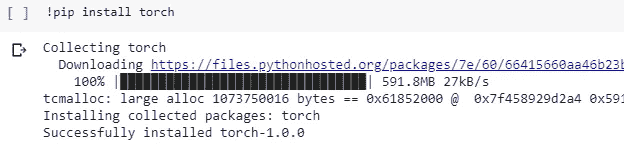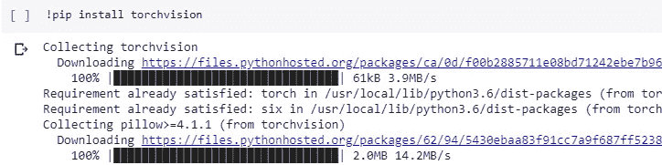

我们需要申报以下包裹:

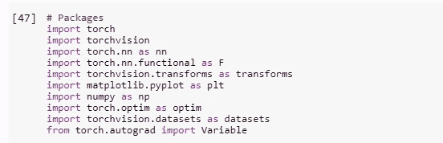

阅读 MNIST 数据集:

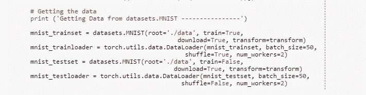

在我的测试中，我有 60000 条记录用于训练，10000 条记录用于测试数据集。见下文。

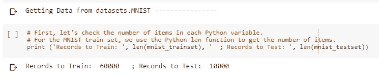

读完数据集后，我可以看到一两条测试记录。在这里，我查找从 index_image 开始的第 5 条记录。

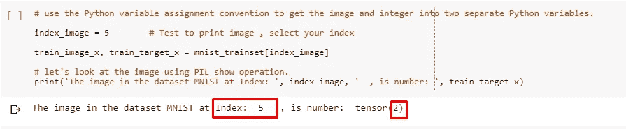

系统说我们在图像索引号 5 上有 2 号。下面打印一些记录。

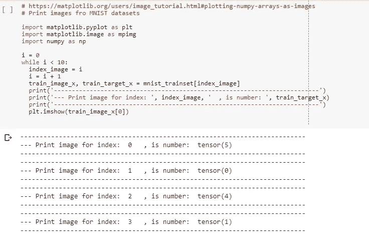

在索引 9 处，我们有数字 4 的图像。

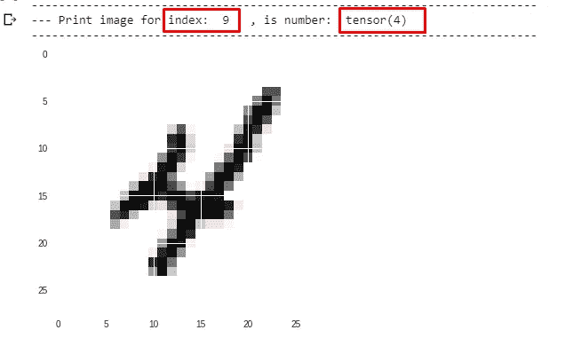

我们可以打印一些图片，仅供测试之用。前 18 个图像打印如下(代码可以在 [GitHub](https://github.com/MRobalinho/PyTorch-DEEP-LEARNING/blob/master/README.md) 上看到):

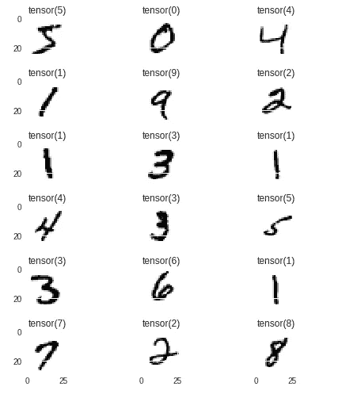

让我们训练模型。我训练了 10 个纪元:

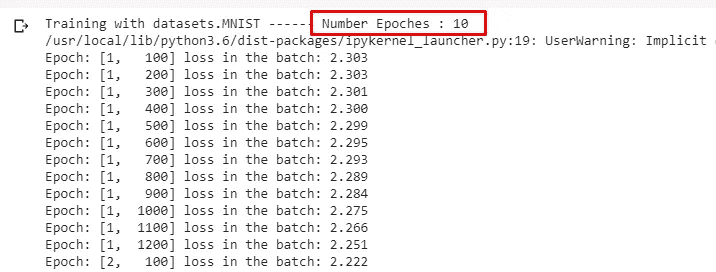

我们可以验证我的测试的准确性，我们有 94%。很好

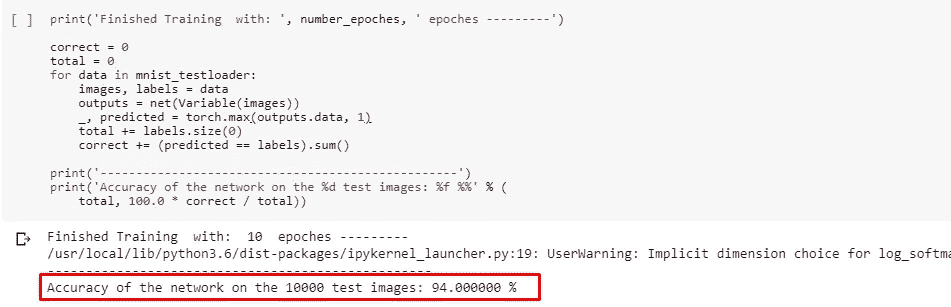

非常好，因为我只用了 10 个 epoches。我用 20 个 epoches 对系统进行了测试，结果显示准确率为 98%。站台

## 结论:

PyThorch 算法使用协作平台实现起来简单、准确且非常可靠。该合作平台高效、快速、非常稳定，允许轻松改编其他专业人员开发的代码，用作这项工作的参考。

**参考文献:**

PyTorch 网页:【https://pytorch.org/ 

红龙 GitHub[https://gist.github.com/reddragon](https://gist.github.com/reddragon/3fa9c3ee4d10a7be242183d2e98cfc5d):[MNIST 数据集的例子](https://gist.github.com/reddragon)

哈米德雷扎·萨吉尔:[https://hsaghir.github.io/data_science/pytorch_starter/](https://hsaghir.github.io/data_science/pytorch_starter/)

http://rasbt.github.io/mlxtend/user_guide/data/mnist_data/ MNIST 数据集:

[Sanyam Bhutani](https://medium.com/@init_27?source=post_header_lockup):[https://medium . com/init 27-labs/py torch-basics-in-4-minutes-c 7814 fa 5 f 03d](https://medium.com/init27-labs/pytorch-basics-in-4-minutes-c7814fa5f03d)