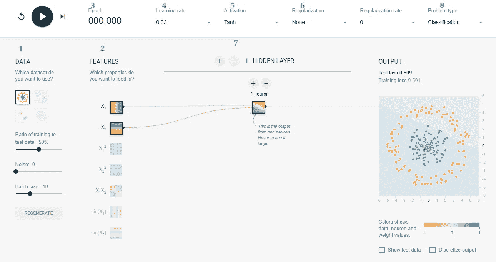

# 用 TensorFlow 游乐场进行深度学习

> 原文：<https://medium.datadriveninvestor.com/deep-learning-with-tensorflow-playground-e6b194ee8fac?source=collection_archive---------4----------------------->

# 介绍

这一切都要感谢丹尼尔·斯米尔科夫和 Shan Carter，他们在[https://playground.tensorflow.org](https://playground.tensorflow.org)上创建了一个教育可视化，这样一个天真的人可以很快理解并澄清他关于深度学习的概念。在本文中，我将使用 [TensorFlow](https://engmrk.com/tensorflow-understanding-basic/) playground 来模拟改变神经网络超参数的影响。它将帮助我们加强我们的深度学习概念。

首先，我们将按照下图中描述的数字 1 到 8 来理解一些术语。

TensorFlow Playground

**1-数据**

我们有六个不同的数据集圆，异或(异或)，高斯，螺旋，平面和多高斯。前四个是分类问题，后两个是回归问题。小圆圈是对应于正 1 和负 1 的数据点。一般来说，正值以蓝色显示，负值以橙色显示。

在隐藏层中，线条由神经元之间连接的权重来着色。蓝色表示正权重，这意味着网络正在使用给定的神经元输出。橙色线表示网络正在分配负权重。

在输出图层中，点根据其原始值显示为橙色或蓝色。背景颜色显示网络对特定区域的预测。颜色的强度显示了预测的可信度。

**2-特性**

我们有七个特征或输入(X1、X2、平方、乘积和正弦)。我们可以打开和关闭不同的功能，看看哪些功能更重要。这是特征工程的一个很好的例子。

**3 个时期**

历元是数据集的一次完整迭代。

**4-学习率**

*学习率(alpha)* 是超参数，负责接近局部最优的速度。

**5-激活功能**

一个 [**激活函数**](https://engmrk.com/activation-function-for-dnn/) 是你添加到输出层或者任何神经网络的两层之间的一个节点。它也被称为传递函数。激活功能决定了是什么导致神经元触发。激活函数基本上有两种类型线性&非线性。

[另查:深度神经网络如何选择激活函数](https://engmrk.com/activation-function-for-dnn/)

**6-正规化**

正则化 L1 和 L2 的目的是减少过度拟合。过度拟合是指模型对其接受训练的数据工作得非常好，但该模型对它以前没有见过的任何数据提供的预测很差。

**7-神经网络模型或感知器**

神经网络模型是由称为神经元的简单元素组成的网络，神经元接收输入，根据该输入改变其内部状态(激活)，并根据输入和激活产生输出(0 或 1)。我们在最简单的神经网络中有一个输入，一个输出和至少一个隐藏层，称为浅层神经网络。当隐藏层为 3 层或更多时，我们称之为深度神经网络。每个隐藏层都有称为神经元的实际工作元素，这些神经元从特征或前身神经元获取输入，并计算线性激活函数(z)和输出函数(a)。

详情请查看:【https://engmrk.com/module-14-artificial-neural-network/ 

**8-题型**

我们有四个数据集用于分类，两个数据集用于回归问题。我们可以选择我们想研究的问题类型。

## 用例

***A-为什么我们在隐藏层增加神经元？***

我们将从隐含层中具有单个神经元的基本模型(浅层神经网络)开始。让我们选择数据集“圆”，特征“X1”和“X2”，0.03 学习率和“ReLU”激活。我们将按下运行按钮，等待 100 个周期完成，然后单击暂停。

即使在完成 100 个周期后，测试和训练损失也大于 0.4。现在，我们将使用加号按钮在隐藏层中添加四个神经元，然后再次运行。

现在，我们的测试和训练损失小于 0.02，并且输出被很好地分为两类(橙色和蓝色)。隐藏层中神经元的增加提供了分配不同权重和并行计算的灵活性。然而，在一定程度上增加神经元将会在计算上很昂贵，却没有什么好处。

***B-为什么对分类问题使用非线性激活函数？***

在神经网络中，对于所有分类问题，我们只使用非线性激活函数，因为我们的输出标签在 0 和 1 之间，而线性激活函数可以提供从-无穷大到无穷大之间的任何数字。因此，输出在任何时候都不会收敛。

在上面的视频中，我们运行了相同的模型，但使用了线性激活，它没有收敛。经过 100 个周期后，测试和训练精度大于 0.5。

另外，检查:[https://engmrk.com/activation-function-for-dnn/](https://engmrk.com/activation-function-for-dnn/)

***C-我们为什么要增加隐藏层？***

现在，我们将添加一个两个神经元的隐藏层，并按下运行按钮。

我们的测试和训练精度在仅仅 50 个时期内降低到 0.02 以下，几乎是单隐层模型的一半。与神经元类似，添加隐藏层不会是所有情况下的好选择。有时，它在计算上变得很昂贵，却没有带来任何好处。这在下面的视频中得到了很好的解释，我们添加了六个隐藏层，每个层中有两个神经元。即使过了 100 年，我们也不能取得好成绩。

***D-为什么 ReLU 激活是隐藏图层的好选择？***

校正线性单位(ReLU)是所有隐藏层的首选，因为只要 z 为正，它的导数就是 1，而 z 为负，它的导数就是 0。在某些情况下，泄漏依赖可用于避免精确的零导数。另一方面，sigmoid 和 tanh 函数都不适用于隐藏层，因为如果 z 非常大或非常小，函数的斜率会变得非常小，从而减慢梯度下降。

我们将使用不同的激活函数(ReLU、sigmoid、tanh 和 linear)运行训练，我们将看到影响。

在上面的视频中，很明显 ReLU 的表现优于其他所有激活功能。Tanh 在我们选择的数据集上表现很好，但效率不如 ReLU。这就是 ReLU 在深度学习中如此受欢迎的原因。

***E-添加/减少或更改输入功能会有什么影响？***

所有可用的特征对问题建模都没有帮助。事实上，使用所有特征或不相关的特征在计算上将是昂贵的，并且可能影响最终的精度。在实际应用中，可能需要进行大量的反复试验才能确定哪些特性对问题建模最有用。我们将通过使用模型中的不同特性来演示这一点。

通过将输入特征从线性变为方形，我们仅在 40 个时期内实现了小于 0.01 的精度。另一方面，乘积和正弦特性并没有真正的帮助。选择最佳输入特征的过程称为[特征工程](https://engmrk.com/feature-engineering-ver2/)。

你可以访问这个教育平台，尝试更多的数据集和不同的功能。我们再次感谢该工具的作者和所有贡献者，因为他们在 [GitHub](https://github.com/tensorflow/playground) 上开源了该工具，希望它能让神经网络变得更容易访问和学习。

本文最初发表于[https://engmrk.com。](https://engmrk.com.)

[点击此处参考。](https://engmrk.com/deep-learning-with-tensorflow-playground/)

# 来自 DDI 的相关帖子:

 [## 用 7 个步骤解释深度学习——数据驱动投资者

### 在深度学习的帮助下，自动驾驶汽车、Alexa、医学成像-小工具正在我们周围变得超级智能…

www.datadriveninvestor.com](https://www.datadriveninvestor.com/2019/01/23/deep-learning-explained-in-7-steps/)  [## 数据科学和软件工程哪个更有前途？-数据驱动型投资者

### 大约一个月前，当我坐在咖啡馆里为一个客户开发网站时，我发现了这个女人…

www.datadriveninvestor.com](https://www.datadriveninvestor.com/2019/01/23/which-is-more-promising-data-science-or-software-engineering/)