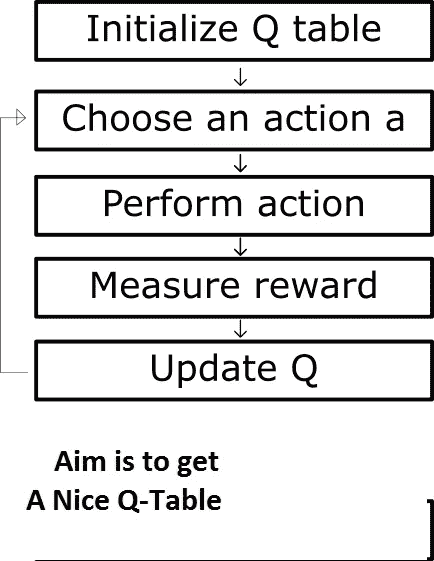
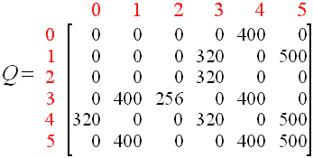
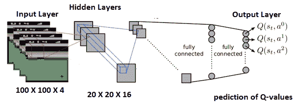
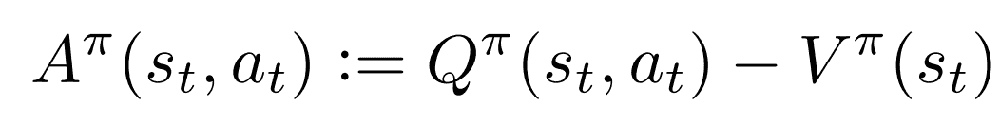
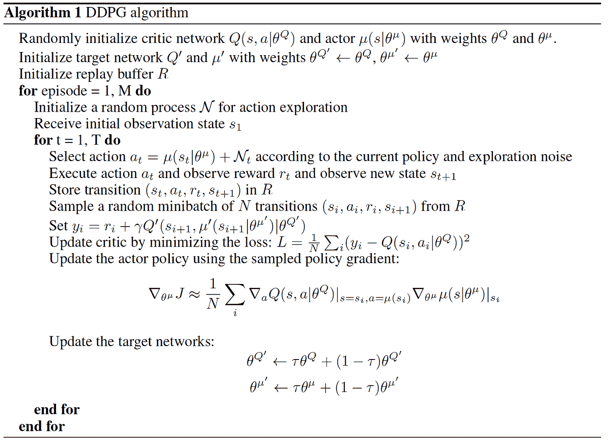
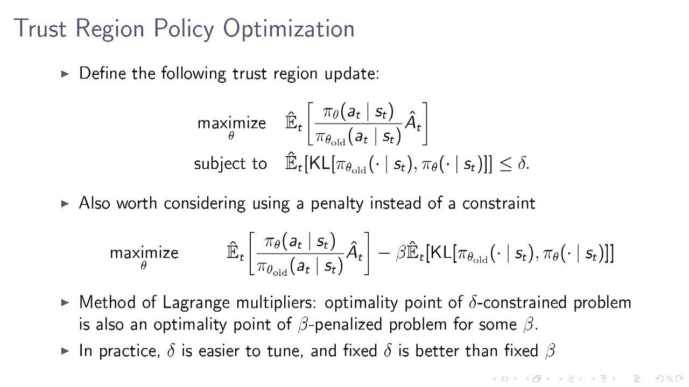

# 深度强化学习

> 原文：<https://medium.datadriveninvestor.com/deep-reinforcement-learning-4149def586bb?source=collection_archive---------8----------------------->

[](http://www.track.datadriveninvestor.com/1B9E)

> ***在 RL 的一系列持续改进中，我们从 Q-learning 到 SARSA 到深 Q 网(DQN)再到 DDPG。Q-learning 缺乏通用性，是一种非策略算法。SARSA 是基于策略的算法，但缺乏通用性。为了解决一般性问题，深度神经网络，更好地被称为 DQN，被用来获得 Q 值，因此它为看不见的情况给出 Q 值。当我们有小的/离散的行动空间时，它工作得很好。***



想象你正在构建一个游戏玩家(代理)，可以在任何时候(状态)采取最佳决策。

代理人需要为每个状态选择最佳行动，以在游戏结束时最大化奖励。简而言之，代理人的目标是创建最佳策略，使从环境中获得的总回报最大化。

"当代理处于某种状态时，最好采取什么行动？"

答案就在 Q 表里。

Q-learning 就是根据状态和行动得到一个好的 Q 表。基于 Q 值公式，除了折扣因子和奖励方案之外，我们还可以获得给定状态和动作的 Q 值。它以迭代的方式学习。它的缺点是不能得到看不见的状态的 Q 值。当我们有更多可能的动作或更多可能的状态时，获取 Q 值是很麻烦的。

这个 Q 表通常在代理的整个生命周期中更新，所以可能被认为是最好的行动，在代理经历一段时间后可能不被认为是非常好的。



行是状态，列是动作。对于每个状态和动作组合，经过多次迭代后，它最终会创建 Q 值。

```
For unseen states, Q-table may not give 
good suggestion
```

请注意，在 Q-learning 中，代理不知道状态转移概率或奖励。代理只试图知道通过一个给定的动作从一个状态到另一个状态是有回报的。在值迭代法中，主体通过给定的动作发现状态转移概率。

===========================================================

1.  价值(V):贴现后的预期长期回报(不是短期回报 R)。*V-下标* π *作为状态 s 的函数*指的是在策略π下当前状态的预期长期收益。
2.  Q 值:又称动作值(Q)。q 值取决于状态 s 和动作 *a* 。*Q-下标π作为 s 和 a 的函数*表示当前状态 *s* 的长期返回，在策略π下采取行动 *a* 。

# [Q 学习与值迭代的区别](https://stackoverflow.com/questions/28937803/difference-between-q-learning-and-value-iteration)

> 通过值迭代，代理学习处于状态 x 时的预期成本。通过 q 学习，代理获得处于状态 x 并应用动作 a 时的预期贴现成本。

============================================================

为了克服通用性问题，创建了基于神经网络的 Q 值估计。它的名字叫深度 Q 网络(DQN)



DQN 也能够获得未知状态的 Q 值，因为它是基于神经网络进行学习的。DQN 是提高了新的想法双 DQN，决斗 DQN，优先经验重播。

深度确定性策略梯度(DDPG)算法采用经验重演的思想，将目标与 DQN 分离。它表现很好，特别是在连续的环境中，我们有一个大的行动空间。向参数空间或动作空间添加噪声增强了 DDPG 的能力。

如果我们没有这么小的行动空间，DQN 和其他老办法就行不通了。在这种情况下，我们需要使用具有基本参与者-评论家架构的 DDPG，其中参与者应该调整为给定状态决定最佳操作的策略函数的参数，评论家根据时间差异误差评估由参与者估计的策略函数。DDPG 遭受收敛问题或步长问题。然后，我们需要转向新的理念，如 TRPO、PPO，政策参数更新比以往任何时候都更智能。

> 引入了一个叫做优势的概念。



It shows how good the action is at given state, compared to the baseline(V). Baseline means the average of values while taking all possible actions at the given state.



注意一个状态的 Q 值叫做 value。由于在给定的状态下我们有许多可能的动作，我们需要一个指示器/操作符，称为优势，可以区分动作。优势是动作(和状态)的 Q 值减去状态的值。优势衡量新政策相对于旧政策有多好。

TRPO(Trust region Policy Optimization)解决了 DDPG 的主要问题，而不是其性能的单调改进。它利用信赖域的概念来求解。这里我们最大化了 KL 散度约束下的期望，目的是不允许政策参数有太大的变化。TRPO 有缺点，即由于 KL 发散及其二阶导数，计算和实现极其复杂。TRPO 的共轭梯度算法用于避免二阶导数，但是它使整体实现变得复杂。



这个复杂性问题通过 PPO(近似策略优化)来解决，其中使用了一个剪裁的代理目标函数。它修改了 TRPO 的目标函数，其代价是政策更新过大，并取消了代价高昂的限制。简而言之，PPO 提高了性能和实现。

> **Q-learning、DQN、DDPG、TRPO 和 PPO 是无模型和非策略算法。无模型表示目标函数是不可估计的，知识是通过试错来更新的。SARSA 是无模型和基于策略的，因为它基于当前操作学习价值。**

除了模拟、RL 代码、游戏玩家、NLP 中的 RL 和机器人之外，接下来的文章将涵盖 Advantage Actor critic 及其更好的版本异步 Actor critic。