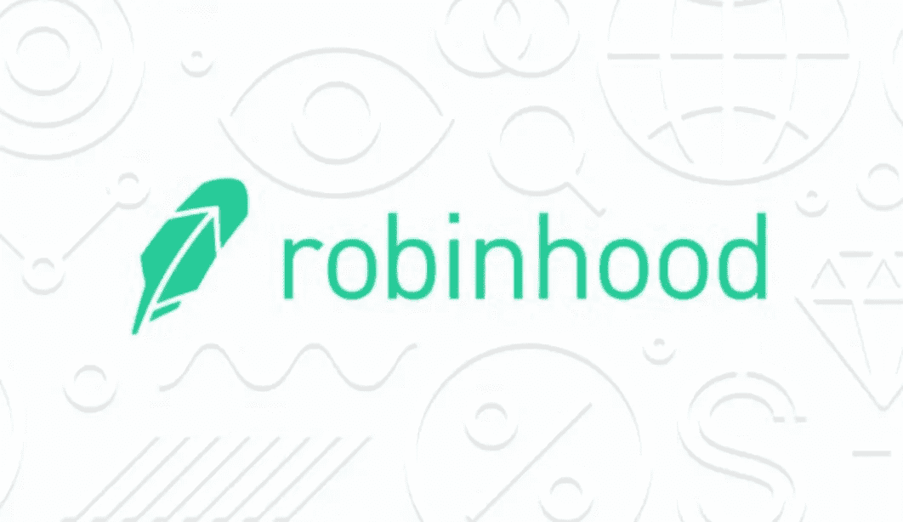
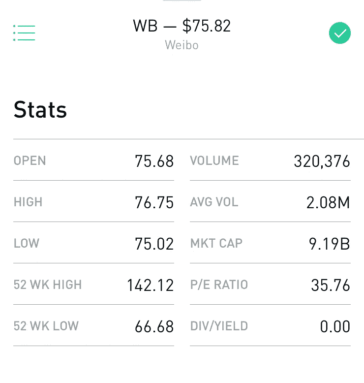

# 深入金融科技:罗宾汉和交易技巧

> 原文：<https://medium.datadriveninvestor.com/deeper-into-fintech-robinhood-trading-tips-86dcc9d2509d?source=collection_archive---------14----------------------->

Robinhood Twitter Banner

**简介**

也许你已经有机会阅读我以前的文章，“关注消费者的金融研究”在这篇文章中，我提出了几个主题，重点是日常生活中的人们如何塑造金融科技的发展。一个特别的话题是关于交易平台 Robinhood。作为我自己喜爱的 iPhone 应用程序之一，我想分享我使用这个基于应用程序的交易软件积极交易约 3 个月的经验。

如果你对金融或商业话题感兴趣，比如我在出版物中提到的话题，你可能会发现自己想尝试交易股票。通常，这个过程会引导你到你最喜欢的搜索引擎寻找答案。

您可能会发现自己在搜索框中键入短语，如:

> 成为成功交易者的秘诀
> 
> 我如何交易股票？
> 
> 哪里可以炒股？

如果你在问这些问题，你很可能是交易新手&我想说你可能会从 Robinhood 开始并阅读这篇文章中受益。也就是说，对于那些开始使用他们的第一个交易账户的人来说，这个平台可能是一个易于使用且成本较低的选择。

我将谈谈我自己用闲置资金交易的个人经历，在攻读国际商务理学硕士(MSc)期间，我积极阅读商业出版物，如华尔街日报或《经济学人》。我确实相信你从阅读这篇文章中获得的收获是有价值的，但是任何类型的投资都有风险。出于这个原因，不要投资那些不能让你亏损的资金，也不要仅仅依靠这篇文章来做投资决定。请将此建议作为一种信息形式，以补充您对平台 Robinhood 的理解，并了解股票市场的趋势和工作知识。

让我们来谈谈 Robinhood，以及为什么它是第一个交易账户或那些投资组合价值较小的账户的好选择。

**不收费。**金融科技应用取消了传统上与发起买卖相关的所有经纪费。在传统的情况下，你可以支付 10 美元来启动你的买入，并支付额外的费用来卖出同样的股票。对于寻求从市场短期波动中获利的投资者来说，这尤其令人不安。如果不超过买卖费用，所有利润都可能减少。在同样的条件下，短期损失可能会增加。

然而，如果罗宾汉没有通过佣金从买卖交易中获利，他们是如何获利的？Robinhood 的[帮助中心](https://support.robinhood.com/hc/en-us/articles/360001226106-How-We-Make-Money)表示，它通过为高级会员开设的 Robinhood 黄金账户以及像银行一样从现金和股票中收取利息来盈利。

**通过手机应用程序访问。**另一个与众不同之处在于能够通过手机进行实时交易。我相信这是一个很大的吸引力，让那些可能根本没有笔记本电脑或在交易时无法访问的人能够使用。在证券交易所的大厅里给经纪人打电话交易的日子已经一去不复返了。

**混乱的界面。**有时候少即是多。这款应用相当精简，不像你在 ThinkorSwim 这样的平台上看到的那么多花哨。有更少的混乱，但你仍然能够根据应用程序中的资源做出决定。然而，那些高度依赖技术分析的人可能会发现图表缺少一些特征。

**访问新闻源。分析师对市场的看法以及你对价值趋势的预期将很快成为你的朋友。Robinhood 的平台在应用程序中直接提供链接到一些流行的免费资源，如 MarketWatch 和 Seeking Alpha。信息就是力量，平台会把你送到相关的来源开始你的研究。**

**简单的指标汇总。**该应用程序提供了将为您的购买决策提供信息的指标。分析师或交易员可能更依赖于一些指标，但 Robinhood 在具体公司简介的图表数据下提供了一个很好的常用指标总结。

Robinhood iOs Screenshot

**更新。**该应用一直在进行一些更新，随着用户数量的持续增长，肯定会看到更多更新。增加了新的功能，如分析师评级，出现在&人们也购买部分。

**下载应用程序**

既然你已经对这个平台有了更多的了解，那就把这个应用下载到你的 iPhone(比如我已经做过的)或者其他设备上。安卓上也有版本。

要创建您的帐户，您需要各种信息，包括但不限于以下信息:

*-18 岁或以上*

*-美国公民身份证明(SSN)*

*-查询账户信息*

*-地址*

注册是免费的，但是记住你需要有资金来开始交易。有一个付费选项，即 Robinhood Gold premium 帐户，它可以打开诸如盘后交易(当股票市场对公众关闭时)等门控功能。这个高级版本还为交易目的提供额外的信用额度。

现在你有一个活跃的帐户，转移资金的价值你可以放心交易。在这一点上，你应该评估你的*风险承受能力*或者你对初始投资的承受能力。我用大约 250 美元开始交易，以确定我的交易能力和市场波动性。随着我对交易越来越熟悉，我开始增加我的存款。

转移过程相当快。Robinhood 通常会在资金从您的银行实际转移之前贷记您的帐户，因为他们可以验证您有一个有效的帐户和可用的资金。你可以在这些资金被正式转移之前使用这个信用系统进行交易。

**交易提示&点位的进一步研究**

在你开始之前，让我们讨论一些话题，这些话题可能会进一步影响你的交易，给你带来成功。在开始计划放弃你的日常工作，成为日间交易者之前，你应该更深入地阅读这些主题。

**黄金法则。**低买高卖。也就是说，总是以低于你卖出股票的价格执行交易。简单吧？如果你能执行这一规则，你将永远获利。然而，你可能知道这并不像我说的那么简单，股票市场还有更多错综复杂的地方。

了解你的投资。沃伦·巴菲特是一位非常成功的投资者，他的名字你可能听说过，他会告诉我们只买我们了解的公司。很难和一个赚了几百万的投资者争论，我说的对吗？他的话很有道理。如果你不了解一家公司是如何盈利的，你又怎么能知道这家公司的股票是否会继续增长呢？你不仅需要知道你在买什么，还需要知道从整个行业的角度来看正在发生什么。也就是说，与竞争对手相比，你打算投资的公司表现如何？哪些新趋势会影响公司的成功？由于国家法规或争议，交易是否存在固有风险？

**基本面&技术分析。**关于商业模式或行业分析的问题是基本面分析更广泛主题的一部分，可能需要进一步研究才能完全掌握。技术分析是这个讨论的另一部分。交易者通常更依赖基本面或技术面的分析。我建议涵盖你的所有基础，并理解两个角度，以做出更好的决定。

不管是基本面还是技术面，你需要了解你是哪种交易者，这将伴随着对这些分析技术的理解。然后，你会开始明白你想交易的频率，你会持有某只股票多长时间，什么股票会引起你的兴趣，你应该关注的行业，或者你可以从你的努力和初始投资中获得什么样的利润。

预测波动。有人可能会说股票有自己的个性。你会看到这些随着新消息的爆发或随着对其跨时间段图表的分析而开始出现。你可能会开始注意到在特定的时间里有每天的高点或低点。预测这些可以让你在交易中获得更大的利润。如果你像日内交易者或摇摆交易者那样频繁交易，这些波动就是你应该从中获利的。

**新闻。**股票市场受到投资者看法的高度管制。媒体或任何受人尊敬的分析师可能会报道会让你的股票上涨的消息。也就是说，交易者正在积极寻找更多关于他们投资的信息，如果他们听到负面新闻的风声，他们可能会卖掉他们的股票。如果大量抛售特定股票，股价肯定会下跌，你的投资组合价值也会下跌。这就是你订阅《华尔街日报》或《经济学人》可能派上用场的地方。你听说过美中贸易战吗？如果你有，你可能会在购买中国公司的股票时三思而行。

**闭幕词**

从 Robinhood 开始很简单，而且可能会有回报，因为该平台为用户提供了一个简单而自由的交易选项。功能是干净的，更新正在逐步完成。现在你应该准备好开始你新的交易爱好了。虽然平台是一个很好的选择，但交易是一项具有挑战性的工作。做你的研究，了解你的投资预期表现，以确保你做出明智的购买决定。

本文在高层次的概述中顺便提到了许多概念。有丰富的资源供你支配，以帮助支持你的理解。我还会继续写类似的主题，所以请关注新的出版物或给我留下建议。

最诚挚的问候，

李·理查森