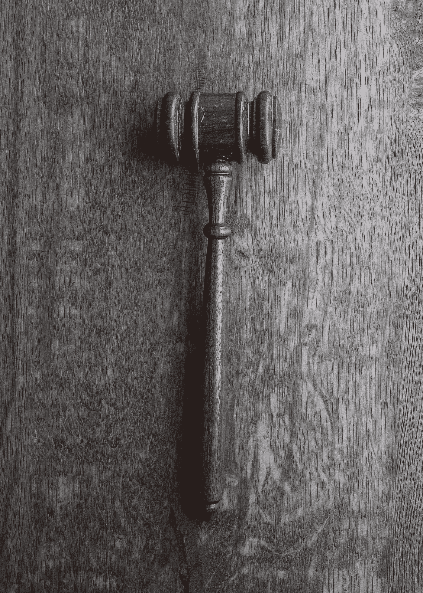

# Deepfake 破坏信任:人工智能进入一个充满可怕的政治和个人影响的幻觉世界

> 原文：<https://medium.datadriveninvestor.com/deepfake-destroys-trust-ai-enters-a-world-of-illusion-with-dire-political-and-personal-255d22133cb?source=collection_archive---------6----------------------->

Photo by [Christian Gertenbach](https://unsplash.com/@kc_gertenbach?utm_source=unsplash&utm_medium=referral&utm_content=creditCopyText) on [Unsplash](https://unsplash.com/collections/4710659/deep-fake?utm_source=unsplash&utm_medium=referral&utm_content=creditCopyText)

儿童出现在色情视频中，名人和政治家也是如此。参议员特德·克鲁兹穿着不合适的服装性感地跳舞？不，这不是一个“谎言”，而是一个例证，说明了当软件的目标是高销量、金钱、政治扭曲或名誉[破坏记者](https://www.howtogeek.com/427224/what-is-a-deepfake-and-should-i-be-concerned/)时，它能做什么。

假新闻是这个强大的[软件](https://sites.google.com/site/thedeepfakestate/deepfake-tools)的主要目标之一，它甚至可以吸引最专业的用户。一个简单的周六夜现场视频能做什么？这里有一个[的例子](https://www.youtube.com/watch?v=-QvIX3cY4lc)。

 [## 人工智能与创意:作为创意引擎的 BigGAN |数据驱动的投资者

### 的确，2018 年可以被视为人工智能创造的创造力全盛时期的开始。当然可以…

www.datadriveninvestor.com](https://www.datadriveninvestor.com/2019/02/13/ai-creativity-biggan-as-a-creative-engine/) 

虽然 SNL 的视频可能很有趣，但 Deepfake 的严重性不容忽视。伊恩·古德费罗斯最初在 2014 年提出了这个概念。Goodfellows 是教材“[深度学习](http://www.deeplearningbook.org/)”的作者。

它最初不是为色情视频而创建的，随着底层人工智能软件不断改进其产品，它的使用迅速蔓延。机器学习系统 GAN ( [生成对抗网络](https://en.wikipedia.org/wiki/Generative_adversarial_network))从事不断评估其产品以自行改进的机器训练。不需要人工干预。考虑到它的全部能力，最终产品可以令人震惊地可信。

这个想法非常简单；两个程序互相合作，其中一个是“对手”第一个程序为想要的最终产品挑选照片或视频；第二个程序评估第一个程序从输入中收集到的信息并进行修改。最终产品是令人信服的新照片或视频，并在需要的地方配有音频。在 GAN 输入介入之前，照片或视频从未存在过。

## 谁有软件？

这款软件使用起来并不复杂，也不具有挑战性。它只需要一个足够大的显卡，就可以供游戏玩家使用，或者访问云服务器来完成这项工作。

教程在网上很容易找到。在 15 分钟内，任何用户都可以获得足够的知识来创建简单的假视频，然后继续提高他们的技能。

如果你不想使用该软件提供的模板，还需要多一点培训，但这仍然是任何决心制作 Deepfake 视频的人都可以做到的。或者你可以雇一个在线的人，花 10-30 美元帮你做这项工作。

最有可能被利用的图像是那些在数百小时的视频中出现过的人；想想网上或家庭视频。将家庭视频上传到脸书或其他平台为儿童色情作坊提供了温床，但家庭并不知道这种邪恶的活动。有多少个小时的无辜儿童会被色情工厂利用？

政客也是首要目标，任何经常出现在电视或网络研讨会或演讲中的人也是如此。

但是他们所说的呢？你怎么能改变呢？ [Adobe](https://www.youtube.com/watch?v=I3l4XLZ59iw) 一直在开发允许你输入任何东西的软件，它会把声音放进视频。但在 2016 年的讨论之后，它就消失了。它去了哪里，为什么去了？似乎没人知道。

[斯坦福大学](https://newatlas.com/edit-talking-head-text-deepfake/60160/)还没有发布将改变视频的语音创作程序。

正如一篇关于斯坦福项目的文章所指出的，“这个软件背后的研究团队做了一些微弱的尝试来处理其潜在的滥用，提供了一个解决方案，任何使用该软件的人都可以选择性地将它标记为赝品，并提供“编辑的完整记录”。"这不是滥用的障碍."

[视频水印](https://filmora.wondershare.com/video-editing-tips/remove-watermark-from-video.html)不保护视频，如果你上传视频给某个网站，它就会移除。我肯定是有费用的，但是假保护会有多深还不知道。

Photo by [Wesley Tingey](https://unsplash.com/@wesleyphotography?utm_source=unsplash&utm_medium=referral&utm_content=creditCopyText) on [Unsplash](https://unsplash.com/s/photos/laws?utm_source=unsplash&utm_medium=referral&utm_content=creditCopyText)

## 法律含义

" [*Deepfakes*](https://slate.com/technology/2019/07/congress-deepfake-regulation-230-2020.html) *是对抗真理的最新武器，国会正在关注。该技术允许任何人制作从未发生过的事件的令人信服的视频，引发了人们对深度造假的担忧，这种造假可能会加剧政治分歧，引发暴力或针对个人。事实上，这项技术已经被用来制作非自愿的色情作品。但是，推动国会采取行动的是对 2020 年总统选举被一个假货扰乱的担忧。*

*“首个针对 Deepfakes 的联邦法案* [*恶意深度假货禁止法案*](https://www.congress.gov/bill/115th-congress/senate-bill/3805) *于 2018 年 12 月出台，随后的* [*DEEPFAKES 问责法案*](https://www.congress.gov/bill/116th-congress/house-bill/3230) *于今年 6 月出台。几个州也出台了针对 Deepfakes 的立法，包括* [*加利福尼亚州*](https://leginfo.legislature.ca.gov/faces/billNavClient.xhtml?bill_id=201920200AB1280)*[*纽约州*](https://nyassembly.gov/leg/?default_fld=&leg_video=&bn=A08155&term=2017&Summary=Y&Text=Y) *和* [*得克萨斯州*](https://capitol.texas.gov/BillLookup/Text.aspx?LegSess=86R&Bill=SB751) *。在 6 月份众议院情报委员会关于这个主题的听证会上，立法者暗示更多的治理即将到来，很可能是以社交媒体监管的形式出现。**

*一些国家已经禁止使用这种技术，因为它侵犯了隐私，助长了诽谤行为。鉴于目前的僵局，联邦法律需要多长时间来防止在我们的政治或企业系统中使用 Deepfakes 是值得怀疑的。*

## *如何阻止 Deepfakes？*

*毫无疑问，Deepfake 软件可以制造笑声，增加学校课程中学习的持久力。为什么孩子们不想让一只恐龙开始背诵《权利法案》？他们会急切地学习它，而恐龙的形象会将这种学习深植于他们的大脑中。*

*真正奇妙的工具。该工具还可以[创造“不真实”的人](https://www.youtube.com/watch?time_continue=156&v=E_oH0xS5e94)。想让一位女性选民说出她投票给某人的原因吗？创造那个人，你就有了“她”*

*由于枪支使我们能够在向西部荒野转移的过程中养活自己，它们也可能被非法使用。因此，Deepfake 视频也有令人不安的一面，这促使谷歌工程师 Supasorn Suwajanakorn 开始设计一种发现 Deepfake 视频的方法。他正在开发[现实卫士](http://aifoundation.com/responsibility/)，一款检测虚假照片和视频的应用。*

*"[*Reality Defender*](http://aifoundation.com/responsibility/)*是一款智能软件，旨在与数字体验(如浏览网页)一起运行，以检测潜在的虚假媒体。与病毒保护类似，它扫描用户遇到的每张图像、视频和其他媒体，以查找已知的假货，允许报告可疑的假货，并通过各种人工智能驱动的分析技术运行新媒体，以检测更改或人工生成的迹象*。”*

*他被[引用](http://www.ciobulletin.com/software/supasorn-to-develop-reality-defender)的话说，*“视频操纵将被恶意使用，除非反制措施到位。”**

*Deepfake 的未来一点也不“未来”，因为它就在这里，而且正被积极地用于其开发者从未打算过的用途。但不管是好是坏，戴白帽子的人必须帮助我们警惕那些试图操纵我们的选举、诽谤我们、伤害我们的孩子和我们的企业实体的黑帽子。*