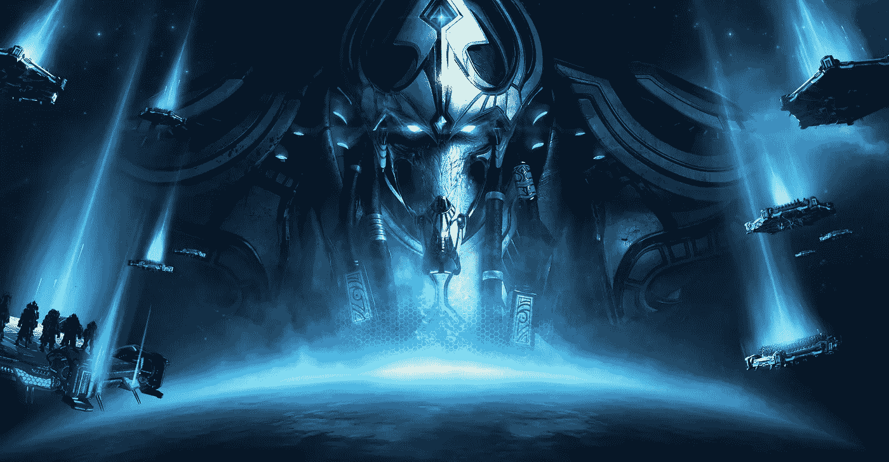
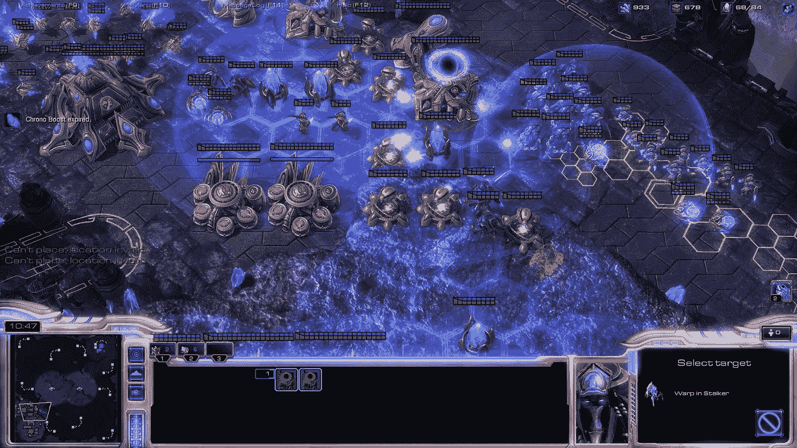
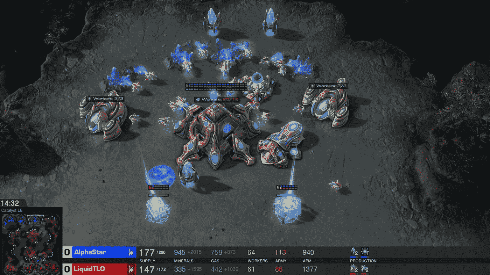

# DeepMind 的毁灭之路放倒两名星际争霸 2 职业玩家

> 原文：<https://medium.datadriveninvestor.com/deepminds-path-of-destruction-takes-down-two-starcraft-ii-professional-players-71c55202461d?source=collection_archive---------11----------------------->

Protoss character Artanis

> 上周的展览展示了我们已经走了多远，还有多远的路要走。

为了展示人工智能已经取得了多大的进步，alpha star——谷歌 DeepMind 的新版本——在一系列比赛中与亲《星际争霸 2》玩家进行了比赛。暴雪的电子竞技冠军是一个复杂的游戏，没有单一的获胜策略。它在单人模式下拥有自己的人工智能，严重依赖手工制作的规则，比玩家更了解地图，并且能够以比人类快得多的速度同时采取多种行动。鉴于这款游戏的复杂性以及自游戏正式发布以来元游戏已经走了多远，当两周前 AlphaStar 以 10 比 1 击败达里奥“TLO”温施和格热戈尔兹“马纳”科姆尼茨时，所有人都感到惊讶。

《星际争霸 2》是由暴雪娱乐公司开发的一款复杂的即时战略(RTS)游戏，要求玩家在任何给定时刻考虑数百个选项，思维敏捷，每分钟动作数高(APMs)，并做出锐利的决策。在这个游戏中，玩家收获资源并把它们花在三件事上:建筑、单位和研究。当玩家的建筑被摧毁时，玩家被消灭；每个人开始游戏时都有一个建筑和一些收割和建造单位。它的主要目的是创造一个经济和/或军事优势，这样你的部队就可以压制你的对手并摧毁他们的建筑。星际争霸 2 有单人游戏和合作战役，但真正的交易在于竞争性的多人游戏体验。

游戏的原始人工智能从非常容易到精英(也有一些作弊选项)，但即使在最困难的难度下，计算机对手通常也缺乏适应性，即兴创作和想象力，这正是人类玩家的独特之处。然而，AlphaStar 有所不同。它最初是通过观看人类比赛来学习的，然后通过与不同版本的自己比赛来磨练自己的技能。人工智能的第一次迭代观看了游戏的重播，以学习“微观”(单位控制)和“宏观”(游戏经济和地图移动/意识)策略的基础。通过这种训练，它能够在 95%的情况下在精英难度上击败游戏中的电脑对手。

星际争霸 2 的比赛一般都很长，执行的动作数量远高于 DeepMind 之前的成就 GO 之类的回合制中的回合数量。在游戏开始时做出的决定可能只有在以后才有用。在对手眼里，错误的决定仍然可能被视为正确的决定，或者即使玩家设法纠正了错误，扭转了比赛。一个策略的成功只能在每局结束时分析，而所有成功的策略仍然可以反制。

地图上未被占据的区域被所谓的“战争之雾”所覆盖，这使得玩家无法在不离开单位或建筑的情况下看到这些区域发生的事情，这意味着星际争霸 2 是一个玩家需要适应他们在任何给定时间可以获得的信息量的游戏。在一些比赛中，人工智能有一个人类球员没有的巨大优势:它能够看到地图上所有可见的部分，而人类球员必须操纵摄像机。意思是，人工智能的“战争迷雾”被关闭了。

在围棋中，AlphaGo 可以将位置移动到任何自由的位置，它的决定会立即改变棋盘。另一方面，AlphaStar 需要有一些时间观念，知道如何提前规划自己的战略，并更好地判断在游戏的后期应该走哪条路。

就像之前提到的，星际争霸 2 是一款 RTS。玩家对他们的观察反应越快，对他们来说结果就越好。DeepMind 的工程师们设法训练出能够像职业选手一样快速应对各种情况的代理人(甚至更快，尽管规则不允许这样做)。所有的游戏都是在一张地图上和一个种族一起玩的(神族对神族)。给代理人的是所选地图的小地图表示，而不是一系列截图。

Protoss unit placement

但是，AlphaStar 没有学星际争霸 2；它学会了在地图上执行哪些动作，以及如何根据任何给定时间的可用信息来计时。尽管这是一个令人印象深刻的技术进步展示，但这并不是一个小差异:AlphaStar 可能无法在不同的地图上击败人类，无论是与不同的种族，甚至是玩不同版本的游戏。即使预计人工智能将设法学习如何玩其他种族，学习的能力仍然会与我们在随机环境中感知和选择行动的方式不同。这意味着，尽管人工智能作为一个研究领域取得了巨大成就，但 AlphaStar 只在一个预先选定的领域取得了成功。

在这些比赛中，DeepMind 训练了一系列人工智能代理，每个代理的侧重点略有不同，进行了一周的实时训练——这大致相当于 200 年的星际争霸——然后选择了表现最好的代理与人类玩家进行比赛。有了 200 年的经验，谷歌的游戏 lovechild 仍然犯了一些明显的错误。它过度构建了无用的单元，遇到了瓶颈，并且通常不使用它所拥有的所有工具。尽管如此，它仍然以 10 比 1 获胜。

AlphaStar faces Dario “TLO” Wünsch

在与虫族玩家 TLO 的第一场比赛后，DeepMind 将 AlphaStar 送回了人工智能标准的训练中，持续了 200 多年。差别是显而易见的。人工智能不再犯明显的战术失误，它的决定对人类观察者来说仍然毫无意义，但更难识别它们是战略失误还是天才之举。

之后，DeepMind 回到了双曲线时间室。在这里，一个新版本的 AlphaStar 接受了训练，它必须操纵摄像机，并且仍然使用 200 年的训练和从锦标赛中选择最佳代理的过程。事实证明，手动操作相机比看起来更复杂:AlphaStar 输给了 MaNa。摄像机的移动严重影响了游戏的质量，使其无法实现 AlphaStar 其他版本在之前比赛中的精彩策略。

DeepMind 的研究人员强调，他们试图让人工智能和人类玩家之间的竞争尽可能公平。人工智能不允许有超人的反应时间或高得离谱的 APMs。尽管如此，这场表演赛的公平性还是受到了质疑；虽然行动的数量受到限制，但重要的不是数量，而是这些投入的质量。职业玩家倾向于发送垃圾信息，只是为了让他们的手指保持温暖和活动，并且仍然受到物理和生物法则的限制。另一方面，AlphaStar 可以在任何给定的时刻以像素级的精度为单独的单元进行输入。即使它降低了 APM，当它参与大规模冲突时，同样的指标飙升至近 1000 次击键。

以上所有内容构成了我渴望看到 DeepMind 在其已经具有开创性的人工智能中实现的改进清单。AlphaStar 对玩家的战略优势很大程度上归结于微观层面。它的军队在机械上更擅长包抄和智取人类军队，部分原因是它可以同时指挥五支军队，这是人类无法做到的。在这些游戏中，很少有甚至没有战术可以被职业玩家在《星际争霸 2》场景中采用的例子，主要是因为人工智能并没有在想出更好的战术方面击败玩家，而是找到了有利于自己的战术。虽然在单位管理和反应时间方面，人工智能在技术上属于人类的范围，但由于其更高的精度，它仍然具有优势。考虑到所有的事情，可以肯定地说应该有更多的障碍。

毫无疑问，DeepMind 的展示赛在展示他们训练星际争霸 2 人工智能的令人印象深刻的系统方面做得很好，这导致了有史以来最强的机器人。我相信，随着更多的数据和更多的训练，他们生产的代理人可能会在击败即使是最好的人类玩家方面更加精细。然而，关于 DeepMind 是否能够创造 100%公平的机器人体验，以及是否有可能在代理和玩家之间建立合法的竞争，仍然存在很大的问号。现在，即使在阻碍了它的智力和意识之后，高级别的控制仍可能使它获胜。

如果为了在星际争霸 2 中获胜，你通过极其精确地控制数百个单位而不是变得聪明会受益更多，那么一个不同的问题出现了:如果我们不得不继续限制代理人公平地与人类比赛，星际争霸真的是一个训练强大人工智能的游戏的好选择吗？

*要了解更多信息，请阅读 DeepMind 关于 https://bit.ly/2B5YrKh*[的深度报道](https://bit.ly/2B5YrKh)

*为亮点，勾选:*[https://youtu.be/6EQAsrfUIyo](https://youtu.be/6EQAsrfUIyo)

# DDI 特色数据科学课程:

*   [**用于数据科学的 Python**](http://go.datadriveninvestor.com/intro-python/mb)
*   [**Scikit-Learn**](http://go.datadriveninvestor.com/scikitlearn/mb)
*   [**深度学习**](http://go.datadriveninvestor.com/deeplearningpython/mb)

**DDI 可能会从这些链接中收取会员佣金。我们感谢你一直以来的支持。*