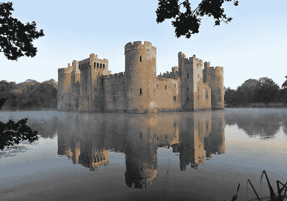

# 防御护城河

> 原文：<https://medium.datadriveninvestor.com/defensive-moats-b1d6758a7e9b?source=collection_archive---------10----------------------->

再来说说护城河。如果你回想起四年级的历史，想象一个中间有一座城堡的小湖，那你就对了。护城河是一种纯粹的防御性战斗技术，它们在我们的加密货币投资心理模型中起着关键作用。从本质上讲，护城河将帮助我们区分一般投资和重大投资，以及具有巨大长期潜力的投资和我们不太确定五年后会出现的投资。

> 有 5 种主要类型的护城河:品牌、转换成本、垄断、专有和价格。我们将关注的是品牌、转换成本和价格。垄断和专有护城河并不真正适用，因为大多数加密货币都是开源的，我们可以随心所欲地克隆任何我们想要的加密货币。

品牌是目前(2018 年末)最重要的护城河。比特币在技术上不如几乎所有其他主要的加密货币，它不像以太坊那样完全，而且与 Dash 等货币相比，它是一种非常昂贵的货币转移方式。由于长期激烈的内战，它也分裂了几次；然而，比特币仍然是加密货币的首选，占据大约 40%的主导地位。这是为什么呢？品牌。

当你第一次听说加密货币时，我打赌是比特币。十有八九，你读了一篇文章或者一个朋友向你介绍了这种新奇的货币形式，他们谈论的是比特币，而不是比如说 Monero。比特币是第一种加密货币，也是 John Q. Public 将它与单词*加密货币*联系在一起的货币。这也是经验丰富的替代硬币投资者和加密货币运营商在相互谈论不同区块链的机制时经常提到的硬币。品牌是技术低劣产品仍然占据市场主导地位的原因。

在寻找潜在加密货币投资的护城河时，转换成本是另一个需要考虑的重要因素。加密中的转换成本通常很低，我的意思是，我可以将任何主要硬币转换成任何其他硬币，那么转换成本在这里是如何应用的呢？它们适用于你对加密货币创造的价值生态系统的依恋，而不仅仅是代币本身。让我解释一下。

加密货币生态系统中的高质量工具数量有限，如易于使用的钱包或交易所。只有一个 Blockchain.info 和一个 ShapeShift.io，随着用户习惯于高质量的无缝服务，他们不太可能切换到没有集成到这些服务中的加密资产；这就是我们所说的转换成本。你有没有注意到每当比特币基地在其平台上增加一枚新硬币时，加密资产的价格是如何上涨的？

价格也是一个考虑因素。这个生态系统的发展过程中有哪些沉没成本？围绕一种成功的加密货币构建的价值生态系统，能轻易克隆成一种新资产吗？答案通常是否定的。每个新创建的资产，即使是现有资产的克隆，也必须围绕自身开发一个价值生态系统，而且它永远不会与父资产相同。想想以太坊和以太坊经典。超越母资产的诀窍在于，围绕新加密资产的生态系统比母资产的生态系统更廉价、更高效。这就是为什么我相信比特币现金(Roger Ver)最终会超过比特币核心。

用比特币现金(Ver)转移资金通常比用比特币核心转移要便宜 100 倍，因此基于比特币现金转移的价值链成本更低、效率更高。诀窍是在资产的生命周期中尽早识别这些品质，以便能够利用这种差异。事实上，诀窍在于找出这些品质，以及它们在我们收购的每一种货币中的存在程度。

有许多类型的护城河，但我们主要是寻找宽经济护城河与深底部。基本上，这意味着这种加密资产的竞争优势既足够大，使其有别于所有其他加密资产，也足够难以复制，使其不能被克隆或轻易变戏法。

让我们看一些例子。例如，ZCash 是一种匿名硬币，是区块链第一个 ZK SNARK 实现。作为这项技术的先行者，它拥有巨大的品牌优势。其他进入者复制了 ZK-斯纳克模式，但没有一个接近超越 ZCash，因为他们不能轻易复制品牌和围绕它的价值生态系统。一个新的进入者需要比 ZCash 更好更有效率，作为一个基于 ZK-斯纳克的匿名硬币，才有机会超越它。这绝非易事。

ZCash 具有适中的转换成本，它被集成到大多数主要工具和交易所中，这是不容易复制的。但是在相同的领域(匿名硬币)有替代物，如 Monero，它们执行类似的功能，并且也集成在加密货币空间中。Zcash 匿名解决方案的*实现*是有价值的，但它不是唯一的*匿名解决方案。*

最后说一下价格。正如我们前面提到的，复制 ZCashs 的价值生态系统的成本会相当高，包括工时和美元，因为需要复制和超越其价值生态系统。如果没有更深层次的创新，这是不太可能有效完成的，仅仅是剪切和粘贴克隆是做不到这一点的。

随着加密货币生态系统的成熟，我们所讨论的护城河的每一种不同质量的重要性都可能会结合起来。眼下，品牌是最重要的考虑因素。但随着加密货币变得根深蒂固，再次通过增加其自身价值、用户的转换成本以及新贵复制这些价值生态系统的价格，将在这些资产周围形成极难超越的护城河。我们的目标是尽早识别并投资这些资产。

*免费复制 Pablo 广受好评的* [*书*](https://drive.google.com/file/d/1MGIxxqxUpx2wLmu6uHZwyO7yu82zsdaR/view) *，重点讲解加密投资原理:*

[**现在免费阅读**](https://drive.google.com/file/d/1MGIxxqxUpx2wLmu6uHZwyO7yu82zsdaR/view) **或者** [**在亚马逊上购买**](https://www.amazon.com/dp/1790255600)