# 与马可道的戴、柴借贷。操作指南。

> 原文：<https://medium.datadriveninvestor.com/defi-lending-with-makerdaos-dai-and-chai-a-how-to-guide-b7ee32d3e44b?source=collection_archive---------2----------------------->

Photo by [Clint Adair](https://unsplash.com/@clintadair?utm_source=unsplash&utm_medium=referral&utm_content=creditCopyText) on [Unsplash](https://unsplash.com/s/photos/blockchain?utm_source=unsplash&utm_medium=referral&utm_content=creditCopyText)

**什么是 DeFi**

*“去中心化金融(简称 DeFi)本质上涉及一个建立在公共区块链之上的全新货币体系。”—硬币电报*

DeFi 不要求中介或中间人(银行)在您进行金融交易时充当托管人。这使得你可以用手机进行交易、借贷、储蓄、付款、集资等，而不用去银行开立储蓄或交易账户。

您不需要提交文件，等待您的贷款申请获得 DeFi 产品的批准，或者在向国外汇款时受到查询、昂贵的费用和提交个人信息的影响。

DeFi 交易是:

*   分散的
*   无边界的
*   不受政府审查的
*   中立的
*   打开
*   未经许可
*   不可靠的

简言之，你可以在没有银行或政府干预的情况下做出支出和投资决定。

加密抵押的 Stablecoins 引领了 DeFi 的采用。

Stablecoins 是作为不稳定的加密货币市场的解决方案而创建的。稳定货币通常由法定货币、传统资产或加密资产等资产类别支持。它也可以由用户期望(算法稳定分数)来支持

有两种广泛使用的稳定化合物；

1.  集中的:由中央托管人担保的
2.  去中心化:由区块链上的加密资产抵押

两者的主要区别在于，一个是在区块链抵押的，另一个是由中央托管人即银行和政府抵押的。两种稳定货币都以 1:1 的比率与法定货币如美元挂钩。

Dai 是 MakerDAO 于 2017 年推出的第一款也是目前最受欢迎的分散式 Stablecoin，maker Dao 是一个建立在以太坊基础上的分散式信贷平台。

目前有 3，490 万戴锁定贷款，Maker 在分散贷款市场占据 74.15%的主导地位。

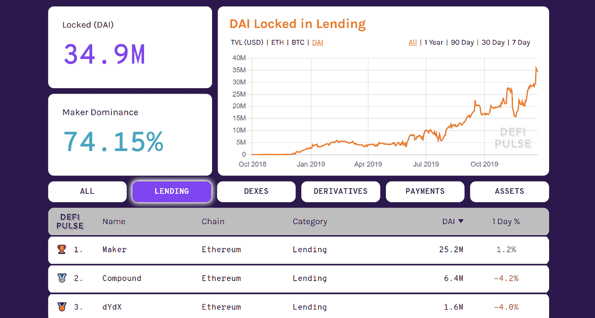

Dai locked in DeFi Lending. Image from DeFi Pulse.

如今锁定借贷的加密货币总价值为 4.609 亿美元，统计数据表明该市场持续增长。

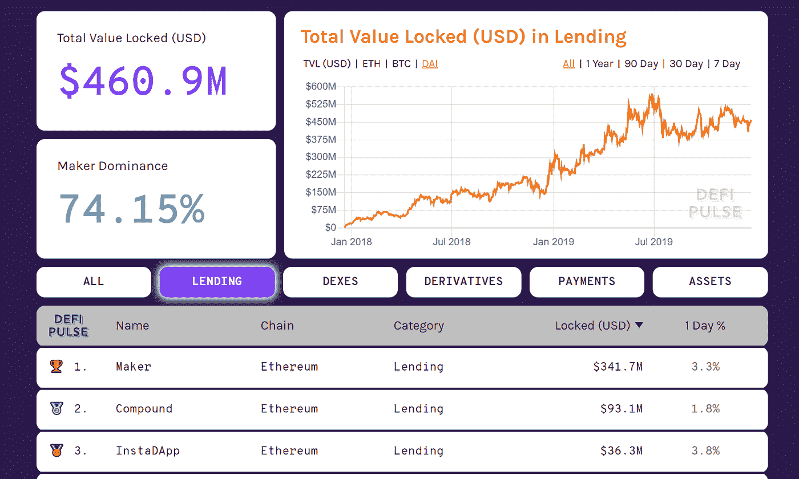

USD Locked in DeFi Lending. Image from DeFi Pulse.

如果您不熟悉 DeFi 产品，MakerDAO 平台将是一个很好的起点。在买戴之前，你必须在你的硬钱包里存上备用的乙醚，比如 Trezor 或 Ledger。一个方便简单的选择是以太坊钱包，Metamask。它允许你下载应用程序作为谷歌浏览器的扩展。

 [## 5 行业转型区块链应用|数据驱动投资者

### 除非你一直生活在岩石下，否则我相信你现在已经听说过区块链了。而区块链…

www.datadriveninvestor.com](https://www.datadriveninvestor.com/2019/02/13/5-real-world-blockchain-applications/) 

MakerDAO 引入了一些变化，作为今年 11 月下旬推出备受期待的多抵押品 Dai ( MCD)的一部分。我将带您了解新版本的平台。

[Oasis](https://oasis.app/?lang=en) 已经取代了做市商 CDP(债务抵押组合)平台。

然后，您可以选择交易，借款或保存戴对绿洲。

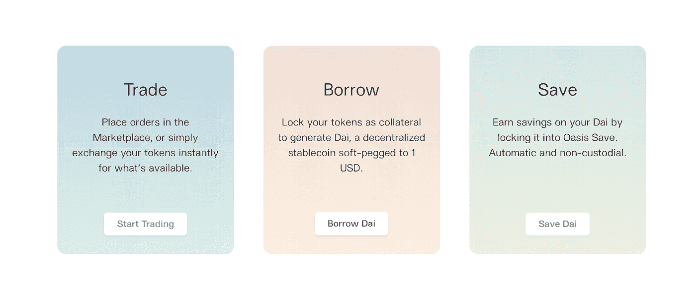

【借】戴

CDP 现在被称为 Vault。您只需生成一次。当您将 Oasis 连接到 Metamask 时，系统会提示您打开第一个保管库。

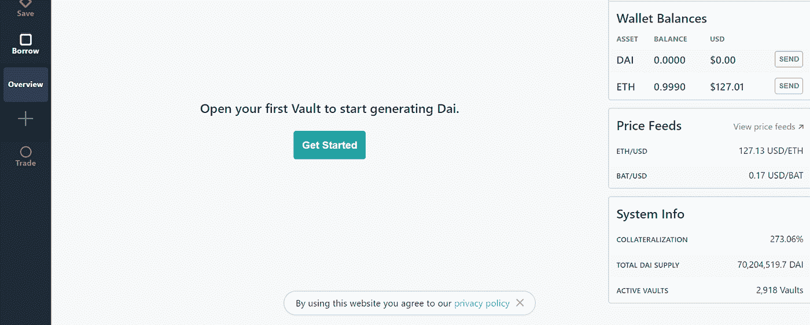

要开始，你必须首先选择你的抵押品。此刻，你有两个并行的选择，以太(ETH)或基本注意力令牌(BAT)。将来应该会添加更多类型的令牌。

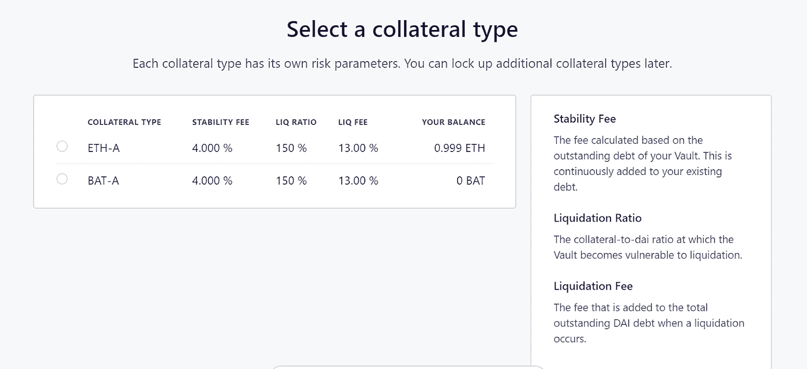

接下来，等待配置您的存储库。

完成后，您可以选择您想放入金库的金额，以生成 Dai。请注意，您需要为每笔交易生成至少 20 Dai。抵押比率和清算价格是自动计算的。稳定费表示当你决定解锁你的金库并要求你的 Eth 或 BAT 时，你需要支付的百分比。费用不固定，可以浮动。

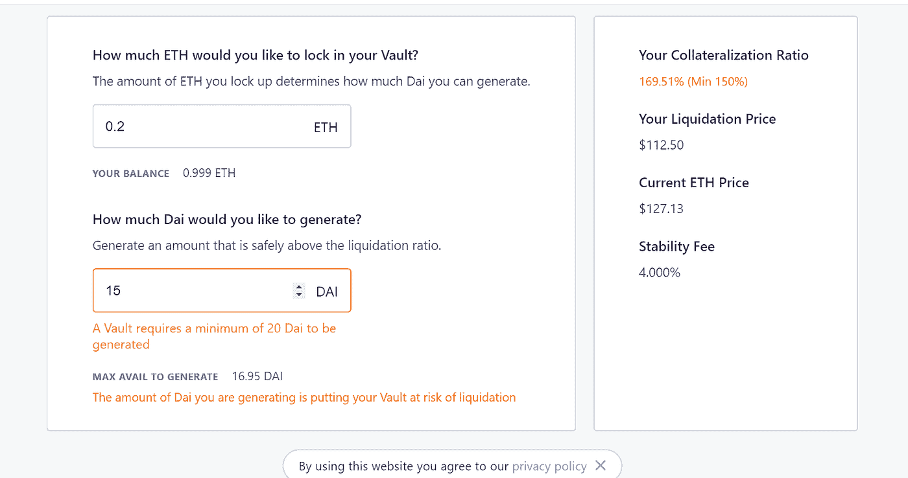

接下来，在确认您的借款之前，请查看保险库的详细信息。

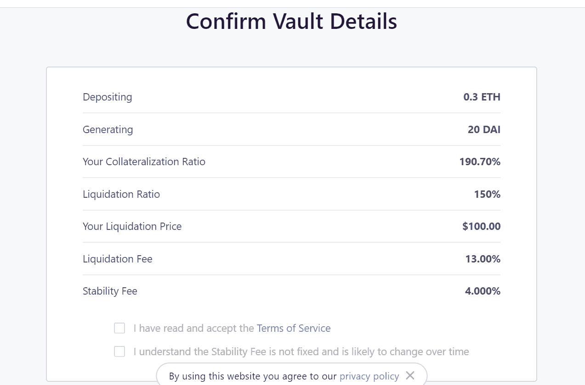

Oasis 然后在左边为你的左边生成一个标签，在这个例子中它被称为 ETH-A 191%,在这里你可以查看你借款的细节。

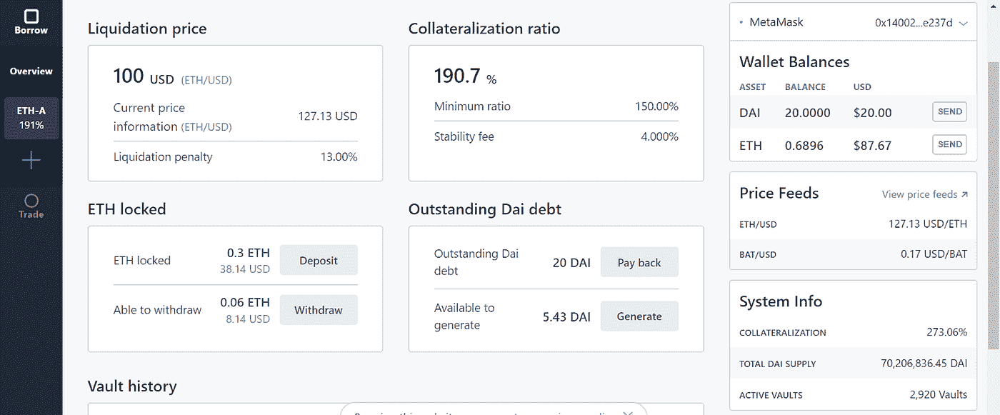

【救】救戴

您还可以在 Oasis 平台上使用 Dai 进行保存。有两种方法可以做到这一点。

选项 1

你用你担保的贷款中的可用 Dai，把它放在 DSR (Dai 储蓄率)。今天的 DSR 是 4%。

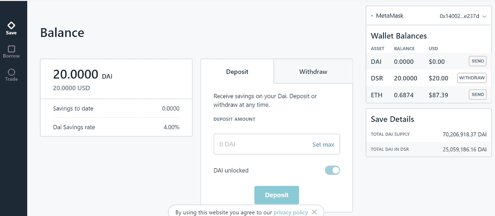

选项 2

通过包裹乙醚产生 WETH 来产生 Dai，然后您可以用 WETH 来购买 Dai。这是你怎么做的。首先，确保您的 Metamask 或硬钱包中有足够的乙醚，并将其连接到 Oasis。

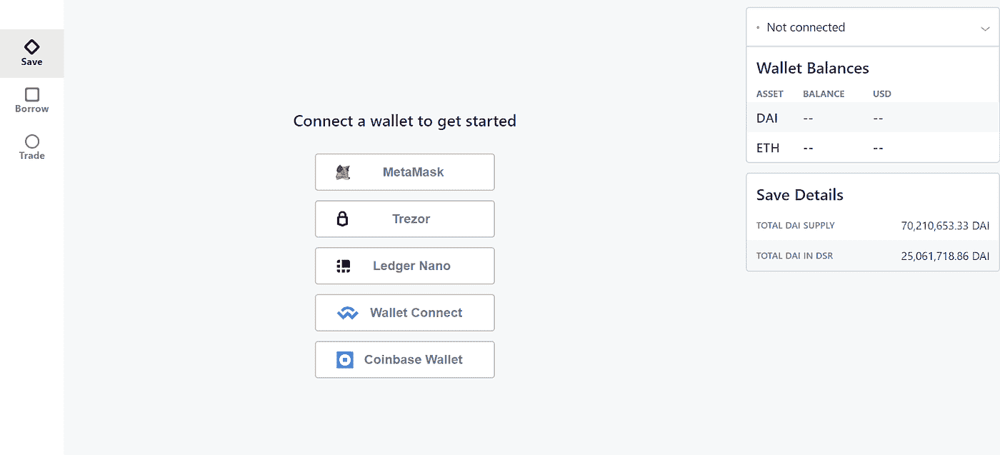

然后，点击左侧的“交易”选项卡。选择“帐户”以查看整体资产余额。要生成 Dai，需要 WETH(包裹以太)。

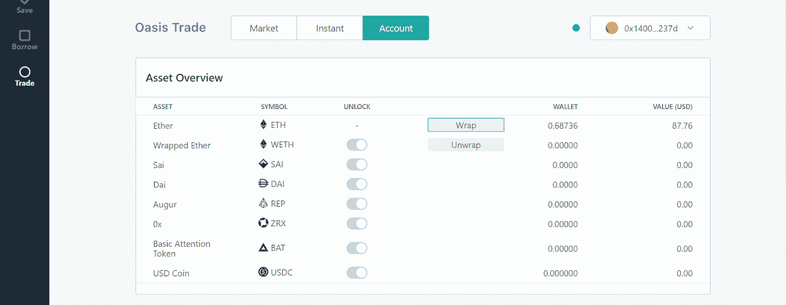

点击“包装”并输入您想要包装的乙醚量。交易确认后，点击“市场”按钮。

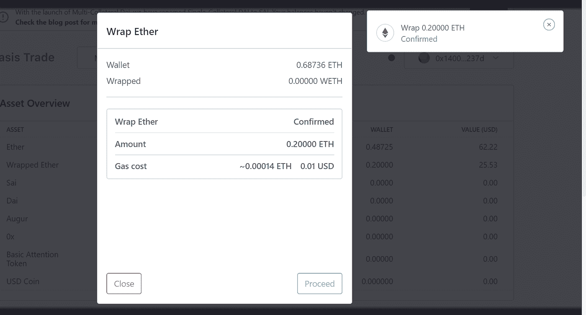

接下来，创建一个订单来销售 WETH 以接收 Dai。

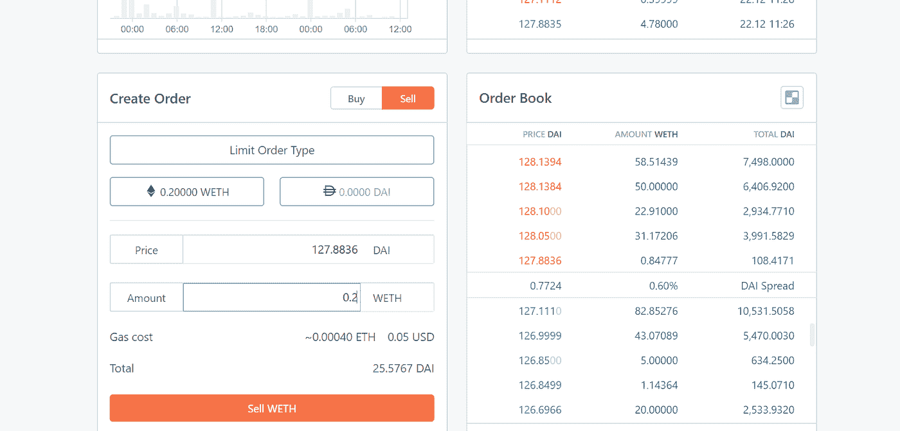

订单完成后，点击“保存”选项卡，存入您想要保存的 Dai 金额。你可以通过同一个页面监控你的收入。

或者，如果你不想把你的戴锁在，你可以用柴来产生利息，但仍然可以使用你的戴。

这在 Oasis 上是没有的。相反，你需要进入 [chai.money](https://chai.money/) ，将 chai 连接到你的 Metamask 钱包，将 Dai 转换为 Chai 并累积利息。

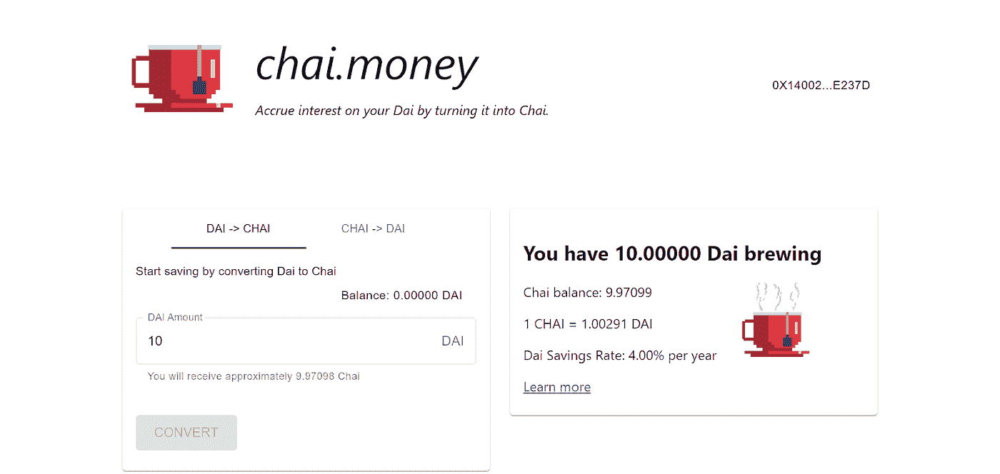

**治戴与马可道**

由于 Dai 是由 MakerDAO 建立的一个分散的稳定中心，因此 Dai 的治理是通过投票系统完成的。为了能够参与对戴信用系统中的风险参数变化的投票，您需要购买创建者令牌 MKR。

详细信息可以在[创客](https://makerdao.com/en/)平台及其[论坛](https://forum.makerdao.com/)上找到。网站上“产品”下的“治理”选项卡会将您带到[投票平台](https://vote.makerdao.com/)，在这里您可以设置您的帐户并开始投票。

MakerDAO 社区是参与 Dai 投资并获取最新信息的最佳场所。

**结论**

新的 Oasis 平台是用户友好的，一旦你理解了借款概念和术语，如稳定费、包裹乙醚、DSR 等，交易、借款和储蓄都非常简单

酿造柴种植你的雏菊更容易！

如果您在使用 Oasis 时遇到问题，您可以寻求帮助，并使用 MakerDAO 平台上的[聊天](https://chat.makerdao.com/)功能获得您的问题的答案。

**资源**

[https://makerdao.com/en/](https://makerdao.com/en/)

 [## DeFi Pulse | DeFi 排行榜|统计、图表和指南

### 名称链类别 1 天% DeFi 是短语分散财务的缩写，通常指…

defipulse.com](https://defipulse.com/)