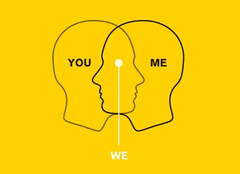

# 所有东西最终都会被商品化…除了同理心

> 原文：<https://medium.datadriveninvestor.com/define-empathy-the-ability-to-understand-and-share-the-feelings-of-another-e6f11c86b5a1?source=collection_archive---------18----------------------->

> 定义共情:“理解和分享他人感受的能力。”

*想学习如何编码？*

在 [LinkedIn](http://www.linkedin.com/Online-Training%E2%80%8E) 上有这方面的免费课程。

*想学怎么扔回旋镖吗？*

你或许可以从这段 YouTube 视频中学习。

*想学做穴居人牛排？*

简单— [看这个！](https://www.youtube.com/watch?v=lannK14WCOU)(嗯好吃！)

The Caveman steak (yummmm)

*想学习如何在 MS Excel 中编写宏？*

有一百万个视频可以帮忙。

*回家路上懒得做饭？*

没有戏剧，点击 Uber Eats 或 Deliveroo。

*在工作中沟通和管理项目有困难？*

试试 Slack 或者 Trello。

*需要帮忙组装你从宜家买的新书架吗？*

找个空气任务工。

*想建一个网站？*

有一些叫做[醒目的](http://www.strikingly.com/)或 [Wix](https://www.wix.com/) 的酷网站可以让你在几个小时内开发出高质量的网站。你甚至不需要知道写一行代码！事实上， [LMN](http://www.lmnpost.com/) 就是建在其中的一个上面的(猜猜是哪一个！).

想要建立一个在线电子商务商店吗？？

几年前，你很幸运有人为

OK, I think you get the point.

The internet has completely changed the world.

Education and our understanding of how knowledge is transferred between humans has been democratized and “commoditised.” We literally have the capability to “learn things” and “get things done” at ridiculous speed from the devices in our pockets. The world is amazing. There’s a product called [Thunkable](https://thunkable.com/) 建立了一个集成购物车的网站，这是一个“拖放”iOS 和 Android 应用构建器。它可能不能让你创建市场上最热门的应用程序，但它是一个很好的选择。就像 [Wix](http://wix.com) 和[醒目](http://strikingly.com)一样，不需要编码知识。

那么这些对我们来说意味着什么，又有什么关系呢？很高兴你问了。

5 个字。

> 硬技能的商品化。

如果你从这次阅读中学到了什么？请让它是这个。硬技能，在“白领”工作中可以量化的技能，你可以通过教育、培训项目、认证和在职培训获得，如如何打字、如何阅读 P&L、如何编写代码等。这些通常是可以量化的技能，很容易定义和评估。随着技术继续在我们的世界扩散，这些技能将变得越来越不值钱。

另一方面，软技能(人际交往技能)很难定义和评估。虽然硬技能是工作特有的，但大多数雇主都在求职者身上寻找类似的软技能。软技能包括:沟通、倾听以及表现出同理心的能力。随着技术继续在我们的世界扩散，这些技能将变得更有价值。

这是为什么呢？让我解释一下。如果我能想象出我想做的有形的东西，并清楚地定义它的特征，那么我有两个选择:

1.  找人帮我做这件事。也叫快速路。但是要花钱。虽然没有以前那么多了。互联网和零工的兴起改变了这一模式。利用在线平台，这些平台不仅使技能民主化，而且使我们获取技能的方式民主化；想一想[航空工人](http://airtasker.com)、[自由职业者](http://freelancer.com)、 [UpWork](http://upwork.com) 、 [WePloy](http://weployapp.com) 或类似的东西正在成为新的规范。
2.  自己动手。也被称为较慢的方式。它可能不会花你任何钱，但它会带走你宝贵的时间。你可以学习(1)中的人已经拥有的技能。然而。这些技能通过互联网变得越来越大众化，其中许多可以通过“廉价”或免费的在线课程学习。然而，这种方法需要时间，随着技术越来越“加快速度”，这些“技能”将继续变得越来越不值钱。

那么我在暗示什么呢？好吧，如果你只是后退一步，在你的脑海中播放这个，那么你可能会开始瞥见我们正在走向的世界。唯一重要的是我们人类提出的解决社会问题的想法，以及执行这些想法所必需的软技能，比如移情。投资这最后一句话。真正理解这对你意味着什么。

人工智能(AI)和共情将改变世界。

为什么？好吧，在我们寻求解决世界问题并使新想法成为现实(执行)的过程中，其他一切都将通过技术变得越来越商品化，所以你需要弄清楚你为你周围的人和世界增加价值的独特方式是如何让你与众不同的。

你可以做的一件事就是变得更有同情心。在我看来，同理心可能是世界上最重要的软技能。它让你从另一个人的角度来倾听和观察这个世界，在某些情况下，感受他们可能面临的问题。正是这种能力和技能可以成为解决问题的催化剂，以及提出可能解决问题的想法所必需的创造力。一些最好的想法来自于在人们意识到之前对消费者行为的了解，以及开发一种解决方案来满足这种未开发的需求。秘方是移情。

事实上，知识现在已经大众化，这意味着你可以在任何时间学习任何东西，只需要花费很少的费用。无论是科学还是创业，信息就在那里，而且很可能是免费的。

记住这一点，考虑对你周围的人更加同情，利用这一点来帮助你理解消费者行为和我们周围的日常问题。这将开始帮助你自然地想出主意。最重要的是，把它结合起来，开始执行和行动！

一些事情可能会帮助你做到这一点:

1.  做一些和你平时完全不同的事情。去尝试一种新的瑜伽或即兴表演课，一些能在你的大脑中触发新的学习序列的新事物。
2.  试着做一些随机的任务，比如开门，或者用你的非惯用手洗碗。
3.  练习耐心和感恩。即使世界唾手可得，也不意味着你现在就需要它。对你所拥有的感到高兴，并意识到总有人比你更糟糕。你很幸运还活着。善待他人，表现出更多的同理心，观察你对世界的看法是如何变化的。

很想知道你对这个想法的看法。