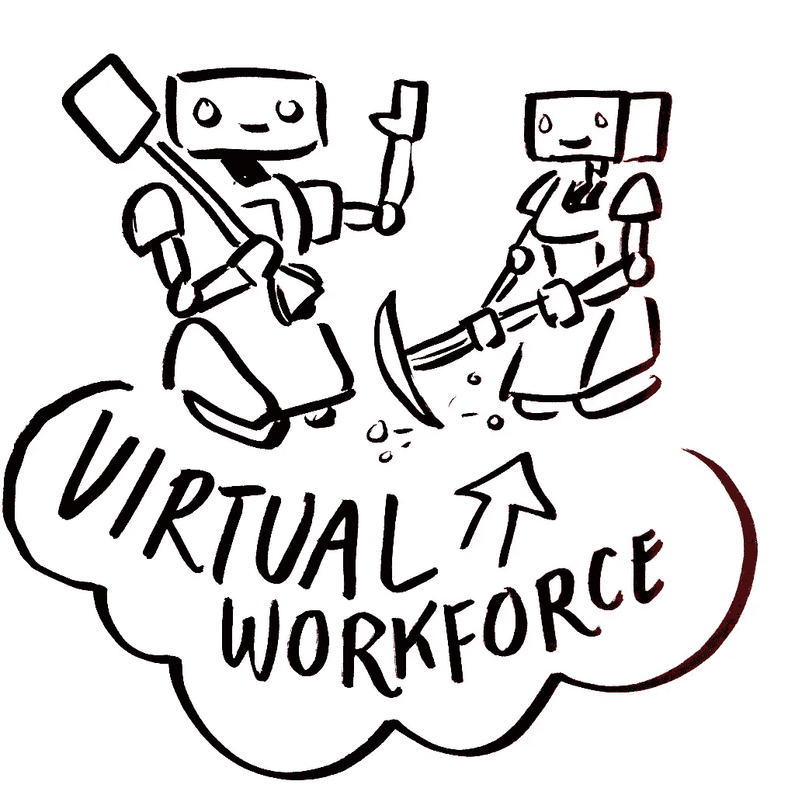

# 定义机器人过程自动化

> 原文：<https://medium.datadriveninvestor.com/defining-robotic-process-automation-5cbb220c49b0?source=collection_archive---------21----------------------->

事实上，自从工业革命以来，自动化已经存在了很长一段时间，尽管我们不需要为了创建我们的定义而追溯到那么远。机器执行以前由一个人(或几个人)完成的任务通常是自动化的一个例子。将计算机引入办公室是自动化的一个例子，我们无法想象今天会回到使用纸质日记和分类账来经营我们的业务。

机器人流程自动化(RPA)是这一想法的下一个发展，在未来的几年里，我们将回顾过去，并想知道如果没有我们的 RPA 机器人，我们是如何管理的！ ***但是 RPA 是什么？***

RPA 是在您的计算机上运行的一款软件，能够使用相同的图形用户界面与您使用的相同软件应用程序进行交互；在字段中输入数据，然后单击按钮提交工作。做这件事的软件被称为机器人，令许多人失望的是，这不是西部世界，在任何地方都没有涉及物理机器人。

RPA 是重复性任务的理想选择，它每次都能以相同的标准完成分配的工作，因此不会出现错误，如果需要，它可以全天候工作，并且以计算机的速度工作。当然，它不是开箱即用的，就像一名新员工一样，机器人必须先接受如何工作的培训，如果后来流程发生变化，甚至还要接受再培训。

RPA 的功能一直在不断增加和扩展，而成本却在普遍下降。现在，利用 RPA 的机会适用于任何规模的任何企业，而不再仅仅是大型企业。如果您曾经认为 RPA 超出了您的价格范围或技能，那么您就错了。现在有可以满足任何需求的解决方案。

从拥有数百台机器人的大型企业到只有 1 或 2 台机器人的小型企业，RPA 每次都能提高运营效率、降低成本、提高客户满意度并交付高质量的结果。

罗布·金

Rob King, Author of Digital Workforce, co-Founder of Wzard Innovation, VP Education at the RPA Academy.