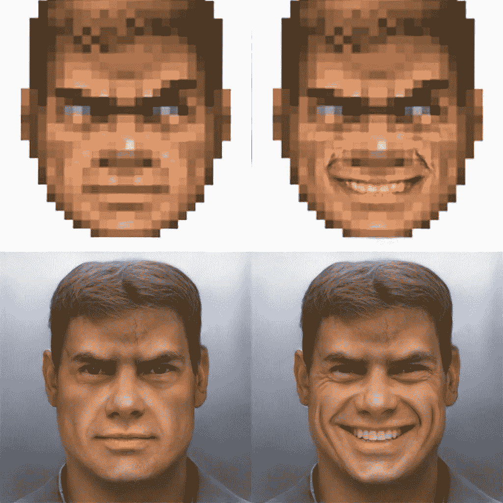

# 定义人工智能伦理——幻觉还是急需的一步？第二部分

> 原文：<https://medium.datadriveninvestor.com/defining-the-ai-ethics-illusion-or-a-step-much-needed-part-ii-39b2e28d28ce?source=collection_archive---------8----------------------->

在这篇文章的第一部分中，我讨论了人工智能伦理的重要性，并概述了构建“可信人工智能”的几个原则:首先，人工智能应用领域的伦理筛选，其次，开发和应用人工智能的人的责任。

现在，我将话题转向智能机器这个美丽新世界中人类和人工智能之间的复杂关系。

 [## 今年值得关注的人工智能趋势——数据驱动的投资者

### 预计 2019 年人工智能将取得广泛的重大进展。从谷歌搜索到处理复杂的工作，如…

www.datadriveninvestor.com](https://www.datadriveninvestor.com/2019/02/19/artificial-intelligence-trends-to-watch-this-year/) 

**3。人还是机器:两者之间的认知**

在未来，机器将越来越擅长模仿人类的外表和行为。深度学习的一些应用已经允许[从静止图像中制作人脸动画](https://www.linkedin.com/feed/update/urn:li:activity:6537292531804311552/)，改变人们的现场镜头以产生所谓的“深度假像”，甚至[创造全新的虚拟“人”](https://emerj.com/ai-power/beyond-deepfakes-programmatically-generated-everything)！“deepfake”技术在 2017 年引起了人们的关注，巴拉克·奥巴马的[假视频](https://www.extremetech.com/extreme/267771-buzzfeed-created-a-deepfake-obama-psa-video)显示了这位美国前总统发表虚假演讲——看起来非常可信！这就是人类和机器之间的界限模糊的世界的出现。

AI has generated realistic pictures of a man from Doom. Source: Reddit.

随着这些技术的进步，我们进入了黑暗的水域。想象一下使用人工生成的视频来传播错误信息和削弱对手的宣传。或者约会网站，在那里人们会对电脑模拟的不存在的人产生情感依恋。如果我们无法区分自然人和模拟人，我们就失去了对“真实”世界的感知。这对我们的自我认同有着深远的影响。

[*可信人工智能的道德准则*](https://ec.europa.eu/digital-single-market/en/news/ethics-guidelines-trustworthy-ai) 表达了对秘密人工智能使用的担忧。人们在与人工智能系统交互时应该意识到这一点。计算机模拟的每个图像和视频都应该有一个标记，类似于“机器生成的内容”，如果没有，就违反了法律。任何数据、输出、交互都是如此，会被误认为是人为的。

然而，如果你没有选择的自由，意识是无用的。一个人应该可以自由选择不与人工智能系统打交道，而是与人类互动。这可能会变得非常棘手，在这个世界上，人工智能几乎嵌入到每个流程和产品中。你拨打客户热线，面对的是聊天机器人；你想和你的全科医生见面，但你需要先通过一个“人工智能护士”，等等。与真人互动将成为高端产品，就像有机食品或定制服装一样。在未来世界，我们可能会面临极端的人工智能不平等——富人可以获得人类的回应，而穷人将处理算法。这种关注应该从早期阶段就指导人工智能的发展，让每个公民都有选择的自由。

**4。总是有人参与**

企业人工智能伦理的核心原则是，在人工智能运作的每个阶段都应该有人类干预的可能性。

然而，在未来，随着人工智能能够在很大程度上作为一个“自主代理”运行，人类干预每个阶段的前景变得暗淡。首先，当 AI 收集和处理大部分原始数据时，这使 AI，而不是人类，与现实世界直接接触。此外，由于决策时间跨度通常缩短到几秒钟，人类指挥官可能根本没有足够的时间进行干预。想象一下，AI 被赋予了很大的自主权，可以在偏远地区或遥远的太空中行动，因为以集中的方式做出常规决策是不可行的。或者大量的人工智能系统通过基于共享信息做出自主决策的能力作为一个整体运行——例如[无人机群](https://mwi.usma.edu/era-drone-swarm-coming-need-ready/)。同样，人为干预可能仅限于一般的监督和在紧急情况下对系统的召回，因为主动纠正这样复杂的系统是非常困难的。

在这种情况下，人工智能设计阶段变得至关重要。让我们假设人工智能被编程来实现某个目标，然后被发射到太空或冲突区域。如果没有一些处理道德困境的内在机制，AI 可能会决定实现目标的最短方式是通过消除障碍——可能是平民或稀有的自然栖息地。当设计失败时，实施阶段的干预可能已经太晚了。

可悲的是，实现目标最有效的方法往往是最不道德的。所以，我们需要决定我们想要什么:高效率的机器还是能够应对道德选择的机器。

**5。寻找中庸之道:在伦理与效率之间**

当我们谈论值得信赖的人工智能时，我们应该记住，强加道德限制将导致效率的降低。与完全“不受约束”的人工智能系统相比，我们对人工智能施加的限制越多，它可能需要更长的时间来交付有意义的结果。例如，一位[博主测试了 OpenAI 发布的新文本写作 AI](https://towardsdatascience.com/do-no-evil-why-we-need-a-public-conversation-about-ai-ethics-17366fb0f148) 的缩小版。在没有监督的情况下，该算法在数百万个网页上进行训练，能够产生由人类输入提示的文本样本。根据 Open AI 的网站，全尺寸语言模型具有“[生成前所未有质量的条件合成文本样本的能力](https://openai.com/blog/better-language-models/#fnref1)”。这与缩小模型产生的非常温和的结果形成对比，尽管它表达了政治正确性的明显迹象。

因此，不受约束的人工智能将有可能在直接竞争中击败受束缚的人工智能。问题仍然是，我们是否希望这种超高效的人工智能被释放出来，并吸收越来越多的数据，以便在每次交互中变得更加高效。这可能为人工智能的恶意应用开辟道路，并潜在地使人工智能本身变得恶意，只要通过学习，如果它每次实现目标都获得奖励，甚至稍微超越正确或道德上可接受的界限。在这种情况下，人类宁愿万无一失。

在设计人工智能的规则和条例时，应该始终考虑效率和伦理之间的权衡。虽然即使是最良性的人工智能也不是完全可预测的，但从长远来看，消除恶意的例子和偏见应该会使人工智能的性能变得平稳。训练良性人工智能可能需要更长时间，但会给我们带来更多好处。

这是人工智能伦理话语的开端。有一点是明确的——我们目睹了人工智能的“军备竞赛”，让人工智能尽快走向伦理路线成为一个“生死”问题。换句话说，在第一颗核弹被投下之前，我们需要一个武器削减条约。目前，我们应该掌握一个“束缚”的人工智能，找出如何将伦理嵌入机器，并就我们需要什么样的伦理达成全球共识——然后我们才能进一步前进。