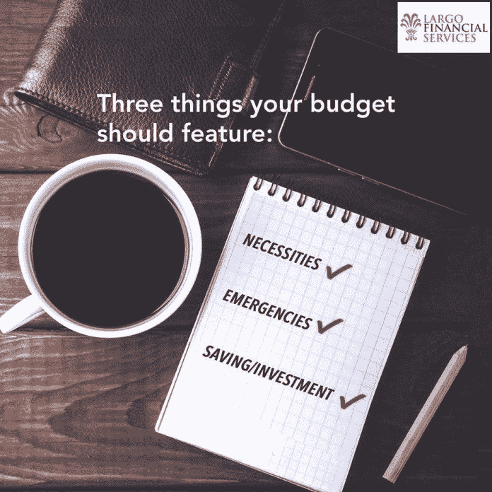

# 挑战扼杀你退休生活的神话

> 原文：<https://medium.datadriveninvestor.com/defy-the-myths-that-kill-your-retirement-340b6fe80170?source=collection_archive---------18----------------------->

## 你百分之百确定你会有一个美好的退休生活吗？

这个问题很简单:你百分之百确定你会有一个很棒的退休生活，还是你有疑问？

在过去的十年里，当经济崩溃使退休账户减少了 40%时，这种不确定性被彻底打破了。

[Douglas Eze](https://twitter.com/largofinancial) 没有怀疑，他也没有不确定。

“如果我能告诉你如何在九年或更短的时间内摆脱债务，这是你想进行的对话吗？”他说。

伊兹是[拉戈金融服务](http://largofinancialservices.com/)的总裁兼首席执行官。在 20 年的时间里，他进入、了解并成功进入了金融服务业。他还计划引导普通美国人走向他们自己的财务自由。

这就是为什么 Eze 写道，“ [*世代财富:超级富豪知道你需要知道的*](https://www.amazon.com/Creating-Generational-Wealth-Super-Wealthy/dp/0989951502) ”

他在纸上的愿景现在得到了一个应用程序的帮助，用于预算和帮助控制可自由支配的支出。这项新技术将帮助美国家庭从大萧条的破坏中恢复过来。

新的经济现实是严峻的。根据第一财经教育中心的数据，每一美元中，美国人要花 34%的利息，比如抵押贷款和信用卡。另外 40%用于各种税收。

 [## 纳税时间真的不是一年一次

### 保持与时俱进，避免不愉快的惊喜

medium.com](https://medium.com/datadriveninvestor/ready-or-not-its-tax-time-5505954cb5d1) 

剩下 23%用于生活方式，只有 3%用于储蓄。

Eze 指出，一对年收入在 35，000 到 40，000 美元的夫妇一生中会有超过 200 万美元从他们手中流过。然而，他们只有 60，000 美元的退休储蓄。

“这张图怎么了？”他问。

# 洞察力和技术

得益于金融洞察力和技术的帮助，Eze 和他的团队发现，资金分配的轻微调整会带来巨大的变化。

减少——而不是避免——22%的税收和利息，让样本夫妇将他们的生活方式分配提高到每一美元的 33%，储蓄提高到 15%。在他们的职业生涯中，6 万美元的储蓄可能会超过 100 万美元。

数字越来越多，Eze 是努力工作有回报的一个例子，而不是众所周知的一夜成功。

24 岁时——从西非移民过来几年后——他在 IHOP 餐厅当服务生，一位顾客递给他一张名片。她问他是否对金融服务感兴趣。多年来，他的兴趣变成了雄心和热情。

“我的使命是通过提高客户的财商来帮助他们发现通往财富和财务独立的道路，”Eze 说。

“当涉及到他们的财务时，我帮助人们改变他们的生活，”他说。“出于这样或那样的原因，每个人都工作以谋生和照顾家人。”

 [## 掌控你的财务生活

### 金钱不能定义你，但你需要它来储蓄和投资

medium.com](https://medium.com/datadriveninvestor/take-control-of-your-financial-life-f858fa54f500) 

在 Eze 看来，无论养家糊口的人如何努力，他们都因为不知道金钱游戏的规则而受到限制。

“我喜欢帮助别人，”他说。“我向他们展示如何实现自己的目标。他们可以通过使用务实、常识性的方法来确保他们的金融未来。这才是真正驱动我的东西。”

实现梦想始于摧毁谎言。

“挑战的一部分是打破不能获得财富的神话，”Eze 说。“大多数人看不到自己的财富定位，或者已经失去了希望。

“人们习惯于一遍又一遍地做同样的事情，直到他们觉得这是正确的方式，”他说。"但是他们被教导的方式不一定是正确的."

# 重复错误

这些错误会在几代人的时间里变得更加复杂，尤其是当金钱和金融不在学校里教授或者不在晚餐时的谈话中出现的时候。

“我们不愿意和我们的孩子谈论财富，”Eze 说。“我们不和他们谈论金钱，因为除了股票和房地产，没有人会和父母谈论任何事情。”

Eze 表示，不是每个人都能投资，富人也不会放弃购买股票。这些资产由子女持有和继承。个人退休保障来源于其他储蓄。

 [## 伟大的父母用金钱的魔力激励孩子

### 理财专家为父母提供了永恒的理财建议

medium.com](https://medium.com/financial-strategy/great-parents-inspire-children-with-the-magic-of-money-85236cd64d65) 

“我不断研究和了解那些已经证明自己在财务上做得很好的人，”Eze 说。“我了解新思想、税法或任何影响财富增长的东西。

“我试图保持领先，”他说。“我与非常成功的理财顾问建立了关系网，他们做我想做的事情。我向他们学习。”

财富课程来之不易，但在今天和未来几年都是必不可少的。

“我希望我的孩子、孙子以及他们的后代能够明白，他们继承的财富来之不易，”Eze 说。“那些孩子需要历史眼光。

“他们一定知道他们的曾曾曾祖父是来自非洲的移民，”他说。“他来到一个国家，努力工作，赢得了他的一切，并明白他为什么要这样做。”

想了解更多关于摆脱债务和创建安全退休的信息，以及财务应用程序，请访问 [Largo Financial Services](http://largofinancialservices.com/) 网站。

# **关于作者**

吉姆·卡扎曼是拉戈金融服务公司的经理，曾在空军和联邦政府的公共事务部门工作。你可以在[推特](https://twitter.com/JKatzaman)、[脸书](https://www.facebook.com/jim.katzaman)和[领英](https://www.linkedin.com/in/jim-katzaman-33641b21/)上和他联系。

*原载于 2018 年 9 月 28 日*[*www.datadriveninvestor.com*](http://www.datadriveninvestor.com/2018/09/28/defy-the-myths-that-kill-your-retirement/)*。*