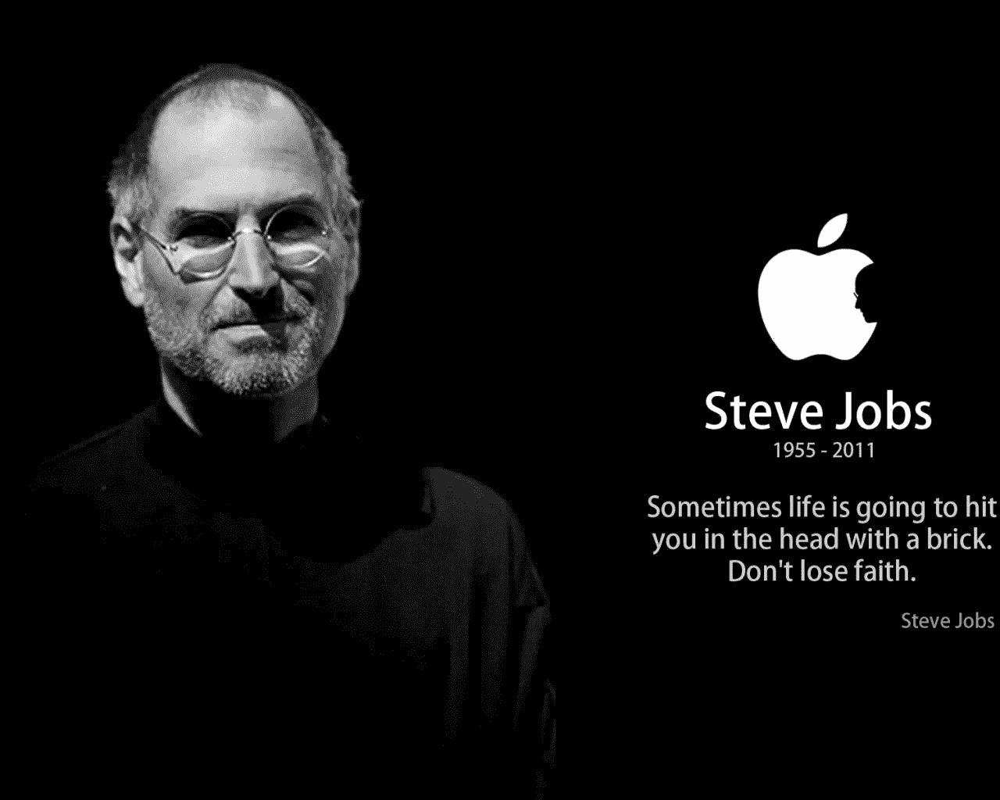

# 无视华尔街的逻辑。特斯拉如何击败华尔街叙事？

> 原文：<https://medium.datadriveninvestor.com/defying-wall-street-logic-how-tesla-beat-wall-street-narrative-f088e465639e?source=collection_archive---------19----------------------->

你不能指望一个建立在规范基础上的系统去理解不正常的事情。

周三收盘后，我像许多人一样等待特斯拉的季度业绩，预计收益和收入将持平或略有下降。令我难以置信的是，我看到第一对夫妇字符串遇到了 2.90 美元的巨大打击，而预期损失为每股 0.19 美元。

***出乎许多人的意料:***

在过去几个月埃隆马斯克的不稳定行为之后，许多人认为特斯拉在第三季度业绩发布时将面临灾难。这将是卖空者的天堂。巨额债务支付、巨额现金消耗和不确定的 Model 3 利润率，让熊市看起来相当明显。主要金融机构对特斯拉提出破产和欺诈的假设，并不断比较特斯拉与福特和通用汽车的市盈率。街上的人真的认为他们已经把埃隆逼到了绝境。《T4 时报》和《纽约时报》的情感见证提供了财务和执行风险的完美组合，推动特斯拉的股票进入 2018 年下半年。

甚至让我惊讶的是，我开始担心埃隆了。然而，我忘记了特斯拉和 SpaceX 的使命和目标是他的生命。一个交换了家庭、关系，甚至在某些情况下，有人可能会说，为了这些使命而保持理智的人，又一次恢复了活力。

“time-lapse photography of black sedan on road” by [Jp Valery](https://unsplash.com/@jpvalery?utm_source=medium&utm_medium=referral) on [Unsplash](https://unsplash.com?utm_source=medium&utm_medium=referral)

***对热闹非凡的电话会议的期望:***

许多人预计，在过去对华尔街表现出挑衅行为后，埃隆在电话中会有些“华而不实”，但他们再次被证明是错误的。埃隆称赞了特斯拉团队中许多人的执行力，就像一位父亲称赞儿子取得了独特的成就。当提到客户在混乱时期保持忠诚并帮助特斯拉变得“更好”的努力时，他哽咽了，这进一步表示了赞赏。埃隆没有推动财务收益，而是更关注特斯拉当前和未来产品在欧洲和亚洲的路线图和影响。这通电话的神态很像埃隆平静而镇定的如释重负的叹息，这是我过去听过的 20 多次电话中从未听到过的。

*对于那些认为他会将财务数据视为“一记耳光”的人，我请你们观看这个简短的视频***，此前许多宇航员批评了埃隆与 SpaceX 的任务。**

*类似于乔布斯在向 R&D 投入大量资金导致我们交流方式改变后所面临的批评，埃隆站在赔率。*

**

*这是怎么发生的？为什么专业人士错了？*

*许多对特斯拉做出财务预测的人都忽略了一点，即特斯拉“只是一家汽车公司”这一观点是完全错误的。我们今天所知道的一些最伟大的公司围绕他们的生态系统创造了独特的护城河，这些生态系统包括不止一个行业。这方面的例子包括苹果公司及其在音乐领域的飞跃，以及亚马逊公司在书籍之外的产品领域的大胆尝试。这些复杂的生态系统是商业、技术和客户体验方法的中心。对这些生态系统持怀疑态度的人可能缺乏必要的远见，看不到跨行业互补的协同作用的深层价值。这种缺乏远见经常导致对领导者执行这些复杂目标的能力的过度批评。*

****跟随客户:****

*在过去的 6 年里，我一直是特斯拉努力开发**生态系统**的狂热追随者，这将彻底改变我们看待交通和与交通互动的方式。在这段时间里，我一直陶醉于一个品牌，这个品牌完全主导了一个围绕细分客户群的行业。特斯拉已经成功地将卡车爱好者、足球妈妈和跑车爱好者带到了船上，肩负着改革多个行业的使命。*

*看着我周围的人(包括我的兄弟)一窝蜂地为 Model 3 存款 1000 美元，我很清楚这是自苹果发布 iPhone 以来消费者对一款产品的驱动力的最大飞跃之一。在一个汽车公司付钱给员工并提供大幅度降价来吸引顾客的行业，特斯拉要求支付押金。*

*目前，许多分析师在 Q 后挠头，质疑利润率稳定性、为增加产量而进行的资本支出扩张，以及购买特斯拉的税收抵免减少是否会减少美国的需求。我明白了，他们的工作是预测特定期限内的投资价格，而特斯拉从历史上看就是一头反复无常的野兽。但是，正统的做法将继续挫败那些必须评估公司价值的人，因为许多关键的价值指标不符合正常的财务做法。*

****对分析师覆盖范围的评论(被动覆盖，非主动覆盖)****

*作为一个理解许多分析师反对特斯拉的观点的人，我不能责怪他们的呼吁。从一个允许金融工程师烘焙出“有意义”的场景的系统中衍生出来，是无法跟踪和预测特斯拉、苹果和亚马逊等一次性公司的成功的。有太多的变量和太多的聪明人贡献了突破性的方法和解决方案，打破了这种估价模式。*

*话虽如此，我将继续反对许多在金融工程领域拥有惊人血统的人，并说特斯拉是那些恰好无视华尔街逻辑的公司之一。*

*干杯，埃隆和他的公司！*