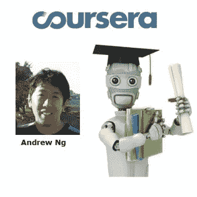
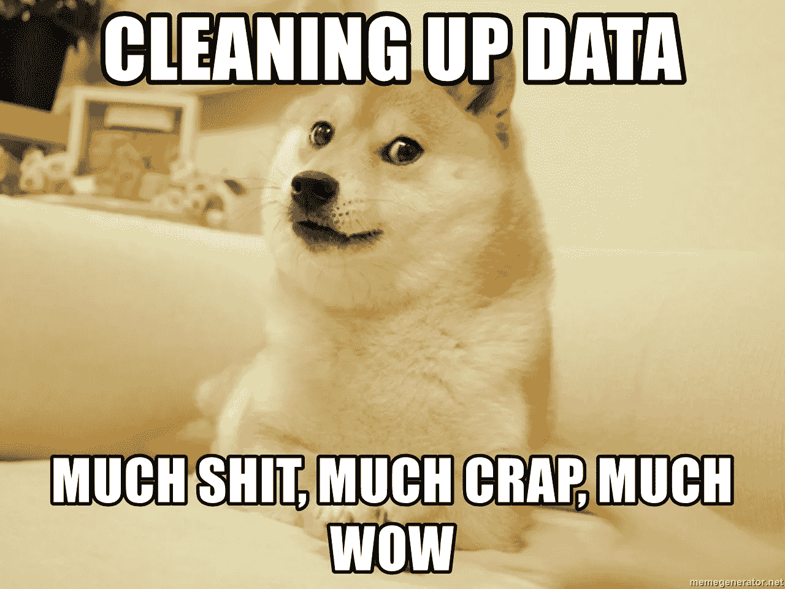
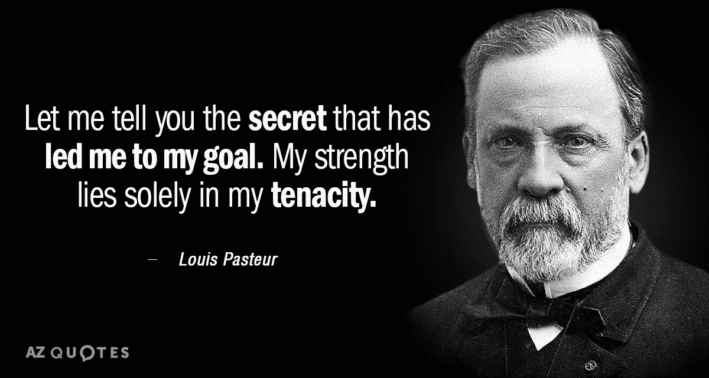

# 总有新的东西要学。

> 原文：<https://medium.datadriveninvestor.com/dehbaiyor-there-is-always-something-new-to-learn-zindi-uber-traffic-competition-4e47ae800ca6?source=collection_archive---------12----------------------->

The journey began…

当我在 2018 年 1 月从吴恩达的机器学习入门课程开始我的数据科学之旅时，我没有想到我会在一年内走多远。不得不在上学的同时学习一个新的领域，特别是作为最后一年的学生，这是非常令人生畏的，同时也是非常有趣的。

我花了相当多的时间在 Edx、Coursera、Udacity、Udemy 等平台上学习数据科学课程。还可以加上我在线阅读数据科学相关文章、在 YouTube 上观看视频以及阅读大量离线书籍的时间。

当我做我的第一个数据科学项目(尼日利亚数据科学组织的校际机器学习资格竞赛)时，我不确定我学到了多少。在公共排行榜上攀升到第一名之前，我的起点很糟糕，排在最后一名。我最终获得了第 21 名(显然我还没有很好地学会如何处理过度合身的问题)，但实际上我为自己的成就感到自豪。这是前 15%的条目。这是一个很好的学习曲线。

A Data Scientist is firstly a Data Cleaner.

如果资格预审比赛是一个很好的学习曲线，我不知道如何获得新兵训练营的资格。在四天的时间里，我学到了很多东西，这让我的注意力转向了我一直落后的数据科学领域:探索性数据分析和数据清理，并让我对人工智能创业大开眼界。在过去的几个月里，我一直在磨练自己在这些领域的技能。

虽然我从训练营开始就知道津迪优步交通挑战赛，但我不愿意参加，因为我觉得我的技能仍然落后，而且由于奖金的原因，许多数据科学领域的“大男孩”将会参加。我的一个朋友 Kehinde Ogunyale 最终说服我在 12 月的某个时候尝试一下。这场比赛对我这样的初学者来说尤其具有挑战性。我从中学到了很多(超参数调整并不像听起来那么简单)，并且也取得了前 25%的成绩。

在比赛期间和比赛结束后，我与其他一些像我一样的崭露头角的数据科学家进行了交谈，我意识到了交互的本质。这也许是数据科学社区最大的优点，它总是愿意提供帮助。我终于加入了一个像我一样的数据爱好者社区，与他们见面，我确信接下来的几个月将会令人兴奋。在我们第一次见面的时候，我已经学到了很多。总是有更多的东西要学。

你可以查看一个 Jupyter 笔记本，它记录了我所有的主要学习点，以及一个在优步竞赛中获得前 5%的解决方案[这里](https://github.com/Dehbaiyor/Zindi-Uber-Traffic-Jam-Competition)。它专门面向像我这样的初露头角的数据科学家。无论我们在生活中做什么，让我们记住坚韧是游戏的名字。再见。

