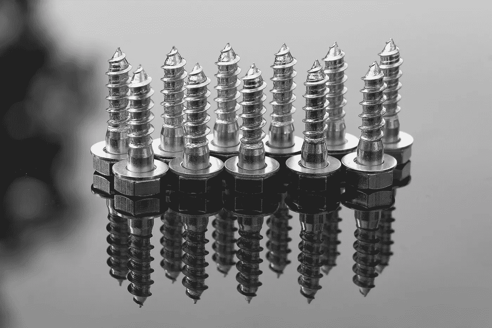

# 需求预测与需求计划

> 原文：<https://medium.datadriveninvestor.com/demand-forecasting-vs-demand-planning-968cdc2e9144?source=collection_archive---------1----------------------->

pexels.com

# 什么是需求预测

维基百科提供了如下定义:

> **需求预测**是预测分析的一个领域，它试图通过企业供应链和业务管理来理解和预测客户需求，以优化供应决策。

pexels.com

它的历史始于资本主义之父亚当·斯密。在他之前，工人们自己生产整个产品。例如，一个鞋匠负责皮革的整个切割过程，缝纫，打磨，用锤子钉钉子，油漆，抛光和所有其他小步骤。1776 年，他指出一个工人应该只专注于一个步骤。因此，一个人只负责裁剪，另一个人负责缝纫等等。

 [## 为什么数据将改变投资管理|数据驱动的投资者

### 有人称之为“新石油”虽然它与黑金没有什么相似之处，但它的不断商品化…

www.datadriveninvestor.com](https://www.datadriveninvestor.com/2019/01/25/why-data-will-transform-investment-management/) 

1817 年，大卫·李嘉图提出，不是工人而是国家。所以法国人应该关注奶酪和葡萄酒，意大利人应该关注时尚，德国人应该关注汽车。

然而，在 19 世纪初，弗雷德里克·泰勒发明了最优化。这是一种科学的统计方法，说明如何进行每一步，使公司达到最佳时机和盈利能力(不是最好，而是最佳)。

随着第二次世界大战，英国陆军发展了运筹学:用有限的资源达到最优的整体方法。随着工业 2.0 革命，大规模生产发生了。20 世纪下半叶，工业 3.0 走进了我们的生活，带来了 ERP 系统、自动化和基于计算机的优化技术。

## 在需求预测中，经常使用以下参数:

需求预测使用平均值、季节性、趋势预测，将促销和激活作为外部输入，从销售部门接收批量销售单位。在这种情况下，营销是定价和促销的唯一决策者。

需求预测是供应链或营销的一部分。大多数情况下，预测的准确性是可以衡量的，但是并不重要。库存没有得到主动管理。预测者在定价和促销方面的工作范围非常有限。在公司里，销售和营销的力量是非常占优势的。

# 但是参数不稳定

pexels.com

它们以不可预见的速度不断变化。新的竞争对手进入市场，客户趋势演变，关税和税收增加，外汇汇率变化。

# 为了克服这些，我们谈论

大数据，工业 4.0，机器学习等等。它们是完全不同的，但为了同一个目标:达到最优。

pexels.com

粗略地说，在工业 1.0 上，生产是用简单的机器或手工进行的。那还是 19 世纪中期。直到 20 世纪中叶，我们还处于工业 2.0 时代，用生产带和原始的自动化来制造产品。从那时到今天，在工业 3.0 中，机器人和先进的自动化帮助我们进行生产。现在是工业 4.0 时代，智能由计算机或机器人创造。

每天都有新的竞争者进入市场，无论是全球还是本地的。这些都来自全球市场和初创企业，它们几乎没有官僚作风，行动迅速。宏观经济正以前所未有的速度发展。每一条新闻都在几秒钟内传遍全球。因此股票市场和外汇汇率。不过，我们需要动态定价。以及新的推广策略。并在完整功能的基础上增加设计的力量。

如果不是现在，很快，自我学习编码系统将取代预测和生产系统，每时每刻不断更新自己。

## 那么，机器人会接管我们的工作吗？

# **是**

pexels.com

## 让我们看看需求计划，

是的，需求计划与需求预测非常不同。这是一个创造可靠预测的系统。请记住，预测的目的是为给定的约束找到最佳的估计，而计划是创造最佳环境以达到预期目标的艺术。然而，可靠和预测这两个词可能看起来是两个相反的术语，但在需求计划中，准确性作为一种信任的倾向比预测更重要。

pexels.com

规划是一个持续改进的过程。需求计划者(应该)负责管理需求的上升或下降(如果你没有库存，那么就稍微提高价格)，指导库存和增加利润。

> 需求计划是一门艺术，通过操纵参数来实现业务目标。

预测无法到达世界的尽头。它只接受当前状态-co，并将其投射到未来。然而，规划旨在改变趋势本身。它应该小心行事。

需求规划部由需求规划、计划或商务运营总监管理；直接向总经理汇报。作为比较，需求预测是另一个部门下的一个单位，但是需求计划是一个部门。该部门独立于销售和营销部门，也负责销售和毛利计划。

## 机器人可以取代预测者**，但它们无法取代计划者**

预测者了解一些统计信息如价格、促销、时机等就足够了。这些信息对计划者也很重要，但是他们需要更多的信息:市场状况、宏观经济挑战、竞争对手的行动、详细的促销计划等等。

pexels.com

不仅如此，他们还在各种问题上挑战商业团队。他们考虑各种还没有人想到的替代方法。如果当前价格上下波动 1%，会发生什么？也许价格弹性太低，公司可能会赚得更多。可能有不同的渠道来投放产品。是否有可能创造替代的跨品类包装(例如女用护垫和巧克力)？

另一个大的分析可能是关于促销技巧。与其说打五折，不如说买一送一。尽管财务状况相同，但第二种方式可能会促使每位客户购买更多产品。

只有统计研究与商业现实相去甚远。预计预测者不会问这些问题，但规划者会问。因为一个预报员只展示那一瞬间的画面，而策划者是画出来的。提出更多的问题，进行更多的分析，把它们和你的证据一起放到桌面上。

**需求规划自有改变未来的力量！**

# 如何打败机器人？

预测是官员的工作，计划是管理者的工作。所以所有的预测者都应该学会如何进化。

电脑杀死了打字机。优步扼杀了经典的出租车理念。iPhone 杀死了诺基亚。判断力会扼杀统计数据。如果你专注于别人给你的东西，你就无法前进。

**那该怎么办？如何在只有评估瓶颈的情况下创建规划远景？**

pexels.com

**学**。学什么都行。学习不同的学科。收集新信息有多种方法。任何科目都会让你的思维更加开阔。这将有助于你将自己与机器人区分开来。

**沟通**。与所有人交流。每个人都有不同的知识、经验、风格和观点。通过分析人，你可能会学到很多东西。通过增加你的交流，你会很容易理解别人的想法并影响他们。

**了解**。了解定价、促销和竞争对手的基本知识。熟知你的数据。当你用数字说话的时候，你自己的感知价值会高很多。

**量化**。量化你能想象到的一切:产品形象、广告效果、包装效果、抽奖对销售量和销售额的影响。我不是说这是一项容易的任务。但是建立关键的假设。

# **结论**

自从有了第一个世界，人类就试图提高效率。我们这些需求人员通过关注数据、进行分析和制作酷图来支持这一目标。然而，时代在变。我们需要将自己与机器人区分开来(无论是在讽刺意义上还是字面意义上)。我们每天都需要开发我们的智力。

巴里斯·努尔鲁拥有工业工程学位，曾在许多跨国公司担任行政管理职务。现在，他也在 Baseduo 中开发好的应用程序。