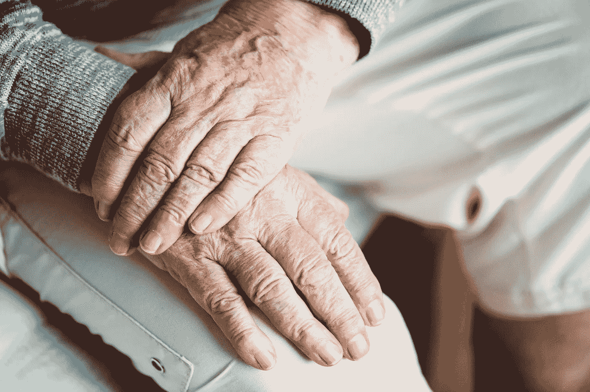

# 人工智能和虚拟现实技术如何应用于老年痴呆症和抑郁症的回忆疗法

> 原文：<https://medium.datadriveninvestor.com/dementia-is-not-a-particular-disease-rather-it-is-a-group-of-different-diseases-that-cause-a-6185164b9669?source=collection_archive---------4----------------------->

Photo by [rawpixel](https://unsplash.com/photos/kH3CTCnuD_Y?utm_source=unsplash&utm_medium=referral&utm_content=creditCopyText) on [Unsplash](https://unsplash.com/search/photos/aging?utm_source=unsplash&utm_medium=referral&utm_content=creditCopyText)

痴呆症不是一种特殊的疾病，而是一组导致精神功能退化的不同疾病。受影响的主要精神功能包括记忆、推理、感知和集中注意力的能力。痴呆症的主要原因之一是阿尔茨海默病。阿尔茨海默病比你想象的更严重。它会导致大范围的脑损伤，这种损伤开始缓慢并逐渐恶化。据估计，它会导致 60%到 70%的痴呆症病例。根据中国的研究，它估计是老年人死亡的第四大原因。另一方面，抑郁是一种强烈的无价值感和绝望感。在重度抑郁障碍中，这可能是严重的，并且可能影响日常活动。如果不小心，甚至会导致自杀。

回忆疗法是在 1963 年由一个叫巴特勒的人首次提出的。它包括利用一个人的历史来改善精神健康。这个人的历史可以口头讲述，或者写在书上，或者书面和口头形式可以同时使用。痴呆症的主要症状之一是记忆力丧失。回忆疗法旨在通过提起过去的事情来改善记忆丧失。回忆疗法旨在提醒一个人过去的经历、事件(如生日或婚姻)和活动(如工作等)。).这是通过使用书面自传如书籍，口头告诉病人他们的故事，或使用视觉道具，如向他们展示难忘的物品，如传家宝，或他们在军队服役时获得的荣誉勋章。也可以使用听觉提醒，例如熟悉的音乐(或者甚至是他们的告别演说)。需要注意的是，这些记忆工具可以单独使用，也可以一起使用。两者结合起来就好多了。回忆疗法仅仅是提醒患有痴呆症的人她的过去。一些研究还表明，它有助于改善抑郁症。事实上，患有阿尔茨海默病的人往往也患有抑郁症。给他们快乐的回忆有助于他们自我感觉更好。回忆疗法已经成为治疗阿尔茨海默病的一种流行方法。然而，随着虚拟现实和人工智能技术的进步，我们可以将回忆疗法向前推进一步。

人工智能简单来说就是创造能够“思考”并以智能方式与人类进行逻辑交互的技术。虚拟现实是使用计算机生成的图像和音频线索来模拟现实生活中的情况。在传统的回忆疗法中，我们主要依靠试图用图片、书籍等告诉阿尔茨海默病患者他们的故事。在这种情况下，改善实际上将取决于这个人在精神上重新创造这样一个环境的能力。考虑到阿尔茨海默病患者的记忆和思维功能受损，这可能是一个相当困难的壮举。因此，他们大脑的创造能力可能会受到阻碍。然而，虚拟现实将这带到了一个新的层次。有了虚拟现实，我们几乎可以把一个人文学般地传送回过去。它不仅仅是向人们展示她过去的视频。它实际上涉及到人的记忆过程。虚拟现实有能力重现一个事件或记忆。这个人感觉她真的在那里。

人工智能和虚拟现实可以为心理治疗和心理健康治疗创造强有力的工具。人工智能和虚拟现实可以创造出作用于我们的五官、生物构成和性格类型的工具。人工智能可以在交互层面上提供帮助。它可以产生有益的声音，帮助人们缓解焦虑。人工智能与虚拟现实相结合，也可以帮助人们更好地与虚拟环境互动。

虚拟现实中有一个重要的概念叫做沉浸感。这是虚拟环境的一种能力，使人感觉她就在那里。它是虚拟环境对人来说看起来真实的能力。这就是视频的不足之处，因为它们不是身临其境的，因为人们感觉不到她就在“视频里面”。另一方面，3D 环境使人感觉好像他们是环境的一部分，可以被称为身临其境。虚拟现实和人工智能不仅仅可以训练病人。它们有潜力被用作诊断工具。这可以通过让病人做某些测试他们记忆不同任务和做决定的能力的任务来实现。这样，它们可以被用作帮助医生诊断阿尔茨海默病的工具。除此之外，它们还可以用来培训护理人员，以帮助他们更有效地照顾阿尔茨海默病患者。

虚拟现实和人工智能不仅向阿尔茨海默病患者展示他们过去的各种照片，而且还让他们从事各种需要大量思考和判断的任务。这些任务包括购物、开车、跳舞等等。一个潜在的缺点是，虚拟现实的制作可能非常昂贵，这可能会反映在治疗成本上。然而，制作虚拟现实的更简单、更便宜的方法——将 2D 图像转换成 3D 视频——同样可以让过去的照片看起来如此真实。虚拟现实和人工智能如果使用得当，可能有助于回忆疗法更好地改善记忆。

参考:

米勒博士和雷诺兹三世博士(2002 年)。无抑郁地生活更久:晚年生活中识别、治疗和预防抑郁的家庭指南。约翰霍普金斯大学出版社。