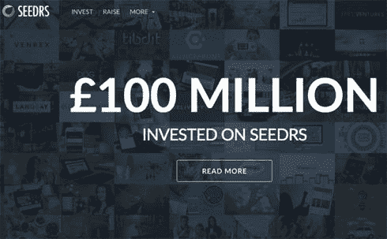

# 民主化的在线创业融资模式

> 原文：<https://medium.datadriveninvestor.com/democratized-online-startup-funding-models-9288125c06e9?source=collection_archive---------12----------------------->

民主化和数字化正在帮助全世界的企业家制造更便宜、更快、更好的创新产品。从获取信息到获取人力资源，投资在全球范围内也越来越民主化。这 4 个平台是投资民主化的先驱，鼓励越来越多的企业家和投资者。

1.  [**共和国**](http://republic.co)

一个允许非授权投资者投资创业公司的在线平台，最低 10 美元起。这增加了初创公司在信用投资者模式之外筹集资金的能力。Republic 正在使投资民主化，并为创始人和投资者铺平筹资道路。Republic 将众筹作为其基本功能。虽然众筹在历史上仅限于购买产品或捐款，早期圣人投资仅限于富人，但 Republic 使众筹能够帮助任何个人成为早期私人公司的投资者。

2. [**造币清单**](https://coinlist.co/)

随着金融生态系统正在适应区块链平台，CoinList 正在引领这一尝试，它构建了一个平台，让最好的数字资产公司可以进行代币销售、空投和在线黑客马拉松。换句话说，CoinList 对他们合作的公司进行背景调查，并提供一个通过 ICO 筹集资金的平台。CoinList 解决了创建金融工具带来的后勤、合规和监管负担，以便代币创建者可以专注于他们最擅长的事情:构建改变世界的产品。

有趣的是，CoinList 和 Republic 都是从同一个创业平台——Angelist 酝酿出来的。

**3。** [**资本即服务**](https://caas.socialcapital.com/)

资本即服务是一种新的早期投资操作系统。改编软件即服务背后的术语和原则，Social Capital 在 2017 年推出了这一独特的模式。CaaS 背后的想法是推动由边界和耗时的融资轮界定的投资壁垒。Caas 进行高达 50 万美元的投资，根据使命、产品、市场和公司在几天内做出决定，一切都有经过验证的数据支持，而不管公司位于何处。

**4。** [**种子**](https://www.seedrs.com/)

Seedrs 是一家总部位于英国的投资众筹平台。在过去的 6 年里，该平台不断尝试和发展其在线融资业务，增加了新的功能和服务。从种子阶段投资到首次公开募股，Seedrs 为企业家提供了筹集资金的在线工具，同时也为投资者提供了分散投资组合的空间。Seedrs 授权高净值个人和信贷投资者进行投资。

*ImageCredits* : [众筹者](https://www.crowdfundinsider.com/2014/06/41579-seedrs-now-allows-investors-hold-shares-outside-nominee-structure/)，[共和国](https://republic.co/about)，[资本即服务](https://medium.com/social-capital/capital-as-a-service-a-new-operating-system-for-early-stage-investing-6d001416c0df)，[原始协议](https://medium.com/originprotocol/investment-period-has-started-for-origins-coinlist-round-2b9683197c29)，[开放商业理事会](https://www.openbusinesscouncil.org/the-uk-top-equity-crowdfunding-platform-seedrs-hits-100-million-invested-in-early-stage-and-growth-businesses/)