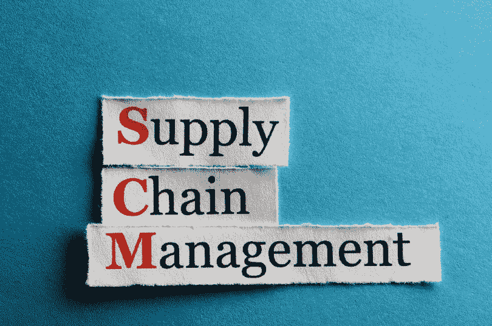
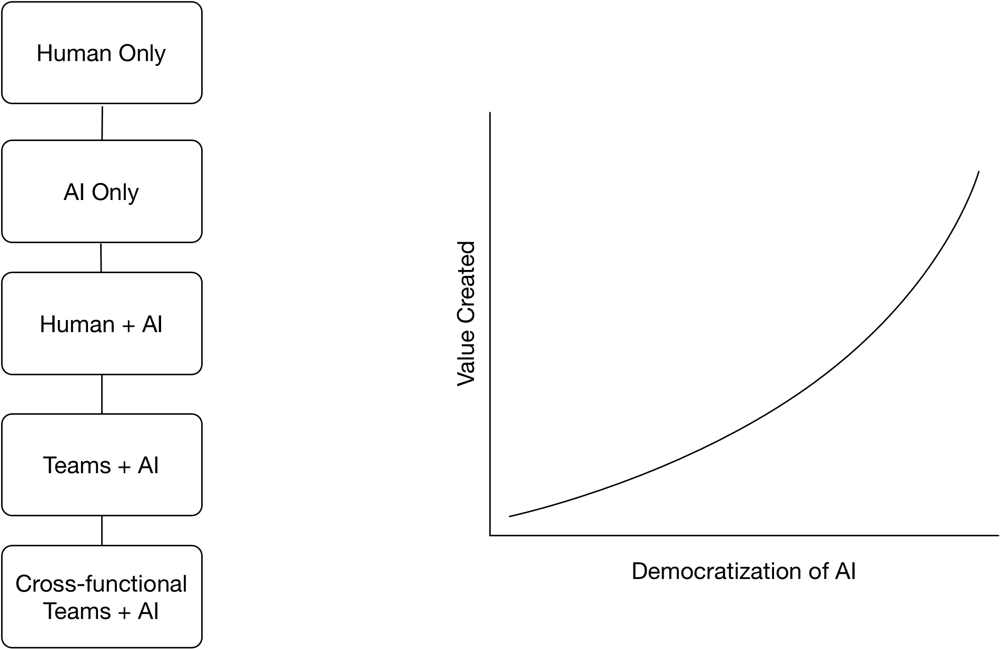

# 面向供应链的大众化人工智能

> 原文：<https://medium.datadriveninvestor.com/democratizing-artificial-intelligence-for-supply-chain-805934fcd743?source=collection_archive---------1----------------------->

随着人工智能(AI)和数据科学的大肆宣传，卖家很容易在混乱中感到迷失。关于人工智能的一些最常见的问题包括:

我们需要多少人工智能？

它能解决什么样的问题？

我们应该建造它还是购买它？

如果我们建造它，我们需要雇用多少人？

很明显，许多关于人工智能的问题是相互关联的，为组织创造了一个迷宫。幸运的是，《哈佛商业评论》最近发表了一篇文章，[为什么 AI 会将决策从 C-Suite 转移到前线](https://hbr.org/2018/08/why-ai-will-shift-decision-making-from-the-c-suite-to-the-frontline) *，*，这可能有助于这种导航。这篇文章强调了许多组织在部署人工智能计划时犯的一个严重错误。简而言之，许多公司倾向于雇佣设计烤箱的工程师，而不是给他们现在的厨师配备更好的厨房。

换句话说，建立大型数据科学团队的影响力可能不如为现有团队配备人工智能工具。或者正如文章更清晰地陈述的那样，“为了从人工智能中提取真正的价值，组织中所有级别的员工都需要被授权在人工智能的帮助下做出最终决定。……简而言之，基于判断的决策权需要民主化。”

这是对卖家的相关建议，因为复杂的任务，如建立全渠道履行业务，设计网络，并创建库存分配策略，往往是由不同的团队管理，具有不同的数据和洞察力。这就是为什么描绘一个连续体是有用的，其中每个级别都代表了人工智能在一个组织内使用的广度和深度。

当更多的团队配备了 AI 工具和见解，直接和间接的好处都会出现。例如:

1)增加的透明度意味着更快地识别和解决竞争/冲突的假设，从而缩短项目时间表。

2)可以更准确地测量因果关系。

3)当团队之间共享新的分析时，一个洞察生态系统慢慢形成，并可以作为新的知识库。

4)人工智能帮助团队确定人工智能要探索的新问题，为创新创造一个强化循环。

关于如何将人工智能应用于供应链的更多细节，请联系我，地址是 monarchfxgo.com 的德伦格彻

*原载于 2018 年 8 月 16 日*[*www.tompkinsinc.com*](http://www.tompkinsinc.com)*。*