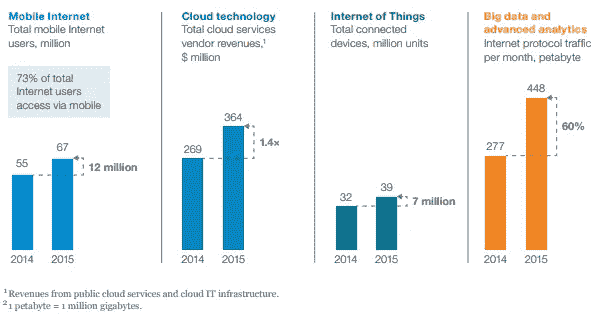
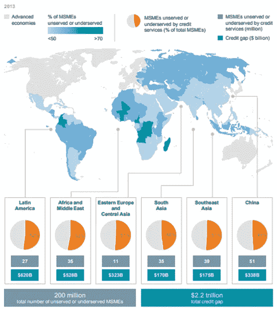
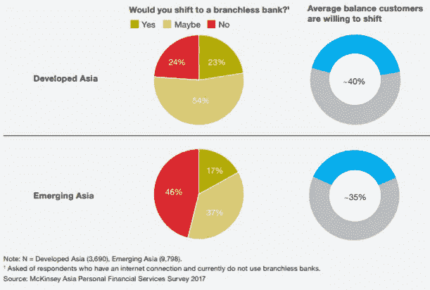
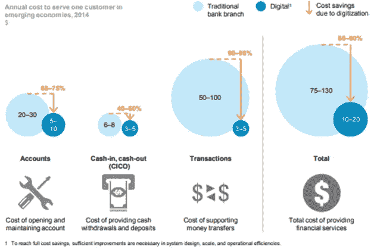

# 金融民主化

> 原文：<https://medium.datadriveninvestor.com/democratizing-finance-fbfffde2a057?source=collection_archive---------10----------------------->

## **印度尼西亚的 P2P 贷款**

by [rawpixel](https://unsplash.com/@rawpixel) on [unsplash](https://unsplash.com/photos/qGb4-eCYhY8)

在印度尼西亚的经济史上，微型、小型和中型企业在危机时期发挥了重要作用。根据 Badan Pusat Statistik 在 2017 年进行的微型和小型产业调查，印度尼西亚有 446 万个商业实体，其中 410 万个(91.96%)是微小中型企业。[【1】](#_edn1)截至 2018 年 6 月，这些微小中型企业还为印尼国内生产总值(GDP)贡献了 60.34%。 [[2]](#_edn2) 这一事实进一步显示了微小中型企业在印尼经济中的重要性。

尽管存在这些事实，中小微企业仍然面临许多困难。65.67%的微小中型企业表示，他们在获得业务资金方面遇到困难。这些微小中型企业中约有 70%无法进入银行系统，尽管获得小额信贷是他们成功的重要因素。[【3】](#_edn3)

Exhibit 1 The digital revolution has arrived in Indonesia. Source: McKinsey & Company.

金融领域数字革命的发展将解决这一问题。值得注意的是，有四种类型的技术给印尼经济带来了巨大的影响。还有*移动互联网、云技术、物联网、* *大数据、*和*高级分析*。根据表 1 中的特定指标定义，所有这些指标都显示了从 2014 年到 2015 年的增量增长。这可以解释为手机和数据成本相对较低，导致许多人更容易上网。[【4】](#_edn4)如下面的图表 2 所示，印度尼西亚的移动宽带费用仅为一些东盟邻国消费者支付费用的 50%。[【5】](#_edn5)印度尼西亚这种未开发的数字化潜力可以加速解决印度尼西亚的问题，例如

Exhibit 2 Mobile broadband price in some country. Source: McKinsey & Company.

印度尼西亚微小中型企业在获得小额信贷方面遇到的问题。

在这个世界上，最富有的人——只占人口的 1%——拥有世界一半的财富，金融排斥对于政府维持经济和政治稳定是必不可少的。在印尼，51%的成年人无法获得私人银行的金融产品[【7】](#_edn7)。

如果金融数字化能够广泛传播到发展中国家，2025 年的经济增长潜力可能会达到 3.7 万亿美元，或 GDP 增加值的 6%。[【8】](#_edn8)2013 年，中小微企业融资仍有 2.2 万亿美元的总信贷缺口(附表 3)。这一数据表明，仍有许多中小微企业没有得到传统银行的服务或服务不足。这种情况要求政府将鼓励数字化的政策作为帮助微小中型企业的战略政策之一。

Exhibit 3 MSMEs across developing countries cannot access microcredit. Source: McKinsey Global Institute.

如前所述，发展微小中型企业将是印度尼西亚经济的一项战略举措。然而，为中小微企业融资并非易事。银行对想申请贷款的微小中型企业有许多要求，如财务状况的跟踪记录。这就成了一个问题，因为大多数中小微企业没有良好的财务记录。要求的另一个例子是担保品和高利率，这是中小微企业无法承受的。

另一方面，从银行业目前的观点来看，向中小微企业贷款不是一项有利可图的业务。为了解决这个问题，银行必须转变其业务，变得更加数字化和无分支，因为这是消费者想要的(图表 4)。此外，对于初创企业来说，他们必须通过利用大数据建立有效的信用评分系统来提高解决贷款要求问题的能力，这样不良贷款的问题就会减少。另一方面，利用金融行业的数字革命将大幅降低成本(图表 5)。

Exhibit 4 Customers demands digital shift. Source: McKinsey Indonesia.

Exhibit 5 Digital technologies cut the cost of providing financial services. Source: McKinsey Global Institute.

如今，许多初创企业提供一种新的机制，称为*点对点* (P2P)贷款，以解决中小微企业无法从传统银行获得资金的问题。P2P 借贷被 Investopedia.com 定义为一种债务融资方式，使个人能够在没有官方金融机构作为中介的情况下借贷资金[【9】](#_edn9)。例如，经 OJK Otoritas Jasa Keuangan 认证的 Amartha.com 已经发放了 5.3841 亿卢比，并记录了 98.39%的贷款。

为了最大限度地降低不良贷款的风险，Amartha.com 利用机器学习技术开发了一个更准确的信用评分系统。金融科技初创公司不断开发技术，以提高金融服务业的效率，另一方面，传统银行也试图将业务转移到数字平台，以便在这个数字时代仍然具有相关性。

[【1】](#_ednref1)印度尼西亚共和国统计局(2017)。*Profil Industri Mikro and Kecil 2017。雅加达:BPS RI，23 岁。*

[【2】](#_ednref2)毕马威咨询公司(2017 年)。*印尼金融:开辟新道路？*。雅加达:毕马威会计师事务所，第 25 页

[【3】](#_ednref3)印尼国家统计局。(2017).*Profil Industri Mikro and Kecil 2017。雅加达:BPS RI，30。*

[【4】](#_ednref4)麦肯锡全球研究院。(2016).*面向所有人的数字金融:推动新兴经济体的包容性增长*。麦肯锡全球研究所。

[【5】](#_ednref5)Das，k .、Gryseels，m .、Sudhir，p .和 Tee Tan，K. (2016)。*释放印度尼西亚的数字机遇*。麦肯锡公司，第 5-6 页。

[【6】](#_ednref6)哈拉里，Y. (2018)。21 世纪的 21 个教训。伦敦:乔纳森·凯普，第 103 页

[【7】](#_ednref7)世界银行集团。(2018).*2017 年全球 Findex 数据库:衡量金融包容性和金融科技革命*。华盛顿特区:世界银行，第 124 页。

[【8】](#_ednref8)麦肯锡全球研究院。(2016).*面向所有人的数字金融:推动新兴经济体的包容性增长*。麦肯锡全球研究所，第 2-4 页。

[【9】](#_ednref9)投资媒体。(2018).*点对点借贷(P2P)* ，investopedia.com【在线】可在:[https://www . investopedia . com/terms/p/Peer-to-Peer-Lending . ASP](https://www.investopedia.com/terms/p/peer-to-peer-lending.asp)2018 年 9 月 27 日访问。

[【10】](#_ednref10)阿玛塔。(2018). *Amartha，*Amartha . com[在线]可在:[https://amartha.com/id_ID/](https://amartha.com/id_ID/)2018 年 9 月 27 日访问。