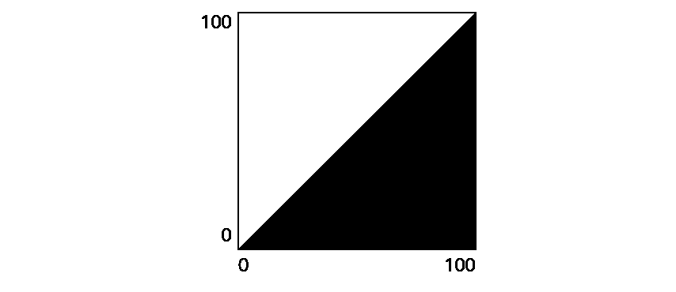
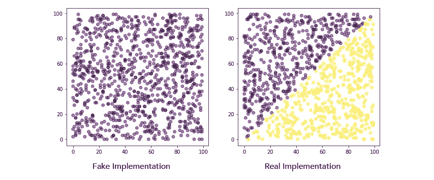
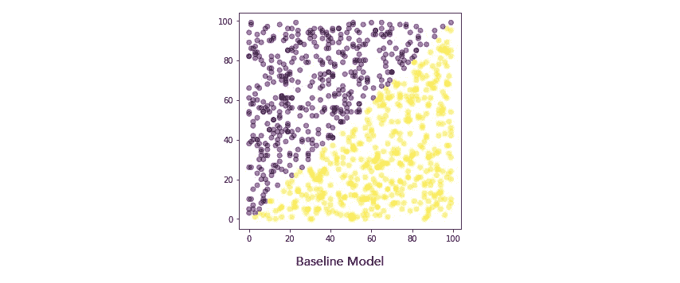
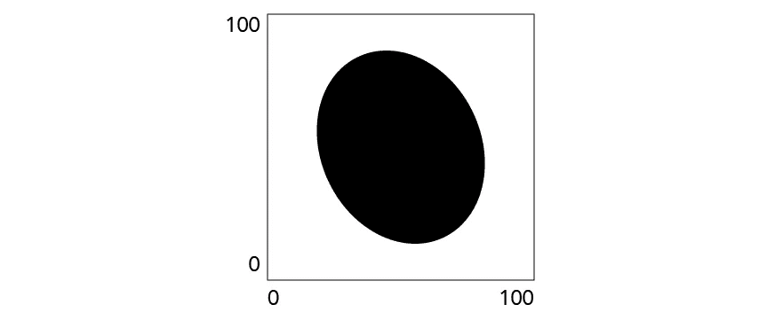
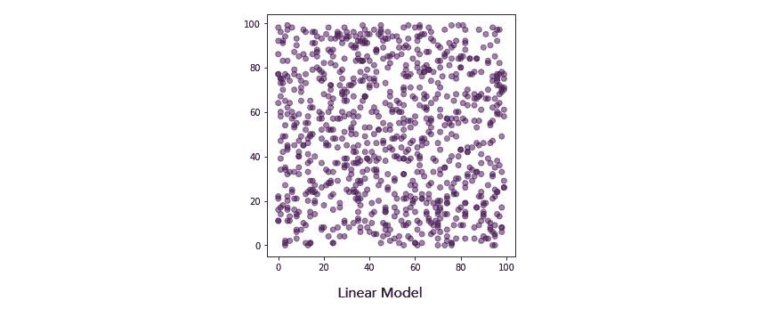
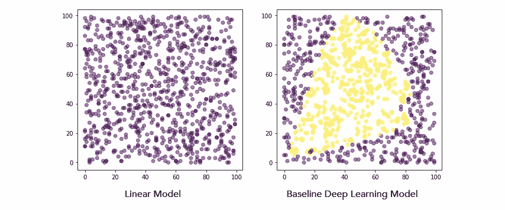
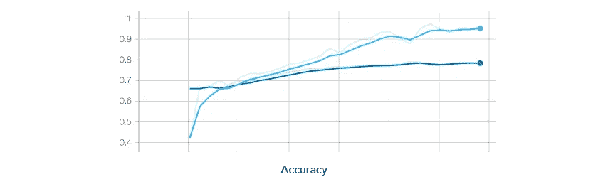
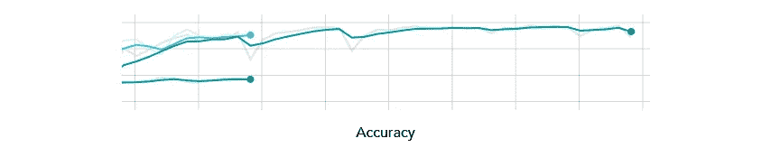
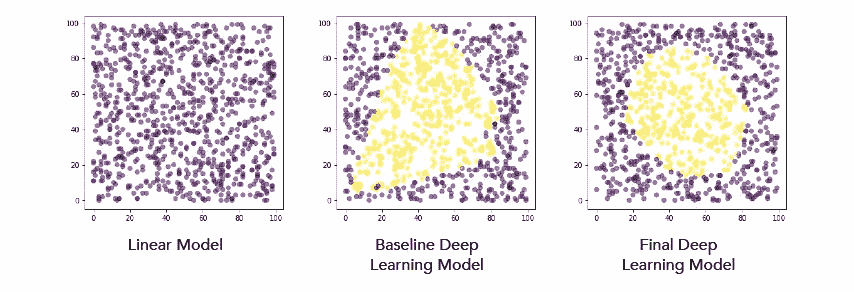

# 揭开机器学习的神秘面纱

> 原文：<https://medium.datadriveninvestor.com/demystifying-machine-learning-e17b0a29e5dc?source=collection_archive---------12----------------------->

*让机器学习少一点神奇*

亲爱的软件工程师，时代在变。机器学习(ML)无处不在。每天都有描述 ML 如何重新定义整个行业的故事出现。似乎每个人都同意曼梯·里正在改变世界。但是有一个脱节。即使 ML 的强大功能在今天已经唾手可得，但是许多软件工程师不知道如何利用它。本文的目标是通过将 ML 与更熟悉的测试驱动开发(TDD)实践进行比较来揭开 ML 的神秘面纱，展示一些优势，并向您展示如何开始使用流行的框架 Tensorflow。

# 机器学习与测试驱动开发

虽然 ML 听起来像魔术，但它与更熟悉的 TDD 有很多相似之处。

假设您被要求编写一个基于两个参数计算值的函数，并给出一个输入和输出样本来验证您的解决方案。

 [## 用 7 个步骤解释深度学习——数据驱动投资者

### 在深度学习的帮助下，自动驾驶汽车、Alexa、医学成像-小工具正在我们周围变得超级智能…

www.datadriveninvestor.com](https://www.datadriveninvestor.com/2019/01/23/deep-learning-explained-in-7-steps/) 

使用 TDD，您首先将样本数据转换成单元测试，单元测试调用您的函数的一个假版本，并运行测试来观察它们的失败。接下来，您研究需求并使用定制逻辑实现功能。最后，重新运行测试来验证您的逻辑，并在任何测试失败时进行调整。

使用 ML 遵循类似的过程。首先创建一个模型，使用一部分示例数据对其进行训练，然后使用剩余的数据对其进行测试。除非你很幸运，否则这个基线模型不会工作得很好，在宣布成功之前，你必须经过几次迭代来调整它。

虽然 TDD 和 ML 共享相同的一般流程，但关键的区别是您没有使用 ML 编写任何定制逻辑。事实上，您甚至不需要理解需求。你的模特*从你提供的例子中学会了*如何解决问题。这使得 ML 特别适合于那些你自己解决起来太困难或者太耗时的复杂问题。

# 从小处着手

让我们看一个例子，看看这在实践中是如何工作的。给定一个每边有 100 个单位的正方形，您的工作是编写一个函数，如果一个点落在三角形阴影区域内，则返回 1，否则返回 0。

## 测试驱动的开发方法

让我们从一个*简化的* TDD 方法开始。

毫不奇怪，假的实现有 50%的几率会失败。幸运的是，这个问题很简单。由于阴影区域占据了对角线以下的整个区域，我们可以简单地检查 x > y。

重新运行测试，我们看到他们都通过了。为了好玩，让我们直观地比较一下这两种实现。

## 机器学习方法

现在让我们用 ML 解决同样的问题。

我们很幸运。即使这个基线模型也是 100%准确的，有效地通过了我们所有的测试。这个问题太简单了，模特第一次就学会了完美地解决它。

# 更大的挑战

既然我们已经走过了基本的 ML 流程，让我们用一个更具挑战性的问题来说明模型调优过程。

给定一个每边有 100 个单位的正方形，您的工作是编写一个函数，如果一个点落在椭圆形阴影区域内，则返回 1，否则返回 0。

## 测试驱动的开发方法

嗯，祝你好运。对于几何倾斜，我会离开这作为一个额外的学分练习。

## 初始机器学习方法

让我们从之前使用的相同基线模型开始，除了我们将使用从 oval 图像生成的样本来训练它。

这次我们没那么幸运。这个模型只有 65%的准确性。如果我们检查结果，我们可以看到它总是返回 0，就像我们的假 TDD 函数一样。

那现在怎么办？事实证明，这不是一个合理的基线。我们的模型使用了一个非常简单的“线性分类器”,它根本无法应对这种非线性挑战。

## 初始深度学习方法

让我们用深度学习神经网络来比较一下。

我们在这里做了两个重要的改变。首先，我们用 DNNClassifier 替换了 LinearClassifier 模型，创建了一个分别具有 1024、512 和 256 个节点的 3 层神经网络。第二，我们在一个循环中多次训练该模型，允许神经网络通过重复暴露于相同的例子来逐渐调整。

经过 300 步，模型的准确率从 64%提高到了 78%。我们正在取得进展，但我们显然还有改进的空间。

## 调整模型

改进 ML 需要模型调整，而不是在我们的程序逻辑中找到并修复 bug。深度学习神经网络提供了各种旋钮来进行实验，包括

*   网络体系结构
*   学习算法
*   学习率
*   激活功能
*   批量大小和训练步骤的数量

首先尝试哪个旋钮并不总是很清楚。最佳值将取决于您正在解决的问题。好消息是，你可以很容易地试验多种组合，并使用一种叫做 TensorBoard 的工具来比较结果。我不会在这里详细介绍 TensorBoard，但是我们会看一些帮助你比较模型的图表。

让我们首先从默认的学习算法切换到 Adam，并将我们的网络架构从 1024 x 512 x 256 减少到 16 x 16 x 16。

在重新训练我们的模型后，模型的准确率从 78%跃升至 96%。使用 TensorBoard，我们可以比较模型如何随着时间的推移而学习。我们可以看到，当我们在 300 步处停下来时，第一个模型很快就稳定下来，而第二个模型仍在学习。

基于这种认识，让我们看看当我们将训练步骤的数量增加一倍时会发生什么。在下面的图表中，我们可以看到，虽然模型继续略有改善，但收益并不显著。到 600 步结束时，该模型只比之前的运行精确 1%。

这两个实验抓住了模型调整的本质。根据问题的不同，一些调整会对模型性能产生很大影响，而另一些则不会产生影响。诀窍是试验不同的参数，并在 TensorBoard 中比较您的结果。

让我们回顾一下，看看我们到目前为止做得怎么样。

即使没有进一步的调整，我们的模型已经学习了一个非常好的椭圆形区域的近似，在我们的测试案例中实现了 97%的准确性。

## 完成的定义

ML 模型从来都不是完美的。与 TDD 不同，在 TDD 中，你的目标是通过所有的测试，使用 ML 要求你接受一个在大多数时候都有效的解决方案。在调优上投入的时间越多，结果就越好。但是最终，你需要决定什么时候你的模型是“足够好”的。

# 摘要

机器学习已经在改变世界，并将在未来几年主导技术。但是利用 ML 已经不需要博士学位了。现在有很多开源的、生产级的 ML 框架，比如 Tensorflow。虽然使用 ML 解决问题需要新的工具和不同的思维方式，但是它也与我们熟悉的实践共享许多概念，比如测试驱动开发。像任何新技术一样，学习 ML 的第一步是卷起袖子，把手弄脏。

查看 tensorflow.org 的[，了解更多信息。](https://www.tensorflow.org)